**Formerly known as vManager**

# Prerequisites
## User privileges
### General authentication

* Create a user in Verisium Manager dedicated to the OpsHub Integration Manager. This user shouldn't perform any other action from Verisium Manager's Desktop client or Web client. Please refer to [Add User](vManager.md#add-user) to determine how to create a user in the Verisium Manager.
* This user shall have access to **Verisium Manager instance APIs** for the Verisium Manager project that is going to be used in the Integration Configuration. For that, the user needs to have specific access levels on that Verisium Manager project. To make sure that the user being used for the OpsHub Integration Manager is having required access levels, please refer to [Add User in Project with Permissions](vManager.md#add-user-in-project-with-permissions).
* If the input for **Override Projects** is not specified, the user shall have access to the project having Project Identifier **"vmgr"**. Refer to [How to determine the Project Identifier](vManager.md#how-to-determine-the-project-identifier) section to determine the project identifier.

> **Note** For **Verisium Manager** version prior to 22.12, more than one user with the same "User Id" (having different letter cases) were allowed. Hence, the sync user which is going to be used in OpsHub Integration Manager must have a unique User Id, ignoring the letter case.

**Project-based authentication**

* Even if the project-based authentication is enabled at the project level, the user can still specify the user with general authentication as mentioned in the above section.
* If user creation is not possible:
  * Specify the username that does not exist in the Verisium Manager or this user shouldn't perform any other action from Verisium Manager's Desktop client or Web client. This user in Verisium Manager should be dedicated to OpsHub Integration Manager.
  * Specify the password which will be the **Project Password** mentioned in Verisium Manager.
  * If this authentication mode is enabled, then in OpsHub Integration Manager system configuration, user needs to specify the **Override Projects** input with the accessible project's identifiers in case project-based password is given in system form.

## License prerequisites

For Verisium Manager Version Prior to 24.03:

* A Verisium Manager API (vAPI) client license is required per sync user for each configured Verisium Manager server in OpsHub Integration Manager.
  * License is needed when the user begins configuration/synchronization for Verisium Manager endpoint in OpsHub Integration Manager because Verisium Manager API (vAPI) client gets launched automatically by OpsHub Integration Manager for Verisium Manager API communication.

> **Note** For the grade attribute synchronization, if the script is configured in the Verisium Manager Desktop client, then the script will also take one Verisium Manager API (vAPI) client license while executing in Verisium Manager.

## Other prerequisites

* The "vAPI" for the "Verisium Manager Project" that is going to be used in the Integration Configuration shall not be blocked. To determine whether the "vAPI" for the "Verisium Manager Project" is blocked or not, please refer to [Project Configuration](vManager.md#project-configuration).
* When Verisium Manager is the target system in the Integration Configuration, and "Parameters" field is mapped in the Mapping Configuration, then the custom field named "OH _Last _Update" needs to be created. Please refer to [Add Custom Field](vManager.md#add-custom-field) to determine how to create a custom field in the Verisium Manager.

# System Configuration

Before you proceed with the integration, you must first configure Verisium Manager system onto OpsHub Integration Manager. 
Click [System Configuration](../integrate/system-configuration.md) to learn the step-by-step process to configure a system.

Refer to the screenshot given below:

<p align="center">
  
</p>


**Verisium Manager System form details**

| **Field Name**                                        | **Description**                                                                                                                                                                                                                                                                                                                                                                                                                                                                                                                                                                                                                 |
| ----------------------------------------------------- | ------------------------------------------------------------------------------------------------------------------------------------------------------------------------------------------------------------------------------------------------------------------------------------------------------------------------------------------------------------------------------------------------------------------------------------------------------------------------------------------------------------------------------------------------------------------------------------------------------------------------------- |
| **System Name**                                       | Provide System name.                                                                                                                                                                                                                                                                                                                                                                                                                                                                                                                                                                                                            |
| **Server URL**                                        | Provide Verisium Manager Server URL like `https://[Verisium Manager Server IP]:[Port Number]`                                                                                                                                                                                                                                                                                                                                                                                                                                                                                                                                   |
| **User Name**                                         | Provide Username of dedicated Verisium Manager user for API communication with Verisium Manager server. This user should have the required privileges to use the Verisium Manager API.                                                                                                                                                                                                                                                                                                                                                                                                                                          |
| **User Password**                                     | Provide password for the user given in Verisium Manager User Name field.                                                                                                                                                                                                                                                                                                                                                                                                                                                                                                                                                        |
| **Override SSL Certificate Hostname's Verification?** | The HTTPS certificate of Verisium Manager server often contains different Common Name (CN) and Hostname that create conflict in the Hostname's verification. In case of conflict, the Hostname's verification needs to be overridden. "Enable" this input in this case.                                                                                                                                                                                                                                                                                                                                                         |
| **Override Projects**                                 | <p>This input should be specified to limit the projects in the following scenarios:<br>1) User has access to all the projects but wants to integrate limited projects through OpsHub Integration Manager<br>2) In case of project-based authentication is enabled where user has access to the limited projects.<br>If this input is not provided, 'vmgr' will be considered as the default project. The user mentioned in the <strong>User Name/User Password</strong> field should have access to that project. Refer to <a href="vManager.md#understanding-json-input">Understanding JSON input</a> section for details.</p> |

***

**Understanding JSON input**

* The project's identifiers can be provided at the time of system configuration in the field `Override Projects`  [in the form of JSON] in the below mentioned use cases:
  * Use Case 1: In Verisium Manager, users may have limited access to specific projects. During the integration process, they will only be able to access those designated projects. Therefore, users need to specify the identifiers of the accessible projects in the format provided below.
  * Use Case 2: A user has access to all projects but wants to integrate only limited projects through OpsHub Integration Manager. In this case, the user can limit project access by providing the necessary input.

Below is the example of the JSON input:

```json
{
  "projects": [
    "vmgr",
    "seeries"
  ]
}
```

# Mapping Configuration

Map the fields between Verisium Manager and the other system to be integrated to ensure that the data between both the systems synchronize correctly.

Refer [Mapping Configuration](../integrate/mapping-configuration.md) to learn the step-by-step process to configure the mapping between the systems.

Refer to the screenshot given below :

<p align="center">
  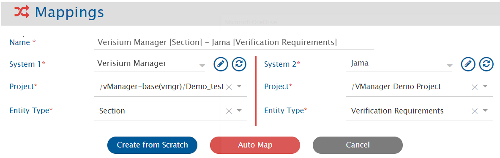
</p>


> **Note**: If you want to synchronize the Parameters of the [Section [(Sub Type) ]](vManager.md#Section.5B.28Sub_Type.29.5D) entity then, please select **Parameters** from the list of the Verisium Manager fields.

<p align="center">
  
</p>


## Sub Types in Verisium Manager

* Verisium Manager supports user defined Sub Types for "Section" and "Metrics Port" entity.
* In OpsHub Integration Manager, these Sub types are supported as separate Entity Types for synchronization, so that user can use it in synchronization for better modelling with other end systems.
* For example, Let's assume we have defined Sub Type "Functional Verification" for "Section", and "Assertion Verification" for "Metrics Port" in Verisium Manager. Hence, in OpsHub Integration Manager integration/mapping configuration, you will be able to create/update integrations/mapping for any of the below entity types:

<p align="center">
  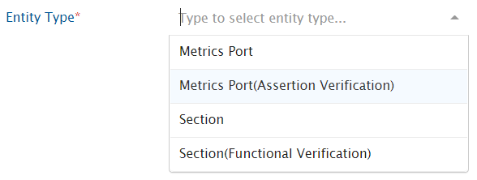
</p>

> **Note**: Here, Entity type "Section" and "Metrics Port" refer to Verisium Manager Section and Metrics Port entity without Sub Type.

## Relationships

For the [Section [(Sub Type) ]](vManager.md#Section.5B.28Sub_Type.29.5D) entity, **Parent**, **Child**, **Reference to** and **Reference By** relationships are supported.

Refer [Relationship Configuration](../integrate/mapping-configuration.md#relationships) to learn the step-by-step process to configure Relationships.

> **Note**: "Reference to" relationship for the [Section [(Sub Type) ]](vManager.md#Section.5B.28Sub_Type.29.5D) entity represents the entities linked via "Reference Entity" in the Verisium Manager.

<div align="center"></div>

It is mandatory to configure Child relationship in Relationship Configuration for [Reference entity](vManager.md#reference-entity). Due to API limitation, Child relationship can only be added at the time of Reference entity creation. Hence, the Child relationship of Reference entity can not be updated/deleted.

### Supported Relationships

| **Mapped Entity Type**  [Link From] | **Entity Type in Relationship Configuration**  [Link To] | **Link Type** | **Cross vPlan Support** |
| ----------------------------------- | -------------------------------------------------------- | ------------- | ----------------------- |
|  [Section [(Sub Type)]]             |  [Section [(Sub Type)]]                                  | Parent        | N/A                     |
|                                     |                                                          | Child         | N/A                     |
|                                     |                                                          | Reference To  | Yes                     |
|                                     |                                                          | Reference By  | No                      |
|                                     |  [Metrics Port [(Sub Type)]]                             | Child         | N/A                     |
|                                     |                                                          | Reference To  | Yes                     |
|                                     |  Reference                                               | Child         | N/A                     |
|  [Metrics Port [(Sub Type)]]        |  [Section [(Sub Type)]]                                  | Parent        | N/A                     |
|                                     |                                                          | Reference By  | No                      |
| Reference                           |  [Section [(Sub Type)]]                                  | Parent        | N/A                     |
|                                     |                                                          | Child         | Yes                     |
|                                     |  [Metrics Port [(Sub Type)]]                             | Child         | Yes                     |
|                                     |  Reference                                               | Child         | Yes                     |

* In the above table:

  * All the **Link Types** are supported for entities in the same vPlan. Refer the above table for cross vPlan support of different **Link Types** between entities.
  * **N/A** means that the link is not supported by the Verisium Manager.
  * **No** means that the link is supported by the Verisium Manager but not by the OpsHub Integration Manager due to API limitation.

## Rank

* Verisium Manager allows to organize the entities in tree structure through **Parent** and **Child** relationships.
* To synchronize the entities maintaining the tree structure in Verisium Manager, the user can configure the **Parent** and **Child** relationship as per the standard [relationship configuration](../integrate/mapping-configuration.md#relationships). Within this structure, to maintain the rank of entities, the user should enable the Rank Synchronization as described in [Rank configuration](../integrate/mapping-configuration/#configuration) section.

## Mapping for Soft Delete Configuration

* When Verisium Manager is the target system, the Soft delete operation is performed by default in the synchronization of the [Source Delete event](../integrate/source-delete-synchronization.md).
* After the Soft Delete operation is performed by OpsHub Integration Manager in Verisium Manager, the entity will be deleted in the Verisium Manager, and it can be found in the "Deleted Entities" of the corresponding project, where it existed earlier.
* To only enable the logical delete operation in the target, "OH Soft Delete" field shall be mapped with the default value "No" in the [Delete Mode](../integrate/mapping-configuration.md#delete-mode) mapping.

# Integration Configuration

In this step, set a time to synchronize data between Verisium Manager and the other system to be integrated. Also, define parameters and conditions, if any, for integration.

Refer [Integration Configuration](../integrate/integration-configuration.md) to learn the step-by-step process to configure the integration between two systems.

Refer to the screenshot given below :

<p align="center">
  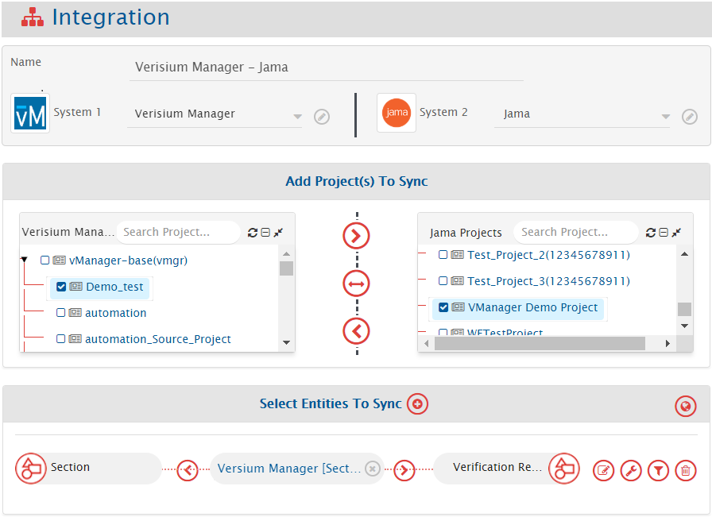
</p>


## Project Specific Entity Information

In Verisium Manager, vPlan can be created under the Verisium Manager Project. Hence, Verisium Manager Project is treated as a Parent-project whereas vPlan is treated as a child-project. The vPlan is listed as a child-project under the corresponding Parent-project (Verisium Manager Project) in the OpsHub Integration Manager configuration. 
 [Section [(Sub Type)]]/#Section.5B.28Sub _Type.29.5D / [Metrics Port [(Sub Type) ]](vManager.md#Metrics_Port.5B.28Sub_Type.29.5D) entity can be created only under the vPlan. As a result, the [Section [(Sub Type) ]](vManager.md#Section.5B.28Sub_Type.29.5D)/[Metrics Port [(Sub Type) ]](vManager.md#Metrics_Port.5B.28Sub_Type.29.5D) can be configured in OpsHub Integration Manager, if child-project(vPlan) is selected in Mapping Configuration or Integration Configuration section.

## Criteria Configuration

If you want to specify conditions for synchronizing an entity between Verisium Manager and the other system to be integrated, you can use the Criteria Configuration feature.
Go to Criteria Configuration section on [Integration Configuration](../integrate/integration-configuration.md) page to learn about Criteria Configuration in detail.
To configure criteria in Verisium Manager, integration needs to be created with Verisium Manager as the source system. Set the **Query** as per the JSON format given below :

**Sample query format** is as given below :

* Query to specify the constraint on **single field** : 
  `{"@c":".AttValueFilter","operand":"EQUALS","attName":"<Attr Name of the Verisium Manager Field>","attValue":"<value>"}`
* Query to specify the constraint on **Multi-Enum (Multi-select) type of field** : 
  `{"@c":".IncludeFilter","operand":"INCLUDE","attName":"<Attr Name of the Verisium Manager Field>","values":["<value1>",..,"<valueN>"]}` 
  This filter will select the entities whose Multi-Enum field has at least one of the values mentioned in the value-list : `["<value1>",..,"<valueN>"]`
* Query to specify the constraints on **multiple fields** : 
  `{"@c" : ".ChainedFilter", "condition" : "OR", "chain" : [{"@c":".AttValueFilter","operand":"EQUALS","attName":"<Attr Name of the Verisium Manager Field>","attValue":"<value>"},{"@c":".AttValueFilter","operand":"EQUALS","attName":"<Attr Name of the Verisium Manager Field>","attValue":"<value>"}]}`

The explanation of all the **Query Parameters** used in the above criteria queries is given below:

| **Query Parameters**       | **Description**                                                               |
| -------------------------- | ----------------------------------------------------------------------------- |
| `@c":".AttValueFilter`     | It represents single attribute operand filter.                                |
| `@c":".IncludeFilter`      | It represents filter on the Multi-Enum (Multi-select) type of field.          |
| `@c" : ".ChainedFilter`    | It represents two or more attribute operand filters with AND/OR clause.       |
| `condition":"<Condition>`  | 	It represents the condition to be used to combine multiple attribute operand filters. Possible values for "Condition" : [AND, OR]  |
| `operand":"<Operand>`      | It represents the comparison operator to specify the constraints in the attribute operand filter. Possible values for "Operand" : [GREATER_OR_EQUALS_TO, LESS_OR_EQUALS_TO, GREATER_THAN, LESS_THAN, INCLUDE, NOT_EQUALS, EQUALS] |
| `attName":"<Attr Name of the Verisium Manager Field>`   | It represents the Attr Name of the Verisium Manager Field on which constraints are specified. Refer [How to determine the Attr Name](#how-to-determine-the-attr-name) to find the Attr Name corresponding to the Verisium Manager field.                   |
| `attValue":"<value>`       | It represents the value for the Verisium Manager Field which is used in the Criteria Query.                                |
| `values":["<value1>",..,"<valueN>"]` | It represents the list of values for Multi Enum(Multi Select) type of Verisium Manager Field which is used in the Criteria Query.                          |

**Example Queries** 
Criteria Query on the **single field**:_ 
{"@c":".AttValueFilter","operand":"EQUALS","attName":"priority","attValue":"High"}

**Description**: It represents the query, which will select only those entities, whose "priority" field value is "High"

Criteria Query on the **Multi-Enum**:_ 
{"@c":".IncludeFilter","operand":"INCLUDE","attName":"Components","values": ["Prototype","Design"]}

**Description**: It represents the query, which will select only those entities, whose "Components" field value either includes "Prototype" or "Design".

Criteria Query on **multiple fields**:_ 
{"@c" : ".ChainedFilter","condition":"OR","chain": [{"@c":".AttValueFilter","operand":"EQUALS","attName":"priority","attValue":"High"},{"@c":".AttValueFilter","operand":"EQUALS","attName":"verification _domain","attValue":"BOTH"}]}

**Description**: It represents the query, which will select only those entities, whose "priority" field value is "High" or "verification _domain" field value is "BOTH".

## Target LookUp Configuration

Provide Query in Target Search Query field so that it is possible to search the entity in the Verisium Manager when it is a target system.
In the target search query field, you can provide a placeholder for the source system's field value in-between '@' 
Go to **Search in Target Before Sync** section on [Integration Configuration](../integrate/integration-configuration.md) page to learn in detail about how to configure target lookup.

Target LookUp Configuration is similar to the [Criteria Configuration](vManager.md#criteria-configuration), except for the facts given below :

* Replace "@c" with "@@c".
* Replace "" with "@Source _System _Field _Name@" for the "attValue" parameter in the query.

**Example Queries**

* Target Lookup Query for the constraint on the **single field**:

    ```json
    {"@@c":".AttValueFilter","operand":"EQUALS","attName":"element_id","attValue":"@id@"}

    ```

* Target Lookup Query for the constraint on the single field:
  ```json
     {"@@c":".AttValueFilter","operand":"EQUALS","attName":"element_id","attValue":"@id@"}
  ```
  * Description: It represents the query, which will select only those entities, whose "element_id" field value is same as the value of the Source system's "id" field value.

* Target Lookup Query for the constraint on the multiple fields:
```json
  {"@@c" : ".ChainedFilter", "condition" : "AND", "chain" : [{"@@c":".AttValueFilter","operand":"EQUALS","attName":"element_id","attValue":"@id@"},        {"@@c":".AttValueFilter","operand":"EQUALS","attName":"name","attValue":"@title@"}]}
```
  * Description :It represents the query, which will select only those entities, whose "element_id" field value is same as the value of the Source system's "id" field value and "name" field value is same as the value of the Source system's "title" field value.


### Default Link Configuration

For configuring the  [Default Link Settings](../integrate/default-link-settings.md) using target lookup query, the same structure can be followed, except for the facts given below:

* Replace `{` with `{{`
* Replace `}` with `}}`

**Sample Target Lookup Query** for setting up the Default link of **"Parent"** link type between **"Metrics Port"** entity and **"Section"** entity is as follows:

* **Link type in Relationship configuration:** Parent → Parent
* **Default Link Setting:**
  * **Entity Type:** Section
  *   **Query:**

      ```json
      {{"@@c":".AttValueFilter","operand":"EQUALS","attName":"full_path","attValue":"test_plan/99999786"}}
      ```
💡 Here,
     ```json
      {{"@@c":".AttValueFilter","operand":"EQUALS","attName":"<field name>","attValue":"<static value>"}}
      ```
is as per target end system's native query format which is JSON whereas, <field name> is the name of the field and <static value> is the static value for the <field name>.
The above query will search for "Section" where the 'full_path' field value is 'test_plan/99999786'. It will link all "Metrics Port"(synced from source system) to the found target "Section". This type of query can be used when synced entities in the target system are linked to a single parent entity in the target.

***

# Known Behaviour

* The **Toggle Flag** (OpsHub Sync Flag / ALM _SYNC flag) will be updated on the Verisium Manager UI based on every **Write** (create/update/link) operation on `Section[(Sub Type)]` / `Metrics Port[(Sub Type)]` entities.
* In the Integration Configuration with Metrics Port[(Sub Type)] entity, bidirectional synchronization of the "Mapping Pattern" is supported. In the Mapping Configuration, "Mapping Pattern" is supported as a "String" type of attribute/field
  * When Verisium Manager is the target system in the Integration Configuration, the expected format of the "Mapping pattern" attribute/field is: 
      ```
      <Mapping Pattern1>;<Mapping Pattern2>;...<Mapping PatternN>
      ```
  *   Here the format of each Mapping Pattern is given below::

      ```
      <Pattern Value> (scope <Scope Value>) [<Domain>] [<Hierarchy>] [<Metrics Type>] [<Entity Type>]
      ```

Please refer to "Verisium Manager User Guide" for further details on the different components of the Mapping Pattern. For having a basic understanding on the format of the Mapping Pattern, please refer to the examples given below :

**Example 1:** uart _tests (scope default)  [TEST]  [All hierarchies]  [All cumulative types]  [TESTGROUP]; uart _ctrl _pkg (scope default)  [E, HDL]  [All hierarchies]  [FSM _TRANSITION _CUMULATIVE,FSM _STATE _LOCAL]  [INSTANCE, TYPE, COVERGROUP, COVERGROUP _ITEM, ASSERTION, FSM]

**Example 2:** uart _pkg (scope default)  [HDL,E]  [INSTANCE]  [BLOCK _CUMULATIVE, STATEMENT _CUMULATIVE, EXPRESSION _CUMULATIVE, FSM _STATE _CUMULATIVE, FSM _TRANSITION _CUMULATIVE, FSM _ARC _CUMULATIVE, COVER _GROUP _CUMULATIVE]  [INSTANCE]; uart _tests/uart _apb _incr _data (scope default)  [All domains]  [All hierarchies]  [All cumulative types]  [All entities]; uart _ctrl _top (scope default)  [HDL]  [TYPE]  [BLOCK _CUMULATIVE, STATEMENT _CUMULATIVE, EXPRESSION _CUMULATIVE, FSM _STATE _CUMULATIVE, FSM _TRANSITION _CUMULATIVE, FSM _ARC _CUMULATIVE, COVER _GROUP _CUMULATIVE]  [TYPE]

<div align="center">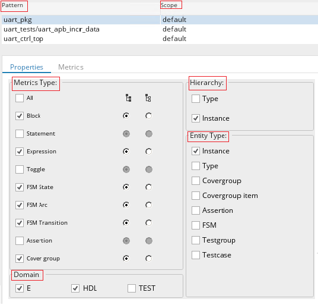</div>

# Known Limitations

## Common Limitations

Below are the commonly known limitations for the [Section [(Sub Type) ]](vManager.md#section5b28sub_type295d)/[Metrics Port [(Sub Type) ]](vManager.md#metrics_port5b28sub_type295d)/Reference entity. Additionally, there exists few specific limitations for [Section [(Sub Type) ] entity](vManager.md#section5b28sub_type295d-entity), [Metrics Port [(Sub Type) ] entity](vManager.md#metrics_port5b28sub_type295d-entity) and [Reference entity](vManager.md#reference-entity).

* There is a configuration in the Advanced Setting of Integration Configuration where the "Remote Entity Link" can be configured. However, the [Section [(Sub Type) ]](vManager.md#section5b28sub_type295d)/[Metrics Port [(Sub Type) ]](vManager.md#metrics_port5b28sub_type295d)/Reference entity is supported in the Verisium Manager Desktop Client, and so the "Remote Entity Link" is not being supported.
* Integration is supported only for vPlans in the database of the Verisium Manager. The synchronization of the vPlan available in the file system is not supported by OpsHub Integration Manager. However, the file system vPlans can be imported to the database and used in the integration.
* For any [Section [(Sub Type) ]](vManager.md#section5b28sub_type295d) entity, if its "vPlan Full Path" field contains `;/ ` (for the Verisium Manager version prior to 23.09) or `"` or ends with `.` (for any supported Verisium Manager version), then that [Section [(Sub Type) ]](vManager.md#section5b28sub_type295d) entity cannot be set as "Parent" entity for any other [Section [(Sub Type) ]](vManager.md#section5b28sub_type295d)/[Metrics Port [(Sub Type) ]](vManager.md#metrics_port5b28sub_type295d)/Reference entity. Also, "Reference to" link cannot be created from that entity to any other entity. Additionally, other linked [Section [(Sub Type) ]](vManager.md#section5b28sub_type295d)/[Metrics Port [(Sub Type) ]](vManager.md#metrics_port5b28sub_type295d)/Reference entity with this entity cannot be fetched due to API limitation. Hence, when Verisium Manager is the source system in the integration configuration in OpsHub Integration Manager, then fetching relationships for such entities will be skipped with the warning in the OpsHub Integration Manager logs.

> **Note:** "vPlan Full Path" may contain special characters ;"/  because these characters are present in the [Section [(Sub Type) ]](vManager.md#section5b28sub_type295d) entity name and/or Plan entity name. Hence, having such characters in vPlan name or [Section [(Sub Type) ]](vManager.md#section5b28sub_type295d) name should be avoided for the vPlan is being configured for synchronization.

* In the Verisium Manager, [Section [(Sub Type) ]](vManager.md#section5b28sub_type295d)/[Metrics Port [(Sub Type) ]](vManager.md#metrics_port5b28sub_type295d)/Reference Entity contains few hidden attributes/fields like Passes Filter, Spec Annotation Changed Flag, Spec Annotation Deleted Flag, Goal, Required Proof Bound, etc. From these hidden fields, `Goal` and `Required Proof Bound` are not supported.
* If valid values for the Enum/Multi-Enum attribute/field is updated from the "Verisium Manager Desktop client" for any [Section [(Sub Type) ]](vManager.md#section5b28sub_type295d)/[Metrics Port [(Sub Type) ]](vManager.md#metrics_port5b28sub_type295d)/Reference entity, the update in the values of such attributes/fields doesn't get reflected in API response immediately, and so the updated values of the attributes/fields will not be reflected in the value mapping of such attributes/fields in the Mapping Configuration immediately.
* Synchronization of the Grade attributes/fields is not supported.

> **Note:** To synchronize Grade attributes/fields in OpsHub Integration Manager, refer to [Verisium Manager Scripts](https://vmanager/VManagerScripts.zip)

* Due to API limitation, the "Reference to" relationship between the entities of the different vPlan is not supported for the Verisium Manager version prior to 21.01.
* The "Reference by" relationship between the entities of the different vPlan is not supported.
* When Verisium Manager is the source system in the integration:
  * If the user makes an update on the 'Reference To' type of link, then to synchronize those updates, the user needs to update at least one of the fields.
  * For the Verisium Manager version prior to 21.02:
    * If valid values for the Enum/Multi-Enum attribute/field contain special characters, then these attribute/field's value gets changed for any [Section [(Sub Type) ]](vManager.md#section5b28sub_type295d)/[Metrics Port [(Sub Type) ]](vManager.md#metrics_port5b28sub_type295d)/Reference entity. The update of such operations doesn't get reflected in API response immediately, and so such updates might not be synchronized to target. Hence, it is recommended that the use of special characters must be avoided for the Enum/Multi-Enum attributes/fields which are to be configured for synchronization.
* When Verisium Manager is the target system in the integration:
  * For the Verisium Manager version prior to 24.03, Date type of field cannot be unset due to API limitation. Processing failure occurs for the corresponding unset update synchronization in the Verisium Manager. Hence, to avoid this failure, [default value mapping](vManager.md#mapping-configurationdefault-mapping) / advanced mapping should be used.
* When the Rich Text Editor field is updated, the last updated time of [Section [(Sub Type) ]](vManager.md#section5b28sub_type295d)/[Metrics Port [(Sub Type) ]](vManager.md#metrics_port5b28sub_type295d)/Reference Entity doesn't get updated. So, to synchronize such fields, an additional update on any other mapped field is required.
* Due to API limitation, the Rich Text Editor field can't be unset. Hence, a single blank space (`" "`) is used to unset Rich Text Editor field.

## Section [(Sub Type)] Entity

Below are the specific limitations for the [Section [(Sub Type) ]](vManager.md#Section.5B.28Sub_Type.29.5D) entity. Additionally, there exists few common limitations for  [Section [(Sub Type)]/Metrics Port [(Sub Type)]/Reference] (#Common Limitations).

* When Verisium Manager is the source system in the integration:_

  * Criteria configuration is not supported on the "Parameters", because they are available at vPlan level in Verisium Manager
  * If User makes any updates in the "Parameter" or "Parameter condition", then to synchronize those updates, the user needs to update at least one of the attributes of the Planning center

* When Verisium Manager is the target system in the integration:_

  * "Parameter condition" can be synchronized only if the "Parameters" are mapped and synchronized since in the Verisium Manager, the "Parameter condition" field is dependent upon the "Parameters"
  * When "Parameters" field is mapped in the Integration Configuration and due to some abnormal situation if OpsHub Integration Manager server fails after adding the "Parameters" to the Verisium Manager but before reflecting back this change to OpsHub Integration Manager, then there is a chance of incorrect conflict detection. Hence, it is recommended to disable the conflict for the "Parameters" field
  * For the Verisium Manager version prior to 21.02
    * Due to API limitation, at any point of time, the "Parameter condition" can be set for only a single Parameter, during which all other Parameters' condition will be set to default values. At the time of synchronization of the "Parameter condition", only one Parameter's condition will be set in the Verisium Manager based on the current value of mapped field of source system with the "Parameter condition". Meanwhile, all other Parameters' condition, will be set to the default values
      * If in the Verisium Manager there are two Parameters i.e. 
        `LogonUser["testuser","demouser","syncuser"],AdminUser["admin","root"]`
      * Current value of the Source System field that is mapped to the "Parameter condition" is 
        `LogonUser["testuser","demouser"],AdminUser["admin"]`
      * Then in the Verisium Manager the value of the Parameter condition will be 
        `LogonUser["testuser","demouser","syncuser"],AdminUser["admin"]`. 
        Here only the last Parameter ("AdminUser")'s value is set and for the first Parameter ("LogonUser"), the value is set to the default value, which is `["testuser","demouser","syncuser"]`
* If "Parameters" and/or "Parameter condition" are mapped in the Integration Configuration, Toggle Flag (OpsHub Sync Flag) will not be updated on the Verisium Manager UI because of write operation on "Parameters" and/or "Parameter condition"

## Metrics Port [(Sub Type)] Entity

Below are the specific limitations for [Metrics Port [(Sub Type) ]](vManager.md#Metrics_Port.5B.28Sub_Type.29.5D) entity. Additionally, there exists few common limitations for  [Section [(Sub Type)]/Metrics Port [(Sub Type)]/Reference] (#Common Limitations).

* Synchronization of "Parameters" and "Logical Instances" are not supported

- When Verisium Manager is the target system in the integration:_
  * Write operation on "Parameter condition" and "Bin Filter" is not supported. So, these attributes/fields are treated as read-only fields in the Mapping Configuration of OpsHub Integration Manager
  * If "Metrics Port Kind" attribute/field is not mapped or no value is given at the time of [Metrics Port [(Sub Type) ]](vManager.md#Metrics_Port.5B.28Sub_Type.29.5D) entity creation, then [Metrics Port [(Sub Type) ]](vManager.md#Metrics_Port.5B.28Sub_Type.29.5D) entity will be created with the value **"Coverage"** for "Metrics Port Kind" attribute/field. Therefore, such a [Metrics Port [(Sub Type) ]](vManager.md#Metrics_Port.5B.28Sub_Type.29.5D) will be "Coverage" port kind in Verisium Manager.

> **Note**If the conflict is enabled for this attribute/field then, due to this behavior, there is a chance of incorrect conflict detection. Hence, it is recommended to provide  [default value mapping] (Mapping Configuration#Default Mapping) for the "Metrics Port Kind" attribute/field.

## Reference Entity

Below are the specific limitations for **Reference** entity. Additionally, there exist a few common limitations for [Section [(Sub Type) ]/Metrics Port [(Sub Type) ]/Reference](vManager.md#common-limitations) entity.

* **When Verisium Manager is the target system in the integration:**
  * Write operation on `Parameter setting` and `Reference to` are not supported. So, these fields are treated as **read-only** in the Mapping Configuration of OpsHub Integration Manager.
  * Write operation on `Creator` is not supported by Verisium Manager version 23.03.
    * However, the `Creator` field is loaded as a writable field in OpsHub Integration Manager's mapping configuration due to API limitation. **Please avoid mapping this field when Verisium Manager is configured as the target system.**
* If `Reference To/Reference By` relationship is mapped in Relationship Configuration, then delete operation of Reference entity is supported. The Reference entity must **not** be created by a user dedicated to OpsHub Integration Manager.
* Due to API limitation, parent relationship from Reference to Referenced Section/Metrics Port/Reference is not supported. Only [Section [(Sub Type) ]](vManager.md#section5b28sub_type29) can be added as parent of a Reference entity.
* Synchronization of `Parameters` and `Logical Instances` is not supported.

# Appendix

## Add User

* Go to Verisium Manager Web Client, i.e. please visit `https://<Verisium Manager Server IP>:<Port Number>/web/vmgr` in the browser
* Login with the Admin User
* Go to **Administration** section
* Select "System Configurations" -> "Security" -> "System Users" -> "New"
  
  <p align="center">
  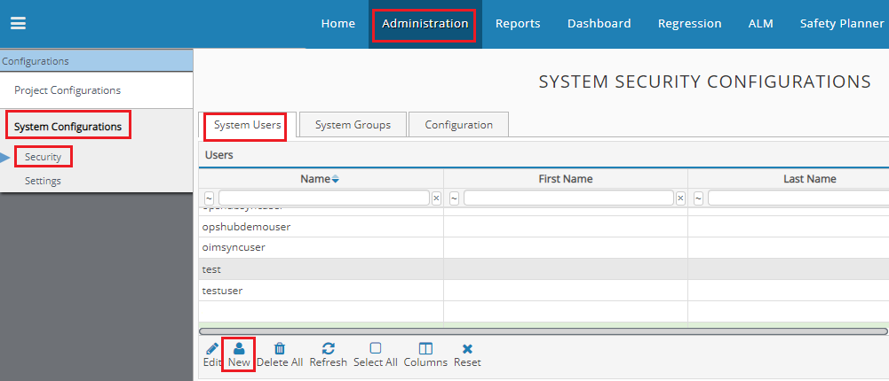
  </p>

* In "Create a new user" window, please provide "UserName" and click "Create" button
  
<p align="center">
  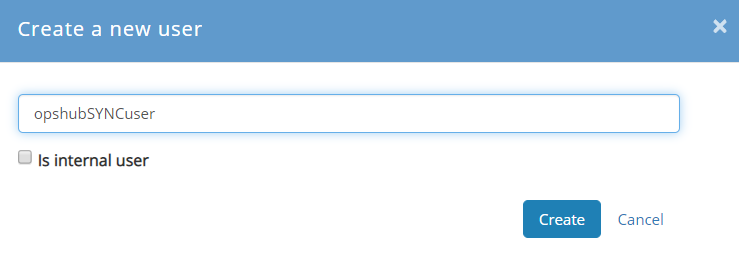
</p>


> **Note**: "Internal User" can also be created, but in case of "Internal User", password needs to be provided in "Create a new user" window.

* Created user will be available in the list of "Users" under "System Users". To determine the access levels of the created Verisium Manager User for the specific Verisium Manager Porject, please refer to [Add User in Project with Permissions](vManager.md#add-user-in-project-with-permissions) 

  <p align="center">
  
  </p>


## Add User in Project with Permissions

There are three ways to add the user in the project with the permissions for accessing **Verisium Manager instance APIs**:

1. [Disable authorization and access control](vManager.md#disable-authorization-and-access-control)
2. [Add User with Access Control](vManager.md#add-user-with-access-control)
3. [Add User to a System Group](vManager.md#add-user-to-a-system-group)

### Disable authorization and access control

If the security setting: **Enable authorization and access control (All authentication channels must be enabled** is disabled for the Verisium Manager Project that is going to be used in the Integration Configuration, then by default, the user will have the permission to access the Verisium Manager instance APIs for that project. To validate the same, please follow the steps given below:

* Go to Verisium Manager Web Client, i.e. please visit `https://<Verisium Manager Server IP>:<Port Number>/web/vmgr` in the browser;
* Login with the Admin User and select the Verisium Manager Project that is going to be used in the Integration Configuration;
* Go to **Administration** section;
* Select "Project Configurations" -> "Security" -> "Configuration" -> "ENABLE /DISABLE SECURITY";
* Setting : "Enable authorization and access control (All authentication channels must be enabled)" shall be disabled.
  
  <p align="center">
  
  </p>


> **Note**: If you want to keep this setting enabled, then please refer to [Add User with Access Control](vManager.md#add-user-with-access-control) to add the user in the project and, set the required access control.

### Add User with Access Control

* Go to Verisium Manager Web Client, i.e. please visit `https://<Verisium Manager Server IP>:<Port Number>/web/vmgr` in the browser
* Login with the Admin User and select the Verisium Manager Project that is going to be used in the Integration Configuration
* Go to **Administration** section
* Select "Project Configurations" -> "Security" -> "Access Control"
* Select "Add" in "Users with access to project"
  
<p align="center">
  
</p>
 
* Select the User from the "Users" and click "Add Selected"
  
<p align="center">
  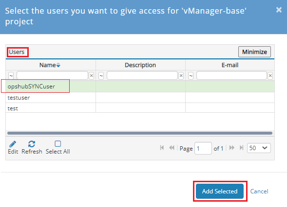
</p>

* Select the User from the "Users with access to project " and click "Project Permissions"
  
  <p align="center">
  
  </p>

* Select "vPlan Read", "vPlan Write" and "vPlan Controlled _Sections", permissions from "Available" list and click on "Confirm" button
  
<p align="center">
  
</p>

  :  * "vPlan Read" permission is required to perform "Read" operation on the entities of vPlan. Permission is needed when Verisium Manager is either source or target system in the Integration Configuration. 
  :  * "vPlan Write" permission is required to perform a "Write" operation on the entities of vPlan. Permission is required when Verisium Manager is the target system in the Integration Configuration or "Remote Entity Id Field Name"/"Remote Entity Link Field Name" is configured in advanced configuration of Integration. 
  :  * "vPlan Controlled _Sections" permission is required to perform a "Write" operation on the Controlled [Section [(Sub Type) ]](vManager.md#section5b28sub_type295d) of vPlan. Permission is required when Verisium Manager is the target system in the Integration configuration, and the [Section [(Sub Type) ]](vManager.md#section5b28sub_type295d) entities used in the Integration are the Controlled [Section [(Sub Type) ]](vManager.md#section5b28sub_type295d)

### Add User to a System Group

In this configuration, the user not having permission to access the specific project is added to a **System Group**. The **System Group** is then added as a Group having access to that particular project.

* Go to Verisium Manager Web Client, i.e. please visit `https://<Verisium Manager Server IP>:<Port Number>/web` in the browser.
* Login with the User that has permissions to change System Security Configurations.
* Select "Configurations" -> "System Level" -> "Security".
  
<p align="center">
  
</p>

* Select "System Groups" tab under "System Security Configurations".
* Select "New" in "Groups". 

  <p align="center">
  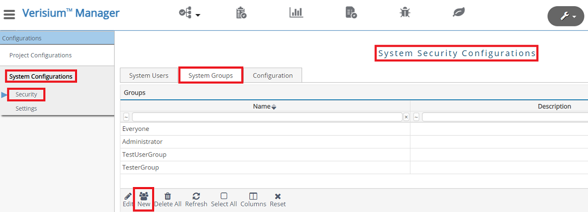
</p>

* In "Create a new group" window, provide "GroupName" and click "Create" button.
* Select the newly created in "Groups".
* Select "Add" in "Users of group ". 
  
  <p align="center">
  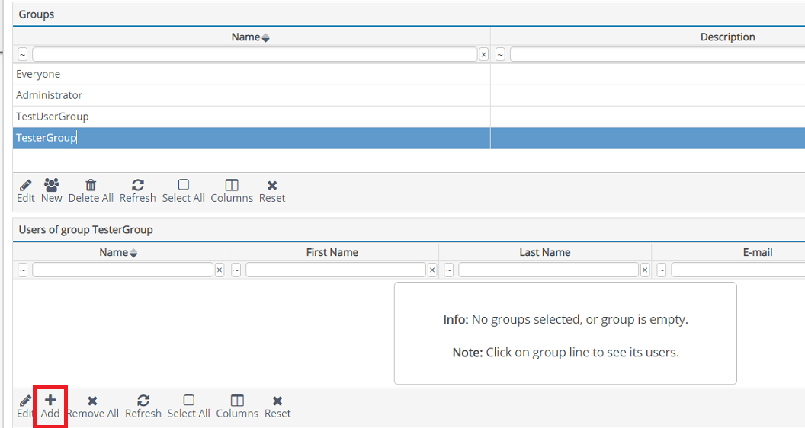
  </p>

* In "Select the users you want to add for group " window, select the  {{SITENAME }} user and click "Add Selected".
* Under the "Configurations" pane, Select "Project Configurations" -> "Security".
* Select "Access Control" tab under "Project Security Configurations".
* Select "Add" in "Groups with access to project ". Select the newly created and click "Add Selected". 
  
  <p align="center">
  
  </p>

## Project Configuration

* Go to Verisium Manager Web Client, i.e. please visit `https://<Verisium Manager Server IP>:<Port Number>/web/vmgr` in the browser
* Login with the Admin User and select the Verisium Manager Project that is going to be used in the Integration Configuration
* Go to **Administration** section
* Select "Project Configurations" -> "Security" -> "Configuration" -> "ADVANCED SETTINGS"
* Setting: "Block vAPI/Web from serving non-administration requests" must be disabled
  
<p align="center">
  
</p>


## Add Custom Field

In Verisium Manager, the Custom Field can be created in two steps :

1. [Create csv file for Custom Field](vManager.md#create-csv-file-for-custom-field)
2. [Import csv file](vManager.md#import-csv-file)

### Create csv file for Custom Field

Create a csv file with details given below, and save it with a suitable name in the **Verisium Manager Server** directory.

<p align="center">
  
</p>


> **Note**: Above csv file can also be created in any Text Editor with contents given below : 
> NAME ,DISPLAY _NAME ,DESCRIPTION ,VALID _CONTAINER _NAMES ,TYPE ,DEFAULT _VALUE ,SHOULD _PROPAGATE ,VALID _VALUES ,IS _GRADE _ATTRIBUTE ,CALCULATION _SCRIPT ,VPLAN _MODIFIABLE,MODIFIABLE OH _Last _Update,OH _Last _Update,Last Update by the OpsHub,section;,ATTRIBUTE _TYPE _STRING,,TRUE,,FALSE,,TRUE,TRUE

### Import csv file

* Open Verisium Manager Desktop Client in the administration mode. i.e. Launch Verisium Manager desktop client by using `Verisium Manager -admin` command in the Command Prompt of the machine where **Verisium Manager client** is configured
* Login with the Admin User, if client asks for the UserName and Password
* Go to **Administration** section
* Click on the **User Attributes** -> **Import user defined attributes from csv file**
  
<p align="center">
  
</p>

* It will open **ImportAttributes** window. Please select the file that is saved in step 1 ([Create csv file for Custom Field](vManager.md#create-csv-file-for-custom-field)) and click **Open** button. For example, if file is saved with the name `custom_attributes.csv`, then select that file in this window and click Open button
  
<p align="center">
  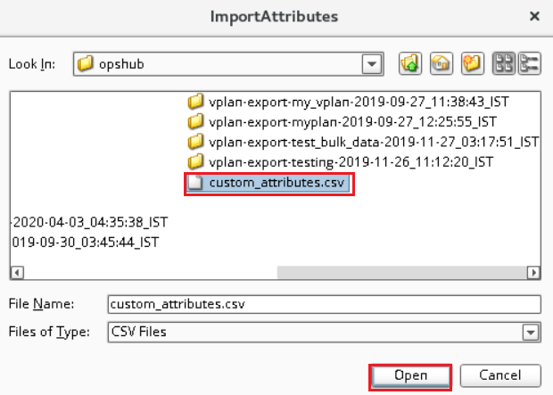
</p>

* Now the added Custom field can be seen in the **User Defined Attributes** section
  
 <p align="center">
  
</p>


## How to determine the Attr Name

* Go to Verisium Manager Web Client, i.e. visit `https://<Verisium Manager Server IP>:<Port Number>/web/vmgr` in the browser
* Login with the Admin User and select the Verisium Manager Project that is going to be used in the Integration Configuration
* Select **Monitor & vAPI**
  
<p align="center">
  
</p>

* Select **vAPI**
  
<p align="center">
  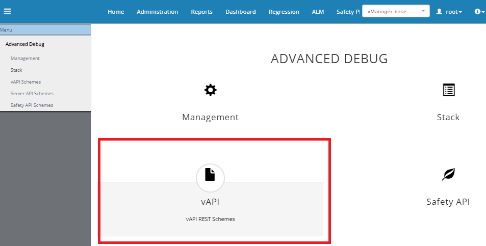
</p>

* Provide username and password if you have not logged in before in the vAPI
* Select `vplan/get-all-fields` -> **Try it out**
  
 <p align="center">
  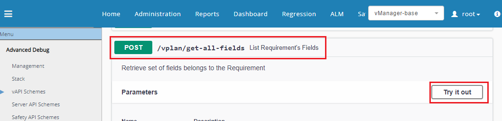
</p>

* Provide below request body in the "body" text box

**For** [**Metrics Port [(Sub Type) ]**](vManager.md#metrics_port5b28subtype295d) **Entity**

```json
{
  "vplan-entity-type": "METRICS_PORT"
}
```

**For Section [(Sub Type)] Entity**

```json
{
  "vplan-entity-type": "SECTION"
}
```

* Click on Execute button

<p align="center">
  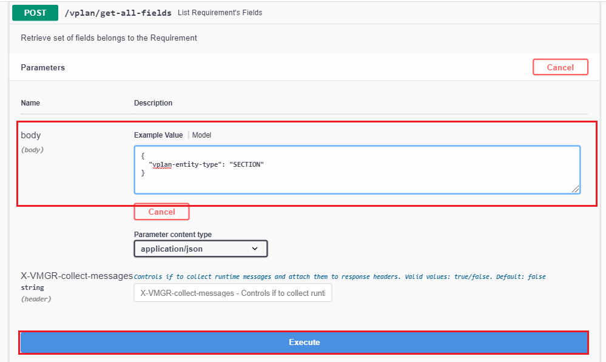
</p>

* In the Server response of this request, data will be in the format given below:

```json
{
  "Attr Name ": "attr_name",
  "Display Name ": "Display_Name",
  "Type ": "STRING",
  "is Hidden": "false",
  "Is User Defined Attribute ": "False",
  "Is Modifiable ": "True"
}
```

* Please find the "Display Name" for which "Attr Name" needs to be determined. The value of "Attr Name" corresponding to the "Display Name" is the "Attr Name" to be used in the Criteria Configuration, i.e. If "Attr Name" for Name field is to be determined then in the response, find "Name" Display Name. In the response: can be found. From the response, we can determine that "Attr Name" corresponding to the Name field is name. Hence, name is the "Attr Name" for the field display name Name.

## How to determine the Project Identifier

* Go to Verisium Manager Web Client, i.e., visit `https://<Verisium Manager Server IP>:<Port Number>/web` in the browser.
* Login with the User that has permissions to change System Security Configurations.
* Select "Configurations" -> "System Level" -> "Setting".
  
 <p align="center">
  
</p>

* Select "Projects" pane under the "System Settings".
  
 <p align="center">
  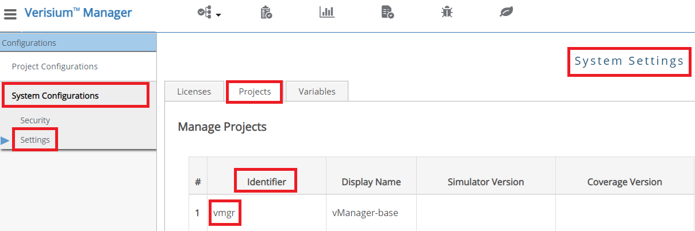
</p>

# Glossary

##  [Section [(Sub Type)]]

It refers to the "Section" Entity of the Verisium Manager **with or without Sub Type**

##  [Metrics Port [(Sub Type)]]

It refers to the "Metrics Port" Entity of the Verisium Manager **with or without Sub Type**
