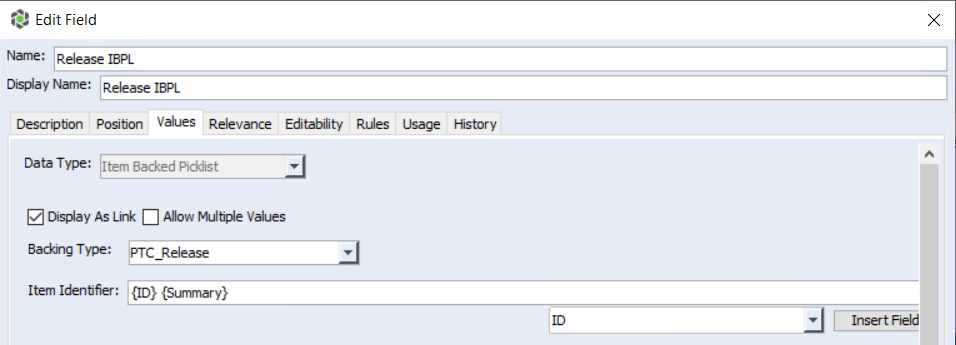
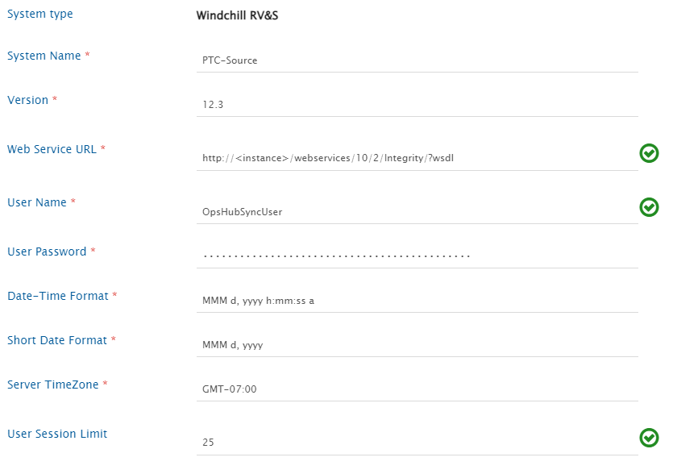
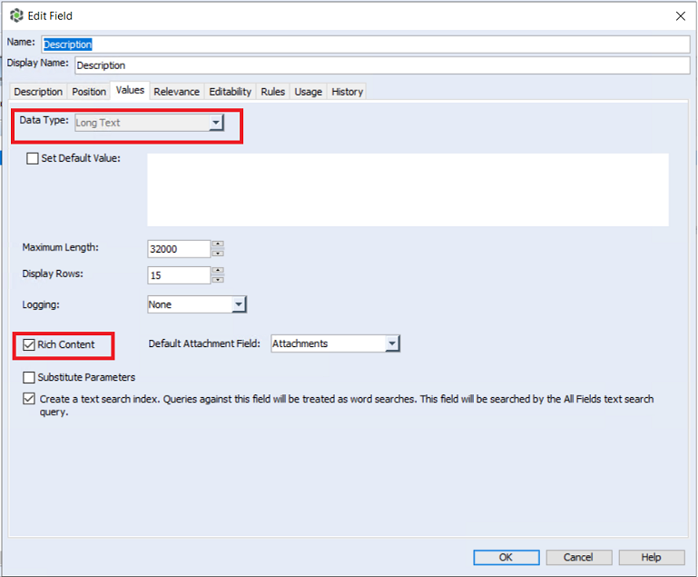
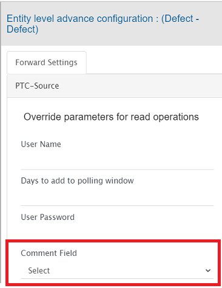
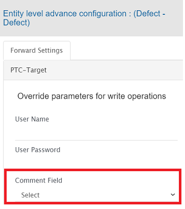

# windchill rv\&s

## Prerequisites

### User privileges

* Create one user of Windchill RV\&S, dedicated to OpsHub Integration Manager. User should not be used to do any operations from system's user interface.
* User should have access to all the projects that needs to be integrated.
* Integration user should at least have the following ACL permissions:
  * Login
  * View Admin

**To check or edit these permissions**:

* Go to 'Windchill RV\&S'' Administration > Administration > Permissions > All
* In right panel go to `mks > im > View ACL`
* Look for ACL of particular group or user with above-mentioned permission.

#### Prerequisites for synchronizing links

* For integrating or migrating links, the service user must have the required access to the linked entity.
  * For example, while integrating defects from Windchill RV\&S to any other end system, if the release entity linked with defects needs to be synchronized, the user must have the required access to the release entity.
  * If the user does not have the required access to the linked entity, OpsHub Integration Manager will skip that link and add a log at the warning level.

### Custom field configuration

One special field is required on the entity that is being synchronized. This must be set up so that the integration status of each item can be tracked:

| **Property Name** | **Type**   |
| ----------------- | ---------- |
| OH\_Last\_Update  | Short Text |

### Library configuration

* This configuration is required before creating mappings or integrations with Windchill RV\&S.
* Stop Server Service before making changes for this configuration.
* Required Libraries:
  * `mksapi.jar`: This jar file is available at `<Windchill RV&S Server Installation folder>\server\mks\lib` directory.
  * `ptc.jar`: This jar is to be generated from ptc webservice wsdl file.

#### Steps to configure Windchill RV\&S libraries

* Stop Server Service.
* Go to `<OpsHub Installation Directory>\OpsHubServer\bundle_config\PTC_LIB` directory.
* Create a directory with your Windchill RV\&S version. For instance, `12.3`.
* Place both `mksapi.jar` and `ptc.jar` in this directory.
* Start Server Service.
* Provide the exact version when configuring Windchill RV\&S.

>  For version 2009, 10.7, 12.0, 12.3, 13.1 and 13.3 `ptc.jar` is already present in your OpsHub Integration Manager installation directory. The user needs to place only `mksapi.jar`. Follow the steps given above if you have some different Windchill RV\&S version.

### Configuration for fields to be synchronized

* All the fields, which are to be synchronized from or to Windchill RV\&S, should be visible for the configured type. For example, if you want to sync `Bug`, then, make all the required fields visible in `Bug` type.
* **Item Backed Pick List (IBPL)**
  * To synchronize the above fields, the `Item Identifier` input in the field configuration should have the format like `{ID} {Summary}`. Here, the Backed Item ID should be the first field and its display name should be given after the ID.
  * If the `Item Identifier` does not have the above mentioned format, the synchronization of IBPL field will not occur. In this case, the error will be logged in OpsHub Integration Manager's synchronization logs.



## System configuration

Before you continue to the integration, you must first configure Windchill RV\&S. Click [System Configuration](system-configuration/) to learn the step-by-step process to configure a system. Refer to the screenshot given below for reference.



If the system is deployed on HTTPS and a self-signed certificate is used, then you will have to import the SSL Certificate to be able to access the system from TEST MEDIAWIKI. Click [Import SSL Certificates](import-ssl-certificates/) to learn how to import SSL certificate.

The **User Session Limit** in System Configuration is used to limit the number of sessions used by OpsHub Integration Manager. The default session limit is 25.

>  Synchronization time will be affected if less number of sessions are available. Refer to [Modify User Session Limit](<windchill rv\&s.md#modify-user-session-limit>) section to learn more on how to configure the user session limit in Windchill RV\&S.

## Mapping configuration

Map the fields between Windchill RV\&S and the other system to be integrated to ensure that the data between both the systems synchronizes correctly. Click [Mapping Configuration](mapping-configuration/) to learn the step-by-step process to configure mapping between the systems.

### Advanced Workflow Transition

#### Need for handling workflow transition

Workflow transition is applicable only when Windchill RV\&S is integrated as a target system. To understand the need for handling workflow transition in Windchill RV\&S, let us take an example: A `Defect` in Windchill RV\&S, when created should be in `New` state. It can then be moved to `Open` state and then to `Resolved` state, but it cannot be directly marked as `Resolved` from `New` state because of the state transition constraints enforced through Windchill RV\&S workflow configuration.

In such scenarios, simply mapping the State field and their look-up values can cause failure(s). The possible scenarios in which the failure can happen are listed below:\
**Scenario 1**: If the user tries to synchronize a defect in Windchill RV\&S with an `Open` state, the user will get a failure with an error message that `Open` is an invalid state because the defect can only be created in `New` state.\
**Scenario 2**: If a Windchill RV\&S Defect is in `New` state and the integration tries to update its status to `Resolved`, a failure will be generated with an error that this item cannot be edited because of invalid state.

#### Solution for handling workflow transition

This issue can be resolved by applying any of the following approaches:

1. Add/Edit workflow transition XML in mapping configuration of OpsHub Integration Manager
2. Change the workflow configuration for the failed state in Windchill RV\&S for sync user

**1. Add/Edit workflow transition XML in mapping configuration of OpsHub Integration Manager**

Click [Workflow Transition](mapping-configuration/#workflow-transition) to learn when and how to configure workflow transition XML mapping.\
With this option, OpsHub Integration Manager makes the required intermediate status transition automatically as per the transition(s) configuration on the end system.

**2. Change workflow configuration in Windchill RV\&S**

Windchill RV\&S allows us to configure any state to state transition for the selected entity type. For step-by-step instructions to configure any-to-any transitions, refer to [Configuration to allow all transitions](<windchill rv\&s.md#configuration-to-allow-all-transitions>).

### Mapping Long Text fields

In Windchill RV\&S, user gets an option to configure a field as Rich Text Field as shown in the image below:



* If the **Data Type** of the field is **Long Text** and it is configured as a **Rich Text** field in Windchill RV\&S system, then only, it will be considered a **Rich Text** field in OpsHub Integration Manager mapping; otherwise, it will be considered a **Text** type field in the mapping.
* Hence, if the user has mapped a Long Text field in mapping and then changes the Rich Text configuration of that field in Windchill RV\&S or vice versa, the respective field should be re-mapped in OpsHub Integration Manager mapping to accommodate the field configuration changes.

### Rank

#### Overview

* Windchill RV\&S organizes the entities of role type `segment` and `node` in tree structure through `Contains` and `Contained By` relationship. The `Contains` relationship represents the sub-requirement(s) of the entity and `Contained By` represents the immediate parent of an entity in document view.
  * The entities of role `segment` type are like Input Document, Specification Document, Software Document.
  * The entities of role `node` types are like Input, Specification, Software Requirement.

>  To check the role type of the entity, please refer to: [Find the role type](<windchill rv\&s.md#find-the-role-type-of-the-entity-type>).

* To synchronize the entities maintaining the above structure, the user can configure the `Contains` and `Contained By` relationship as per the standard [Relationships Configuration](mapping-configuration/#relationships). Within this structure, to maintain the rank (order) of entities, the user should enable the Rank Synchronization as explained in [Rank Configuration](mapping-configuration/#configuration).

#### Known Limitations

* OpsHub Integration Manager is not able to connect to Windchill RV\&S via proxy for the operations (like loading projects, entities, etc) due to API limitation.
* When Windchill RV\&S is source end system in synchronization:
  * In Windchill RV\&S, when a rank (order) is changed for any entity, neither its `Modified Date` is changed nor revision gets generated. Once operation of the rank (order) change is performed, it is reflected in the target end system upon the next update on the entity, which leads to the change in the `Modified Date` of the entity.

### Attachments Synchronization

When Windchill RV\&S is the target system:

* In Windchill RV\&S, there can be multiple attachment type of field.
* To synchronize attachment to a specific field, attachment field's internal name needs to be provided in the attachments advance mapping.
  * Inline attachments will also be synchronized to this attachment field.
    * Refer to [Search internal name for a Windchill RV\&S field](<windchill rv\&s.md#search-internal-name-for-a-windchill-rv\&s-field>) to find the internal name of a field.
* Consider the following attachments advance mapping to synchronize attachments to a specific field in Windchill RV\&S:
  * Here, **Custom Attachment** is the internal name of the attachment field.

```xml
<OHAttachments>
  <xsl:for-each xmlns:xsl="http://www.w3.org/1999/XSL/Transform" select="SourceXML/updatedFields/Property/OHAttachments/OHAttachment">
    <xsl:element name="{concat('attachment_',position())}">
      <filename><xsl:value-of select="fileName"/></filename>
      <addedByUser><xsl:value-of select="addedByUser"/></addedByUser>
      <contentLength><xsl:value-of select="contentLength"/></contentLength>
      <contentType><xsl:value-of select="contentType"/></contentType>
      <contentBase64><xsl:value-of select="contentBase64"/></contentBase64>
      <attachmentURI><xsl:value-of select="attachmentURI"/></attachmentURI>
      <updateTimeStamp><xsl:value-of select="updateTimeStamp"/></updateTimeStamp>
      <label><xsl:value-of select="label"/></label>
      <fileComment><xsl:value-of select="fileComment"/></fileComment>
      <attachmentReferenceType><xsl:value-of select="attachmentReferenceType"/></attachmentReferenceType>
      <uniqueCode><xsl:value-of select="uniqueCode"/></uniqueCode>
      <attachmentType>
        <xsl:variable name="xPathVariable" select="attachmentType"/>
        <xsl:value-of select="attachmentType"/>
      </attachmentType>
      <attachmentFieldName>Custom Attachment</attachmentFieldName>
    </xsl:element>
  </xsl:for-each>
</OHAttachments>
```

## Integration configuration

Set a time to synchronize data between Windchill RV\&S and the other system to be integrated. Also, define parameters and conditions, if any, for integration.\
Click [Integration Configuration](integration-configuration/) to learn the step-by-step process to configure integration between two systems.

### Comments Configuration

If comments' synchronization is enabled in the Mapping Configuration:

* The **Comment Field** needs to be configured in the Integration Configuration.
  * If Windchill RV\&S is the source system:
    * Navigate to 'Override parameters for read operations' in Entity level advance configuration and configure the **Comment Field**.
    * 
  * If Windchill RV\&S is the target system:
    * Navigate to 'Override parameters for write operations(Destination)' in Entity level advance configuration and configure the **Comment Field**.
    * 

### Criteria Configuration

If you want to specify conditions for synchronizing an entity between PTC Integrity and the other system to be integrated, you can use the Criteria Configuration feature. Go to Criteria Configuration section on [Integration Configuration](integration-configuration/) page to learn in detail about Criteria Configuration.

#### Query

* PTC Integrity query can be formed using the name given to field at the time of creating it, for example: State, Create Date, Modified Date.
* The Query Format is: `(field[Field Name]=value)`
  * For textual fields query format is: `(field[Field Name]="value")`

> Parenthesis "()" are required around the query as given in the format and sample.

#### Sample query

Example:

```
(field[State]=Open)
(not(field[State]=Open))
(field[Modified Date] between time Nov 26, 2013 12:00:00 AM and NOV 30, 2013 12:22:45 PM)
((field[State]=Open) or (field[State]=In Progress))
(field[Summary]="criteria")
(field[Type]="Bug")
```

* In Query Configuration of the field with value containing special characters **"** (Double Quotes) or **\\** (Back slash), the special characters should be escaped (by adding escaping character `\`) while setting the criteria query in the OpsHub Integration Manager.
* Below is the example of the criteria query with the value containing special characters:\
  `(field[Description] ="\"Test Successful!\"")`

> Escaping of characters is required if the value of the field or the field name contains special characters.

### Target LookUp Configuration

Provide Query in **Target Search Query** field such that it is possible to search the entity in the Windchill RV\&S as a destination system.\
Target LookUp configuration is similar to the Criteria Configuration where in the target search query field, you can provide a placeholder for the source system's field value in-between '@'.

Go to **Search in Target Before Sync** section on [Integration Configuration](integration-configuration/) page to learn in detail about how to configure target lookup.

#### Sample Queries

* Target Lookup Query on the field Custom\_text\
  `(field[Custom_text] contains "@oh_internal_id@")`\
  **Description:** It represents the query that will select only those entities, whose "Custom\_text" contains source entity id.
* Target Lookup Query on a single entity\
  `(field[ID] = 100)`\
  **Description:** It represents the query that will select only one entity with ID = 100.

### Integration Limitations

* In an attachment synchronization, if the file name contains any windows restricted special chars (i.e. `|`, `<`, `>`, `?`, `*`, `"`, `:`, `,`, `/`, `\`) then those chars will be truncated because Windchill RV\&S itself doesn't allow these chars.
* Attachment with the same name shall be renamed as per the Windchill RV\&S UI. For ex. if entity is having Test.png in its attachments and if same file name comes in attachment then it will be renamed to Test\~2.png.
* When Windchill RV\&S is the source system:
  * **Use Case:** "Include author in comment" is configured in Comment Configuration to synchronize comment's author to the target system.
    * If the user name of a comment's author contains sequence of characters, i.e., **" (** \[white space followed by an open round bracket], then incorrect author name will synchronize to the target system.

### Known Behaviour

* **Use Case:** Reducing the **User Session Limit** \[field in System configuration]
  * The **User Session Limit** should be first reduced in OpsHub Integration Manager and then in Windchill RV\&S.
  * Mismatch in this limit between OpsHub Integration Manager and Windchill RV\&S can lead to temporary failures with error message:\
    &#xNAN;_"MKS161774: Too many concurrent logins. Maximum allowed number of concurrent logins is 1. Please log out from unused Windchill RV\&S clients to allow for new logins."_

## Entity specific information

### Test Suite

#### Known Limitations

* OpsHub Integration Manager does not support **Branches**, **Labels** and **Change Packages** actions for Test Suite synchronization.

### Test Case and Test Steps

#### Overview

* In Windchill RV\&S, Test Steps are used to identify the sequence of actions required to perform a Test Case. OIM supports integration of these test steps for Windchill RV\&S to other systems and vice-versa. However, Test Steps is treated as a field of test case in OIM.

#### Test Step fields synchronization and Test Steps subfields

* The user should map the 'Test Steps' field to synchronize test steps using OpsHub Integration Manager.
* The Test Steps entity in Windchill RV\&S has multiple fields. However, the user can choose to map any number of fields he/she wants by mentioning those fields in advance mapping as shown in the templates below.

#### Mapping for Test Steps field

* In case of Test Steps field mapping, initially the advance mapping of Test Steps field has to be replaced, and user needs to provide advance mapping for Test Steps field synchronization as shown in the sections below:

**When Windchill RV\&S is source system**

* Let us consider that we want to synchronize Windchill RV\&S Test Case to other target end point, for example, Jira Xray Test Case. Here, in fields mapping configuration, we will map Windchill RV\&S Test Steps field with Jira XRay Manual Steps field along with other required fields which should be synchronized.
* Here, both the systems have sub fields for Test Steps. Let's consider that Windchill RV\&S Test Steps has "Description", "Summary" and "Result" fields and Jira XRay Manual Test Steps have "description", "step" and "expected" fields. Here, we need to use advance mapping for synchronization of these fields. Please refer to the below template and example for better understanding of the advance mapping:

```xml
 <Manual-space-Test-space-Steps>
  <xsl:for-each xmlns:xsl="http://www.w3.org/1999/XSL/Transform" 
  select="SourceXML/updatedFields/Property/Test-space-Steps/com.opshub.eai.ptc.common.TestStep">
    <xsl:element name="{concat('_',order)}">
      <xsl:element name="order">
        <xsl:value-of select="order"/>
      </xsl:element>
      <xsl:element name="step">
        <xsl:value-of select="ptcFields/<Field_Internal_Name>"/>
      </xsl:element>
      <xsl:element name="expected">
        <xsl:value-of select="ptcFields/<Field_Internal_Name>"/>
      </xsl:element>
      <xsl:element name="description">
        <xsl:value-of select="ptcFields/<Field_Internal_Name>"/>
      </xsl:element>
        <xsl:if test="eaiAttachment">			
      <OHAttachments>
      <xsl:for-each select="eaiAttachment/OHAttachment">
      <xsl:element name="{concat('attachment_',position())}">
      <filename>
        <xsl:value-of select="fileName"/>
      </filename>
      <addedByUser>
        <xsl:value-of select="addedByUser"/>
      </addedByUser>
      <contentLength>
        <xsl:value-of select="contentLength"/>
      </contentLength>
      <contentType>
        <xsl:value-of select="contentType"/>
      </contentType>
      <contentBase64>
        <xsl:value-of select="contentBase64"/>
      </contentBase64>
      <attachmentURI>
        <xsl:value-of select="attachmentURI"/>
      </attachmentURI>
      <updateTimeStamp>
        <xsl:value-of select="updateTimeStamp"/>
      </updateTimeStamp>
      <label>
        <xsl:value-of select="label"/>
      </label>
      <fileComment>
        <xsl:value-of select="fileComment"/>
      </fileComment>
      <attachmentReferenceType>
        <xsl:value-of select="attachmentReferenceType"/>
      </attachmentReferenceType>
      <uniqueCode>
       <xsl:value-of select="uniqueCode"/>
      </uniqueCode>
      <attachmentType>
       <xsl:variable name="xPathVariable" select="attachmentType"/>
       <xsl:value-of select="attachmentType"/>
      </attachmentType>			
      </xsl:element>
      </xsl:for-each>
      </OHAttachments>
            
      </xsl:if>
      </xsl:element>
      </xsl:for-each>
 </Manual-space-Test-space-Steps>
```

* The `<Field_Internal_Name>` in above advance mapping template is the internal name of the field of Windchill RV\&S. The user should replace the tag `<Field_Internal_Name>` with appropriate fields that he/she wants to read data of test step details, description and expected result from. The tag `<Field_Internal_Name>` under "description", "step" and "expected" in mapping should be replaced by "Description", "Summary" and "Result" respectively if fields like "Description", "Summary" and "Result" present in Windchill RV\&S entity need to be mapped to "description", "step" and "expected" respectively.
* User can find internal names of fields in Windchill RV\&S by following the steps mentioned in [Search internal name for a Windchill RV\&S field](windchill-rv\&s/#search-internal-name-for-a-windchill-rv\&s-field).

**When Windchill RV\&S is target system**

* Let us consider that we want to synchronize Jira Xray Test Case entity along with Manual Test Steps to target end point Windchill RV\&S Test Case along with Test Steps details. Hence, with Test Case fields mapping configuration, we will map Windchill RV\&S Test Steps field with Jira XRay Manual Steps field along with other fields that should be synchronized.
* Here, both the systems have sub fields for Test Steps. Let's consider that Windchill RV\&S Test Steps has "Description", "Summary" and "Result" fields and Jira XRay Manual Test Steps have "description", "step" and "expected" fields. Here, we need to use advance mapping for synchronization of these fields.
