# Prerequisites

## User privileges

* Create one user of Windchill RV&S, dedicated to space.vars.SITENAME. User should not be used to do any operations from system's user interface.
* User should have access to all the projects that needs to be integrated.
* Integration user should at least have the following ACL permissions:
  * Login
  * View Admin

**To check or edit these permissions**:

* Go to 'Windchill RV&S'' Administration > Administration > Permissions > All
* In right panel go to `mks > im > View ACL`
* Look for ACL of particular group or user with above-mentioned permission.

## Prerequisites for synchronizing links

* For integrating or migrating links, the service user must have the required access to the linked entity.
  * For example, while integrating defects from Windchill RV&S to any other end system, if the release entity linked with defects needs to be synchronized, the user must have the required access to the release entity.
  * If the user does not have the required access to the linked entity, space.vars.SITENAME will skip that link and add a log at the warning level.

## Custom field configuration

One special field is required on the entity that is being synchronized. This must be set up so that the integration status of each item can be tracked:

| **Property Name** | **Type**   |
| ----------------- | ---------- |
| OH_Last_Update  | Short Text |

## Library configuration

* This configuration is required before creating mappings or integrations with Windchill RV&S.
* Stop Server Service before making changes for this configuration.
* Required Libraries:
  * `mksapi.jar`: This jar file is available at `<Windchill RV&S Server Installation folder>\server\mks\lib` directory.
  * `ptc.jar`: This jar is to be generated from ptc webservice wsdl file.

### Steps to configure Windchill RV&S libraries

* Stop Server Service.
* Go to `<OpsHub Installation Directory>\OpsHubServer\bundle_config\PTC_LIB` directory.
* Create a directory with your Windchill RV&S version. For instance, `12.3`.
* Place both `mksapi.jar` and `ptc.jar` in this directory.
* Start Server Service.
* Provide the exact version when configuring Windchill RV&S.

**Note**:  For version 2009, 10.7, 12.0, 12.3, 13.1 and 13.3 `ptc.jar` is already present in your space.vars.SITENAME installation directory. The user needs to place only `mksapi.jar`. Follow the steps given above if you have some different Windchill RV&S version.

## Configuration for fields to be synchronized

* All the fields, which are to be synchronized from or to Windchill RV&S, should be visible for the configured type. For example, if you want to sync `Bug`, then, make all the required fields visible in `Bug` type.
* **Item Backed Pick List (IBPL)**
  * To synchronize the above fields, the `Item Identifier` input in the field configuration should have the format like `{ID} {Summary}`. Here, the Backed Item ID should be the first field and its display name should be given after the ID.
  * If the `Item Identifier` does not have the above mentioned format, the synchronization of IBPL field will not occur. In this case, the error will be logged in space.vars.SITENAME's synchronization logs.
    
<p align="center">
  
</p>


# System configuration

Before you continue to the integration, you must first configure Windchill RV&S. Click [System Configuration](../integrate/system-configuration.md) to learn the step-by-step process to configure a system. Refer to the screenshot given below for reference.

<p align="center">
  
</p>


If the system is deployed on HTTPS and a self-signed certificate is used, then you will have to import the SSL Certificate to be able to access the system from TEST MEDIAWIKI. Click [Import SSL Certificates](../getting-started/ssl-certificate-configuration.md) to learn how to import SSL certificate.

The **User Session Limit** in System Configuration is used to limit the number of sessions used by space.vars.SITENAME. The default session limit is 25.

**Note**:  Synchronization time will be affected if less number of sessions are available. Refer to [Modify User Session Limit](#modify-user-session-limit) section to learn more on how to configure the user session limit in Windchill RV&S.

# Mapping configuration

Map the fields between Windchill RV&S and the other system to be integrated to ensure that the data between both the systems synchronizes correctly. Click [Mapping Configuration](../integrate/mapping-configuration.md) to learn the step-by-step process to configure mapping between the systems.

## Advanced Workflow Transition

### Need for handling workflow transition

Workflow transition is applicable only when Windchill RV&S is integrated as a target system. To understand the need for handling workflow transition in Windchill RV&S, let us take an example: A `Defect` in Windchill RV&S, when created should be in `New` state. It can then be moved to `Open` state and then to `Resolved` state, but it cannot be directly marked as `Resolved` from `New` state because of the state transition constraints enforced through Windchill RV&S workflow configuration.

In such scenarios, simply mapping the State field and their look-up values can cause failure(s). The possible scenarios in which the failure can happen are listed below:
**Scenario 1**: If the user tries to synchronize a defect in Windchill RV&S with an `Open` state, the user will get a failure with an error message that `Open` is an invalid state because the defect can only be created in `New` state.
**Scenario 2**: If a Windchill RV&S Defect is in `New` state and the integration tries to update its status to `Resolved`, a failure will be generated with an error that this item cannot be edited because of invalid state.

### Solution for handling workflow transition

This issue can be resolved by applying any of the following approaches:

1. Add/Edit workflow transition XML in mapping configuration of space.vars.SITENAME
2. Change the workflow configuration for the failed state in Windchill RV&S for sync user

**1. Add/Edit workflow transition XML in mapping configuration of space.vars.SITENAME**

Click [Workflow Transition](../integrate/mapping-configuration.md#workflow-transition) to learn when and how to configure workflow transition XML mapping.
With this option, space.vars.SITENAME makes the required intermediate status transition automatically as per the transition(s) configuration on the end system.

**2. Change workflow configuration in Windchill RV&S**

Windchill RV&S allows us to configure any state to state transition for the selected entity type. For step-by-step instructions to configure any-to-any transitions, refer to [Configuration to allow all transitions](#configuration-to-allow-all-transitions).

## Mapping Long Text fields

In Windchill RV&S, user gets an option to configure a field as Rich Text Field as shown in the image below:

<p align="center">
  
</p>

* If the **Data Type** of the field is **Long Text** and it is configured as a **Rich Text** field in Windchill RV&S system, then only, it will be considered a **Rich Text** field in space.vars.SITENAME mapping; otherwise, it will be considered a **Text** type field in the mapping.
* Hence, if the user has mapped a Long Text field in mapping and then changes the Rich Text configuration of that field in Windchill RV&S or vice versa, the respective field should be re-mapped in space.vars.SITENAME mapping to accommodate the field configuration changes.

## Rank

### Overview

* Windchill RV&S organizes the entities of role type `segment` and `node` in tree structure through `Contains` and `Contained By` relationship. The `Contains` relationship represents the sub-requirement(s) of the entity and `Contained By` represents the immediate parent of an entity in document view.
  * The entities of role `segment` type are like Input Document, Specification Document, Software Document.
  * The entities of role `node` types are like Input, Specification, Software Requirement.

**Note**:  To check the role type of the entity, please refer to: [Find the role type](#find-the-role-type-of-the-entity-type).

* To synchronize the entities maintaining the above structure, the user can configure the `Contains` and `Contained By` relationship as per the standard [Relationships Configuration](../integrate/mapping-configuration.md#relationships). Within this structure, to maintain the rank (order) of entities, the user should enable the Rank Synchronization as explained in [Rank Configuration](../integrate/mapping-configuration.md#configuration).

### Known Limitations

* space.vars.SITENAME is not able to connect to Windchill RV&S via proxy for the operations (like loading projects, entities, etc) due to API limitation.
* When Windchill RV&S is source end system in synchronization:
  * In Windchill RV&S, when a rank (order) is changed for any entity, neither its `Modified Date` is changed nor revision gets generated. Once operation of the rank (order) change is performed, it is reflected in the target end system upon the next update on the entity, which leads to the change in the `Modified Date` of the entity.

## Attachments Synchronization

When Windchill RV&S is the target system:

* In Windchill RV&S, there can be multiple attachment type of field.
* To synchronize attachment to a specific field, attachment field's internal name needs to be provided in the attachments advance mapping.
  * Inline attachments will also be synchronized to this attachment field.
    * Refer to [Search internal name for a Windchill RV&S field](search-internal-name-for-a-windchill-RV&S-field) to find the internal name of a field.
* Consider the following attachments advance mapping to synchronize attachments to a specific field in Windchill RV&S:
  * Here, **Custom Attachment** is the internal name of the attachment field.

```xml
<OHAttachments>
  <xsl:for-each xmlns:xsl="http://www.w3.org/1999/XSL/Transform" select="SourceXML/updatedFields/Property/OHAttachments/OHAttachment">
    <xsl:element name="{concat('attachment_',position())}">
      <filename><xsl:value-of select="fileName"/></filename>
      <addedByUser><xsl:value-of select="addedByUser"/></addedByUser>
      <contentLength><xsl:value-of select="contentLength"/></contentLength>
      <contentType><xsl:value-of select="contentType"/></contentType>
      <contentBase64><xsl:value-of select="contentBase64"/></contentBase64>
      <attachmentURI><xsl:value-of select="attachmentURI"/></attachmentURI>
      <updateTimeStamp><xsl:value-of select="updateTimeStamp"/></updateTimeStamp>
      <label><xsl:value-of select="label"/></label>
      <fileComment><xsl:value-of select="fileComment"/></fileComment>
      <attachmentReferenceType><xsl:value-of select="attachmentReferenceType"/></attachmentReferenceType>
      <uniqueCode><xsl:value-of select="uniqueCode"/></uniqueCode>
      <attachmentType>
        <xsl:variable name="xPathVariable" select="attachmentType"/>
        <xsl:value-of select="attachmentType"/>
      </attachmentType>
      <attachmentFieldName>Custom Attachment</attachmentFieldName>
    </xsl:element>
  </xsl:for-each>
</OHAttachments>
```

# Integration configuration

Set a time to synchronize data between Windchill RV&S and the other system to be integrated. Also, define parameters and conditions, if any, for integration.\
Click [Integration Configuration](../integrate/integration-configuration.md) to learn the step-by-step process to configure integration between two systems.

## Comments Configuration

If comments' synchronization is enabled in the Mapping Configuration:

* The **Comment Field** needs to be configured in the Integration Configuration.
  * If Windchill RV&S is the source system:
    * Navigate to 'Override parameters for read operations' in Entity level advance configuration and configure the **Comment Field**.

  <p align="center">
    
  </p>

  * If Windchill RV&S is the target system:
    * Navigate to 'Override parameters for write operations(Destination)' in Entity level advance configuration and configure the **Comment Field**.
 
   <p align="center">
    
  </p>


## Criteria Configuration

If you want to specify conditions for synchronizing an entity between PTC Integrity and the other system to be integrated, you can use the Criteria Configuration feature. Go to Criteria Configuration section on [Integration Configuration](integration-configuration/) page to learn in detail about Criteria Configuration.

### Query

* PTC Integrity query can be formed using the name given to field at the time of creating it, for example: State, Create Date, Modified Date.
* The Query Format is: `(field[Field Name]=value)`
  * For textual fields query format is: `(field[Field Name]="value")`

> Parenthesis "()" are required around the query as given in the format and sample.

### Sample query

Example:

```
(field[State]=Open)
(not(field[State]=Open))
(field[Modified Date] between time Nov 26, 2013 12:00:00 AM and NOV 30, 2013 12:22:45 PM)
((field[State]=Open) or (field[State]=In Progress))
(field[Summary]="criteria")
(field[Type]="Bug")
```

* In Query Configuration of the field with value containing special characters **"** (Double Quotes) or **\** (Back slash), the special characters should be escaped (by adding escaping character `\`) while setting the criteria query in the space.vars.SITENAME.
* Below is the example of the criteria query with the value containing special characters:\
  `(field[Description] ="\"Test Successful!\"")`

> Escaping of characters is required if the value of the field or the field name contains special characters.

## Target LookUp Configuration

Provide Query in **Target Search Query** field such that it is possible to search the entity in the Windchill RV&S as a destination system.
Target LookUp configuration is similar to the Criteria Configuration where in the target search query field, you can provide a placeholder for the source system's field value in-between '@'.

Go to **Search in Target Before Sync** section on [Integration Configuration](../integrate/integration-configuration.md) page to learn in detail about how to configure target lookup.

### Sample Queries

* Target Lookup Query on the field Custom_text
  `(field[Custom_text] contains "@oh_internal_id@")`
  **Description:** It represents the query that will select only those entities, whose "Custom_text" contains source entity id.
* Target Lookup Query on a single entity
  `(field[ID] = 100)`
  **Description:** It represents the query that will select only one entity with ID = 100.

# Integration Limitations

* In an attachment synchronization, if the file name contains any windows restricted special chars (i.e. `|`, `<`, `>`, `?`, `*`, `"`, `:`, `,`, `/`, `\`) then those chars will be truncated because Windchill RV&S itself doesn't allow these chars.
* Attachment with the same name shall be renamed as per the Windchill RV&S UI. For ex. if entity is having Test.png in its attachments and if same file name comes in attachment then it will be renamed to Test~2.png.
* When Windchill RV&S is the source system:
  * **Use Case:** "Include author in comment" is configured in Comment Configuration to synchronize comment's author to the target system.
    * If the user name of a comment's author contains sequence of characters, i.e., **" (** [white space followed by an open round bracket], then incorrect author name will synchronize to the target system.

# Known Behaviour

* **Use Case:** Reducing the **User Session Limit** [field in System configuration]
  * The **User Session Limit** should be first reduced in space.vars.SITENAME and then in Windchill RV&S.
  * Mismatch in this limit between space.vars.SITENAME and Windchill RV&S can lead to temporary failures with error message: "MKS161774: Too many concurrent logins. Maximum allowed number of concurrent logins is 1. Please log out from unused Windchill RV&S clients to allow for new logins."_

 **Entity specific information**

## Test Suite
* space.vars.SITENAME does not support **Branches**, **Labels** and **Change Packages** actions for Test Suite synchronization.

## Test Case and Test Steps

### Overview

* In Windchill RV&S, Test Steps are used to identify the sequence of actions required to perform a Test Case. OIM supports integration of these test steps for Windchill RV&S to other systems and vice-versa. However, Test Steps is treated as a field of test case in OIM.

### Test Step fields synchronization and Test Steps subfields

* The user should map the 'Test Steps' field to synchronize test steps using space.vars.SITENAME.
* The Test Steps entity in Windchill RV&S has multiple fields. However, the user can choose to map any number of fields he/she wants by mentioning those fields in advance mapping as shown in the templates below.

## Mapping for Test Steps field

* In case of Test Steps field mapping, initially the advance mapping of Test Steps field has to be replaced, and user needs to provide advance mapping for Test Steps field synchronization as shown in the sections below:

**When Windchill RV&S is source system**

* Let us consider that we want to synchronize Windchill RV&S Test Case to other target end point, for example, Jira Xray Test Case. Here, in fields mapping configuration, we will map Windchill RV&S Test Steps field with Jira XRay Manual Steps field along with other required fields which should be synchronized.
* Here, both the systems have sub fields for Test Steps. Let's consider that Windchill RV&S Test Steps has "Description", "Summary" and "Result" fields and Jira XRay Manual Test Steps have "description", "step" and "expected" fields. Here, we need to use advance mapping for synchronization of these fields. Please refer to the below template and example for better understanding of the advance mapping:

```xml
 <Manual-space-Test-space-Steps>
  <xsl:for-each xmlns:xsl="http://www.w3.org/1999/XSL/Transform" 
  select="SourceXML/updatedFields/Property/Test-space-Steps/com.opshub.eai.ptc.common.TestStep">
    <xsl:element name="{concat('_',order)}">
      <xsl:element name="order">
        <xsl:value-of select="order"/>
      </xsl:element>
      <xsl:element name="step">
        <xsl:value-of select="ptcFields/<Field_Internal_Name>"/>
      </xsl:element>
      <xsl:element name="expected">
        <xsl:value-of select="ptcFields/<Field_Internal_Name>"/>
      </xsl:element>
      <xsl:element name="description">
        <xsl:value-of select="ptcFields/<Field_Internal_Name>"/>
      </xsl:element>
        <xsl:if test="eaiAttachment">			
      <OHAttachments>
      <xsl:for-each select="eaiAttachment/OHAttachment">
      <xsl:element name="{concat('attachment_',position())}">
      <filename>
        <xsl:value-of select="fileName"/>
      </filename>
      <addedByUser>
        <xsl:value-of select="addedByUser"/>
      </addedByUser>
      <contentLength>
        <xsl:value-of select="contentLength"/>
      </contentLength>
      <contentType>
        <xsl:value-of select="contentType"/>
      </contentType>
      <contentBase64>
        <xsl:value-of select="contentBase64"/>
      </contentBase64>
      <attachmentURI>
        <xsl:value-of select="attachmentURI"/>
      </attachmentURI>
      <updateTimeStamp>
        <xsl:value-of select="updateTimeStamp"/>
      </updateTimeStamp>
      <label>
        <xsl:value-of select="label"/>
      </label>
      <fileComment>
        <xsl:value-of select="fileComment"/>
      </fileComment>
      <attachmentReferenceType>
        <xsl:value-of select="attachmentReferenceType"/>
      </attachmentReferenceType>
      <uniqueCode>
       <xsl:value-of select="uniqueCode"/>
      </uniqueCode>
      <attachmentType>
       <xsl:variable name="xPathVariable" select="attachmentType"/>
       <xsl:value-of select="attachmentType"/>
      </attachmentType>			
      </xsl:element>
      </xsl:for-each>
      </OHAttachments>
            
      </xsl:if>
      </xsl:element>
      </xsl:for-each>
 </Manual-space-Test-space-Steps>
```

* The `<Field_Internal_Name>` in above advance mapping template is the internal name of the field of Windchill RV&S. The user should replace the tag `<Field_Internal_Name>` with appropriate fields that he/she wants to read data of test step details, description and expected result from. The tag `<Field_Internal_Name>` under "description", "step" and "expected" in mapping should be replaced by "Description", "Summary" and "Result" respectively if fields like "Description", "Summary" and "Result" present in Windchill RV&S entity need to be mapped to "description", "step" and "expected" respectively.
* User can find internal names of fields in Windchill RV&S by following the steps mentioned in [Search internal name for a Windchill RV&S field](#search-internal-name-for-a-windchill-rv&s-field).

 **Known Behaviour**

* OIM provides conflict management configuration for all fields. Conflict management configuration is also supported for Test Steps since it treats Test Steps as a field too. However, following behaviour should be taken into consideration by the user:
* Test Steps field is considered as a list of test steps. Conflict handling is not done for individual test steps. Even if one step has conflict, event failure will occur for complete test case. For example, we have steps 1,2,3 in source system and target system. If the user changes step 2 in source and step 3 in target, it will be considered as conflict case not only for a single test step but, for complete test step field. By default, the data in the target system always gets overwritten by data in the source system. User can also configure settings for conflict management. For conflict management of Test Steps field, please refer to section [Conflict Management](../integrate/mapping-configuration.md#conflict-management)
* The case when Windchill RV&S is the target system, during Test Steps synchronization with any of the operations, i.e., add, remove, the actions will be logged in the history of Test Case.
* The case when Windchill RV&S is the target system, in case of delete operation, the Test Steps do not get deleted from Windchill RV&S. They get dereferenced from the associated test case and exist as an unassociated workitem.

**Known Limitations**

* The case when Windchill RV&S is the source system, Test Steps would not sync to target unless its associated Test Case is updated.

## Windchill RV&S Requirements

* space.vars.SITENAME supports synchronization of Windchill RV&S Requirements.

 **Known Behaviour**

* When Windchill RV&S is target system: 
  * In Windchill RV&S, for any entity having role as Node [Example: PTCInput, PTCSpecification], it can only be present under either Document or other entity of role type Node. This detail is being set through 'Contained By' relationship.
    * If 'Contained by' details are not present during synchronization or the 'Contained By' entity is not synchronized in the target, synchronization will have processing failure. These failures can be successfully retried once 'Contained By' entity is available in Windchill RV&S.
    * If an entity's 'Contained By' corresponding link is removed from the source system, the link is not deleted from Windchill RV&S, and the entity will remain at its same position. If a user wants to move this entity inside any specific Requirement within the same document or move at immediate level in Requirement Document, then the default link can be used to bring such entities to a specific level. For more details on such default link configuration, refer to [section](#sample-default-links-mappings-for-the-relationship-contained-by) for more details.
  * If entity is to be deleted from Document view through synchronization, that entity will be shifted to immediate level in Requirement Document, instead of being deleted from Windchill RV&S Document view. The entity deletion will remove the entity along with all its children from Windchill RV&S Document view. If the user wants to add the removed entity back to the Windchill RV&S Document view, they will have to re-add all its child entities again. Hence, adding an entity to the Root level can save this trouble for the user.

**Known Behaviour**

* Starting from Windchill RV&S 13.2, in Windchill RV&S administration client we can configure specific attachment types that users are allowed to upload which are not included in the default extensions supported list. If an attachment with an extension from the source system is not allowed in Windchill RV&S, it can cause a processing failure for the entity to which the attachment belongs. Refer to [Add attachment extension to configuration property](#add-attachment-extension-to-configuration-property)

# Appendix

## Search internal name for a Windchill RV&S field

* Open WinchillRV&S Integrity client and login. Further, open Fields option under Workflows and Documents as shown in the image below:

<p align="center">
  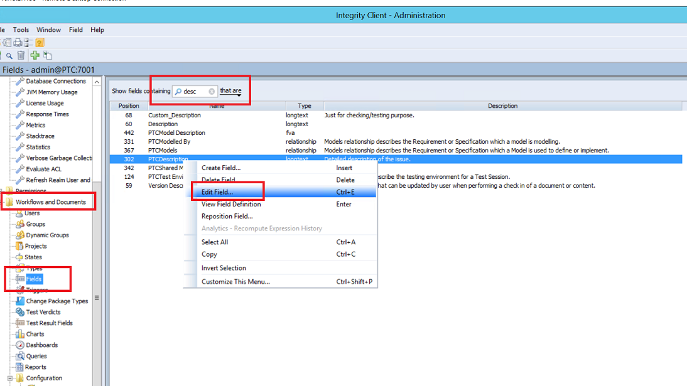
</p>

* Now, search for the desired field in the 'Show fields containing' search bar. 
* Right click on that field and click on 'Edit Field'
* A window same as in given image will pop up.
* The 'Name' here is the internal name of that specific field.

<p align="center">
  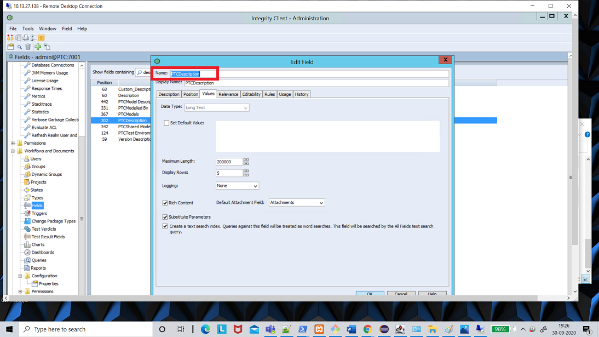
</p>

## Comment field

In Windchill RV&S, you can enable logging for a long-text field, which can work as 'Comments' field: 

* Create a long-text field and enable logging: 

<p align="center">
  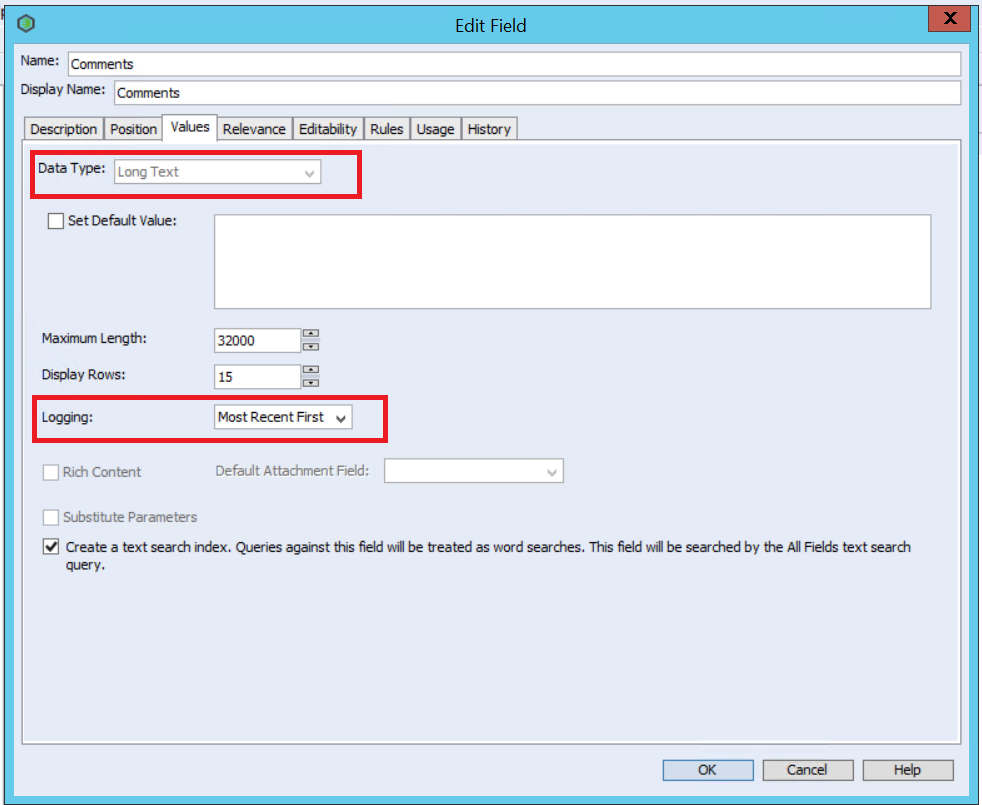
</p>

* Make this field visible on an entity type:

<p align="center">
  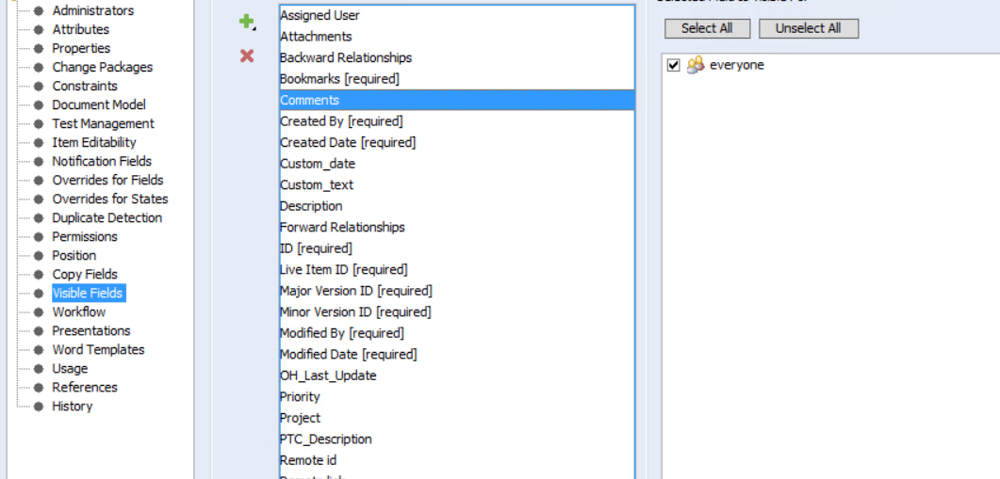
</p>

## Configuration to allow all transitions

Here are the steps to configure any-to-any transitions for the selected entity type:

* Go to the machine where Windchill RV&S is installed with the Integrity Admin Client
* Open the Integrity Admin Client and login with the admin user and password
* Go to Windchill RV&S Integrity Admin Client > Workflows and Documents > Types

<p align="center">
  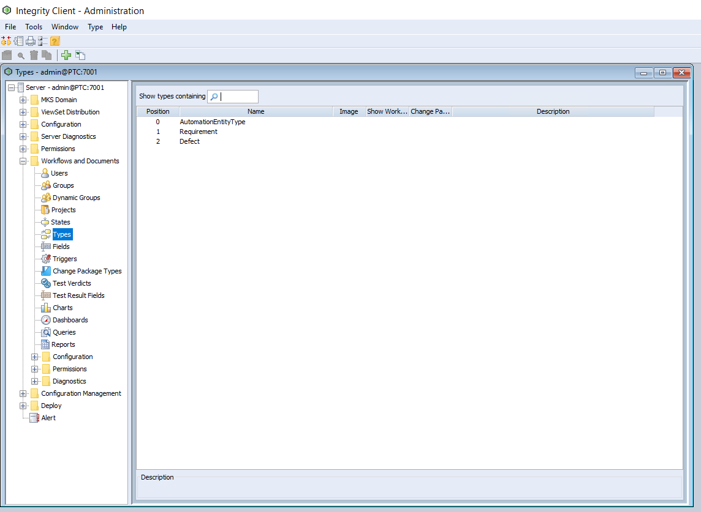
</p>

* Go to 'Edit Type' of the entity type for which you need to configure the transition

<p align="center">
  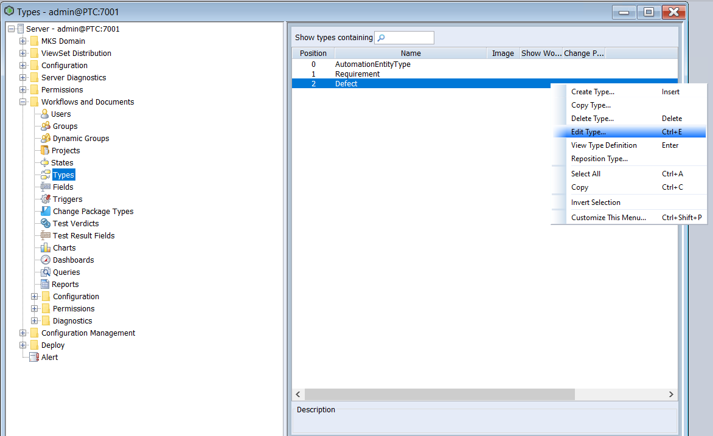
</p>
			
* Go to Workflow and then Drag and drop the available state from right side panel, for example, 'Test State'

<p align="center">
  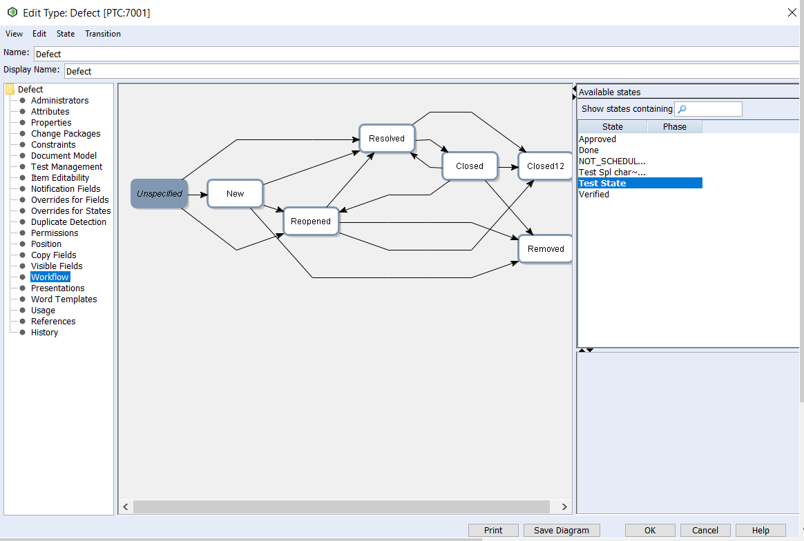
</p>
			
* Now create a transition from any state (as in 'New') to 'Test State'. Also select the user from the Groups section to whom the transition permission shall be allotted. Click OK to save this transition.

<p align="center">
  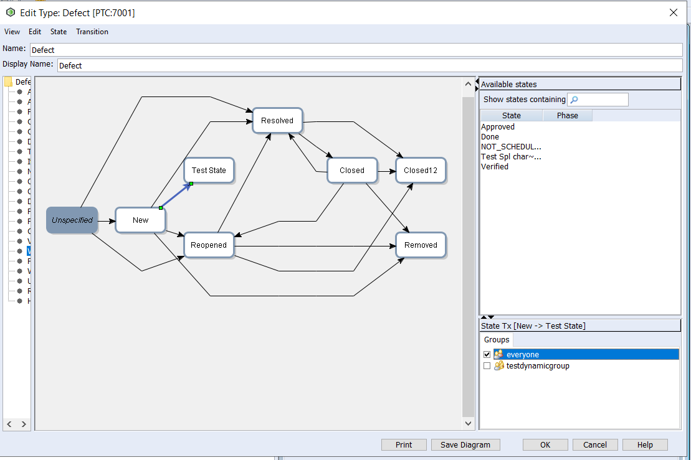
</p>

**Note:** Above steps includes only 'New' -> 'Test State' as an example, but these steps can be followed for all the required state transitions.<br>

>**Note**: This option is applicable if the user does not wish to configure advanced transition's workflow mapping in space.vars.SITENAME. Advanced workflow mapping is required when workflow transition is configured on the end system.

## Find the role type of the entity type

* Go to the machine where Windchill RV&S is installed with the Integrity Admin Client.
* Open the Integrity Admin Client and log in with the admin user and password.
* Go to Windchill RV&S Integrity Admin Client > Workflows and Documents > Types.

<p align="center">
  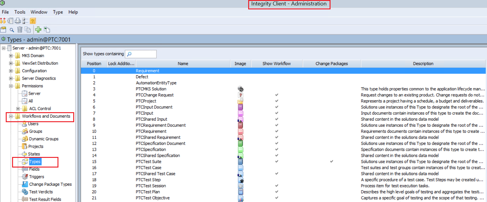
</p>

* Go to **Edit Type** of the entity type for which you need to find the role type.

<p align="center">
  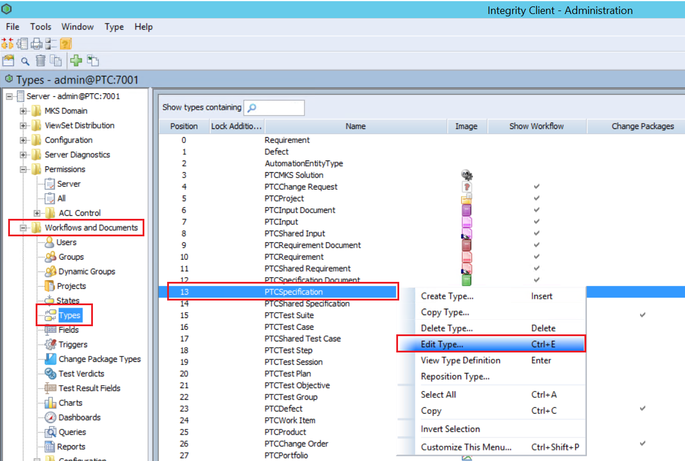
</p>

* Look for the **Document Model** option inside the left panel to find the role of the selected entity type.

<p align="center">
  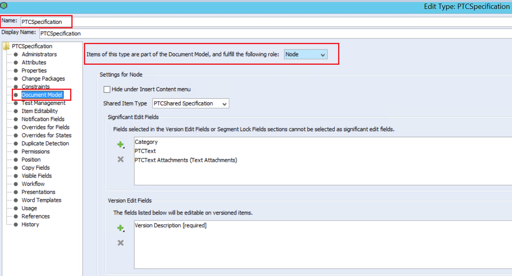
</p>

## Sample Default Link's mapping(s) for the relationship Contained By

Following are a few of default link's use case(s) to configure the default **Contained By** relationship when association corresponds to **Contained By** removed from the source end system:

* When entities from source end system get synchronized to target Windchill in a single document then default the **Contained By** relationship with particular entity of document type or requirement type. Refer to this [Section](#default-with-a-specific-entity-in-the-target-end-system).	
* When entities from source end system get synchronized to target Windchill RV&S in the particular document as per the project then default the **Contained By** relationship with one-to-one project-based default association. i.e. When x is the source project then the default **Contained By** link as entity E1, and When y is the source project then the default **Contained By** link as entity E2. Refer to this [Section](#default-with-a-one-to-one-entity-as-per-the-source-project-in-the-target).
* When entities from source end system get synchronized to target Windchill RV&S across multiple documents within a project then default the **Contained By** relationship with the document corresponds to the target entity in sync. Refer to this [Section](#default-with-a-document-of-the-target-entity-document-in-which-entity-belongs-to-in-target-end-system).

### Default with a specific entity in the target end system

* Refer to the below screenshot. Here, in this example, the Input Document entity '239363' will be considered as the default **Contained By** entity when no relationship corresponds to **Contained By** coming from the source end system.

<p align="center">
  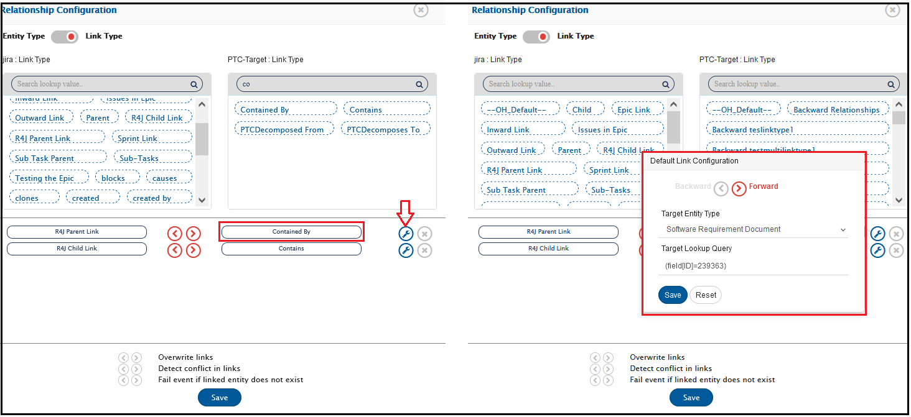
</p>

### Default with a one-to-one entity as per the source project in the target

* Configure the default link with the **Target Lookup Query** as `(field[ID]={$projectDefaultId})`. Click on [Relationship](../integrate/mapping-configuration.md#relationships) for more details on default link configuration.
* An advance relationship mapping is required to configure. Click on the **Edit relationship configuration xsl** icon against the Relationship option in mapping to configure below advance mapping.
  * Search for the below snippet in the existing XSL script.

```xml
<Item lookupQuery=" (field[ID]={$projectDefaultId})" entityType="<LookUpEntityType>" targetLinkType="Contained-space-By">Source Link Type</Item>
```
* Replace the above found snippet with the following XSL script by keeping above script line as it is in replaced script.
```xml
<xsl:variable xmlns:xsl="http://www.w3.org/1999/XSL/Transform" name="defaultLinkWithSourceLinks" as="item()*">
    <xsl:variable xmlns:xsl="http://www.w3.org/1999/XSL/Transform" name="projectDefaultId" >
    <xsl:choose xmlns:xsl="http://www.w3.org/1999/XSL/Transform" >
      <xsl:when test="SourceXML/opshubProjectName = 'TestProject' ">
      	    <xsl:value-of xmlns:xsl="http://www.w3.org/1999/XSL/Transform" select="'267511'"/>
      </xsl:when>
	   <xsl:when test="SourceXML/opshubProjectName = 'DemoProject' ">
      	    <xsl:value-of xmlns:xsl="http://www.w3.org/1999/XSL/Transform" select="'267512'"/>
      </xsl:when>
      <xsl:otherwise>
        <xsl:value-of xmlns:xsl="http://www.w3.org/1999/XSL/Transform" select="'267513'"/>
      </xsl:otherwise>
    </xsl:choose>
	</xsl:variable>
     <xsl:choose>
      <xsl:when test="$projectDefaultId != '' ">
      	  <Item lookupQuery=" (field[ID]={$projectDefaultId})" entityType="<LookUpEntityType>" targetLinkType="Contained-space-By">Source Link Type</Item>      
      </xsl:when>
   </xsl:choose>
```
* Here in this example, when source project is Test Project then consider the default **Contained By**link as entity **267511**, when source project is Demo Project then the default link as entity **267512**otherwise for any other unknown project consider the default link as entity **267513**.
* Click on **Save**to submit the above script changes.

### Default with a document of the target entity (Document in which entity belongs to in target end system) 
* Configure the default link with the **Target Lookup Query** as **(field[ID]={$defaultParentAsDocId})**. Click on [Relationship](../integrate/mapping-configuration.md#relationships) for more details on default link configuration.
* An advance relationship needed which requires the Remote Entity Id configuration for the integration against the source end system where Windchill RV&S is the target end system. Refer to the [Remote Id Configuration](../integrate/integration-configuration.md#tracking-id-and-link-of-entities-across-systems) for more details.
* Click on the **Edit relationship configuration xsl**icon against the Relationship option in mapping to configure below advance mapping.
* Search for the below snippet in the existing XSL script.

```xml
<Item lookupQuery=" (field[ID]={$projectDefaultId})" entityType="<LookUpEntityType>" targetLinkType="Contained-space-By">Source Link Type</Item>
```

* Replace the above found snippet with the following XSL script by keeping above script line as it is in replaced script.

```xml
 <xsl:variable xmlns:xsl="http://www.w3.org/1999/XSL/Transform" name="defaultParentAsDocId">
	<xsl:choose>
      <xsl:when test="SourceXML/updatedFields/Property/Remote-space-ID != '' ">
      	  <xsl:value-of select="utils:getEntityFieldValue($workflowId, $targetSystemId, SourceXML/opshubProjectKey,
      	  SourceXML/updatedFields/Property/Remote-space-ID ,'Document ID')"/>
      </xsl:when>
	</xsl:choose>
   </xsl:variable>
     <xsl:choose>
      <xsl:when test="$defaultParentAsDocId != '' ">
      	  <Item lookupQuery=" (field[ID]={$defaultParentAsDocId})" entityType="<LookUpEntityType>" targetLinkType="Contained-space-By">Source Link Type</Item> 
      </xsl:when>
   </xsl:choose>
```
          
* Following is the complete relationship snippet including the above advance mapping. This is for reference henceforth, do not copy and paste the below snippet directly instead follow the above steps to configure an advance mapping.

```xml
<OHEntityReferences>
 <xsl:variable xmlns:xsl="http://www.w3.org/1999/XSL/Transform" name="nonDefaultLinks" as="item()*">
    <Item targetLinkType="Contains">R4J Child Link</Item>
    <Item targetLinkType="Contained-space-By">R4J Parent Link</Item>
  </xsl:variable>
  <xsl:variable xmlns:xsl="http://www.w3.org/1999/XSL/Transform" name="entityTypeMapping" as="item()*">
    <Item targetEntityType="24">Epic</Item>
    <Item targetEntityType="17">Story</Item>
  </xsl:variable>
  
  <xsl:variable xmlns:xsl="http://www.w3.org/1999/XSL/Transform" name="defaultLinkWithSourceLinks" as="item()*">
   <xsl:variable xmlns:xsl="http://www.w3.org/1999/XSL/Transform" name="defaultParentAsDocId">
	<xsl:choose>
      <xsl:when test="SourceXML/updatedFields/Property/Remote-space-ID != '' ">
      	  <xsl:value-of select="utils:getEntityFieldValue($workflowId, $targetSystemId, SourceXML/opshubProjectKey,
      	  SourceXML/updatedFields/Property/Remote-space-ID ,'Document ID')"/>
      </xsl:when>
	</xsl:choose>
   </xsl:variable>
     <xsl:choose>
      <xsl:when test="$defaultParentAsDocId != '' ">
      	  <Item lookupQuery=" (field[ID]={$defaultParentAsDocId})" entityType="24" targetLinkType="Contained-space-By">R4J Parent Link</Item>   
      </xsl:when>
   </xsl:choose>
  </xsl:variable>
  
  <xsl:variable xmlns:xsl="http://www.w3.org/1999/XSL/Transform" name="defaultLinkWithOH_DEFAULT" as="item()*"/>
  <xsl:variable xmlns:xsl="http://www.w3.org/1999/XSL/Transform" name="entityReferencecontext" select="/SourceXML/updatedFields/Property/OHEntityReferences/OHEntityReference"/>
  <xsl:variable xmlns:xsl="http://www.w3.org/1999/XSL/Transform" name="linksToBeCarriedFromSourceEvent" as="item()*">
    <xsl:for-each select="$nonDefaultLinks">
      <xsl:variable name="currentLinkType" select="."/>
      <xsl:if test="$entityReferencecontext/linkType[text()=$currentLinkType]">
        <xsl:if test="$entityReferencecontext[linkType[text()=$currentLinkType]]/links/EAILinkEntityItem">
          <Item targetLinkType="{@targetLinkType}">
            <xsl:value-of select="."/>
          </Item>
        </xsl:if>
      </xsl:if>
    </xsl:for-each>
  </xsl:variable>
  <xsl:variable xmlns:xsl="http://www.w3.org/1999/XSL/Transform" name="linksToBeAddedAsDefault" as="item()*">
    <xsl:for-each select="$defaultLinkWithOH_DEFAULT">
      <Item lookupQuery="{@lookupQuery}" entityType="{@entityType}">
        <xsl:value-of select="."/>
      </Item>
    </xsl:for-each>
    <xsl:for-each select="$defaultLinkWithSourceLinks">
      <xsl:variable name="currentLinkType" select="."/>
      <xsl:if test="not($linksToBeCarriedFromSourceEvent[text() = $currentLinkType] = $currentLinkType)">
        <Item lookupQuery="{@lookupQuery}" entityType="{@entityType}">
          <xsl:value-of select="./@targetLinkType"/>
        </Item>
      </xsl:if>
    </xsl:for-each>
  </xsl:variable>
  <xsl:for-each xmlns:xsl="http://www.w3.org/1999/XSL/Transform" select="$linksToBeCarriedFromSourceEvent">
    <xsl:variable name="currentLinkType" select="."/>
    <op_list>
      <xsl:element name="{@targetLinkType}">
        <xsl:for-each select="$entityReferencecontext[linkType=$currentLinkType]/links/EAILinkEntityItem">
          <xsl:element name="{concat('_',position())}">
            <xsl:element name="EntityType">
              <xsl:variable name="sourceEntityType" select="entityType"/>
              <xsl:value-of select="$entityTypeMapping[text()=$sourceEntityType]/@targetEntityType"/>
            </xsl:element>
            <xsl:element name="GlobalId">
              <xsl:value-of select="linkGlobalId"/>
            </xsl:element>
            <xsl:element name="LinkAddedDate">
              <xsl:value-of select="linkAddedDate"/>
            </xsl:element>
            <xsl:element name="LinkedID">
              <xsl:value-of select="entityInternalId"/>
            </xsl:element>
            <xsl:element name="IsExternalLink">
              <xsl:value-of select="isExternalLink"/>
            </xsl:element>
            <xsl:element name="ExternalLinkUrl">
              <xsl:value-of select="externalLinkUrl"/>
            </xsl:element>
            <xsl:element name="EntityLinkComment">
              <xsl:value-of select="linkComment"/>
            </xsl:element>
            <xsl:if test="order!=''">
              <xsl:element name="order">
                <xsl:value-of select="order"/>
              </xsl:element>
            </xsl:if>
            <xsl:if test="id!=''">
              <xsl:element name="id">
                <xsl:value-of select="id"/>
              </xsl:element>
            </xsl:if>
          </xsl:element>
        </xsl:for-each>
      </xsl:element>
    </op_list>
  </xsl:for-each>
  <xsl:for-each xmlns:xsl="http://www.w3.org/1999/XSL/Transform" select="$linksToBeAddedAsDefault">
    <op_list>
      <xsl:element name="{.}">
        <xsl:element name="_1">
          <xsl:element name="EntityType">
            <xsl:value-of select="@entityType"/>
          </xsl:element>
          <xsl:element name="LookupQuery">
            <xsl:value-of select="@lookupQuery"/>
          </xsl:element>
        </xsl:element>
      </xsl:element>
    </op_list>
  </xsl:for-each>
</OHEntityReferences>
```
## Handling POST request redirects

* space.vars.SITENAME does not allow redirects for POST requests due to security reasons.
* If a POST redirect request will be sent to Windchill RV&S, then it may throw an error with **code 302**.
* Please refer to: [Redirect errors with SOAP based services](../help-center/troubleshooting/errors/common/redirect-errors-with-soap-based-services.md) to resolve the error.

## Modify User Session Limit

* Open the Integrity Admin Client and log in with the admin user and password.
* Go to Windchill RV&S Integrity Admin Client > Workflows and Documents.
* Expand Configuration.
* On the Properties node, find the **mksis.im.perUserSessionLimit** property.
* Right click and select **Edit Property**.
* An **Edit Property** window will open.
* Set the desired limit in **Value** field and click **Ok**.  
Refer to the image given below:  

<p align="center">
  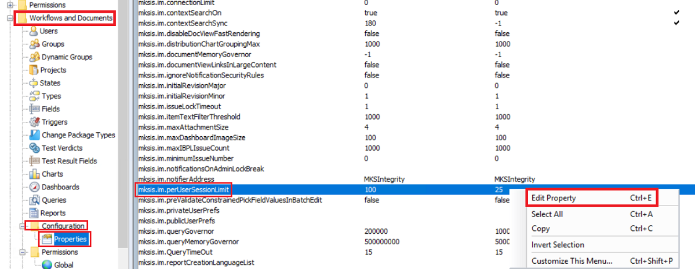
</p>

>**Note**: If the user belongs to a group, then the user session limit may be overridden on a group basis. Refer to [Modify Session Limit of a group](#modify-session-limit-of-a-group) section for more information.

## Modify Session Limit of a group

If a user belongs to multiple groups and the session limit value is specified in all or some of the groups, the session limit resolves to the highest value specified in the groups and global value [value of **mksis.im.perUserSessionLimit** property]. For example, if a user belongs to Group A (session limit = 4) and Group B (session limit = 7), and the global value is 3, the maximum allowed sessions is 7. If the global value is 9, then 9 is the maximum allowed sessions.  

Follow the steps given below to modify session limit of a group:

* Open the Integrity Admin Client and log in with the admin user and password.
* Go to Windchill RV&S Integrity Admin Client > Workflows and Documents > Groups.
* Select the group in which the integration user is a member.
* Right click and select **Edit Group**.
* An **Edit Group** window will open.
* Set the desired limit in **Session Limit** field and click **Ok**.  
Refer to the image given below:

<p align="center">
  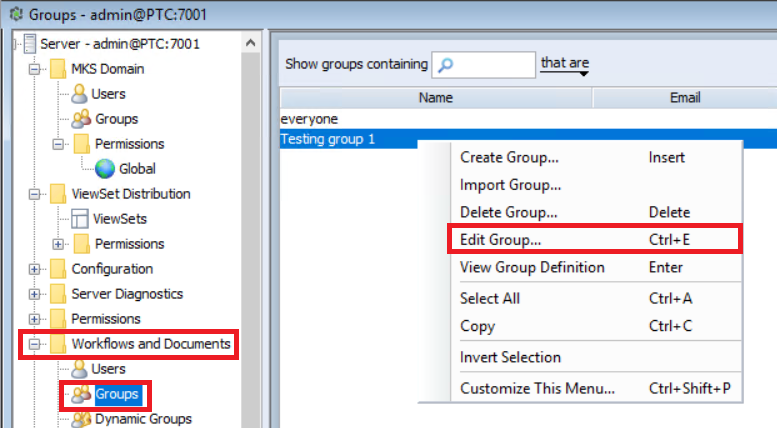
</p>

## Add attachment extension to configuration property

* Users can add attachments with extensions that are not supported by default by manually adding them to a property **mksis.im.additionalAllowedAttachmentExtensions**.
* You can access configuration properties from the following node locations in the Windchill RV&S administration client:
  * Open Windchill RV&S administration client.
  * On the left panel navigate to Workflows and Documents > Configuration > Properties > **mksis.im.additionalAllowedAttachmentExtensions**
  * This property defines the supported attachment file types. By default the `.jpg, .jpeg, .gif, .png, .tif, .tiff, .bmp, .txt, .doc, .docx, .ppt, .pptx, .xl, .xls, .xlsx, .pdf, .csv, .zip, .xml, .mksole, .xlsb, .vsd, .vss, .vst, .vdx, .vsx, .vtx, .vsdx, .vssx, .vstx, .pps, .ppsx, .log, and .mp4` extensions are supported.
  * If additional file types are required to be supported, the administrator must update the property and add the required extension separated by semicolon ";" For example: `rtf;tex`
  * To include files without an extension, add the `<empty>` keyword to the property. For example: `rtf;tex;<empty>`

<p align="center">
  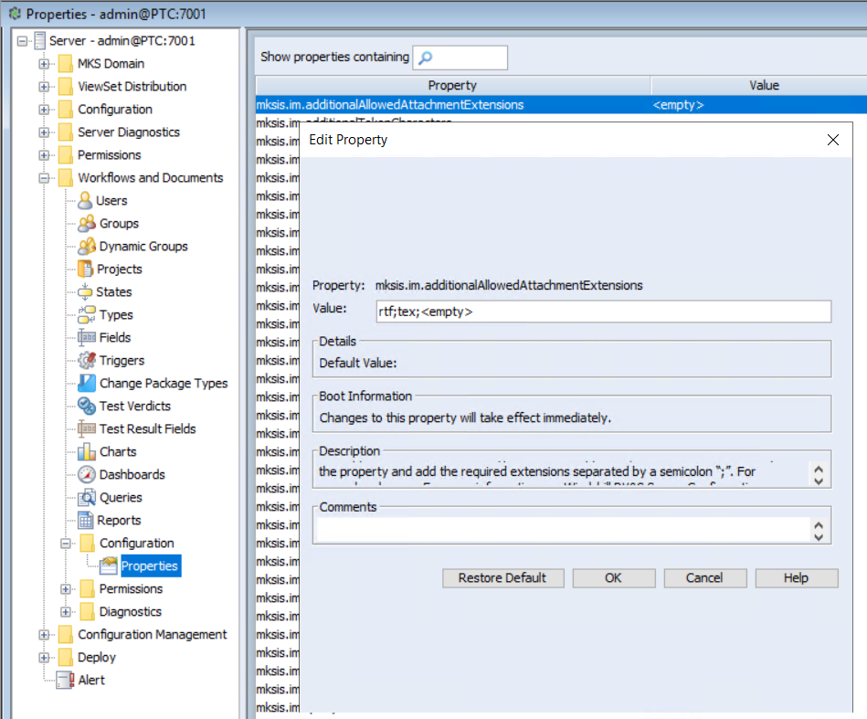
</p>

