# Prerequisites

## User Privileges

* Create one user of Zendesk System, dedicated to OpsHub Integration Manager. User should not do any operations from System's User-Interface.
* User should have access to all the organizations that needs to be integrated. If user is not associated with organizations to be integrated, the behavior would be as described in [Organization Association to Ticket](#organization-association-to-ticket).

# System Configuration

Before you continue to the integration, you must first configure Zendesk. Click [System Configuration](../integrate/system-configuration.md) to learn the step-by-step process to configure a system.

Refer to the following screenshot with Authentication Mode as Basic Authentication:

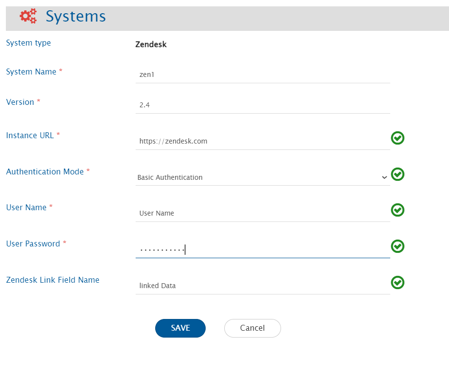

Refer to the following screenshot with Authentication Mode as OAuth Access Token:

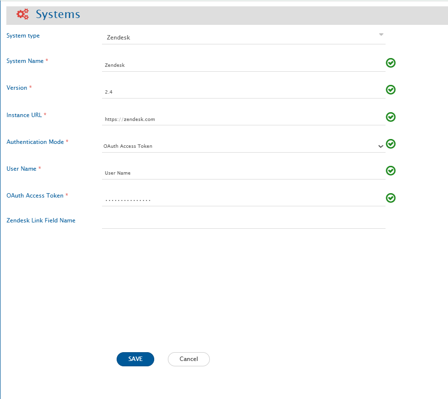

Refer to the following screenshot with Authentication Mode as API Token:

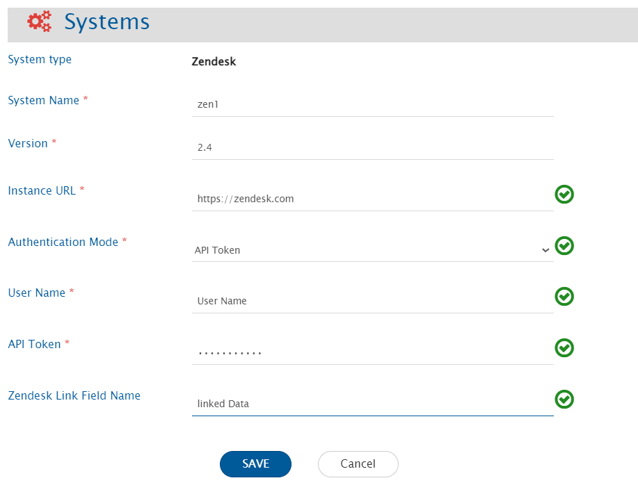

### **Zendesk System form details**

| **Field Name**            | **When field is visible on the System form**             | **Description**                                                                                                                                                                                                 |
|---------------------------|-----------------------------------------------------------|------------------------------------------------------------------------------------------------------------------------------------------------------------------------------------------------------------------|
| **System Name**           | Always                                                    | Provide System name                                                                                                                                                                                              |
| **Version**               | Always                                                    | Provide Zendesk system version                                                                                                                                                                                   |
| **Instance URL**          | Always                                                    | Provide Zendesk instance URL                                                                                                                                                                                     |
| **Authentication Mode**   | Always                                                    | Select the authentication mode you would like to use to communicate with the Zendesk server. If you have **single sign on** enabled for Zendesk server, select **API Token** as authentication mode. If you have **OAuth Client App** configured to communicate with APIs, select **OAuth Access Token** as the authentication mode. |
| **User Name**             | When Authentication Mode selected                         | Provide Zendesk system user with administrator privilege.                                                                                                                                                        |
| **User Password**         | Basic Authentication mode selected                        | Provide Zendesk system user's password.                                                                                                                                                                          |
| **API Token**             | API Token mode selected                                   | Provide Zendesk user API Token. Refer [this](https://support.zendesk.com/hc/en-us/articles/226022787-Generating-a-new-API-token) for generating **API Token** in Zendesk server.                                |
| **OAuth Access Token**    | OAuth Access Token mode selected                          | Provide Zendesk OAuth Access Token. Refer [Generating OAuth Access Token Through UI](https://support.zendesk.com/hc/en-us/articles/4408845965210-Using-OAuth-authentication-with-your-application) or [Generating OAuth Access Token through API](https://developer.zendesk.com/documentation/ticketing/working-with-oauth/creating-and-using-oauth-tokens-with-the-api/) to generate **OAuth Access Token** in Zendesk server. |
| **Zendesk Link Field Name** | Always                                                  | Provide the link field name that denotes the Parent - Child link. Refer to [Determine the Parent - Child Link field name](#determine-the-parent---child-link-field-name) section                                 |

If the system is deployed on HTTPS and a self-signed certificate is used, then you will have to import the SSL Certificate to be able to access the system from OpsHub Integration Manager. Click [Import SSL Certificates](../getting-started/ssl-certificate-configuration.md) to learn how to import SSL certificate.

# Mapping Configuration

Map the fields between Zendesk and the other system to be integrated to ensure that the data between both the systems synchronizes correctly. Click [Mapping Configuration](../integrate/mapping-configuration.md) to learn the step-by-step process to configure mapping between the systems.

# Integration Configuration

Set a time to synchronize data between Zendesk and the other system to be integrated. Also, define parameters and conditions, if any, for integration.

Click [Integration Configuration](../integrate/integration-configuration.md) to learn the step-by-step process to configure integration between two systems.

## Known Limitations

* If a ticket is merged into another ticket, then this merged ticket will contain all public and private attachments from the original ticket into separate comments. If the original ticket contains both public and private comments, then either one of them might not synchronize unless the merged ticket is updated. This is due to the update time of the merged ticket being less than the creation time of the merged comments. Once the merged ticket is updated then all comments will synchronize.
* Zendesk has some validation for naming the tags mentioned in the Zendesk document. Zendesk will remove most of the special characters from the names of the tags. In that case, if the Zendesk system is the target system, it may result in conflict.
* OpsHub Integration Manager can only sync updates related to parent-child links in one ticket at a time due to API limitations. It is because the API does not reflect such a linkage in the linked ticket. As a result, the link will only be visible in one of the tickets on which the linking operation is performed.
* Opposite link types, **Linked problem** and **Linked incidents** are introduced in the mapping to denote the link between problem type and incident type tickets in OpsHub Integration Manager. If only, **Linked incidents** is mapped, an update of the problem type ticket must be performed to sync the updates related to these links.

# Criteria Configuration

## Query

If you want to specify conditions for synchronizing an entity between Zendesk and the other system to be integrated, you can use the Criteria Configuration feature.

Go to Criteria Configuration section on [Integration Configuration](../integrate/integration-configuration.md) page to learn in detail about Criteria Configuration.

However, you don't need to write any criteria query in OpsHub Integration Manager. Instead, you need to give the view id for the same.  
The steps given below explain how to make view in Zendesk for enabling criteria:

**Make view in Zendesk for enabling criteria**

* Login to Zendesk with integration user  
* Navigate to Admin → Views → Add View  

  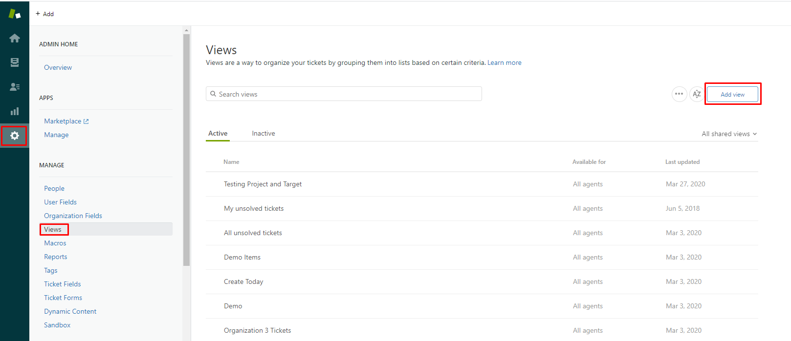

* Fill the view details  
  - Give appropriate name for View  
  - Select appropriate conditions as per your requirement  
    - If you specify condition(s) under 'Meet all of the following conditions' section then it will ensure that ticket will be synchronized only when all those conditions will be satisfied for this section  
    - If you specify condition(s) under 'Meet any of the following conditions' section then it will ensure that ticket will be synchronized if any one of the condition(s) will be satisfied for this section  

  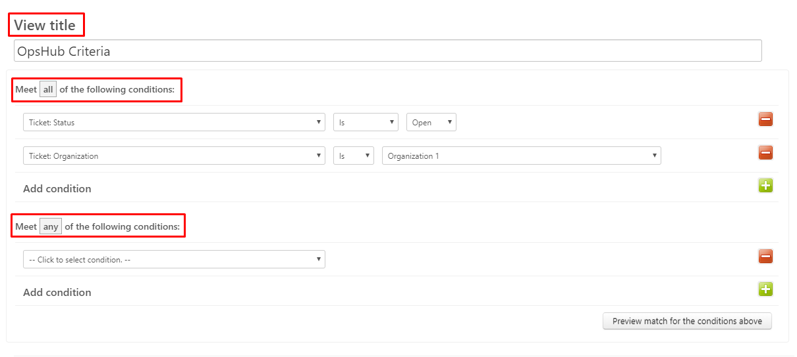

* Give appropriate access to integration user and create view  
  - Navigate to 'Available for' section and make sure that view is accessible to integration user. We will recommend to select 'Me only' option, which will ensure that no other user can accidentally modify it. If you are selecting 'Me only' option then ensure that you have currently logged on with integration user which is used for Zendesk in OpsHub Integration Manager.  
  - Finally click on 'Create View' to save the view.  

  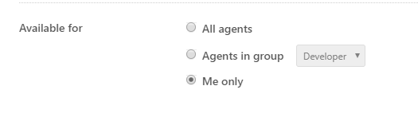

* Once you created view, then select appropriate option as per earlier access provided under 'Available For' section. In earlier step, if 'Me only' option is selected, then here select 'Personal Views', if 'All agents' option is selected, then here select 'Views shared with all agents' option.  

  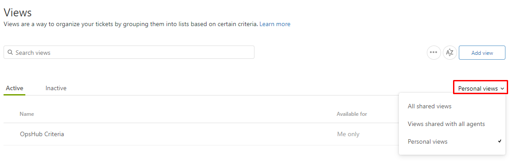

* Navigate to recently created view and click on it.  

  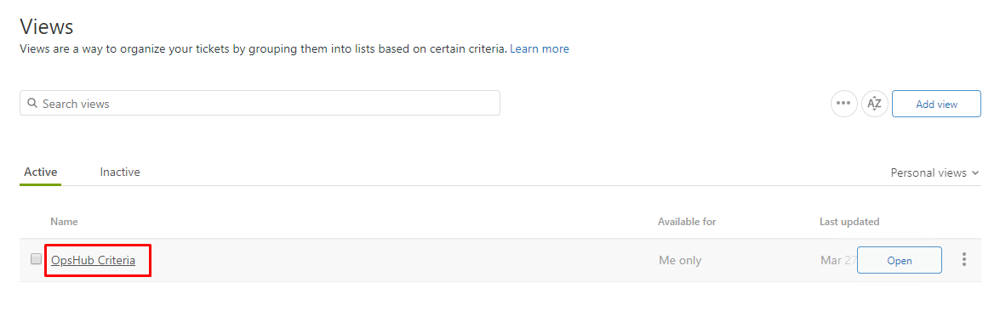

* Navigate to browser address bar, here you will find view id. If you see URL like this `https://opshub.zendesk.com/agent/admin/views/123754` in browser, then view id is **123754**  

  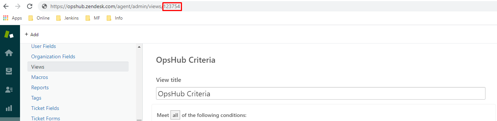

* Use this view id as criteria query for Zendesk system in OpsHub Integration Manager

## Sample Views

**Synchronize tickets from specific organization and Status is Open**  

  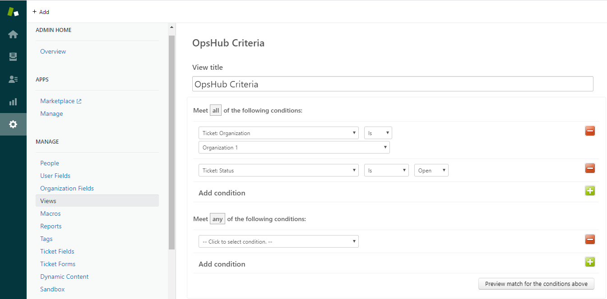

**Synchronize tickets from specific organization, Status is Open and Priority is High**  

  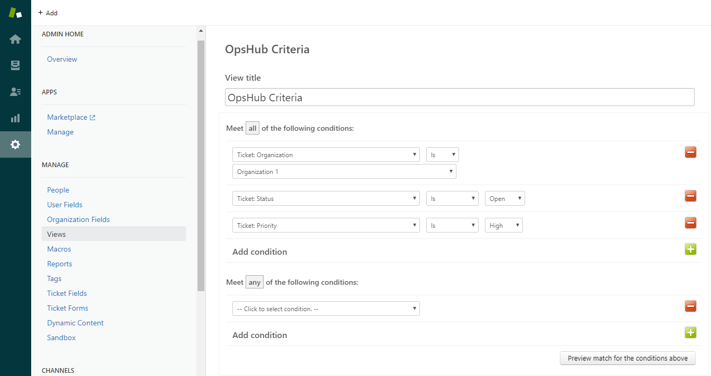

**Synchronize tickets from any one of the specified organizations, Status is Open and Priority is High**  

  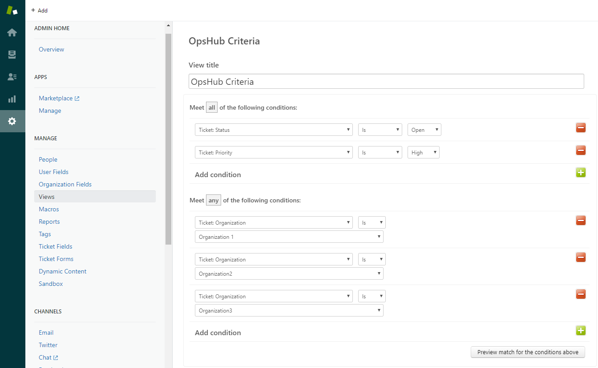

# Appendix

## Add User

* Login to Zendesk server.  
* Click **Manage button icon** (bottom-left corner).  
* Click **People** link on the left side bar.  
* Click the user menu item present on the top-right corner in people screen.  
* It will open a form to add new user. Enter username and email Id.  
* Click **Save** to add user.  

  

## Organization Association to Ticket

**Organization association behavior when Zendesk is target system**

* Organization association with ticket depends on the mapping configuration. The behaviors under different cases are listed below.

| **Mapping Configuration** | **Behavior** |
|---------------------------|--------------|
| Both Requester and Organization fields are not mapped | Ticket will be associated with the default organization of integration user. If integration user does not belong to any organization, the synced ticket will not be associated with any organization. |
| Only Requester field is mapped | Ticket will be associated with default organization of the Requester |
| Only Organization field is mapped | If the mapped organization is accessible to integration user, ticket will be associated with that organization, otherwise failure will be generated. |
| Both Requester and Organization fields are mapped | If the mapped organization is accessible to requester, ticket will be associated with that organization, otherwise failure will be generated. |

The above behavior with OpsHub Integration Manager sync reflects the Zendesk API behavior.

## Determine the Parent - Child Link field name

* Go to **App and integrations** → **App** → **Zendesk Support apps** in the admin window of Zendesk.  
* Select **Linked Ticket** plugin.  
* Copy the value under **Reference Field (Legacy)** field.  

  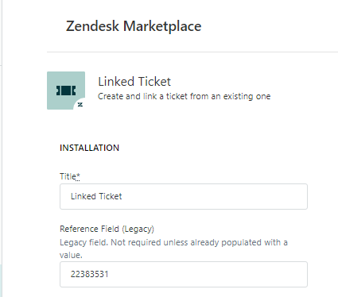

* Go to **Objects and rules** → **Tickets** → **Fields**.  
* Search for the field id with copied value from **Reference Field (Legacy)** field. The display name of that field record is the Parent - Child Link field name.  

  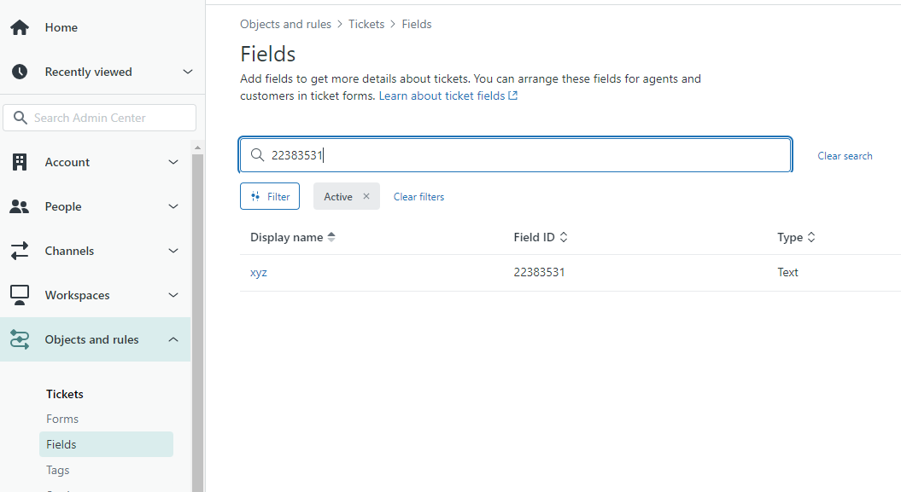

