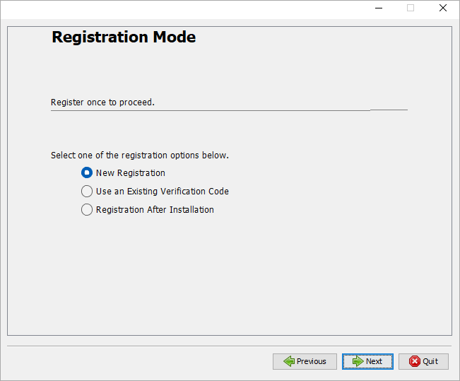
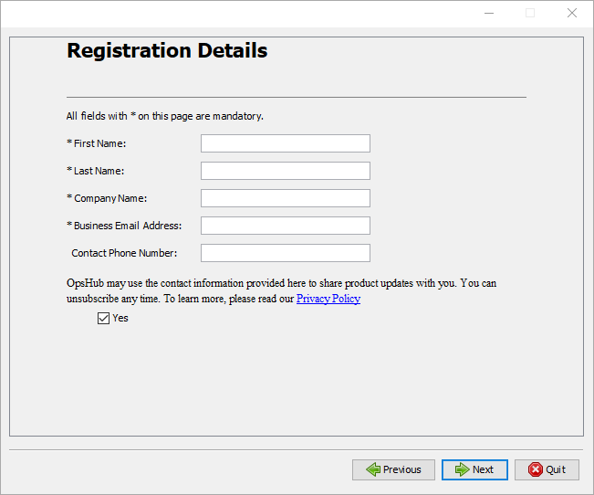
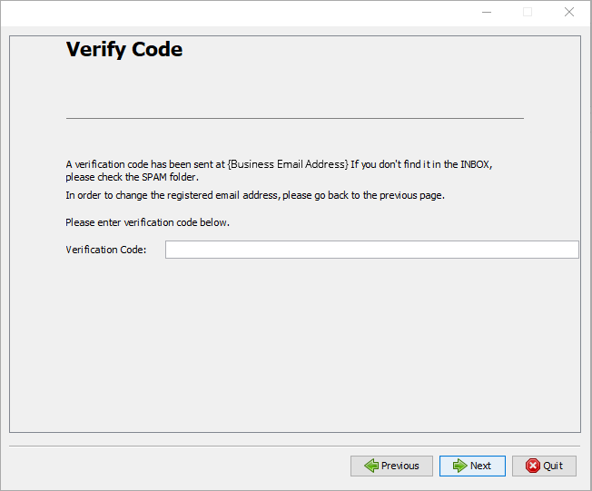
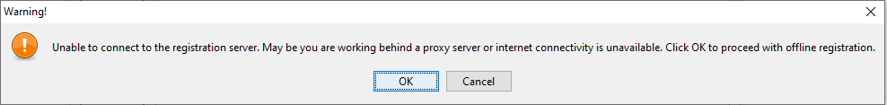
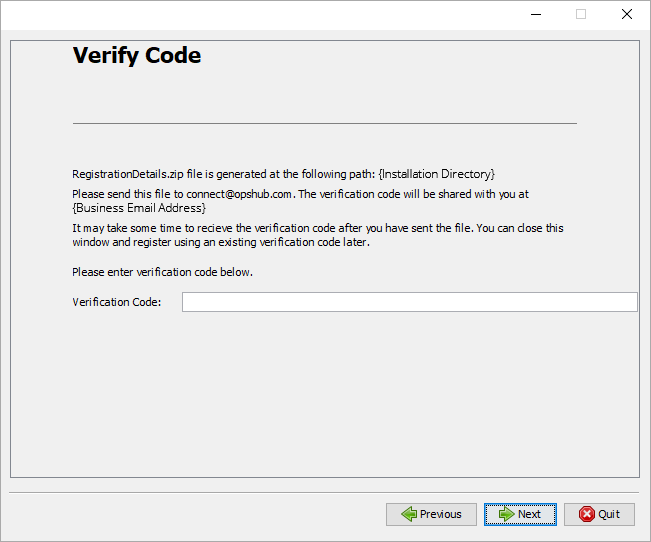
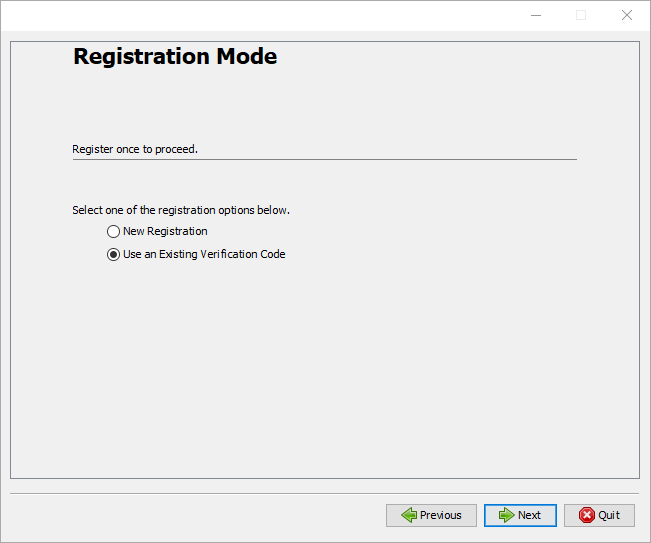
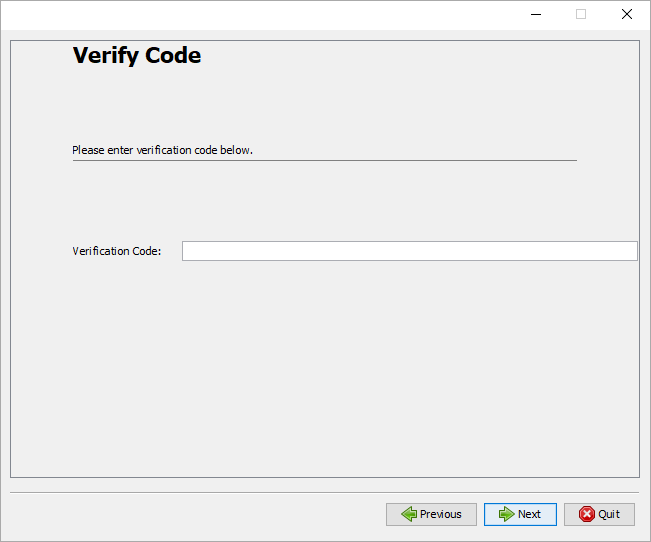
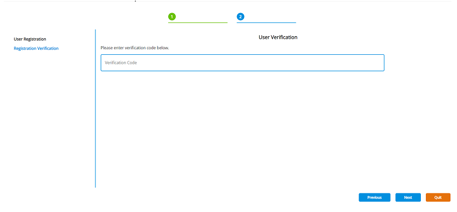
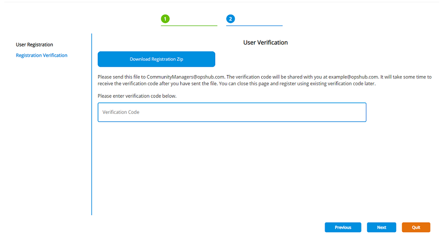
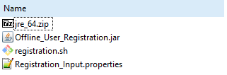

# Registration Mode

When you have provided installation directory during installing/upgrading OpsHub Integration Manager, you will be redirected to the Registration screen. In the Registration screen, you need to register yourself before installation/upgradation:

OpsHub Integration Manager requires one-time registration.

* Please select **New registration** if you are installing/upgrading OpsHub Integration Manager for the first time.
* If you already have a verification code, select **Use an Existing Verification Code** option.
* If you want to register after installation, select **Registration After Installation** option.

  

## New Registration

Once you select **New registration**, you will see the screen shown below. Fill all required data and click Next.

  

When you select **Next**, installer/migrator will register yourself with the registration server.  
On successful registration, you will get a verification code on your registered business email address. Please enter the verification code in the screen shown below and continue installation/upgradation.

  

If the installer/migrator is not able to connect to the registration server, you will get an option to register yourself using **Offline Registration** option as shown below. Click **OK** to continue the Offline Registration.

  

> 📌 Installer/Migrator may not connect to registration server when you do not have Internet connectivity, or you are working behind a Proxy or when the Registration Server is down. Please proceed with **Offline Registration** in any of these cases.  

See [Offline Registration](#offline-registration) for offline registration process.

# Offline Registration

Once you select **OK** in the screen shown above, installer/migrator will prepare `RegistrationDetails.zip` file at the installation directory.

  

When you are using Offline Registration option, user can either send the user detials in encrypted format or in decrypted manner. To send the data in encrypted manner, refer to [Get Verification Code using Encrypted User Details](#get-verification-code-using-encrypted-details). If the user wants to know the exact details they are sending to OpsHub Integration Manager, they can use the decrypted registered details. Refer to [Get Verification Code using Decrypted User Details](#get-verification-code-using-decrypted-user-details).

## Get Verification Code using Encrypted Details

Send `RegistrationDetails.zip` on CommunityManagers@opshub.com. Verification Code will be then shared with you on your registered business email address.  
Once you get the verification code, enter the code in the screen shown below and continue with the installation/upgrade.

  

## Get Verification Code using Decrypted User Details

* A zip file containing the decryption utility is copied to the OpsHub Integration Manager installation folder. Follow the below steps to get the decrypted user data for the verification code generation:
  * Unzip the zip `DecryptionUtility.zip` and extract DecryptionUtility from it. [In the extracted folder, the `DecryptionUtility.jar` will be available].
  * In the extracted folder, the `details.properties` is available. Mention the below details in that file:
    * Specify the `zipFilePath` where `RegistrationDetails.zip` is present (Do not change the name of the `RegistrationDetials.zip`)
    * Specify the `destDirectory`, the directory where you want to store the Decrypted UserDetails output file.

> 📌 Use forward slash ("/") in the paths specified in the `details.properties` file.

* Open the Command Prompt at the location where `DecryptionUtility.jar` is placed.
  * **For Windows OS:**
    * Type the command: `start <path to jre>\bin\javaw -jar DecryptionUtility.jar`  
      For example:  
      `C:\Users\Admin\AppData\Local\Temp\CBA6.tmp\jre\bin\javaw -jar DecryptionUtility.jar`  
    * To reach to `<path to jre>`, follow the below steps:
      * Open Run dialog box, write `%temp%` and hit Enter.
      * Go to the latest created Temp folder. This folder will contain `jre` folder. Use this path as `<path to jre>` in the above mentioned command.
  * **For Linux OS:**
    * Type the command: `<path to jre>/bin/java -DOPSHUB_TEMP_DATA=$OPSHUB_TEMP_DATA -jar DecryptionUtility.jar`  
      For example:  
      `/home/administrator/Downloads/OIMV7_130_Linux_OpsHub/jre/bin/java -DOPSHUB_TEMP_DATA=$OPSHUB_TEMP_DATA -jar DecryptionUtility.jar`
    * To reach to `<path to jre>`, follow the below steps:
      * Go to OpsHub Integration Manager installation folder. This folder will contain a jre zip. Unzip the jre and use this as `<path to jre>` in the above mentioned command.

* The decrypted UserDetails will be stored in file named `DecryptedRegistrationDetails.txt`.

> 📌 The output file will contain the decrypted userdetails and encrypted Key and Salt value [due to security purpose]. Here, mail `DecryptedRegistrationDetails.txt` file on CommunityManagers@opshub.com. The verification code will be then shared with you on your registered business email address.  

Once you get the verification code, enter the code in the screen shown below and continue with the installation/upgrade.

  

You can close the installer/migrator and can register using the same existing code as described in [Registration using Existing Verification Code](#use-an-existing-verification-code).

  

## Use an Existing Verification Code

When you have valid verification code with you, You can proceed registration using an existing verification code as described below.

Select **Use an Existing Verification Code** option as shown in below screen.

  

> 📌 When you are using this option for upgrading OpsHub Integration Manager, You should have the latest Application Backup as described [here](../manage/upgrade/taking-application-backup.md).

Once you select **Use an Existing Verification Code** option, you will see the screen shown below. Enter the Verification code and continue installation/upgradation.

  

## Registration After Installation

Once you select **Registration After Installation**, the following screen will appear after installation:

  

On selecting **Next**, OpsHub Integration Manager will have you register with the registration server. On successful registration, you will get a verification code on your registered email id. Enter the verification code as shown in the screenshot below:

  

If the OpsHub Integration Manager is not able to connect to the registration server, you will get an option to register yourself using Offline mode by downloading `RegistrationDetails.zip` as shown below:

  

## Known Behavior

* In the case of OpsHub Migrator for Microsoft Azure DevOps (OM4ADO) and OpsHub Integration Manager (OIM) with community edition, the **Registration After Installation** feature is not available.

# Silent Registration for Linux

Here is a video on the silent registration of OIM on the Linux machine: 


When you want to install/upgrade OpsHub Integration Manager on a Linux machine as described [here](installation.md#launch-the-installer-in-different-operating-systems), you need to register yourself by following the steps listed below before you proceed with the installation/upgradation.

* Please download offline registration utility from [here](https://opshubtrial-my.sharepoint.com/:u:/g/personal/support_opshub_com/EQHg8u3f96lCgBG78UOaLMwBXsfN-yl-Z7ou6KxHYXJMcA).
* You will get the files as shown below:

  

* Fill the registration data in `Registration_Input.properties`: 
  * FirstName
  * LastName
  * CompanyName
  * EmailId: You will receive verification code on this Email Id.
  * ContactNumber: Optional
  * Consent  
    * Yes, if you want the latest updates from OpsHub.  
    * No, if you do not want the latest updates from OpsHub.
  * FileName: Filename of installer/migrator zip without extension such as `OIMV7.10-HF2_Linux_OpsHub` for `OIMV7.10-HF2_Linux_OpsHub.zip`
  * InstallationDirectory: Directory on which you want to install/upgrade OpsHub Integration Manager

* Run registration utility as below:
  * Open the terminal window and go to the folder containing offline registration utility.
  * Create empty directory with full access (it should not be inside installation directory) and export its path to `OPSHUB_TEMP_DATA` variable as shown in the example below:
    * `export OPSHUB_TEMP_DATA=/home/setup/temp`  
      Please take a note of the variable, You need to export the same variable with the same value during installation/migration.
  * Execute the following command: `chmod 755 *` to give execute permission to all files.
  * Execute the following command: `sh registration.sh`

* On successful execution, utility will prepare `RegistrationDetails.zip` file at installation directory.

Please send this file to CommunityManagers@opshub.com. Verification Code will be then shared with you at your registered business email address.  
Once you receive the verification code, continue installation as described [here](installation.md#launch-the-installer-in-different-operating-systems)
