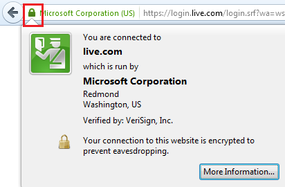
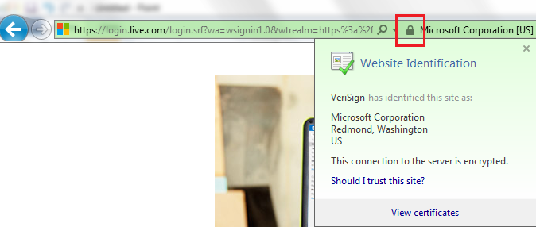
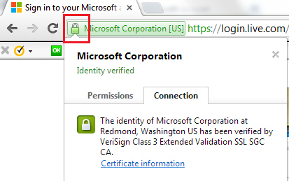

# SSL Certificate Import Instructions

**OpsHub Integration Manager** will automatically import the certificate if you create or edit a system.  
If the certificate does not import automatically during project or entity selection, you may see error messages like:

- `Peer is not authenticated`
- `Peer's identity has not been verified`
- `Handshake failure` or `Handshake exception`

If the certificate is not imported, follow the steps below.

---

## Download HTTPS Certificate

To access systems deployed on HTTPS from **OpsHub Integration Manager**, download the HTTPS certificate on the machine where OIM is deployed.

## Mozilla Firefox



1. Open the system URL in Firefox using HTTPS protocol.  
2. Click the lock icon on the upper-left side of the address bar.  
3. Click **"More Information"** in the pop-up.  
4. In the new window, click **"View Certificate"**.  
5. Go to the **"Details"** tab.  
6. Click the **"Export"** button.  
7. Save the certificate on your local drive.  

**Note**: If a certificate hierarchy is present, all certificates must be exported.

---

## Internet Explorer



1. Open the system URL in Internet Explorer using HTTPS.  
2. Click the lock icon on the right side of the address bar.  
3. A pop-up will show **"Website Identification"**.  
4. Click **"View Certificates"**.  
5. Go to the **"Details"** tab and click **"Copy to File"**.  
6. A wizard for copying certificates will appear.  
7. Select the **DER encoded binary** option and click **Next**.  
8. Click **Browse**, provide a filename, and save it to a local drive.  

**Note**: Export all certificates in the chain if a hierarchy is present.

---

## Google Chrome



1. Open the system URL in Chrome using HTTPS protocol.  
2. Click the lock icon on the upper-left of the address bar.  
3. A pop-up will state **"Identity Verified"**.  
4. Go to the **"Connection"** tab and click **"Certificate Information"**.  
5. In the **"Details"** tab, click **"Copy to File"**.  
6. A certificate export wizard will appear.  
7. Select the **DER encoded binary** option and click **Next**.  
8. Click **Browse**, set a filename, and save to a local drive.  

**Note**: Export all certificates in the hierarchy if present.

---

## Import SSL Certificate through Console

Follow the steps below to import the downloaded certificate into **OpsHub Integration Manager**:

1. Open **Command Prompt** with Administrator privileges (right-click `cmd.exe` → **Run as Administrator**).  
2. Navigate to the folder:  
   `<<OpsHub_Installation_Directory>>\AppData\OpsHubData`

3. Run the following command:

   ```sh
   keytool –importcert -alias <<certificate alias>> -keystore <<path>> -file "Certificate_Location\Certificate filename.extension"
   ```

   **Example**:

   ```sh
   keytool -importcert -alias httpscertifcate -keystore "C:\Program Files\OpsHub\AppData\OpsHubData\cacerts" -file "C:\Users\Administrator\Desktop\certificate.crt"
   ```

4. When prompted, enter the keystore password.  
   **Note**: The default keystore password is `changeit`.

5. Type `yes` when asked: **Trust this certificate?**  
6. Restart the OpsHub Server.

---

**Important Notes**:

- If any hierarchy is present in the certificate, all certificates must be imported.
- If multiple end system certificates are configured in **OpsHub Integration Manager** and these certificates have different private key passwords, use the **Certificate Password Encryptor Utility** to encrypt and store the passwords.
  - This utility creates a `cacert_config.properties` file containing all alias names and their encrypted passwords.
  - You can use this file to load the certificates from the keystore in **OpsHub Integration Manager**.
