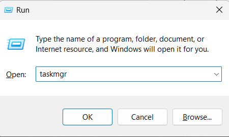

## Description

- Too many open connections observed when OpsHubEAWindowsService is running as console application and OpsHubEAWindowsService is forced closed using cancel button.
- Observations:
  - High RAM consumption
  - Slowness in the system because of too many EA connections remaining open.

## Cause

- This happens when the OpsHubEAWindowsService is being launched via console application and it has been forcibly closed using the cancel button.

## Solution

- Stop the OpsHubEAWindowsService (Recommend to close by pressing enter key).
- Press Windows + R to open the Run Dialog.
- Type 'taskmgr' and click OK to open Task Manager.  

 

  

- In the 'Background processes' section locate 'Enterprise Architect - UML Development Tool' processes.
- Right click on each process and select 'End task' to terminate it and release the resource.  

  

> **Note**: To release all the connections properly when closing OpsHubEAWindowsService, we recommend to close OpsHubEAWindowsService using Enter key. Refer to [Setting up OpsHubEAWindowsService](../../../connectors/enterprise-architect.md#setting-up-opshubeawindowsservice)
