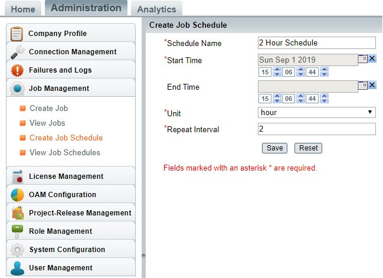

# Description

While configuring an integration, schedule can be associated in advance configuration. For more information on how to 'Associate Schedule', refer [Integration Configuration - Associate Schedule](../../../integrate/integration-configuration.md#associate-schedule).  

Now if I want to create a custom schedule and associate it to integration then how can I do this? For example, I want to create a schedule of '2 hours' so that every 2 hours integration reads data from the source system and synchronizes it to the target system. At present, the option to set 2 hours of schedule is not available in <code class="expression">space.vars.SITENAME</code> by default.

# Solution

You can create a custom schedule by following the steps below:

* Login to `<Server_URL>/OpsHubWS`  
  - For http deployment URL can be `http://localhost:8989/OpsHubWS`  
  - For https deployment URL can be `https://localhost:8443/OpsHubWS`

  **Note:** If you are accessing <code class="expression">space.vars.SITENAME</code> from a different machine, then change the localhost to the IP address or hostname of the machine where <code class="expression">space.vars.SITENAME</code> is installed.

* Go to **Administration → Create Job Schedule**

* Fill up the details as per your custom schedule need. Given below is the example of a 2-hours schedule setup.  

  

* Fill the required details and then save it. Once you save this, then this new schedule will be available in the integration under schedule association option.

* Login to <code class="expression">space.vars.SITENAME</code> through `<Server_URL>/OIM`  
  - For http deployment URL can be `http://localhost:8989/OIM`  
  - For https deployment URL can be `https://localhost:8443/OIM`

  **Note:** If you are accessing <code class="expression">space.vars.SITENAME</code> from a different machine, then change the localhost to the IP address or hostname of the machine where <code class="expression">space.vars.SITENAME</code> is installed.

* Now, refer [Integration Configuration - Associate Schedule](../../../integrate/integration-configuration.md#associate-schedule) documentation to associate your newly created schedule to the integration. Now, choose your custom schedule to set to the integration.
