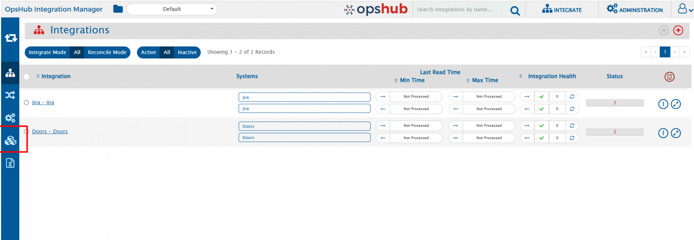
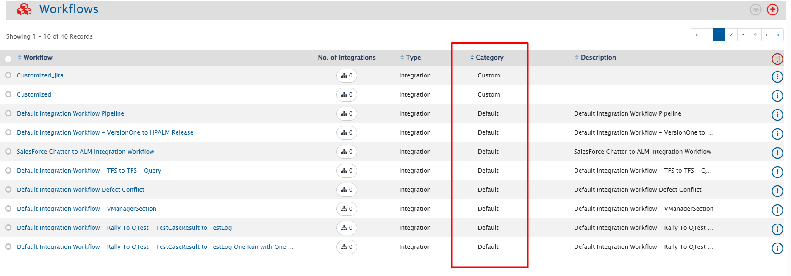
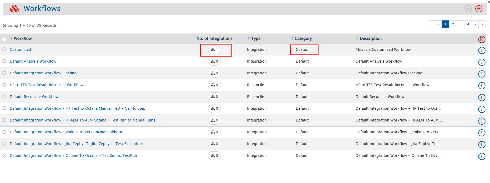
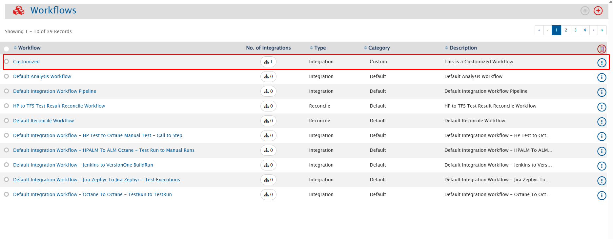

## Solution: Identifying Workflow Categories

In OpsHub Integration Manager, you can view workflow categories in the UI to easily identify default workflows from custom ones.

### Steps to View Workflow Categories

1. Navigate to the **View Integrations** Page.  

2. Click on the **Configure Workflow Screen** option from the left bar.  

  

3. On the Workflow page, you can see a list of all workflows, along with associated integration details, workflow type, category, and description.  
   Here, the **Category** column shows if a workflow is **Default (pre-installed)** or **Custom (user-created)**. This allows you to quickly identify the category of each workflow.  

  

4. To view the integrations associated with a particular workflow, refer to the **No. of Integrations** column.  
   For **Customized Workflow**, click on the number under **No. of Integrations** to view the integrations linked to the customized workflow.  

  

* This will show the integrations associated with **Customized Workflow**.  

  

* Similarly, for **Default Workflow**, click on the number under **No. of Integrations** to view the integrations linked to the default workflow.  

---

This streamlined process allows for easy identification and tracking of workflow categories and their associated integrations.
