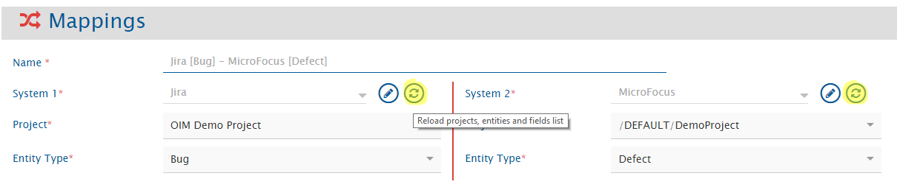

# Not able to see the newly added projects or lookup values

## Description

In some cases when new project/entity type/field/field values are added in the end system, the recently added values are not visible in <code class="expression">space.vars.SITENAME</code>. 

## Cause

There could be multiple reasons:  

### Permission Issue
Newly created project/entity types/fields may not have necessary permissions.   

### Caching Issue
<code class="expression">space.vars.SITENAME</code> caches (keeps in memory) the list of projects, fields and fields’ look-up values once these have been fetched from end systems for certain duration. This duration is configurable within <code class="expression">space.vars.SITENAME</code>. If you want to see the current value of these items, then navigate to <code class="expression">space.vars.SITENAME</code> and check the 'Cache Timeout' field. Keeping 'Cache Timeout' to a value lower than 10 minutes can slow down performance. Therefore, we suggest you have 'Cache Timeout' set for not less than 10 minutes. After this duration, this data will be automatically reloaded from end system. Once initial setup of integrations is stabilized, then you can increase the value to a higher value such as 60 Minutes, which will result into faster performance. 

Sometimes when user creates new project/entity type/field/field value in the end system and then try to find it in <code class="expression">space.vars.SITENAME</code>, then due to caching it may not appear immediately. 

## Solution

As the problem could occur due to multiple reasons, choose a solution that is suited to the reason that affects you.

### Permission Issue
Due to lack of permissions, <code class="expression">space.vars.SITENAME</code> may not be able to see newly created project/entity types/fields. For this reason, check that pre-requisites are being properly followed for that system. To validate this, refer [Connectors](../../../connectors/connectors.md) documentation for that system.

### Caching Issue
Sometimes when user creates new project/entity type/field/field value in end system and then try to check it in <code class="expression">space.vars.SITENAME</code>, then due to caching it may not appear immediately in <code class="expression">space.vars.SITENAME</code>. 

#### Reload data in mapping
If you are not able to see recently created project/field/field values in mapping, then follow the steps given below : 

* Edit the field mapping
* Click on reload icon for appropriate system as shown below:
  

  

#### Reload data in integration
If you are not able to see the recently created project/field/field/field values in integration, then follow the steps given below : 

* Edit the integration
* Click on reload icon for appropriate system as shown below:
  

  

