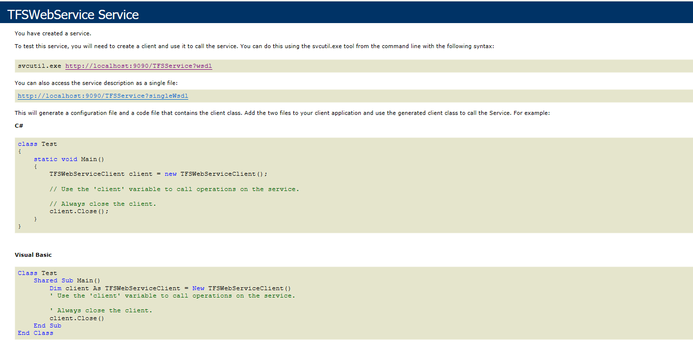

## Description

OpsHubTFSService needs to be registered while communicating with Team Foundation Server (TFS) and Azure DevOps.

## Solution

For registering OpsHubTFSService click [Service configuration](../../../connectors/azure-devops.md#service-configuration), and follow pre-requisites and steps given in “Service configuration” section.  
For troubleshooting, refer [Service Troubleshooting](../../../connectors/service-troubleshooting.md) section.

## Validate

After registering OpsHubTFSService, you can validate the registration by opening this URL in a browser:  
`http://<hostname>:<port>/TFSService`  

E.g. If you have registered OpsHubTFSService with hostname `localhost` and port number `9090` then hit URL: `http://localhost:9090/TFSService`.  

If OpsHubTFSService is registered successfully, the following output will be opened in browser after hitting the URL:  

