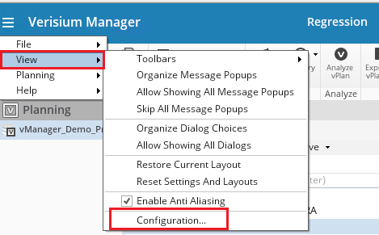
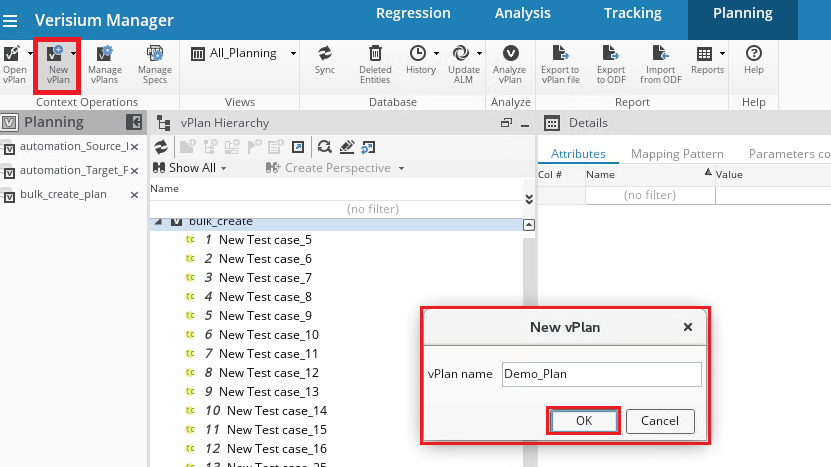

## Description
The user has configured the Verisium Manager System in the <code class="expression">space.vars.SITENAME</code>. However, vPlans are not loaded in the Project list of Integration Configuration / Mapping configuration.

## Cause
Integration is supported with the vPlan in the database only. Hence, vPlans will be loaded in the Project list of Integration Configuration / Mapping configuration only if there exist a vPlan in the database.

## Solution
* Create a vPlan in database to use it as a Project in the Integration Configuration / Mapping configuration.
* To create the vPlan in the database of the Verisium Manager, user needs to enable the **"vPlan in database"** option of the Verisium Manager, i.e. :
  * Open **"Verisium Manager Desktop Client"**, i.e., Launch Verisium Manager desktop client by using `vmanager` command in the Command Prompt of the machine where **Verisium Manager client** is configured.
  * Provide credentials, if client asks for the UserName and Password.
  * Select **"View"** → **"Configurations"**  
   

  
   

   
    * Select **"VPlan"**
    * Enable **"vPlan in Database"**  
        
      >**Note**: To enable this option, **"Vmanager_High_Availability"** feature [Product Id: VMGH01. Product Name: vManager Gen 4] must be present in the Verisium Manager license.
* After this configuration, vPlan can be created in the database. Please follow the steps given below for the same:
  1. Select **"New vPlan"** button.
  2. This will open a **"New vPlan"** window.
  3. Please enter the preferred name in the **"vPlan name"** textbox.
  4. Select **"OK"** button.  
     

