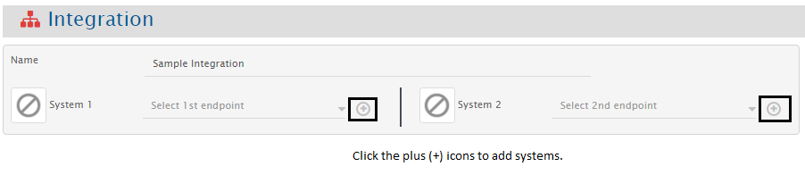
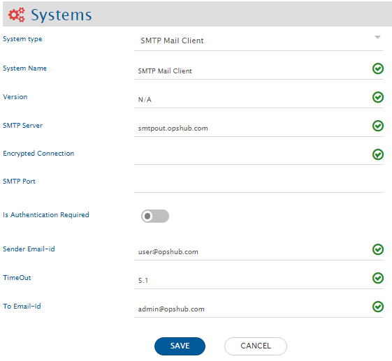
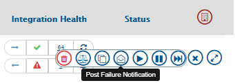
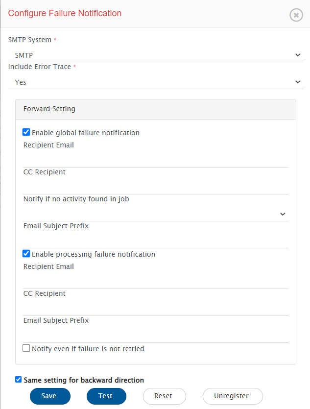
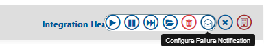
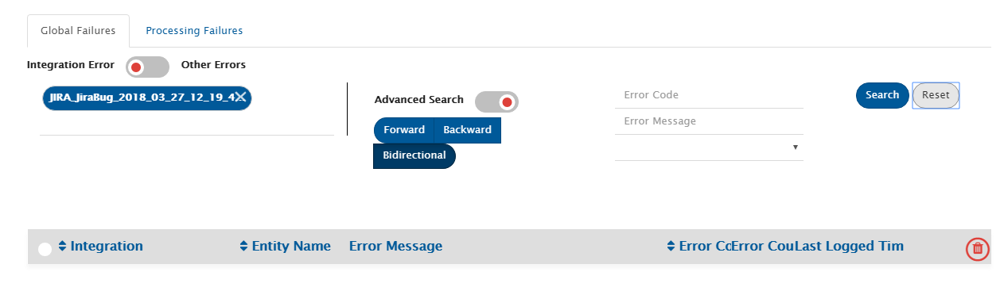
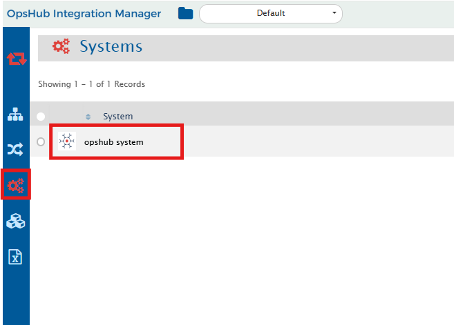
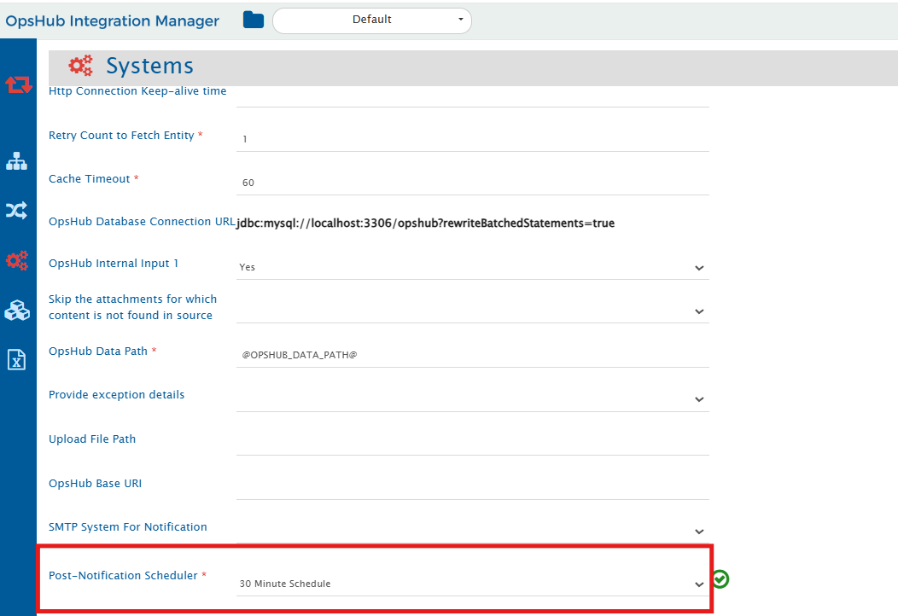

# Overview
Post Failure Notification is to notify the user in case of continuous execution of failure during polling, when there is no activity performed on an active integration or when any failure occurs during synchronization.  
  

You need to register for **Failure Notification for the integration** for which you want to receive the notifications. If for any reason (like SMTP mail server is not connected or SMTP system configuration is not valid) failure notification doesn't send notification, it will be considered as a case of error and will be logged in the "Error Management" section. Next time whenever the scheduler for Failure Notification runs, it will send the pending events' notification emails.

## SMTP Configuration

Failure Notification requires SMTP mail client systems to be created which can send emails notifications. User can also create systems from Integration → System Configuration → Create System.

  

This section shows SMTP Mail Client System Configuration steps in detail.

  

1. Set **System Name** to **SMTP Mail client**.  
2. Set **Version** to **N/A** as it is not required  
3. Set **SMTP Server** to outgoing server name. All notification mails will be sent through this server.  
4. Select **Is Authentication Required** to **Yes** if SMTP Server requires authentication credentials for sending mails. If no authentication is required and sending anonymous mails is supported by SMTP Server, then set it to **No**.  
5. Set the value of **Sender Email-id** as it is a **mandatory** field irrespective of the value of field **Is Authentication Required** being **Yes or No**. Give a name of a valid email account which can be used for sending e-mails.  
6. If **Is Authentication Required** is set to **Yes** then **Password** will appear, give email login password for user in **Sender Email-id**.  
7. **TimeOut** is optional field, it is maximum time for which {{SITENAME}} will try to send email, after time out period that specific mail will not be sent.  
8. Give email id of recipient of notifications in **To Email-Id**.  
9. Click **Save** to save the configuration.

## Register For Failure Notification

To register for **Failure Notification**, follow the steps given below:

  

- Select **Configure Failure Notification** from the as shown in the image above by clicking the **Configure Failure Notification** icon against an integration name. This will open "Configure Failure Notification" dialog.

  

- Select Email server system from the dropdown list in Email server field.
- Set the value of **Include Error Trace** drop-down list to Yes, if you want to send the error trace data as .pdf file along with the entity failure(s) notification email. If you set the value of the drop-down list to No, the trace data will not be attached to failure emails. The default option is Yes.
- Set **Recipient Mail** to the email address to which notification is to be sent. If there are multiple email addresses, then specify it in comma separated form, for example: _user1@domain.com_, _user2@domain.com_.
- Set **CC Recipient** to email address to which notification copy is to be sent. If there are multiple email addresses then specify it with comma separator, for example: _user1@domain.com_, _user2@domain.com_.
- Set the value of **Email Subject Prefix** to the prefix that you need to consider for the failure notification email subject. This prefix is used both for the Jobs failure(s) and Entitys failure(s) notifications.
- Enable **Enable global failure notification** to enable notification for job failures.
  - Set **Mail If No Activity Found In Job For** to the time duration after which the mail should be sent if there is no activity in the active integration.
  - Enable **Notify immediately when global failure occurs** to send an immediate notification in case of job failure.
  -  Disable **Notify immediately when global failure occurs** and set the value of **Notify when global failure count reaches** to specify the number of times a global failure must occur before sending a notification. Only numeric values between 1 and 20 (inclusive) are allowed.
  - >**Note**: If the project or entity is not accessible and a global failure occurs, a notification will be sent immediately regardless of the configuration, as this type of error is not temporary and requires immediate action.
- Enable **Enable processing failure notification** to enable notification for processing failures.
  - Enable **Notify even if failure is not retried till max count** to notify processing failure without waiting for it to get retried till max retry count.
- **Same setting for backward direction** enable this setting to use same setting for backward direction incase of bidirectional integrational configuration. To configure different setting for backward direction, uncheck this checkbox.
- Click **Save** to save the configuration.
- Click **Test** to test the SMTP configurations. This will send a test email to receipts mentioned in the "Recipient Email" field.

>**Note**: You can register for Failure Notifications on multiple integrations globally. Select all the integrations on which the Failure Notifications are to enabled and select the global **Configure Failure Notification** icon. Notification can be configured for only those integrations which donot have post-failure notification configured. Configuring the failure notification through bulk edit will set up failure notifications for **Global and Processing** failures for both directions.

  

## Unregister/Update Configure Failure Notification

- After registering for **Failure Notification** if it is required to update or unregister it, then select **Configure Failure Notification** from the menu for the integration on which failure notification is required to update or unregister.
- Click **Unregister** button to disable the failure notifications coming for the integration.

## Not getting failure alert emails?

If you are not getting failure alert emails, you should go to Global Failures and check whether there is an error logged or not. You can filter the error by error types: Integration errors and other errors.

  

## Configure Post Failure Notification Job

- By default, Post Failure Notification job is scheduled to be triggered at an interval of every 30 minutes.
- The trigger time for Post Failure Notification Job can be changed from opshub system.
- To change the trigger time for the Post Failure Notification job, go to the OpsHub system under the System tab.
- By default, the value for **Post-Notification Scheduler** will be set to **30 Minute Schedule**. Select an option from drop down to schedule the Post Failure Notification job.

