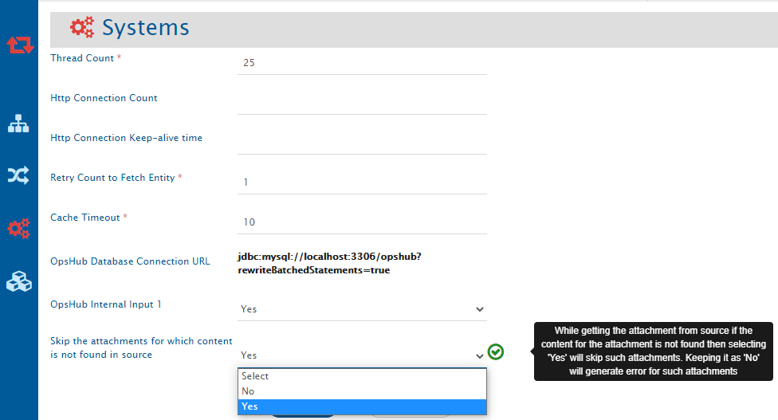

## Description

When you encounter **OH-Connector-0450**, then the following error message appears:

**OH-Connector-0450**: An error occurred while getting the input stream for attachment for entity id: [&lt;entity id&gt;] and stream URI :[&lt;attachmentURI&gt;]. Please check if the attachment is present in the source or if it can be accessible by the integration user or not. If you want to skip such attachments globally for all the systems, go to System Configuration → opshub system → select 'Skip the attachments for which content is not found in source' as 'Yes'.

## Cause

From system A to system B an entity is getting synchronized. This entity has attachment `filename.txt`. Now, during synchronization, while getting the content of the source attachment, if an attachment with URI `http://&lt;serverurl&gt;:8080/secure/attachment/201908/filename.txt` is no longer accessible from the end system, then the user will get the following error:

```
com.opshub.eai.core.exceptions.OIMAttachmentException: OH-Connector-0450: An error occurred while getting the input stream for attachment for entity id: [E1] and stream URI :<serverurl>:8080/secure/attachment/201908/filename.txt. Please check if the attachment is present in the source or if it can be accessible by the integration user or not. If you want to skip such attachments globally for all the systems, go to System Configuration -> opshub system -> select 'Skip the attachments for which content is not found in source' as 'Yes'.
```

## Solution

1. In this case, if the user wants to still migrate the entity by skipping all such attachments which are not accessible, then follow the steps given below:
   - Go to 'System configuration' list page
   - Open **opshub system** in the 'System Configuration' page
   - From here, select the **Skip the attachments for which content is not found in source** as **Yes**

<p align="center">
  
</p>


>**Note**: This option will start skipping the attachments from all the systems for which <code class="expression">space.vars.SITENAME</code> can determine the attachments which are not found.

