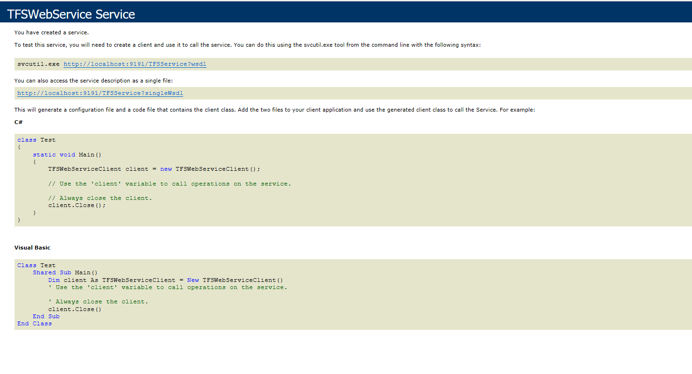

## Description

When you encounter OH-TFS/AzureDevOps-0182 then the following error message will appear:

'OH-TFS/AzureDevOps-0182:Can not reach TFSService. Please check if TFSService is running and `<TFS_SERVICE_URL>` is valid URL for TFSService.'

## Cause

Following are the probable reasons for this:

* OpsHubTFSService is not registered or started.
* `<TFS_SERVICE_URL>` format which is entered during system configuration is incorrect or wrong. 
* The HostName and PortNumber where OpsHubTFSService is registered is different than hostname and port number which is mentioned in Service URL during system configuration.  
  E.g. OpsHubTFSService is registered with URL http://localhost:9191/TFSService but during system configuration http://localhost:9090/TFSService is provided in Service URL.
* The OpsHubTFSService has not been upgraded after upgrading {{SITENAME}}.   

## Solution

* If you have not registered OpsHubTFSService, then refer [How to register OpsHubTFSService?](how-to-register-opshubtfsservice) and register OpsHubTFSService.
* If OpsHubTFSService is already registered and not running, then start the OpsHubTFSService.  
* The format of Service URL should be http://<hostname>:<port_number>/TFSService during system configuration. 
* Validate OpsHubTFSService is registered on same hostname and port number that is provided in Service URL by opening this URL in the browser:  
  http://<hostname>:<port>/TFSService.  
  E.g. If you have registered OpsHubTFSService with hostname "localhost" and port number "9191" then hit URL: http://localhost:9191/TFSService. 
* If you have upgraded {{SITENAME}}, then refer [How to upgrade OpsHubTFSService after upgrading {{SITENAME}}?](../../../faqs/tfs/how-to-upgrade-opshubtfsservice-after-upgrading-opshub-integration-manager.md) to upgrade OpsHubTFSService.
* If OpsHubTFSService is registered/started/upgraded successfully, the following output will be opened in the browser after hitting the URL:  

  

