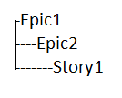
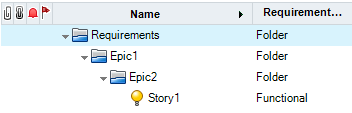
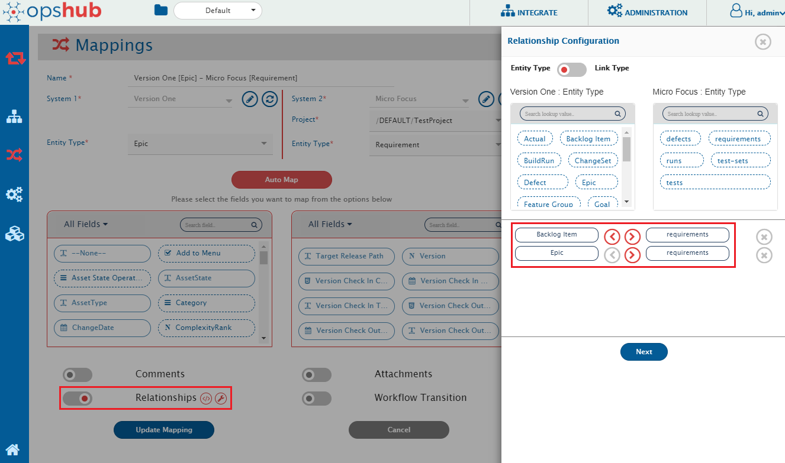
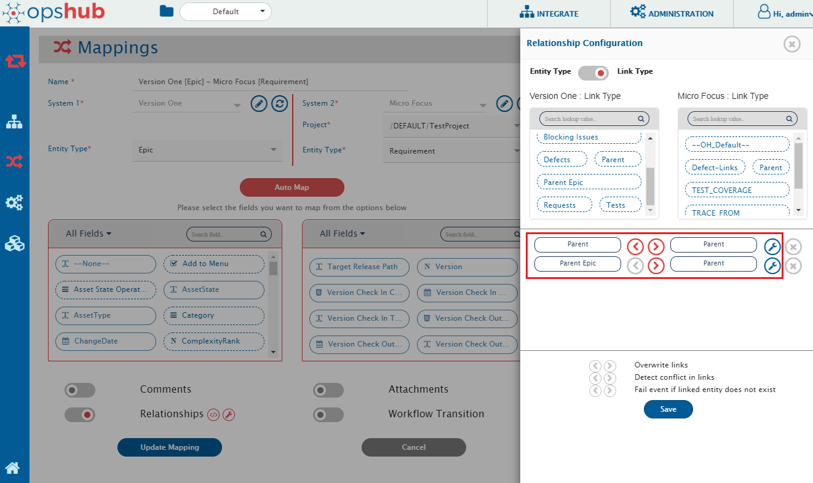

## Description

When integrations are configured for any entity of the source system to **Requirement** entity in Micro Focus QC/ALM, the folder structure/Hierarchy for Requirement entity can be set/created based on 'Issue Relationship' configuration of the mapping.

For example, a user has the hierarchy of entities in the source system such as VersionOne with the parent-child relationship as shown below:

Now, the user wants to synchronize this hierarchy of relationship as folder structure/Hierarchy of Requirement in Micro Focus QC/ALM as shown below:

## Solution

* As per the above example, we have two entities - **Epic** and **Story** in the source system, which are mapped to **Requirement** in Micro Focus ALM\QC. So we require two integrations, one for 'Epic' to 'Requirement' and the other for 'Story' to 'Requirement'. To synchronize the parent-child relationships between 'Epic' and 'Story', **Issue Relationship** needs to be configured in both the mappings.

* Create mapping for 'Epic' to 'Requirement' with the default value for 'Requirement-Type' as 'Folder'. For 'Requirement-Type' field, default value is required, so map 'Requirement-Type' with None and set default value as 'Folder'.  
  ** To configure default mapping, please refer [default value mappings](../../../../integrate/mapping-configuration.md#default-mapping). For example, please refer the screenshot of {{SITENAME}} mapping page given below for 'Epic' to 'Requirement' mapping with default value 'Folder' for 'Requirement-Type'.

{.center .frame}

* In this mapping, map the relationships to synchronize parent-child relationship defined in Version One as folder-hierarchy in Micro Focus QC/ALM. To map the relationships, click **Relationships** in {{SITENAME}} mapping page. A new window in which linkage between entities can be configured will open.

* Now in this window, in Entity type, map 'Backlog Item' to 'Requirements' and 'Epic' to 'Requirements' and in Link Type, map **Parent to Parent** and **Parent Epic to Parent**. Please refer [Relationship Configuration](mapping_configuration.md#relationships) for detailed understanding of Relationship Configuration. Please confirm the configuration for entity-types and link-types as highlighted in the screenshots below:

{.center .frame}

{.center .frame}

* Create mapping for 'Story' to 'Requirement' with the default value for 'Requirement-Type' as 'Functional'. For 'Requirement-Type' field, default value is required, so map 'Requirement-Type' with None and set default value as 'Folder'.  
  ** For example, please refer the screenshot of {{SITENAME}} mapping page below for mapping of 'Backlog Item' (Story) of Version One to 'Requirement' of Micro Focus QC/ALM with default value 'Functional' for 'Requirement-Type'.

{.center .frame}

* In this mapping, configure the Relationships (Parent-Child) as configured in the 'Epic' to 'Requirement' mapping.

