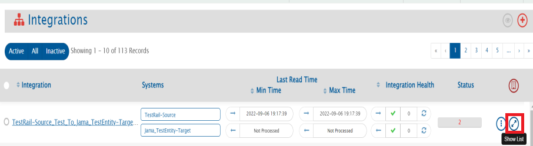
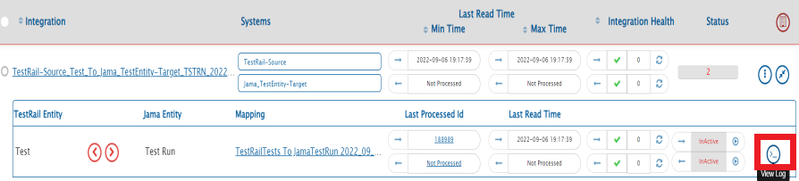
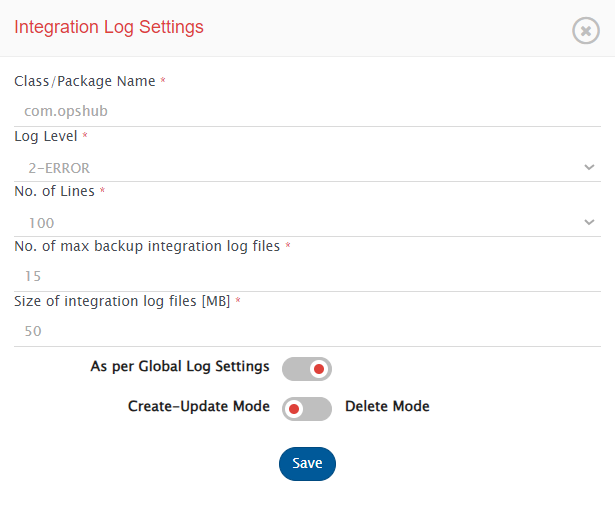
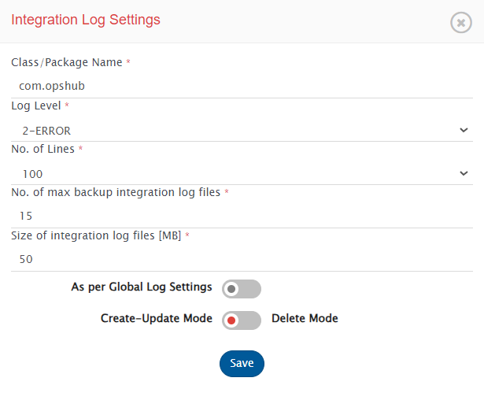
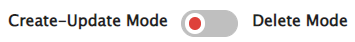
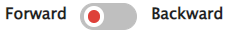
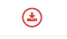

# Overview

- Sync log helps to view logs for tracking activities while integration is running. Usually, logs are helpful when any failure or unusual behavior is detected in integration.
- Sync log can store logs in 5 different levels. Logs will capture information based on the logging level set in the Sync log. Each integration has a separate Integration Sync Log.

# How to navigate to the Integration Sync Logs

To view the logs for any integration, navigate to integration and click the **Show List** button. From the list, click the **View Log** button.  

  

  

# Settings

- Click on the Setting button on the Sync log window to configure log settings as mentioned below:  
 

  

  

- **Class/Package Name:** The name of the package or class for which logs need to be monitored. To monitor the logs within the 'com.opshub', package 'com.opshub' should be entered here.

- **Log Level:** Represents the logging level which determines the amount of information recorded in the log files. By default, only Error logged [Level 2:Error] in OpsHub Integration Manager are logged in logs. Other available levels are as below. The coverage of information increases in ascending order from logging level 1 to 6.
  - 1-FATAL: Log minimum amount of data, not sufficient for tracking integrations.
  - 2-ERROR: Log errors of OpsHub Integration Manager only.
  - 3-WARN: Log errors and warning of OpsHub Integration Manager only.
  - 4-INFO: Log info, errors, and warning of OpsHub Integration Manager only.
  - 5-Debug: Log a considerable amount of data for debugging purpose.
  - 6-TRACE: Log a detailed maximum amount of data. It is useful for tracking integration in depth. However, it also increases the log sizes and creates multiple log files due amount of information logged.

- **No. of Lines:** Number of lines of logs to be displayed on the log viewer screen of the UI.

- **No. of max backup log files:** Maximum number of backup files to store excluding the current log file used by the integration.

- **Size of log file [MB]:** Maximum size (in MB) that an integration log file can have before a new backup log file is created.

- **As per Global Log Settings:** Use the toggle button to determine if sync log settings should follow global level Integration log setting or override that setting.

- **Create-Update Delete Mode:** Use the toggle button to set integration sync log settings that the user would like to view for each mode.

# Behaviour of integration Sync Logs

- **As per Global Log Settings Enabling:** Global level Integration Log Setting will be used for Create-Update/Delete mode, and the form is non-editable.
- **As per Global Log Settings Disabling:** The user-configured Integration Log Setting of Class/Package name, Log level, number of lines, and the maximum number of backup log files for the Create-Update/Delete mode of that integration will be used.

# Refresh log

**Refresh log:** Button on the top of the window can be used to refresh the logs to show the latest logged data.  

  

**Auto Refresh:** Toggle button which can be set **on** to automatically refresh logs every few seconds (2-3 seconds).  

  

# Create-Update Delete Mode

**Create-Update Delete Mode:** Toggle button is used to set the **type of synchronization** logs that the user would like to view.  

  

# Forward Backward Direction

**Forward Backward:** The Toggle button is used to set the direction of the integration the user would like to view.  

  

# Export logs

- Click the Export Logs button to export logs as a zip file. Here, the user can download the logs and analyze the logging for debugging purpose.  

  

# Word Wrap

  

Click on Word Wrap to enable/disable the word wrapping behavior in the log viewer.

- Word wrap is enabled by default.
- When word wrap is enabled, long log entries are wrapped, making them easier to read without horizontal scrolling.
- When word wrap is disabled, log entries remain on a single line, preserving the visual alignment of timestamps and structure. However, horizontal scrolling may be needed.

