# Event Failure Management Overview

Event Failure Management is a way to keep track of all failures that occur during integrations. Failures are stored in the OpsHub Integration Manager database, and during further execution of an integration, the failures specific to the integration are retried up to the maximum permissible count set up during the configuration. OpsHub Integration Manager also allows a user to manually retry the failures after the automatic retries are over.

Here is a video on different types of failures and how to manage them:



>**Note**: Instead of event failure(s) for a single entity, if you want to see the failures for all integrations configured on your OpsHub Integration Manager instance, delete the currently selected integration and hit the search button. You can also add multiple integrations by clicking on the text box below the currently selected integration(s) and add other integration name(s).

## How to navigate to the Event Failure Management section

To view the Event Failure Management section, follow the steps below:
* Log into OpsHub Integration Manager using the assigned credentials.
* Navigate to the Integration Page. 
* On the integration page, you'll see a table listing all the configured integrations. You can find out whether or not certain integration(s) failed and needs diagnostics by looking at the **Integration Health** column of the table. 
* In the **Integration Health** column, for each integration you'll see a number denoting the number of failed events for that integration. If the number is greater than 0,  click the number to view the failure(s) and diagnose it further.
* Once you click on the number, you'll be redirected to the *Integration Job Error(s)* page. There you'll see a table listing all the event failures for that integration.

  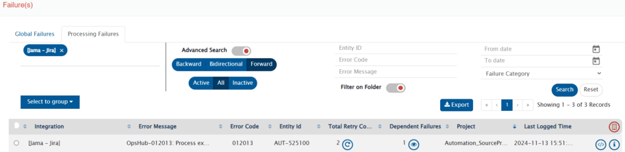

## Filtering failures

* You can apply advanced filters by using the **Advanced Search** option. Slide the button adjacent to **Advanced Search** option to the right to enable this option. Following options will appear:
  * **Entity Id**: Enter the Id of the source system which failed to synchronize.
  * **Error Code**: Enter the OpsHub Integration Manager code mentioned in the Error Message
  * **Error Message**: The message that specifies the cause of the failure
  * **From date** - **To date**: The time period during which the failure had occurred
  * **Failure Category**:  Failures have typically two categories, i.e. "Integration Sync" and "Delete Sync". Select the category of failure.
    * 'Integration Sync' represents the failure occurred during the synchronization of the 'Create-Update event'
    * 'Delete Sync' represents the failure occurred during the synchronization of the 'Delete event'
  * **Filter On Folder**: This option allows you to filter failures by the folder selected at the top. Slide the button adjacent to **Filter on Folder** to the right to enable this filter.
    * **Enabled**: Displays a list of failures filtered by the selected folder.
    * **Disabled**: Displays a list of failures across allowed folders.

>**Note**: If User Access Control is disabled, failures across all folders will be displayed.

* Instead of event failures of a single entity, if you want to see the failures of every integration, you can delete the currently selected integration name on the top left and hit the search button. Doing so will show all the event processing failures through out the OIM.
* You can also add multiple integration by clicking on the textbox below the currently selected integration name and adding other integrations.

For example, in the image below, we have filtered the errors with Error Code '0041'.

  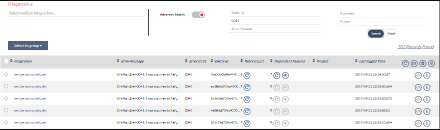

## Grouping failures

* You can group and filter failures in categories from the **Select to group** drop-down. The categories in which you can group failures are:  **Error Message**, **Error Code**, and **Integration Name.**
* Select the grouping in which you want to view the failure. The errors relevant for that group will appear.

  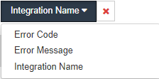

## Action on failures

You can perform one shot actions on grouped failures. For example, you can retry or delete all groups in one click.

The 4 actions that you can take on failures grouped under a single category are:

*  **Delete All**: Deletes all the failures without its dependent failures, across all the groups in the result

Click  to delete all failures.

*  **Delete all with dependents**: Deletes all the failures with its dependent failures, across all the groups in the result

Click  to delete all failures with dependents.

*  **Retry All**: Resets retry count for all the failures without its dependent failures, across all the groups in the result

Click  to retry all failures.

*  **Retry all with dependents**: Resets retry count for all the failures with its dependent failures, across all the groups in the result

Click  to retry all failures with dependents.

In addition to the Delete, Retry, Delete All With Dependents and Retry All With Dependents actions, you can take 3 more actions on the individual errors within each section. The additional actions that you can perform on an individual error are:

*  **View Failed Event**: Allows users to view detailed information regarding event fetched from the source system, mapping input and output for the configured mapping, and rules input and output for configured reconciliation rules.

Click  to view failed event.

*  **Show Dependent Failures**: View all dependent failures for a single entity - you can retry, delete, or edit event XML fpr these failures  
Click  to see all dependent failures of an entity.

*  **Show Failure Details**: See detailed information about the selected failure

Click  to see detailed information about the selected failure.

## View Failed Event

Once you click the **View Failed Event** option against a failure, a pop-up screen appears. This pop-up screen has the following details related to the failed event:

* **Source Event**: Source Event refers to the event retrieved from the source system. It contains a list of key-value pairs for properties of the issue type (e.g., Bug, User Story) or entity, such as AssignedTo, Created Date, eventType. Also, some fields that help OpsHub Integration Manager maintain records for the entity, such as InternalId and EventUUId.

>**Note**: Here's an example of the pop-up screen for an integration's failed event. The details may vary from failure to failure:

  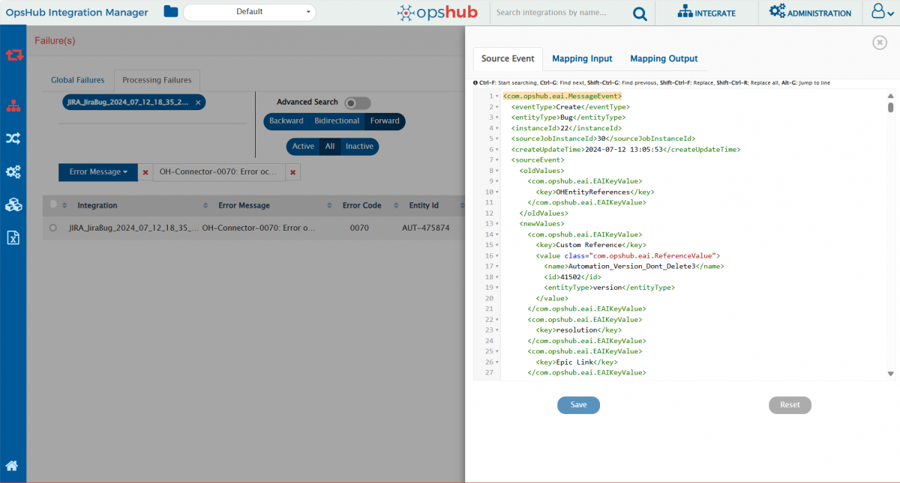

* **Mapping Input**: The Mapping Input option refers to the XML input for the source event as per the configured mapping. Here, all properties of the source entity are retrieved from the source system.

  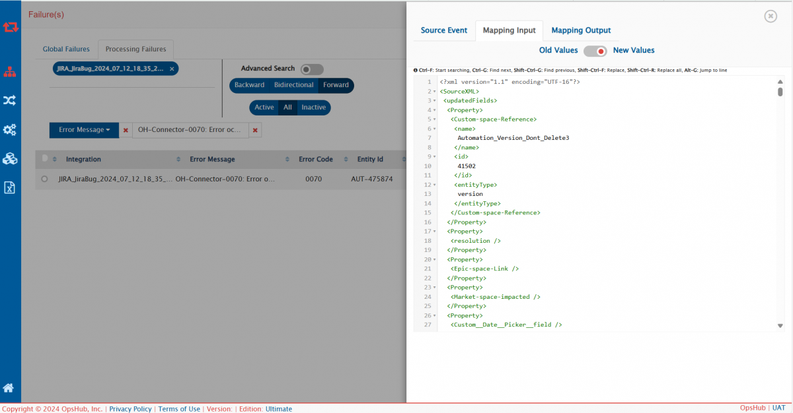

>**Note**: Slide the toggle to switch between old values and new values of the mapping input.  
>**Note**: The 'old values' in the mapping input refer to the previously fetched values from the source entity. The 'new values' in the mapping input refer to the current values of an entity that has been fetched from the source system.

* **Mapping Output**: The Mapping Output option refers to the XML output for the source event as per the configured mapping.

  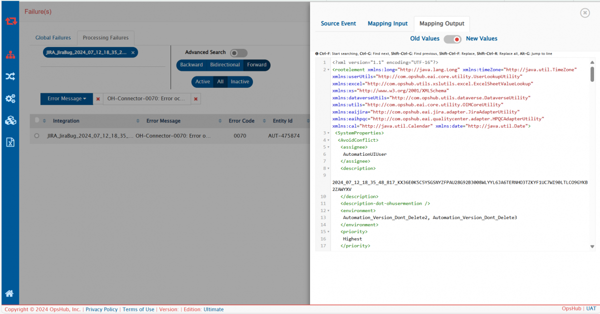

>**Note**: Slide the toggle to switch between old values and new values for the mapping output.  
>**Note**: The 'old values' in the mapping output refer to the transformed values(old) for the given mapping input. The 'new values' in the mapping output refer to the values of an entity after they have been transformed as per the configured mapping.

* **Reconciliation Data**: If the configured job is for **reconciliation** and a failure occurs because of it, another option for reconciliation data will appear. This option contains rules input and rules output for the configured reconciliation rules.

  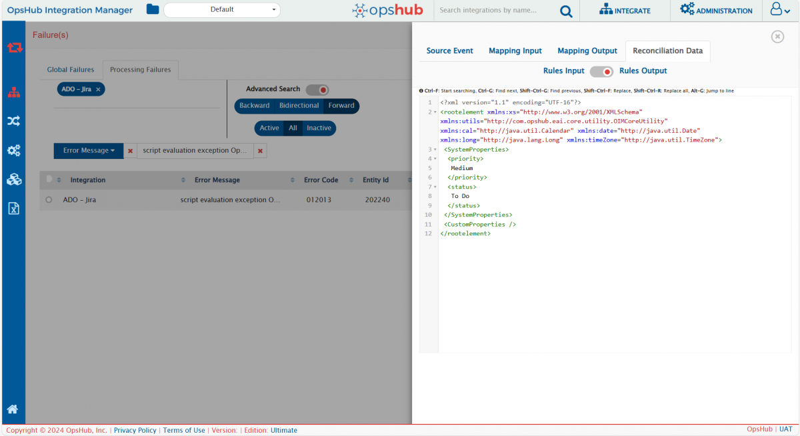

>**Note**: Slide the toggle to switch between rules input and rules output.  
>**Note**: The rules input is the 'Mapping Input XML' for the configured mapping along with a special field called 'diffProperties', crucial for reconciliation. The rules output is the 'Mapping Output XML' which are the transformed values of fields configured for reconciliation.

* In the following two cases, the Mapping Input, Mapping Output, and Reconciliation Data options will provide no information:
  * There has been a problem during the execution of the transformation
  * If failure occurred before the execution of the transformation,

* A warning will be given for the above three cases. Following is the example of the warning message:  

  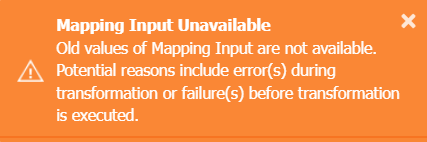

* If the failures are present in the older versions(before V7.170 upgrade): In that case, to view the mapping input & mapping output, the failures should be retried to have the information.

>**Note**: If the failures are not retried after updating the source event, and you view the failed event again, an icon will appear in the top right corner of the Mapping Input, Mapping Output, and Reconciliation Data options. This icon indicates that the XML values are not the latest, and you should retry and refresh the failed event. Refer to the below image for the same:
  

  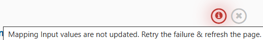

## How to read an error message

Once you click the **Show Details** option against an error, **the Failure Details** pop-up appears. This pop-up has the following details related to the error.

>**Note**: The following image shows the Jira-ServiceNow integration specific error. The errors may slightly vary from one integration to another. 

  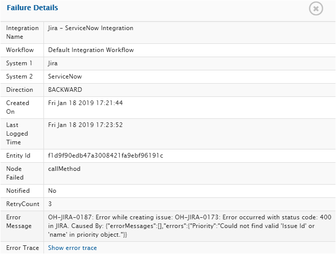

* **Integration Name**: Name of the integration for which the failure has been recorded
* **Workflow**: Name of the workflow, executing which the failure has occurred
* **Source System Name**: Name of the source system used in the corresponding integration
* **Event Name**: Nature of the event, for example, Create, Update, Sync, and so on
* **Created On**: The time at which the failure was logged for the first time
* **Last Logged Time**: Last time when the failure was logged
* **Entity Id**: The id of the failed entity in the source system
* **Node Failed**: Name of workflow state at which event failed
* **Notified**: **'Yes'** when the failure has been notified to the user via email and **'No'** otherwise
* **Retry Count**: Number of times failure is retried since last reset of Retry Count
* **Error Message**: The message that specifies the cause of the failure
* **Error Trace**: Error trace of the failure

# Engage Support Team For Failure

If you are facing a complex failure for which you are seeking help from support team, export **Integration Configuration Detail** as described below and share it with the support team. Integration Details will help support team to address the failure with ease as it contains requisite details for troubleshooting the failure.

* Navigate to the integrations page. 
* Go to the integration for which you are facing a failure.
* Hover over More  icon, you will get an option to export Integration Details as shown in the image below.

  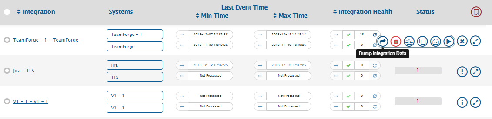

  

* Click on the **Dump Integration Data** button. You will get a zip file with the name: **IntegrationDetails.zip**.
* Zip contains integration configurations, sync logs, mapping, and failure details; it does not contain any sensitive data related to the integration user. 

You can also export Integration Details of multiple integrations as shown below. 

* Select integrations for which you want to export Integration Details.
* Hover over More  icon enabled at the top level and follow the same process as described above.

