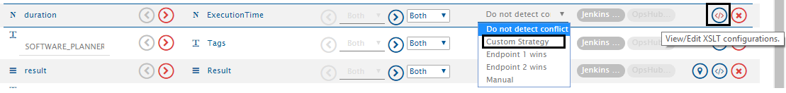
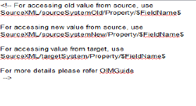

# Custom Conflict Resolution Strategy

Custom Conflict Resolution Strategy assists user in making complex resolution decisions based on the run time values in the source and target systems. With this strategy, users can resolve conflict by considering which end point was updated last or which end point was updated first. User can also make the master/slave decision at run time, based on the current state of the end systems. For example, whether the end system in which a workitem is still open becomes the master or a system in which workitem was not created by sync becomes the master and so on.

---

## Steps to provide XSLT for defining Custom Strategy

Given below are steps to provide XSLT for custom strategy:  
* Click the edit adjacent to the **Custom Strategy** drop-down option. 

<div align="center">
  
</div>

* Remove comments and provide XSLT in the open box.

<div align="center">
  
</div>

---

### Field Value Access Table

| Description                             |  Example                                                                 |
|-----------------------------------------|--------------------------------------------------------------------------------|
| **You can access the source old value:** | `SourceXML/sourceSystemOld/Property/$FieldName$`<br>*$FieldName$ is the internal name of the source system field* |
| **You can access the source new value:** | `SourceXML/sourceSystemNew/Property/$FieldName$`<br>*$FieldName$ is the internal name of the source system field* |
| **You can access the target value:**     | `SourceXML/targetSystem/Property/$FieldName$`<br>*$FieldName$ is the internal name of the target system field* |

---

### Example

For example, take that resolution strategy for Title field is 'master system is selected based on originated-in system.'  
We can provide the script:  

```xml
<Title>
  <xsl:variable xmlns:xsl="http://www.w3.org/1999/XSL/Transform" name="xPathVariable" select="SourceXML/sourceSystemNew/Property/Created-space-By/userEmail"/>
  <xsl:choose xmlns:xsl="http://www.w3.org/1999/XSL/Transform">
    <xsl:when test="$xPathVariable='test@opshub.com'">
      <xsl:value-of select="SourceXML/targetSystem/Property/Title"/>
    </xsl:when>
    <xsl:otherwise>
      <xsl:value-of select="SourceXML/sourceSystemNew/Property/Title"/>
    </xsl:otherwise>
  </xsl:choose>
</Title>
```

