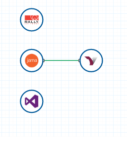
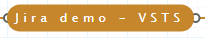
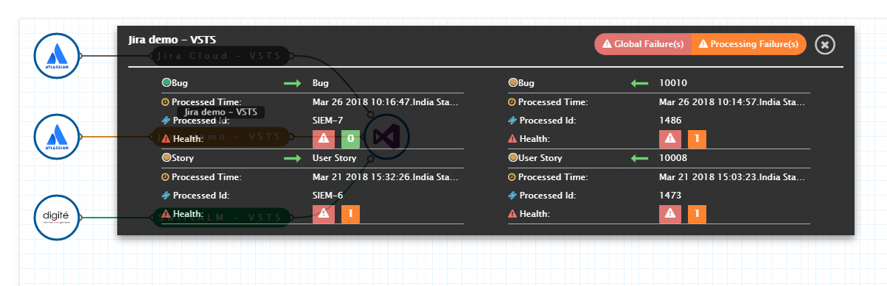

The OIM dashboard gives a quick view of integrations configured in **OpsHub Integration Manager**. Users can check overall health of integrations and know if integrations are working fine or have any failures. Users can navigate directly to integrations, systems, and failures from the dashboard.

Here is a video on how to use the dashboard in OIM:



# Graphical View

- Login into **OpsHub Integration Manager**.
- Dashboard will appear on home page.
- Click on (../assets/rotate.png) at top right corner of dashboard to rotate graphical representation of integration.

- **Node:** Represents system created in **OpsHub Integration Manager**.
- **Branch:** Represents that two nodes are connected through integration. Click on branch to view integration in read-only mode. Color of branch depicts status of integration.
  - **Green:** Integration is active.
  - **Gray:** Integration is inactive.
  - **Red:** Job failure in integration.
  - **Orange:** Processing failures in integration.
  - Click on  to view integration details from dashboard.

In integration details window, the following information is shown:

- Entity type(s) integrated.
- Flow of integration (Uni-directional or Bi-directional) for each entity type.
- For each flow:
  - **Last processed time:** Last time when integration was executed.
  - **Last processed entity ID:** Last entity processed by integration.
  - **Health:** Shows failures, if any, logged in integration.

> **Note** : Graph gives complete view of all integrations across folders.

# Filtering the Dashboard by Various Functions

Users can filter the integrations according to the system and integration status.

- Click the funnel icon to view the filter options.

(../assets/dashboard_filter.PNG)

- Select the **systems** and click **Filter** button. All the integrations that use the selected systems will be displayed.
- The available options for **integration status** are: All, Active, Inactive, and In error. Select one and click **Filter**.
- You can try combinations — for example: set Jira as a system filter and Active as an integration status filter to view all active Jira integrations.
(../assets/dashboard_filter_graph.PNG)

- Click **Clear** to view all integrations and remove applied filters.

# Navigation from Dashboard

## Navigate to System

- Click on a system node in the graph. For example, clicking on the “Team Foundation Server” icon will open that system’s configuration.

(../assets/Dashboard_Image3.png)

## Navigate to Integration

- Click on the integration name in the graph to open its details.

(../assets/Dashboard_Image1.png)

## Navigate to Failure

- Click on "Global Failure(s)" or "Processing Failure(s)" to go directly to the Failures module.

(../assets/Dashboard_Image2.png)

