# Overview

OpsHub Integration Manager supports the synchronization of source "Entity type" and/or "Project" change by performing the following steps on the target entity:

1. Change the target "Entity type" and/or "Project", if the target system supports the conversion of the "Entity type" and/or "Project".
2. Deprecation of previously synced target entity and creation of new entity on the target if the target system doesn't support the conversion of the "Entity type" and/or "Project."

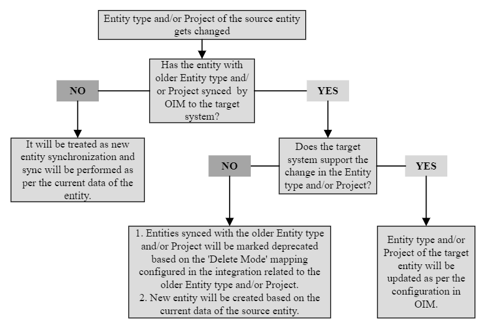

- As a part of "Deprecation", the Logical Delete, Soft Delete or Archive operation will be performed on the entity.
  - In the "Logical Delete", the fields of the target entity can be marked with predefined values(configured from "Delete Mode" mapping of OpsHub Integration Manager) to represent that the corresponding source entity's "Entity type" and/or "Project" is changed.
  - In the "Soft Delete", the entity will be deleted in the target, and will move to the recycle bin of the corresponding systems.
    - Currently, the "Soft Delete" is supported for Rally, Digital.ai Agility (Formerly known as VersionOne), and Team Foundation Server systems in OpsHub Integration Manager.
  - In the "Archive operation", the entity will be archived in the corresponding systems.
    - Currently, the "Archive operation" is supported for Jira On Premise system in OpsHub Integration Manager.

Furthermore, OpsHub Integration Manager supports the synchronization of project structures (in which each project from that hierarchy can be synced to target project) via [Child Project Sync](integration-configuration.md#child-project-synchronization) feature. In such cases, if the project is restructured in the end system, and the entity from the new project structure is transformed to a different target project (other than the previously synchronized one), it will be categorized as project movement synchronization. Refer to [Synchronization with project hierarchy](#synchronization-with-project-hierarchy) for more details.

# Configuration Steps

- In order to perform the Deprecation in the target entity, "Delete Mode" mapping shall be configured in the mapping configuration of the older Entity type and/or Project's integration.
  - Refer to '[Delete Mode mapping configuration](mapping-configuration.md#delete-mode)' section for further details on "Delete Mode" mapping.
- If the "Delete Mode" mapping is not configured, then deprecation will be reflected in the sync report of OpsHub Integration Manager only.

> **Note** : To distinguish between "Logical Delete" performed on target entity due to source delete synchronization or deprecation performed due to source entity's "Entity type" and/or "Project" change, some advanced mapping configurations can be used. Refer to [Differentiating source delete synchronization and deprecation](#differentiating-source-delete-synchronization-and-deprecation) section for further details on the same.

# Known Behaviors

- OpsHub Integration Manager facilitates the synchronization of updates in the "Entity type" and/or "Project" to the target by performing the above pre-defined actions by default.
  - However, if the user does not want to change the "Project" once the entity is created in the target system, the "Create" option can be set in "Sync When?" setting of the 'Projects' field mapping. Refer to the [Restrict project update in target](#restrict-project-update-in-target) section for more details.
- If in the source system, the "Entity type" and/or "Project" are changed, and this new "Entity type" and/or "Project" are transformed to the same "Entity type" and/or "Project" of the target system (which is previously synchronized), such scenario would not be considered as entity movement. Refer to [Synchronization with flat project mapping](#synchronization-with-flat-project-mapping) for more details.
- To synchronize the source entity's "Entity type" and/or "Project" changes, the integration user for the target system must have read and write permission on previously synced(having older entity type/project) entities.

## When the target system doesn't support the "Entity type" and/or "Project" change

- OpsHub Integration Manager will perform the following operations:
  1. Previously synced entities will be marked deprecated based on the "Delete Mode" mapping configured of older "Entity type" and/or "Project"'s integration.

    > **Note**: If the integration associated with the older "Entity type" and/or "Project" is not available, then the delete mode mapping configured in the integration related to new "Entity type" and/or "Project" will be considered.

  2. A new entity will be created based on the current data of the source entity.
    - If the comments are mapped in the mapping, ['OpsHub-020404' or 'OH-Connector-06201'](../help-center/troubleshooting/errors/common/oh-connector-06201.md) error will be observed temporarily in the sync.

- If the source entity is restored to the older "Entity type" and/or "Project", it will be treated as a new change on that source entity. As a result, deprecation and new creation of the entity will be performed in the target system.

- OpsHub Integration Manager has integration configurations, involving multiple systems:

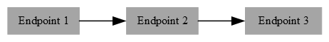

  - Here, if the "Entity type" and/or "Project" are changed in the source system, "Endpoint 1":
    - If both the target systems, "Endpoint 2", and "Endpoint 3" support the conversion, the "Entity type" and/or "Project" conversions will be performed in the target systems.
    - If "Endpoint 3" supports the conversion but "Endpoint 2" does not, the change will not be updated in "Endpoint 3".
      - In this case, the deprecation and creation of the entity will take place at "Endpoint 2". There will be a standard create/update sync from "Endpoint 2" to "Endpoint 3".
      - To reflect the deprecated entity from "Endpoint 2" to "Endpoint 3", [source delete synchronization](source-delete-synchronization.md) can be configured if the entity is deleted in "Endpoint 2".

- Deprecated entity is not applicable for further synchronization by OpsHub Integration Manager:
  - Deprecated entities will not be fetched from any other integration configuration.
  - If there is any failure on the target entity, which is going to be deprecated, OpsHub Integration Manager will delete the failures on that entity.

## When the target system supports the "Entity type" and/or "Project" change

- When OpsHub Integration Manager contains a single "Entity type" and/or "Project" to multiple "Entity types" and/or "Projects" integration configurations:
  - For the older "Entity type" and/or "Project":
    - The last updated entity by OpsHub Integration Manager is applicable for conversion, and the rest entities will be deprecated as shown:

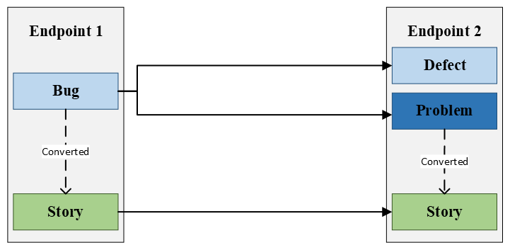

    - In the above example, a "Bug" has been synced as "Defect" and "Problem" in the target, and "Problem" was last updated. Now, "Bug" is converted to "Story". OpsHub Integration Manager will convert "Problem" to "Story" and deprecate "Defect".

  - For the newer "Entity type" and/or "Project":
    - The integration which fetches the updated entity first will perform the type/project change in the target. Others will do normal create/update.

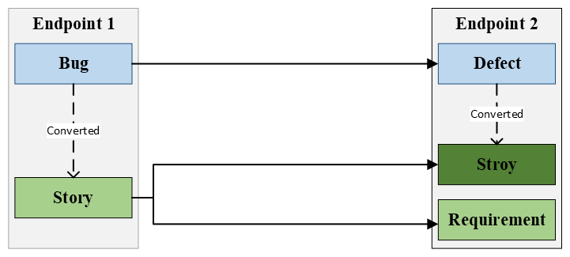

    - In this example, "Bug" → "Story", first fetched by "Story - Story" integration. So "Defect" → "Story" and a new "Requirement" is created by "Story - Requirement" integration.

- If the "Entity type" and/or "Project" has been updated multiple times immediately, and the integration relevant to each is present in OpsHub Integration Manager, some interim conversions may get skipped if not fully fetched:

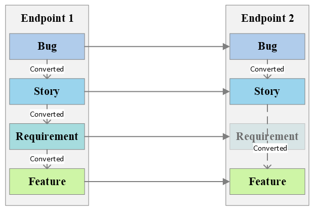

  - In this case: "Bug" → "Story" → "Requirement" → "Feature"
    - If "Requirement" update is not fetched, result is "Bug" → "Story" → "Feature". The skipped steps will be missed.

## Processing Failures

- If the entity being updated has a failure in the integration of the older type/project, sync of update will be blocked until that failure is resolved.

# Differentiating source delete synchronization and deprecation

- In Source Delete Synchronization, "Event Type" = `OH Delete`.
- In source type/project change, "Event Type" = `Create` or `Update`.
- Advanced mapping logic can differentiate:

```xml
<Status>
  <xsl:variable xmlns:xsl="http://www.w3.org/1999/XSL/Transform" name="eventType" select="SourceXML/opshubEventType"/>
  <xsl:choose xmlns:xsl="http://www.w3.org/1999/XSL/Transform">
    <xsl:when test="$eventType='OH Delete'">
      <xsl:value-of select="'Deleted due to deletion in the Source'"/>
    </xsl:when>
    <xsl:otherwise>
      <xsl:value-of select="'Deprecated due to type change'"/>
    </xsl:otherwise>
  </xsl:choose>
</Status>
```

# Restrict project update in target

* If the user wants to restrict the project changes in the target system:
  * The field representing the project in the end system such as "Projects" (or "Rally Projects" for the Rally system), must be mapped within the mapping configuration.
  * Select "Create" option in "Sync When?" setting.
* The project mapping is defined at the integration level in **OpsHub Integration Manager**. If there are no intended modifications in the project field's value mapping, the "Same as Integration" option within the value mapping can be used. This will avoid redundant project value mappings for the "Projects" field.
* By performing the above configurations, **OpsHub Integration Manager** will synchronize the source updates to the target (on the previously synchronized entity) without altering the project, i.e.,
  * Configurations in **OpsHub Integration Manager** are as follows:

| Integration Configuration | | | | | Mapping Configuration | | | |
|---------------------------|---------------------------|------------|--------------------------|------------------------|----------------------|------------|---------------------|-------------|
| **Endpoint 1**            |                           | **Direction** | **Endpoint 2**         |                        | **Endpoint 1 field** | **Direction** | **Endpoint 2 field** | **Sync When?** |
| Entity Type               | Project                   |            | Entity Type             | Project                |                      |            |                     |              |
| Defect                    | Project A                 | Forward    | Bug                     | Project B              | Projects             | Forward    | Projects            | Create       |
| Defect                    | Project C                 | Forward    | Bug                     | Project D              |                      |            |                     |              |

* Here, if the project of the Defect entity SE1 is updated to 'Project C' in Endpoint 1, **OpsHub Integration Manager** will synchronize this update to the Bug of Project B, i.e., TE1 in Endpoint 2 (instead of updating the project to Project D):

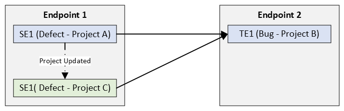

## Known behaviors

* Updates on the 'Entity Type' will not be restricted with this configuration. Refer to [Entity Type update with project update restriction](#entity-type-update-with-project-update-restriction) section for more details.
* It is recommended to select the same "Sync when?" option in both directions of the 'Projects' field mapping. If different options are chosen, it may lead to duplicate entities in the end system. Refer to [Different "Sync When" options per direction with project update restriction](#different-sync-when-options-per-direction-with-project-update-restriction) section for more details.
  * However, if the user wants to synchronize project updates from Endpoint 1 to Endpoint 2 (where the entity is unique across projects), but restricts the project updates from Endpoint 2 to Endpoint 1 (as Endpoint 1 is the master system for synchronization), it's acceptable for both directions to have different "Sync When?" options.
    * Refer to [Different "Sync When" option for master system with project update restriction](#different-sync-when-option-for-master-system-with-project-update-restriction) section for more details.
* The project update restriction cannot be enabled for the configuration of a single "Entity type" and/or "Project" to multiple "Entity types" and/or "Projects". Refer to [Single entity to multiple entities sync with project update restriction](#single-entity-to-multiple-entities-sync-with-project-update-restriction) section for more details.
  * If the source entity was previously synchronized to multiple "Entity Types" and/or "Projects" of the target system, enabling this setting will ensure that all subsequent synchronizations of that entity will be performed on the most recently updated active entity in the specified target system.
    * Refer to [Syncing the older entity to multiple entities with project update restriction](#syncing-the-older-entity-to-multiple-entities-with-project-update-restriction) section for more details.

## Use Cases

### Entity Type update with project update restriction

* Configurations in **OpsHub Integration Manager** are as follows:

| Integration Configuration | | | | | Mapping Configuration | | | |
|---------------------------|---------------------------|------------|--------------------------|------------------------|----------------------|------------|---------------------|-------------|
| **Endpoint 1**            |                           | **Direction** | **Endpoint 2**         |                        | **Endpoint 1 field** | **Direction** | **Endpoint 2 field** | **Sync When?** |
| Entity Type               | Project                   |            | Entity Type             | Project                |                      |            |                     |              |
| Defect                    | Project A                 | Forward    | Bug                     | Project B              | Projects             | Forward    | Projects            | Create       |
| Defect                    | Project C                 | Forward    | Story                   | Project D              |                      |            |                     |              |

* Here, if the project of the Defect entity SE1 is updated to 'Project C' in Endpoint 1, **OpsHub Integration Manager** will synchronize this update to the Bug entity of Project B, i.e. TE1 in Endpoint 2 by modifying the Entity Type to 'Story':

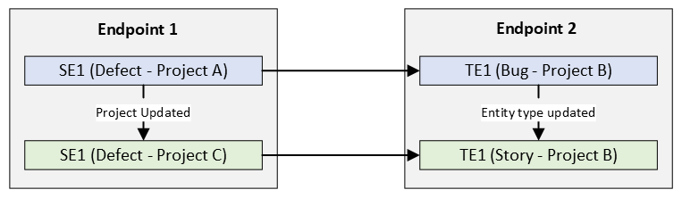

* If the Endpoint 2 does not support the "Entity Type" modification, then it will mark the Entity TE1 as deprecated and create a new entity TE2 in the Project B of Endpoint 2.

### Different "Sync When" options per direction with project update restriction

* Configurations in **OpsHub Integration Manager** are as follows:

| Integration Configuration | | | | | Mapping Configuration | | | |
|---------------------------|---------------------------|------------|--------------------------|------------------------|----------------------|------------|---------------------|-------------|
| **Endpoint 1**            |                           | **Direction** | **Endpoint 2**         |                        | **Endpoint 1 field** | **Direction** | **Endpoint 2 field** | **Sync When?** |
| Entity Type               | Project                   |            | Entity Type             | Project                |                      |            |                     |              |
| Defect                    | Project A                 | Bidirectional | Bug                  | Project B              | Projects             | Forward    | Projects            | Create       |
| Defect                    | Project C                 | Bidirectional | Bug                  | Project D              | Projects             | Backward   | Projects            | Both         |

* Here, if the project of the Defect entity SE1 is updated to 'Project C' in Endpoint 1, **OpsHub Integration Manager** will synchronize this update to the Bug of Project B, i.e., TE1 in Endpoint 2.

* Afterwards, if the Bug entity TE1 is updated in the Endpoint 2, it will create a new Defect entity in 'Project A' of Endpoint 1, i.e., SE2:

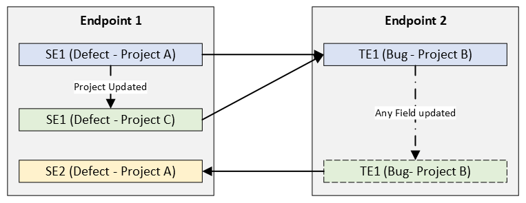

* Hence, for one Endpoint 2 entity, i.e., TE1, there will be two entities in Endpoint 1, i.e., SE1 and SE2.

### Different "Sync When" option for master system with project update restriction

* The synchronization is configured between Jira and Rally systems, where Jira is the master system.
  * The entities are unique across the projects of the same workspace in Rally.
  * The projects of the same workspace are configured in **OpsHub Integration Manager**.
* Configurations in **OpsHub Integration Manager** are as follows:
**Integration Configuration** (Left) | **Mapping Configuration** (Right)

| Jira Entity Type | Project     | Direction     | Rally Entity Type | Project     | Jira Field           | Direction     | Rally Field       | Sync When? |
|------------------|-------------|---------------|--------------------|-------------|-----------------------|----------------|--------------------|------------|
| Defect           | Project A   | Bidirectional | Bug                | Project B   | Rally Project Enum   | Bidirectional | Projects          | Both       |
| Defect           | Project A   | Bidirectional | Bug                | Project C   | Projects             | Backward      | Rally Projects    | Create     |
| Defect           | Project D   | Bidirectional | Bug                | Project E   | Projects             | Forward       | Rally Projects    | Both       |
| (continued)      | (continued) | (continued)   | (continued)        | (continued) | Projects             | Backward      | Rally Projects    | Create     |

* If the project of the Defect entity SE1 is updated to 'Project D', **OpsHub Integration Manager** will synchronize this update by updating the project of Rally Bug entity TE1 to 'Project E'.

* If the project of the Bug entity TE2 is updated to 'Project E', **OpsHub Integration Manager** will synchronize this update to Jira Defect entity SE2 of Project A in Endpoint 1 without modifying its project:

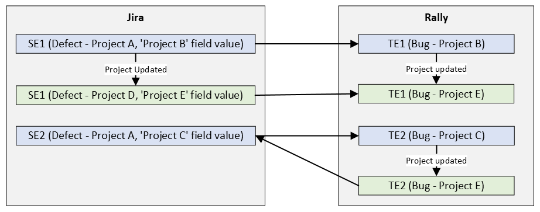

### Single entity to multiple entities sync with project update restriction

* Synchronize the Defect entity of Endpoint 1 as Bug entity in two different projects of the Endpoint 2
* Configurations in **OpsHub Integration Manager** are as follows:
**Integration Configuration** (Left) | **Mapping Configuration** (Right)

| Endpoint 1        | Project    | Direction | Endpoint 2   | Project    | Endpoint 1 Field | Direction | Endpoint 2 Field | Sync When? |
|------------------|------------|-----------|--------------|------------|------------------|-----------|------------------|------------|
| Entity Type       | Project    |           | Entity Type  | Project    |                  |           |                  |            |
| Defect            | Project A  | Forward   | Bug          | Project B  | Projects         | Forward   | Projects         | Create     |
| Defect            | Project A  | Forward   | Bug          | Project C  |                  |           |                  |            |

* The Defect entity SE1 of the Project A in Endpoint 1 will be synchronized as a Bug entity TE1 in 'Project B' of Endpoint 2 via Integration 1 and Integration 2. So, there will be no entity corresponding to SE1 in the 'Project C' of the Endpoint 2:

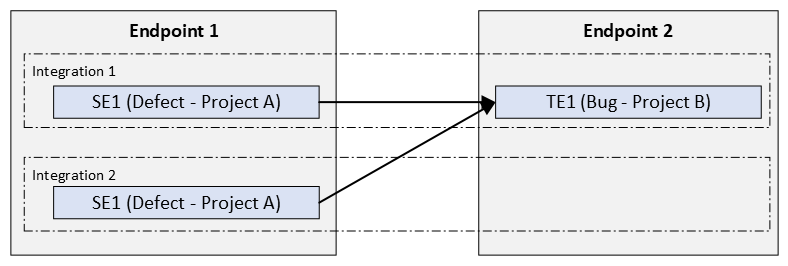

### Syncing the older entity to multiple entities with project update restriction

* The old and new configurations in **OpsHub Integration Manager** are as follows:

| **Configurations** | **Integration Configuration** ||| | | **Mapping Configuration** ||| |
|--------------------|-------------------------------|-------------------------|---------------|----------------------------|-------------------------|----------------------|---------------|----------------------|----------------|
|                    | **Endpoint 1 Entity Type**    | **Endpoint 1 Project**  | **Direction** | **Endpoint 2 Entity Type** | **Endpoint 2 Project**  | **Endpoint 1 Field** | **Direction** | **Endpoint 2 Field** | **Sync When?** |
| **Old**            | Defect                        | Project A               | Forward       | Bug                         | Project B              | Projects             | Forward       | Projects             | Both           |
| **Old**            | Defect                        | Project A               | Forward       | Problem                     | Project C              |                      |               |                      |                |
| **New**            | Defect                        | Project D               | Forward       | Bug                         | Project E              | Projects             | Forward       | Projects             | Create         |

* Here, the Defect entity SE1 of Endpoint 1 will be synchronized in Endpoint 2 as Bug in Project B (TE1) and as a Problem entity in Project C (TE2).
* If the project of the Defect entity SE1 is updated to 'Project D', **OpsHub Integration Manager** will synchronize this update to TE2 of Project C (the last updated entity) in Endpoint 2 by modifying the Entity Type from 'Problem' to 'Bug' and deprecate the older entity TE1 (to avoid orphan entities) in Endpoint 2:

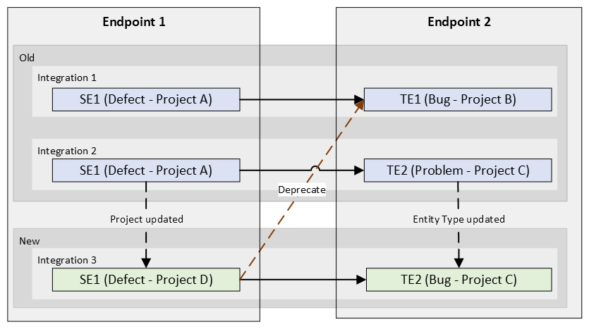

* If the Endpoint 2 does not support the "Entity Type" modification, it will mark the Entity TE1 and TE2 as deprecated and create a new entity TE3 in the target project B.

# Project Restructuring Use Cases

## Synchronization with project hierarchy

* Configurations in **OpsHub Integration Manager** are as follows:

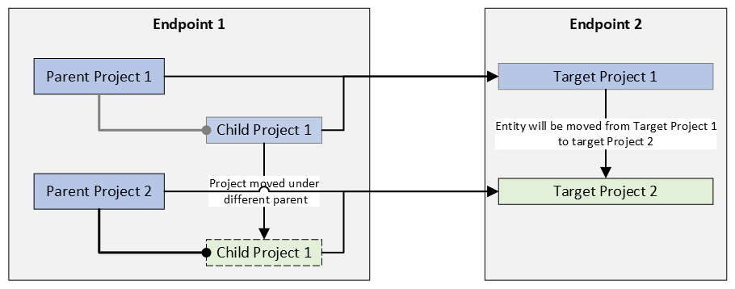

* Here, the entity SE1 of Child Project 1 is synchronized to 'Target Project 1' as TE1.
* If the 'Child Project 1' is moved under 'Parent Project 2' in Endpoint 1, **OpsHub Integration Manager** will synchronize the SE1 either by updating the project of TE1 to 'Target Project 2' (if Endpoint 2 supports project update) or create a new entity TE2 in 'Target Project 2' and deprecate TE1 (if Endpoint 2 does not support project update).

## Synchronization with flat project mapping

* Configurations in **OpsHub Integration Manager** are as follows:

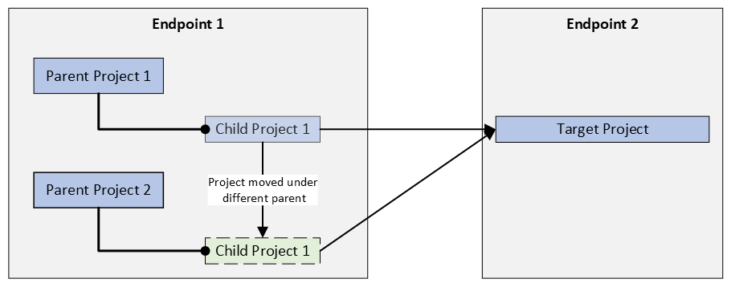

* Here, the entity SE1 of Child Project 1 is synchronized to 'Target Project' as TE1.
* If 'Child Project 1' is moved under 'Parent Project 2', **OpsHub Integration Manager** will synchronize the SE1 to TE1 without updating its project (as the new transformed project is same as the previously synchronized project).
