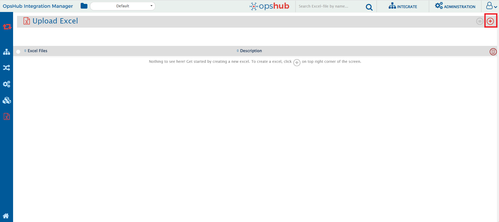
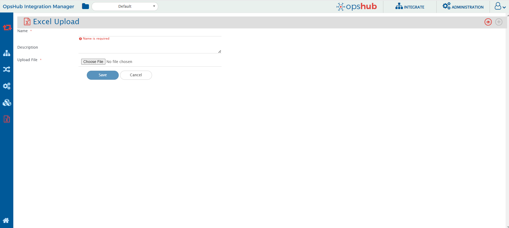
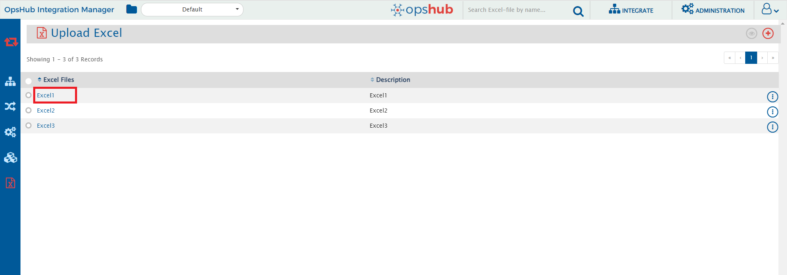
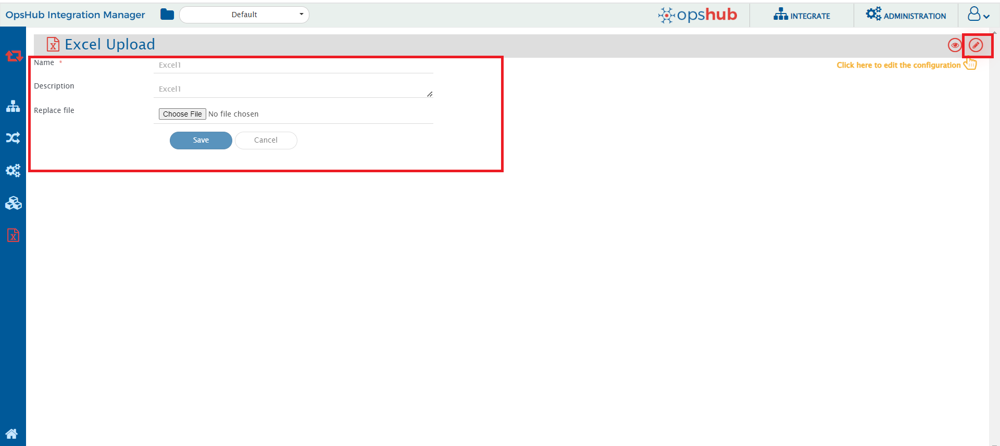
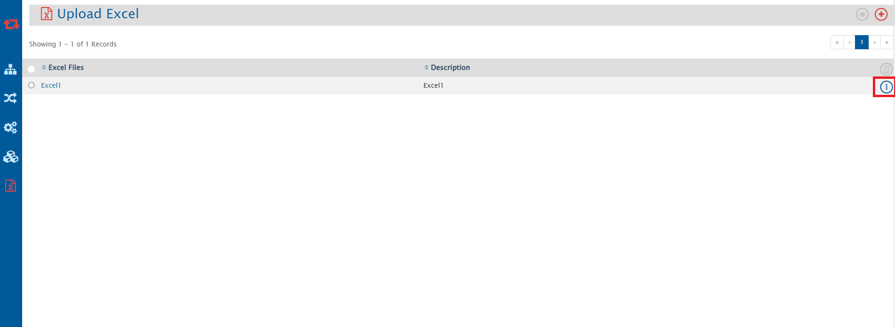
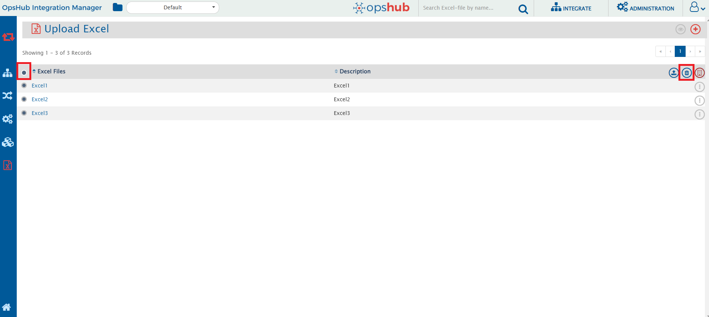
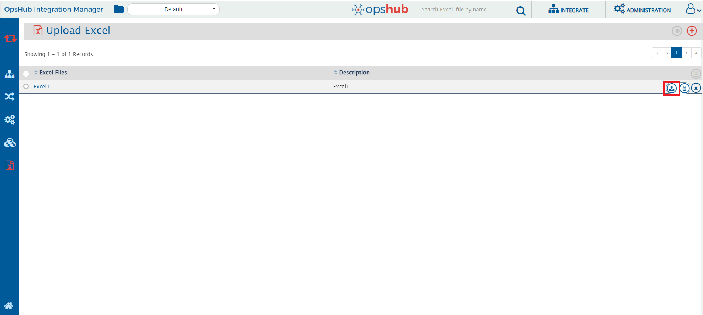

* Excel Upload is a functionality provided in OpsHub Integration Manager when the user wants to map more than 100 field values for a field.  
* Using this excel upload functionality, the user can upload the excel file in the OpsHub Integration Manager itself.  
* This functionality provides OpsHub Integration Manager user to upload the excel file directly into the OpsHub Integration Manager.  
User can synchronize data between two systems by providing the sheet name, source column and target column in the mapping page.

# Upload Excel
* To upload the excel file, user must click on the below mentioned "Excel" icon in the sidebar on the integrate page of OpsHub Integration Manager.  

  

* To upload a new excel file, click on the plus sign given at the top right corner.
   
  

  
  

* The user has to fill the mandatory fields(Name and Excel File) given as shown in the screenshot below:
  
  

  
  

# Edit Excel
* Click on the excel file which needs to be edited as shown in the screenshot below:

  

  
  

  In the edit page, the user can change name, description and upload another excel file  
  (in case there any changes in the excel file content). User can click on the pencil icon to edit the details.
  
  

  
  

# Delete Excel
## Delete Single Excel File
* The user can delete the excel file by clicking on the delete icon that appears on expanding the three dots icon as shown in the screenshot below:  
 

  

  

## Delete Multiple Excel Files
* To delete more than one file at a time, the user can select the radio buttons beside the respective files and click on delete icon to delete more than one file at a time.
  
  

  
  

  
* To delete all the excel files at a time, the user can select the radio button in the Excel Files column.

# Export Excel
## Export Single Excel File
* The user can export the excel file by clicking on the export icon that appears on expanding the three dots icon as shown in the screenshot below:  
  

    
  

* On clicking the highlighted icon in the given screenshot, the excel file will be downloaded(zip file format).
  
  

  
  

## Export Multiple Excel Files
* The user can select the radio buttons beside the respective files and click on export icon to export more than one file at a time.
  
  

  
  

* Similarly user can select the radio button in the Excel Files column to export all the files at once.

