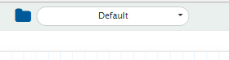
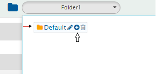
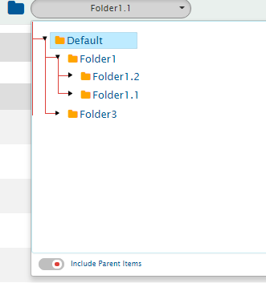
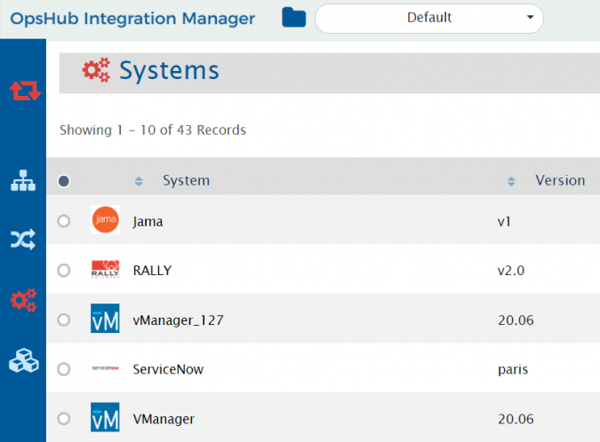
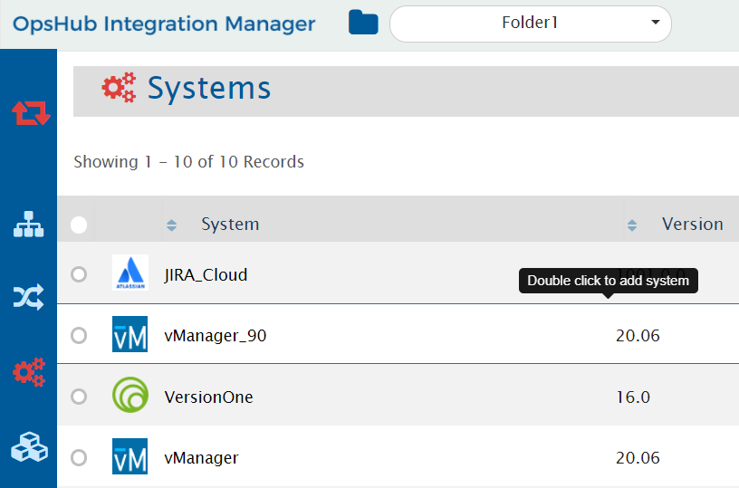
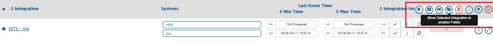
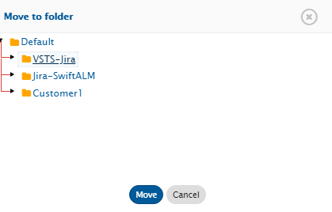
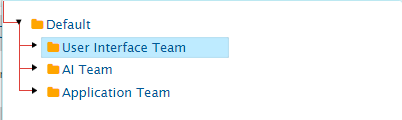

# Folder Management

Folder Management helps in organizing Integrations, Mappings, and Systems under separate workspace/folder.  

## Benefits of Folder Management

- Structured view of integrations instead of having all integrations under one roof.
- Searching an integration made easy.
- Ease in managing and debugging integrations.

## How it works

- Folders can be found on the top panel.

  

- "Default" is the root folder.
- To create new folder, click the add icon as shown below.

  

- Multi-level hierarchy of a folder can be created based on set of integrations.

  

## Include parent item

From child folder, a user can view all the config done in parent folders, using the toggle button:

  

- Integrations, mappings, and systems created under parent folder will be accessible to the child folder.
- Parent folder cannot access its child folder integrations, mapping, and systems.
- Systems and mappings created in parent folder can be re-used in child folders.
- Dashboard will include complete view of all integrations across the folders.
- The assests below show all systems created in Default folder and Folder 1, which is the child folder of Default folder. 

  

  

## Move configuration

- Integrations, mappings and systems can be moved from one folder to another folder across hierarchy.
- To move an item from one folder to another folder, click on item, select move action as shown below.

  

- All the existing folder will be listed, select the folder, and click **Move**.

  

- Similarly, mappings and systems can be moved.

### Rules to move configurations
**Rules for Moving System:**

Systems can be moved in a manner that associated mappings and integrations are at the same level or below the system in the same hierarchy.

Example: 

Folder Hierarchy: `/Default/A/B/C/D/E/F`

- `/Default/A/B` - System1, System2
- `/Default/A/B/C` - Mapping1 created using System1 and System2
- `/Default/A/B/C/D/E` - Integration1 created using Mapping1

Valid moves for Mapping1: `/Default/A/B`, `/Default/A/B/C/D`, `/Default/A/B/C/D/E`

**Rules for Moving Mapping:**

Mappings can be moved in a manner that associated systems are at the same level or above in the same hierarchy, and integrations are at the same level or below the mapping in the same hierarchy.

Same example applies.

**Rules for Moving Integration:**

Integrations can be moved in a manner that associated systems, mappings, and workflows are at the same level or above in the same hierarchy.

Same example applies.

# Modelling integrations

Given below are a few sample use cases on how to model integrations and divide them into folders.

Create a model for arranging integrations to be configured in OpsHub Integration Manager based on use case. Given below are some example of use case and using folders to manage integrations:

**1. Divide based on system combination**

- User wants integration between VersionOne, TFS and HP ALM.
- Integration can be divided into two sets:
  - VersionOne and TFS integrations 
  - TFS and HP ALM integration

> **Note**: It can be a bi-directional integration with multiple entities involved for each set of integration.

- Create systems at default level so that it can be accessed in child folders.
- Create mappings and integration in folders as shown below.

  

**2. Dividing based on Team/Users under same organization**

- This approach can be used when the user wants to divide integration sets based on use case of team/users within organization using common tools.
- For Example: 2 Teams are using common tools.

Folder structure can be as follows:

  

**3. Dividing based on customer**

- This type of model is useful for customer who are service providers, providing integrations to other customers.
- Create a separate folder for each customer integrations.
- Here Systems, Mapping, and Integrations will be created under specific folder created for each customer (as different customer do not share systems).

  

> **Note** : Currently all the users will have access to all the folders.

# Appendix

## Sorting behavior for integration folder name

The sorting behavior for integration folder names is based on their ASCII values. Refer to the following ASCII values table for more information:

  

