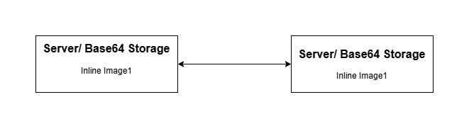
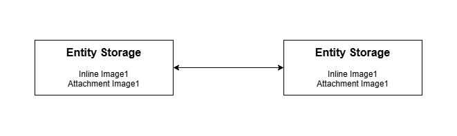
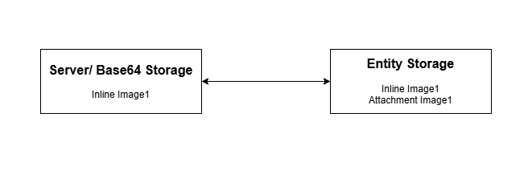

# Overview

OpsHub Integration Manager supports the synchronization of images and files across end systems in fields, comments, and as attachments on the entity.

* There are certain types of end systems based on how they add images/ files on their entity fields and comments.

1. **Entity Storage:**
   * Upon adding an image/ file to rich text fields, the same image/ file is also added as an attachment to the entity.
   * Example: If image/ file is added to rich text field in Rally, the same image/ file will be visible in attachment section of the entity.
   * Entity Storage Systems: Rally, Jira, OpenText ALM Quality Center (Formerly Micro Focus ALM/QC), qTest, DOORS NG, ServiceNow, Codebeamer, Windchill, TestRail, OpenText ALM Octane, Enterprise Architect, Aha!, Redmine

2. **Server Storage:**
   * Upon adding an image/ file to rich text fields, they are uploaded to an end system location itself, but the image/ file will not be added as an attachment to the entity.
   * Example: If image/ file is added to rich text field in Azure DevOps, this image/ file will not be visible in attachment section of entity. Instead, it will be uploaded to an end system.
   * Server Storage Systems: Version one, Jama, Aras, Readyone, Salesforce, ETM, DOORS, Hubs=Spot, Azure DevOps

3. **Base64 Storage:**
   * Upon adding an image/ file to rich text fields, they are not uploaded anywhere. The raw data itself is encoded in Base64 and is set in the rich text field. Image/ file will not be added as an attachment on the entity.
   * Example: If image/ file is added to rich text field in Broadcom Clarity, image/ file will not be uploaded anywhere. Also, it will not be added as attachment on the entity.
   * Base64 Storage Systems: Broadcom Clarity

# Image/ File Synchronization Behavior with Storage Combinations

## Server/ Base64 Storage System Combinations

<p align="center">
  
</p>


* Between server/ base64 and server/ base64 storage combination systems, if an inline image/ file is added to the entity upon synchronization by OpsHub Integration Manager as shown in the above image, it will be similar to the way image/ file is added to the source end system entity, i.e., it will only be added on inline field/ comment.

## Entity Storage System Combinations

<p align="center">
  
</p>


* Between entity and entity storage combination systems, if an inline image/ file is added to the entity, upon synchronization by OpsHub Integration Manager as shown in the above image, it will be similar to the way image/ file is added to the source end system entity, i.e., it will be added on inline field/ comment and also as an attachment on the entity.
  * Due to the entity storage system's behavior of auto-adding the image/ file as an attachment to the entity regardless of whether attachment synchronization is enabled/ disabled in mapping. OpsHub Integration Manager will also add the attachment on the entity to synchronize the image/ file.

## Server/ Base64 Storage and Entity System Combinations



* Between server/ base64 and entity storage combination systems, if an inline image/ file is added to the entity, upon synchronization by OpsHub Integration Manager above shown image will be the way image/ file will be added to the entity.
  * When the entity storage system is the target, OpsHub Integration Manager will auto-add the image/ file as an attachment to the entity.
  * When server/ base64 storage system is the target, OpsHub Integration Manager will not auto-add the image/ file as an attachment to an entity. It will only be added in the rich text field/ comment.
  * View parity between these storage combinations will be due to end-system behavior differences.

# Image/ File Synchronization Behavior with Text Fields/ Comments

* In the case of a Text type field/ comment, we cannot add renderable images/ files.
  * Hence, we will add a custom tag with the uploaded image/ file URL and the filename of the uploaded image/ file.

```xml
<InlineFile src="https:://opshub.jamacloud.com/attachment/1193337/img1.png">img1.png</InlineFile>
```

* In case of backward synchronization of such fields:
  * The original uploaded image to the original source will be preserved. i.e., in backward synchronization, we will ensure that the renderable source image is not removed.
    * For Base64 end systems, since a custom tag was not added in backward sync, the original image added to the source entity will be removed.

> **Note:** If the target end system is Base64 storage and the mapped field is text type, then bidirectional mapping with a rich text field is not advisable due to the removal of the image at the source field

# Image/ File Synchronization Behavior with Target end system not supporting Inline Synchronization

* In case the target end system does not support inline synchronization, and an inline image/ file is added to the source entity rich text field/ comment, then upon synchronization by OpsHub Integration Manager, below mentioned will be the behavior:
  * Data synchronized to the target entity will not have any renderable images/ files or opshub custom tags for image/ file when it is not a renderable field/ comment.
  * Images/ files will be uploaded to the entity as attachments.
  * In backward synchronization, from such end systems, the originally added images/ files will be removed from the fields.

# Image/ File Synchronization Behavior with Comment

* If a comment has been synchronized by OpsHub Integration Manager with an inline image/ file, the target comment will also have the image/ file.
  * Now, even if the comment is deleted in the source end system, the image/ file will persist in the target comment and also as an attachment on the entity in case it is an entity storage end system.

# Synchronization Behavior

Following are the **Before** and **After** behaviors for the given scenarios:

| **Serial No.** | **Scenario** | **Source Applicable To** | **Target Applicable To** | **Behavior before 7.195** | **Behavior after 7.195** |
|----------------|--------------|---------------------------|---------------------------|----------------------------|---------------------------|
| 1 | - Create entity with no attachment or inline images<br>- Add inline image to entity & start synchronization | Entity Storage | Server Storage | - An image will be uploaded twice, one as attachment & second as inline image<br>- Due to re-upload of image, one image of source will be in sync with multiple target images | - An image will be uploaded on server & will be referred in rich text field |
| 1 (contd.) | | Entity Storage | Entity Storage | - An image will be added to entity as attachment & will be referred in rich text field | Same |
| 2 | - Create entity with no attachment or inline image<br>- Add comment with inline image & start synchronization | Entity Storage | Server Storage | - First, image will be added as attachment<br>- When the image is detected as inline image, the same will be removed from the attachment<br>- A new image will be uploaded as the inline image. It will be referred from rich text field or comment. | Same |
| 3 | - Create entity with one attachment<br>- Add the same file in rich text field | ALL | ALL | Same | Same |
| 4 | - If the rich text field was not mapped previously and it had inline images<br>- After few revisions, rich text field is mapped | ALL | ALL | - No image was added in target, OH_IMG tag was added with a unique code | - Field will have inline images in target |
| 5 | - Create entity with multiple same name images referred in single rich text field & synchronize to target<br>- Update target entity & start other way synchronization | ALL | ALL | - All same named images will be mapped to one source image | - Despite matching file names, a one-to-one mapping between source and target images will be preserved |
| 6 | - Create entity with same image referred in two or more rich text fields<br>- Update the content of image<br>- In later revision, both rich text field has some text appended | ALL | ALL | - Inline image will be updated twice<br>- Due to re-upload, one image of source will be in sync with multiple target images | - Inline image will be updated only once |
| 7 | - HTML type of field is mapped with text field in target<br>- Source field has an inline image | ALL | Server Storage | - Two images will be uploaded, one as external image in target system and other as attachment on entity<br>- In target text field, it will be shown as `<ImageTag>Img1.png</ImageTag>` | - One image will be uploaded in the target system and this will not be visible in attachment section of entity<br>- In target text field, it will be shown as `<ImageTag src=”Server storage uploaded URL”>Img1.png</ImageTag>` |
| 7 (contd.) | | ALL | Entity Storage | - Attachment will be uploaded twice<br>- In target text field, it will be shown as `<ImageTag>Img1.png</ImageTag>` | - Attachment will be visible in attachment section of entity.<br>- In target text field, it will be shown as `<ImageTag src=”Attachment URL”>Img1.png</ImageTag>` |
| 7 (contd.) | | ALL | Base64 Storage | - Inline image with base64 storage is not supported | - Target text field will have `<ImageTag>Img1.png</ImageTag>`<br>- Image will not be uploaded to attachment or anywhere. Instead, an image tag with filename will be created |
| 8 | - Same source field is mapped to two different fields in target & one of them is a text field and other one is a rich text field<br>- Source field has inline image | ALL | Server Storage | - Image will be synchronized both as inline image for rich text field and as attachment to the target entity<br>- Rich text field has inline image<br>- Text field has `<ImageTag>Img1.png</ImageTag>`<br>- Entity has attachment | - Rich text field will have inline image<br>- Text field will have `<ImageTag src = ”Server storage uploaded URL”>Img1.png</ImageTag>`<br>- Image will be uploaded to external server and will be referred in these 2 fields |
| 8 (contd.) | | ALL | Entity Storage | - Rich text field will have inline image<br>- Text field will have `<ImageTag src= ”Attachment URL”>Img1.png</ImageTag>`<br>- The entity will have only the attachment due to the implicit behaviour of Entity Storage Connector | Same |
| 9 | - Create entity with no attachment or inline image<br>- Add comment with inline image & start synchronization<br>- Target end system does not support inline image in comments | ALL | Server Storage | - Same image will be uploaded twice to the end system<br>- Attachment will be added to the entity also | - First, image will be added as attachment<br>- When the image is detected as inline image, the same will be removed from attachment & image will be uploaded to server again<br>- The comment will be added with `<ImageTag src = ”Server storage uploaded URL”>Img1.png</ImageTag>` |
| 9 (contd.) | | ALL | Entity Storage | - First, image will be added as attachment to entity<br>- When the image is detected as inline image, a comment will be added with `<ImageTag src = ”Attachment URL”>Img1.png</ImageTag>` | Same |
| 10 | - Comment synchronization is enabled<br>- Rich text field is mapped to text field in target<br>- Both have same inline image | Entity Storage | Server Storage | - Image will be uploaded to server system & text field data added with `<ImageTag src = ”Server storage uploaded URL”>Img1.png</ImageTag>`<br>- Comment will be added with referred inline image | Same as before |
| 11 | - Source HTML field is mapped to target text field<br>- Create entity with inline image & synchronize<br>- Update target text field & start reverse synchronization (from target to source) | ALL | Base64 Storage | - Inline image with base64 storage is not supported | - If same name image is found in source entity, it will be replaced with source URI<br>- In case, image with same name is not found, the image will be removed from the source entity |
| 12 | - Create entity with rich text field having image 1<br>- In next revision, image 2 is uploaded on the same field<br>- If the events fail and are in retry but image 1’s base64 data is missing from the write-side cache | Base64 Storage | ALL | - Inline image with base64 storage is not supported | - Base64 content for image 1's hashcode will be queried in source entity<br>- Since, it is no longer present on entity now, image 1 will not be synchronized<br>- In the next revision, image 2 will be synchronized |


