Systems here refer to the applications such as Team Foundation Server (TFS) and JIRA that you are using in your Application Lifecycle Management (ALM) ecosystem.

In this section, you will learn how to configure a system onto <code class="expression">space.vars.SITENAME</code> and how to update the system details after configuration, if required.

# Basic Integration

* The dashboard, by default, shows all integrations created so far on the selected instance.

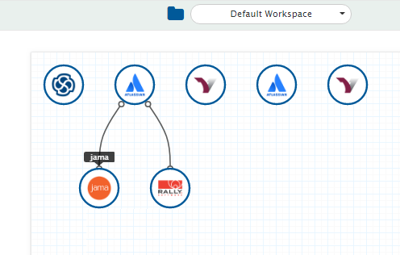

*   If the integration you want to use is not present in the list, follow the steps here:

    *   Click the **Integrate** button on the screen.

         

           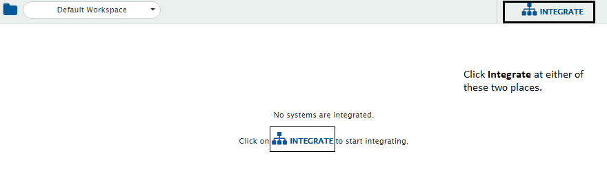
         

    * Click the plus icon **[+]** on the top right corner of the screen. You will be prompted to enter the **Integration Name** and names of the systems you want to integrate.

   

   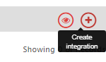
   

> **Note**: You are free to choose any name for the integration; however, we advise you to choose a name that helps identify the systems involved in the integration.

  

* Click the plus sign [+] adjacent to the System 1 and System 2 fields. You will be navigated to the System Configuration screen. Check the [System Configuration](system-configuration.md) steps here.
* In the **Select Project to Sync** section, select the projects you want to synchronize between the systems by clicking them. For example, in this case, we select Demo Project from TFS and OpsHub project from JIRA.
* Click the forward arrow (>), bi-directional arrow (<-->), or backward arrow (<) depending upon whether you want to integrate projects from System 1 and System 2, or do a bi-directional synchronization.
* In the **Select Entities to Sync** section, select the entities (issue types) you want to synchronize between the systems. A list of entities that are common for both projects would appear for both systems. Click the ones you want to synchronize. You can synchronize multiple entities in one integration. To add more entities, click the plus sign  [+] adjacent to **Select Entities to Sync**.

> **Note** : Some systems will have entities that require special settings. These entities would appear on the right side of the screen.

* If the required mapping doesn't exist, click the the plus button [+] adjacent to **Select fields to be synced** (In one of the screenshots above, select fields to be synced section is populated with TFS-JIRA map). You will be navigated to Mapping Configuration screen.

Click [Mapping Configuration](mapping-configuration.md) to learn the steps to create a new mapping.

*   You can configure some global settings for the integration using the option shown in the image below. The Global Settings allows you define: Entity Id Field Name, Entity Link Name i.e. [Tracking Id and Link of Entities Across Systems](integration-configuration.md#tracking-id-and-link-of-entities-across-systems) for both systems, [Maximum Retry Count](integration-configuration.md#maximum-retry-count) and [Associate Schedule](integration-configuration.md#associate-schedule) for integration.

   

     
   

   
* Polling time automatically set for the integration based on the system used for integration.
  * For Build systems and Source Control Management systems, last updated|created changeset/revision will be set as start polling time. If source does not have any data created then by default, it will be set to **0**.
  * For ALM (Application Lifecycle Management), PLM (Product Lifecycle Management), and Test Management systems, polling time is set to the last updated time on the selected source projects. If the project does not have data then polling time is set to the CurrentTime - 24 Hours.
*   If you want to change the default polling time, then click the **Entity Level Mandatory Settings** button given beside entity mapping option.

  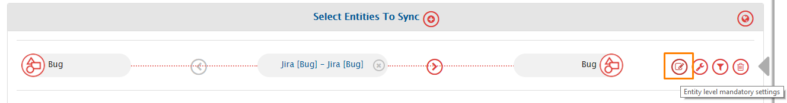

*   To save the integration in active mode, slide the **Activate Integration** button to the right. Select **Yes** in the **Are you sure?** pop-up.

  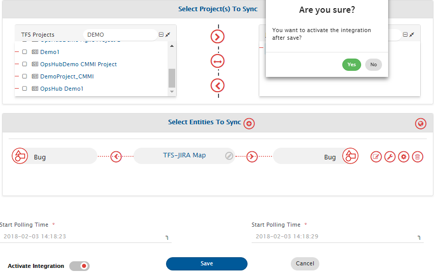

* Click **Save** to save the integration.

# Child Project Synchronization

There are few connectors who support child project synchronization. Enabling this feature will synchronize entities from selected projects and their child projects to other system.

If you have created integration with parent project mapping and later if a child project is added to that parent project in the end system, then such child projects will be automatically polled and no manual configuration changes will be required in the <code class="expression">space.vars.SITENAME</code> integration.

## Setting up child project sync

If the systems that you have mapped support child project polling, then you'll see a checkbox called **'Sync child projects'** below the name of that system in 'Synced projects' section. By default, this checkbox will be unchecked, which means it won’t poll child project's data. If you check the checkbox then <code class="expression">space.vars.SITENAME</code> will read events from the parent project including all child projects, and will sync them to the target project as per the project mapping.

If the checkbox is checked, this feature will be enabled for every project mapping in that integration and will be applicable to all the configured issue types.

## Scenarios

**Scenario 1:**
Now in this example if “Sync child projects” is selected for Rally (which support child project polling) then integration will read events from the _Rally R1_ including its child projects & _Rally R2_ including its child projects. After sync, entities will be synchronized to related target project(s). This means event from _Rally R1.1_ project (a child project under R1) will go to _Jira J1_ project and event from _Rally R2.1_ project (a child project under R2) will go to _Jira J2_ project.

**Scenario 2:**
If we consider the case of bidirectional sync, in our example, the events generated by _Jira J1_ will be synced to relevant projects in target. i.e.

* New entities created in _Jira J1_ will synced to _Rally R1_.
* Any updates in already synchronized entities in _Jira J1_ will be synchronized to relevant target project i.e. if the entity updated is of parent project _Rally R1_, updates will be synced in _Rally R1_. If the entity updated is of child project _Rally R1.1_, its update will be synced to _Rally R1.1_.

**Scenario 3:**
If you need a specific child project to be synchronized to a specific target project then you can map that child project separately. So in our example, if you don't want _Rally R1.1_ to be synced with _Jira J1_ and want it to be synced with _Jira J2_ instead, you can simply map _Rally R1.1_ to _Jira J2_ separately. So after doing this, events from _Rally R1_ and all of its child projects except _Rally R1.1_ will sync to _Jira J1_ and events from _Rally R1.1_ will sync to _Jira J2_.

**Scenario 4:**
If you don't want certain project’s child project to be polled, then you can configure separate integration for it in which the 'Sync child project' checkbox is not selected. Also ensure that this project or any of its parent (predecessor) projects are not a part of any other integration where 'sync child project' feature is turned on.

**Scenario 5:**
If project mapping is done at mapping level, it will be prioritized over integration-level mapping.

> **Note** : For this feature to work properly, all the child projects must have the same permission as the parent project. i.e. all the prerequisites that are applicable for parent projects will also be applicable to child projects.

# Criteria Configuration

Criteria Configuration helps in integration of subset of entities based on some conditions. For example, you can specify that only bugs with high priority are to be synchronized or tickets that are closed should be synchronized. Even after the entities are integrated, this synchronization based on defined criteria is retained.

* Click the icon shown in the image below for enabling **Criteria Configuration**.

  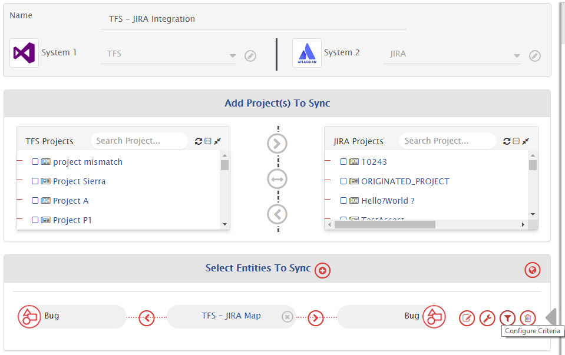

2. A pop-up window - **Criteria Configuration** appears on the right. In this window, for a bidirectional mapping, sections specific to both systems involved in the integration will appear in backward and forward criteria configuration tabs. Fill the requisite details.

  

3. First, select **Yes** in the Configure Criteria drop-down list. Once you select **Yes** in the Configure Criteria drop-down list, two more fields, **Query** and **Select criteria storage type field**, appear. Note that it is mandatory to select values for these three fields.

* In the **Query** field, enter the condition that you want <code class="expression">space.vars.SITENAME</code> to consider when it synchronizes the selected entity between the source system and the destination system. For example, if you enter `PRIORITY='High'` in the Query field for this integration, it means you are instructing to synchronize only those entities that are high priority.

> **Note** : The format in which you enter condition in the Query field will vary from one system to another. Refer the [Connectors](../connectors/connectors.md) section to learn more.

* From the **Select criteria storage type** drop-down list, select whether you want to store the entities from the source system in the database, directly in the end system or select **No Storage** option. The default behavior is to store the data in the database.
  * When you select **In Database**, the selected entities synchronize between both systems even when the conditions defined in the **Query** field has been updated.
  * When you select **In End System**, the selected entities synchronize between both systems only when the current conditions in the **Query** field are met. When you select this option, you also need to specify the field of the source system where the criteria need to be stored in the **Select where criteria info is to be stored** field.
  * When you select **No Storage**, the selected entities synchronize between both the systems only when the current conditions in the **Query** field are met. If the **Query** field is updated (in such a way that the entity is not meeting criteria), then updates to the entity won't get synchronized further. This option can be used if you want to stop the synchronization of the entity as soon as the conditions in the **Query** field stop meeting the criteria. For the other two options, once the entity is synchronized, it will always be in a synchronization state, even if the entity is not meeting the criteria anymore.
    * _This option is available only for Intland software's codebeamer, codebeamer X and Jira as of now._
    * The synchronization performance will get improved if you select this option.
      * Reason: This option will save time by not loading all the entities. Also, it will not go to the end system to update the criteria's results in the field.

To read in detail about Criteria information storage in end system, click [here](criteria-information-storage.md).

> **Note** : **Hierarchy Synchronization behavior when criteria is Configured in integration**:
> When criteria is configured, the position/order of the entity for hierarchy synchronization will be considered for the entities which are meeting the criteria at the time of synchronization. For example if some of the entities in the source end system view do not meet the criteria, then, in such cases, the target system view may be different in terms of position/order of the entities. Please check the below scenario for better understanding:

**Example**

Consider the following view of the end system for entities:

**P1**

* **C1**
* **C2 (Non-meeting criteria)**
  * **CC1**
  * **CC2**

**P2**
**P3**

The entity **CC1** and **CC2** are sibling to each other. In this case, **CC1** entity placed before **CC2** entity position/order, and both entities added on first level as entity **C2** is not meeting criteria. After synchronization, then the expected view in the target end system will be:

**P1**

* **C1**
  **P2**
  **P3**
  **CC1**
  **CC2**

The scenario mentioned above will be the expected behavior as entity **C2** does not exist in the target end system. The entity view in the target system will get corrected once the source entity **C2** fulfills the criteria, and is synchronized to the target end system.

> **Note** : **To keep entities 'once in sync always in sync', bidirectional integration should be configured in the same base integration.**
>
> * With two different unidirectional integrations, you will not be able to sync the updates for non-criteria meeting entities synced by other way integration.

> **Note** : **If integration gets deleted and created with the same configuration, the older criteria data synced by deleted integration will not remain in sync.**

# Advance Settings

Here is the video on Advanced Configuration settings:



These features help the user specify custom conditions during integration configuration.

1. Click the **Configure Advance** icon to define custom configuration settings. A pop-up window appears on the right.
2.  Within the pop-up window, there are two tabs: **Forward Advance Settings** and **Backward Advance Settings**. 
    When you select the **Forward Advance Settings** tab, you specify configuration settings for System 1. 
    When you select the **Backward Advance Settings** tab, you specify configuration settings for System 2. 
    Here you can define the following key parameters:

   

    
   

   

     
   

## Global Settings

The Global level settings allow customizing default behaviour of integration for all mapped entity types. 
When the Global level setting button is clicked, the **Global level advance configurations pop-up** opens on the right.

In the given pop-up, the **Entity Id Field Name**, the **Link Field Name**, and the **Sync Field Name** for the integrated systems can be selected and common parameters such as **Max Retry Count** and **Associate Schedule** can be set at once.

* **Entity ID Field Name:** Set this to a custom text property available in the end system. Ensure the field is available in all entity types in a given integration. 
  If set, this will sync Entity ID of the other system in the system for which it is set. 
  example: If Entity ID Field Name is set for Jira, then once an entity is created in VSTS or Jira, the integration will set the VSTS Entity ID (bug ID, requirement ID, etc.) in this field.
* **Link Field Name:** Set this to a custom text property available in the end system. Make sure the field is available in all entity types in a given integration. 
  If set, this will sync the entity web URL of the other system in the system for which it is set. 
  example: If Link Field Name is set for Jira, then once an entity is created in VSTS or Jira, the integration will set the VSTS entity URL (e.g., `https://<companyname>.visualstudio.com/project/_workitems/edit/84701`) in this field.
* **Sync Field Name:** Set this to a custom text property in the end system. Ensure it is available in all entity types in the integration. 
  If set, the integration will maintain the time of the last successful sync for every entity in the selected text field. 
  The time represents the audit time until which changes have been successfully synced to the target.

## Common Sections

* **Max Retry Count:** Set the maximum number of times the failed events should be retried. The default value is 3.
*   **Associate Schedule:** Set an interval at which the data between the source and the target systems should be synchronized. 
    The default schedule is 1 Minute Schedule.

   

    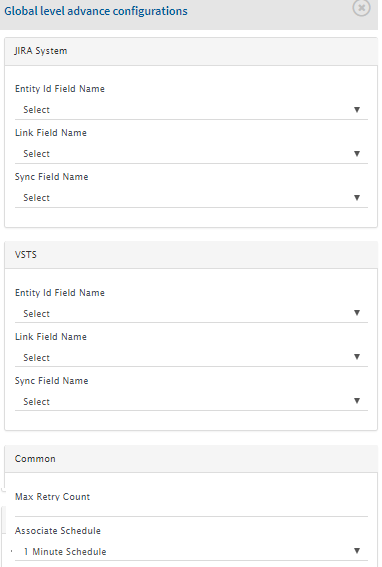
   

Once the Global level settings are configured, continue with other configurations.

## Maximum Retry Count

Click the **Configure Advance** icon > Go to Advance Configuration pop-up > Select **Override parameters for read operations** > Go to **Maximum Retry Count**.

## Sync Only Current State

This configuration is useful to switch 'History'-based (each change performed on bug will be considered for synchronization) processing to 'Current State'-based (only the state of the entity at the time of synchronization is considered) processing.

Click the **Configure Advance** icon > Go to Advance Configuration pop-up > Select **Override parameters for read operations** > **Sync Only Current State**.

From the **Sync only current state** drop-down list, select:

* **No** – if you want to synchronize the selected entity along with its history.
* **Yes** – if you only want to synchronize the current state.

> **Note**: This feature is available only for selected connectors. If you want to request this feature, please contact your sales/support point of contact.

These fields are shown in the image below:

  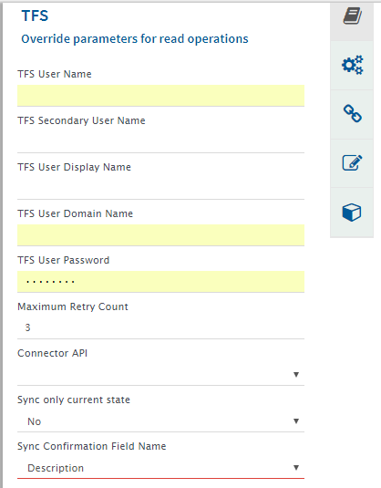

## Behavior for Absent Fields

Click the **Configure Advance** icon > Go to Advance Configuration pop-up > Select **Other configurations** > Go to **Behavior for Absent Fields**.

From the **Behavior for absent fields** drop-down list, select one of the following:

* **Skip** – Fields not present in the target system are skipped without failure. Other fields are synchronized.
* **Sync** – All fields, including those not in the target system metadata, are sent to the target API. This might result in failure if the field is invalid.
* **Validate** – A failure will occur if any field not present in the target system's metadata is added in mapping.

## Action on Entity Deleted in Target

Click the **Configure Advance** icon > Go to Advance Configuration pop-up > Select Other configurations > Go to Action on Entity Deleted in Target.

From the **Action on entity deleted in target** drop-down list, select **Create Failure**, **Recreate** or **Skip Update** depending on the action you want to take when the synchronized entity is deleted from the target system.

* When you select **Create Failure**, failure is created when the selected entity has been deleted from the target system.
* When you select **Recreate**, entity is recreated in the target system when the selected entity has been deleted from the target system.
* When you select **Skip Update**, no action is taken when the selected entity has been deleted from the target system.

## Associate Schedule

Click the **Configure Advance** icon > Go to Advance Configuration pop-up > Select Other configurations > Go to Associate Schedule.

From the **Associate Schedule** drop-down list, select an interval at which you want to synchronize the data between the source and the target systems. The default schedule is 1 Minute Schedule.

## Enable Delete Sync

To update the target entity for the corresponding sync-abandoned source entity, which are no longer a part of the synchronization, follow these steps:

1. Click the **Configure Advance** icon;
2. Go to **Advance Configuration** pop-up;
3. Select **Other configurations**;
4. Select **Yes** in the **Enable Delete Sync**;
5. This configuration can be completed by providing the value for the below configurations:
   * **Delete Events Sync Schedule**:
     * This configuration determines the interval at which delete events will be synchronized from the source to the target system.
     * The dropdown will show all the available schedules which can be configured for the delete event synchronization. Select the preferable schedule.
   * **Delete Events Polling Type**:
     * Two types of polling are supported for synchronization:
       * **Complete Polling**:
         * This polling type will synchronize the delete events for all the deleted entities, which are synchronized through the given integration.
       * **Polling From Date**:
         * This polling type will synchronize the delete events for all the deleted entities, which are synchronized to the target after the time specified in **Delete Events Polling Time** configuration through the given integration.
         * The time at which the entity is synchronized to the target system can be determined from the value of **Last Processed Time** column in the "Sync Report".
   * **Synchronize Not Applicable Entities** (Optional Input):
     * The default value for this input will be **No**.
     * To update the target entity when the source entity is not applicable for the synchronization, this input can be configured with the **Yes** value:
       * When the entity type and/or project of an entity is modified in the source system, the entity might no longer be included in synchronization due to the following reasons:
         * The integration configuration associated with the updated entity type and/or project is not available in <code class="expression">space.vars.SITENAME</code>.
         * The integration configuration linked to the updated entity type and/or project exists with the criteria that the entity no longer satisfies.

> 💡 There are certain known behaviors associated with this configuration, please refer to [Known Behaviors in Source Delete Synchronization](source-delete-synchronization.md#known-behavior) for further details.

## Sync New, Failed, or Both Events

Click the **Configure Advance** icon > Go to Advance Configuration pop-up > Select Other configurations > Go to Sync.

* Select 'New Event' when you only want to synchronize events that are new.
* Select 'Failed Event' when you only want to synchronize events that are failed.
*   Select 'Both (Failed and New Events)' when you only want to synchronize failed as well as new events.

    

     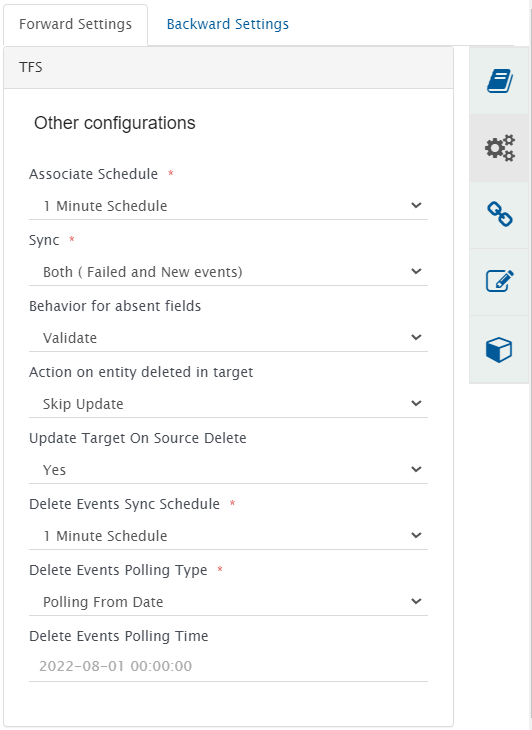
    

## Tracking Id and Link of Entities Across Systems

<code class="expression">space.vars.SITENAME</code> provides Remote Entity Id and Link settings that help in tracing synchronized entities across systems using their unique Ids and navigation URLs. You need to provide the names of fields in which you want to save this information.

**Remote Entity Id Field Name** will store the unique id and **Remote Entity Link Field Name** will store the navigation URL of the corresponding entity in the other system.

Suppose, a "Defect" with Id "D123" and navigation URL `systemA_url/project1/defect/D123` from System A is synchronized to System B as a "Problem" with Id "P12345" and navigation URL `systemB_url/project2/problem/P12345`, then:

* In System A:
  * **Remote Entity Id Field** of the **Defect** will store value **P12345**.
  * **Remote Entity Link Field** of the **Defect** will store value **systemB _url/project2/problem/P12345**.
* In System B:
  * **Remote Entity Id Field** of the **Problem** will store value **D123**.
  * **Remote Entity Link Field** of the **Problem** will store value **systemA _url/project1/defect/D123**.

If a Wiki or HTML field is selected for **Remote Entity Link Field Name**, Remote Entity Link will be added as a hyperlink of Remote Entity Id.

* Consider the following image where **Notes** (HTML field) is selected for **Remote Entity Link Field Name**:

   

     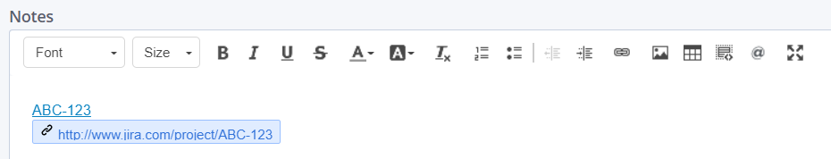
   

* Here, **ABC-123** is the Remote Entity Id. The Remote Entity Link (`http://www.jira.com/project/ABC-123`) is added as a hyperlink of Remote Entity Id.
* On clicking **ABC-123**, you will be redirected to the Remote Entity having Id **ABC-123**.

### To store the Id and link of the target entity in the source entity:

Click the **Configure Advance** icon > Go to Advance Configuration pop-up > Select **Override parameters for write operations (Source)** > Go to **Remote Entity Id Field Name** and **Remote Entity Link Field Name** > Select field name from the drop-down list.

### To store the Id and link of the source entity in the target entity:

Click the **Configure Advance** icon > Go to Advance Configuration pop-up > Select **Override parameters for write operations (Destination)** > Go to **Remote Entity Id Field Name** and **Remote Entity Link Field Name** > Select field name from the drop-down list.

> 💡 Consider whether you are making this configuration for forward or backward settings. Source and Target will change accordingly.

  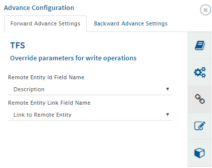

## Search in Target Before Sync

Click the **Configure Advance** icon > Go to **Advance Configuration** pop-up > Select **Override parameters for write operations (Destination)** > Go to **Search in Target Before Sync**.

  

**The Search In Target Before Sync** feature allows <code class="expression">space.vars.SITENAME</code> to search whether the selected entities from the source system already exist in the target system, and if yes, then what is the course of action that should be followed.

This feature is generally recommended when synchronization between systems being integrated was tried earlier either manually or by any other tool and user still wants to keep those synchronized entities in the integration with <code class="expression">space.vars.SITENAME</code> without creating their duplicate entries. 
Search can be configured to be done on any target system field which holds values similar to any one source system field or transformed fields from mapping. For example, entity id of source system is stored in **Original Entity ID** field in the target system, search can be configured on **Original Entity ID** field.

> **Note** : The priority will be given to the source system field value. If the field is not found in the source system, then the transformed fields from mapping will be used.

If you select **No** from the **Search In Target Before Sync** drop-down field, then <code class="expression">space.vars.SITENAME</code> will synchronize entities normally and create them on target if it was not already synchronized. 
If you select **Yes**, you will have to define the course of action that <code class="expression">space.vars.SITENAME</code> should take when matching entities are found in the source and the target systems.

Once you select **Yes**, the following fields will appear. You need to enter appropriate data in these fields as described below.

### **Target Search Query**

1. Provide query to be used for search entity in the target system in native target system format. 
   For example, `Title=@Name@ and CustomId=@ID@`. Here **Name** and **ID** are the field names of source system.
2. Fields of the target system's entity can also be used in the Target Search Query in case the source system and target system's field values format are different.
   * For example, if the source and target system have a different entity ID format or entity display name, the target search query on the source entity fields may not be useful. In such case, a user can convert the source entity ID to the target entity Id format using the mapped target system's field; that target system field can be used in the target search query.
   * Source entity ID: `XYZ-50` and Target entity ID: `50`, then the user can do the advanced mapping to convert the source ID format to Target entity ID format under the target field named **"ID converter."**
     * In such case, the target look-up query can be: `Entity ID = @ID converter@`. 
       &#xNAN;_ [Where **Entity ID** and **ID converter** both are target system fields]_
     * **Note**: Here, instead of the target field **"ID converter,"** the user can utilize the pseudo/virtual field in the mapping to have source-to-target format conversion, and then the pseudo/virtual field can be used in the target look-up, too  [as per the use case].
3. For native form of end system query to be given for your system, you can refer **Target LookUp Configuration** section in the specific connector document.
4. **What if multiple entities found in Target System matching above Query?** 
   Here you can define the action to be taken when there are multiple entities found in the target system matching query provided above in **Target Search Query**. Select appropriate options from the drop-down list.
   * **Continue with the first entity found**: Select **Continue with the first entity found** if you want to update the first entity from the multiple matching entities found in the target system.
   * **Fail the sync**: Select **Fail the sync** if you want <code class="expression">space.vars.SITENAME</code> to notify that multiple entities exist in target system and fail the sync in this case.
5. **Continue sync to the entity matching above query**: 
   Here you can define the behavior you want for the matching entity found in the target system. Select appropriate options from the drop-down list.
   * **Yes**: Select **Yes** if you want <code class="expression">space.vars.SITENAME</code> to update the existing entity in the target system.
   * **No**: Select **No** if you want <code class="expression">space.vars.SITENAME</code> to skip the source event to be synchronized to the target system.
6. **If no entity found matching above query**: 
   Here you can define the behavior that you want when there is no matching entity found in target system. Select appropriate options from the drop-down list.
   * **Create new entity in the target**: Select this option if you want to create a new entity in the target field if the search query doesn't yield any matching results.
   * **Skip the event**: Select this option if you want <code class="expression">space.vars.SITENAME</code> to ignore the search information and not take any action.

## Workflow Association

Click the **Configure Advance** icon > Go to **Advance Configuration** pop-up > Select **Workflow Association**.

  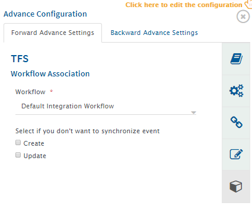

<code class="expression">space.vars.SITENAME</code> provides default workflow, which comes with default installation. If you want a customized workflow, please contact your sales/support point of contact.

* Select **Create** option if you don't want to synchronize new entities created in the source system.
* Select **Update** option if you don't want to synchronize those entities that are updated in the source system.

Click the **Integrate** button to complete the integration process.

## Event Detection & Generation

* The **Event Detection & Generation** feature is used to generate the events for the attributes/fields, which do not generate any history on entity updates.
* Many systems have the calculated attributes/fields, which are calculated at runtime.
  * For example, few systems have entity/artifact's placement data, which can be calculated at the runtime. Such field data can be changed due to reordering of entity/artifact (However, such reordering does not change the Last Modified Time in the system). Hence, by enabling this feature, <code class="expression">space.vars.SITENAME</code> can keep track of such attributes/fields and update entity in source system to generate the events for synchronization purpose.

**Supported Connectors**

1. [**IBM Rational DOORS**](../connectors/doors.md#event-detection-generation)

> **Note** :The feature will be visible only when DOORS is the source system in the integration.

Click the **Configure Advance** icon > Go to **Advance Configuration** pop-up > Select **Override parameters for read operations**. In that screen, the below options will appear.

| Input Name                  | Visible when                                          | Description                                                                                                                                          |
| --------------------------- | ----------------------------------------------------- | ---------------------------------------------------------------------------------------------------------------------------------------------------- |
| Configure Event Detection   | Source system supports the feature.                   | Select Yes if you want to enable the event detection of the events, which do not generate history on update; otherwise, select No.                   |
| Event Detection Field Name  | Yes is selected for 'Configure Event Detection' input | Select a field for event detection. If this field is modified, <code class="expression">space.vars.SITENAME</code> will generate additional update on the entity.             |
| Event Generation Field Name | Yes is selected for 'Configure Event Detection' input | Select a field to perform an update. <code class="expression">space.vars.SITENAME</code> will update this field to generate the history for data sync. OIM will overwrite it. |

> **Note** : Additional user credentials are required if the integration runs on the **history based synchronization**. Please check the respective connectors' documentation to check the user inputs.

## Fetch Mapped Data Only

By default, OIM fetches complete entity details from the end system. When **Fetch Mapped Data Only** is enabled, only mapped data (including fields, comments, attachments, links) will be fetched from end system.

**Note:** Enable this feature only when end system has 1000+ fields, and it slows down the end system when loading single entity.

> **Note** : Given feature is available only for selected connectors (Currently supported for [Jira](../connectors/jira.md#integration-configuration)) under additional license add-on. If you want to request for this feature, please contact your sales/support.

**Enable Fetch Mapped Data Only**

* For source end point:
  Click the **Configure Advance** icon > Go to **Advance Configuration** pop-up > Select **Override parameters for read operations** > Fetch Mapped Data Only.
* For target end point:
  Click the **Configure Advance** icon > Go to **Advance Configuration** pop-up > Select **Override parameters for write operations** > Fetch Mapped Data Only.

**Known behaviors due to inconsistency caused by the functionality**

* It is recommended not to use this feature when number of fields mapped are too high, as this can cause error in end system API invocation because of URL length limit.
* For failed events, newly added fields will not be retrieved if mapped data retrieval is enabled. One can fetch the missing data using reconciliation.
* If the end system does not support history or if current state sync is enabled, then data will be overwritten in the target end system upon adding a new field in the mapping configuration.
* If inline files added on an entity are stored as attachments in the end system, attachment sync is enabled, and the field having inline files is not mapped, then those inline files will be synced as attachments in target.
  * Later on, if the field containing inline image is mapped, then same attachment will be referred as inline file or attachment will be removed and added based on the end system attachment storage level.
* Conflict detection will not work as expected in the following scenario:
  * A field was initially mapped and field data was synced using OIM. Now that field is removed from the mapping and updates are synced. Later on, if that same field is mapped again, conflict detection will not work as expected and false conflict might be detected.

# Managing Integrations

Select a single integration, then click the **Options** button to perform the following actions on the integration:

  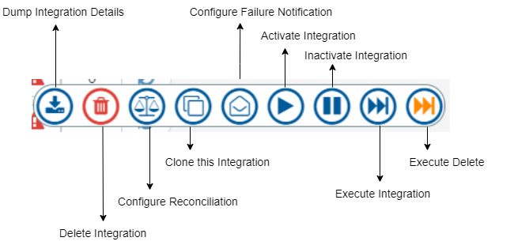

* **Dump Integration Data**: You will get a zip file named **IntegrationDetails.zip**.
  The zip file will contain the integration configurations, synchronization logs, mappings, and failure details. It will not include any sensitive data related to the integration user.
* **Delete Integration**: Delete the selected integration
* **Configure** [**Reconciliation**](reconcile.md): Set reconciliation rules
* **Clone Integration**: Create a copy of the selected integration
* **Failure Notification**: Allow <code class="expression">space.vars.SITENAME</code> to send failure notifications after the integration is active
* **Activate/Inactivate Integration**: Activate or Inactivate the selected integration
* **Execute Integration**: Click this to trigger the sync job for the selected integration manually
*   **Execute Delete Integration**: Click this to trigger the delete job for selected integration manually

    > **Note**: This button will only be visible when the integration is configured with delete sync.

  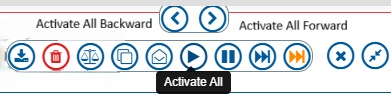

* **Action Buttons**
  * **Hover behavior:**
    * When you hover over the Activate, Inactivate, Execute, or Execute Delete buttons, two directional buttons (Forward / Backward) appear.
  * **Forward / Backward buttons:**
    * Apply the action in the selected direction only.
  * **Available actions:**
    * **Activate / Inactivate:** Activate or inactivate the integration in the selected direction.
    * **Execute:** Trigger a sync job for the selected direction.
    * **Execute Delete:** Trigger a delete job for the selected direction.

## How to edit Integration

**Edit Integration**: Open the integration in a view mode and get an option to edit it

> **Note** : Always inactivate an integration to be able to edit it.

  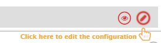

Some of these actions: Activate/Inactivate, Execute, Execute Delete, Merge Integration and Failure Notification can be performed as a bulk operation for multiple integrations. You can also select multiple integrations and move them to another folder.

# Bulk Edit Integration Groups

On the Integrations page, select multiple integration groups and hover on the **Actions** button to open the action bar as seen in the image below:

  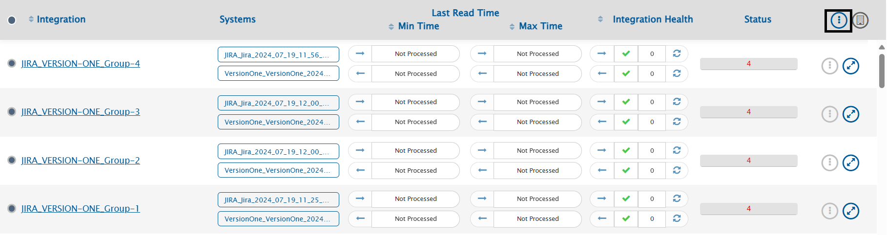

You will see a **Bulk Edit** button on the right side of the action bar. Hovering over the Bulk Edit button will provide you with three options as seen in the image below:

  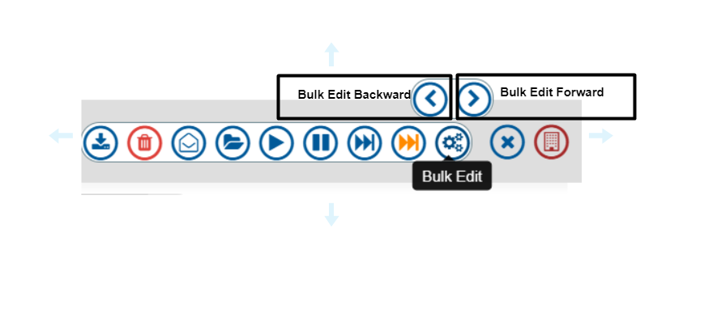

* **Bulk Edit Backward**: Configure the bulk edit settings in backward direction for the selected integration groups.
* **Bulk Edit Forward**: Configure the bulk edit settings in forward direction for the selected integration groups.
* **Bulk Edit**: Configure the bulk edit settings in bidirectional mode (Forward & backward directions) for the selected integration groups.
* **Action Bifurcations**: We can also now Activate/Inactivate/Execute/Execute Delete the integrations in Forward/Backward/Bidirectional direction for the selected integration groups.

Clicking the first three options will open the Bulk Edit Sidebar with your preferred direction selected for Bulk Edit operations.

  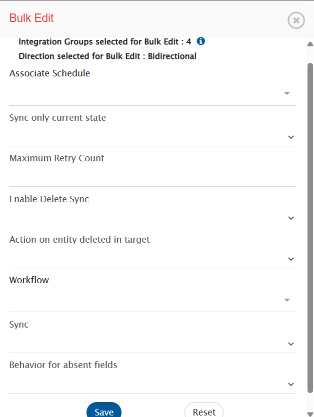

On top of the sidebar, you can see the count of selected integration groups. You can click the  button to open a dialog box displaying the names of selected integration groups. Click the 'close' button to close the dialog box.

  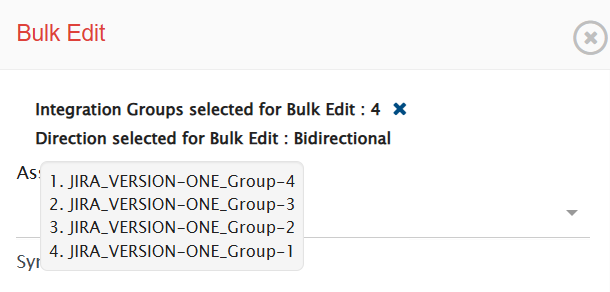

The Bulk Edit supports the following settings:

* [Associate Schedule](integration-configuration.md#associate-schedule)
* [Sync Only Current State](integration-configuration.md#sync-only-current-state)
* [Max Retry Count](integration-configuration.md#maximum-retry-count)
* [Enable Delete Sync](integration-configuration.md#enable-delete-sync)
* [Action on Entity Deleted in Target](integration-configuration.md#action-on-entity-deleted-in-target)
* [Workflow](integration-configuration.md#workflow-association)
* [Sync](integration-configuration.md#sync-new-failed-or-both-events)
* [Behaviour for absent fields](integration-configuration.md#behavior-for-absent-fields)

> **Note** :
> Only the settings that you change for the selected groups are committed.
