# Mapping Overview

Mapping is the process of defining the fields that are to be integrated between the given projects and entities of two systems. It is during the mapping stage that the flow of data (From System 1 to System 2, From System 2 to System 1 or bi-directional flow between System 1 and System 2) is also defined.  

In this section, you will learn how to configure a mapping between two systems and how to update or edit the mapping after configuration, if required.  

If the systems you want to map are not configured onto OpsHub Integration Manager, click the plus buttons [+] adjacent to System 1 and System 2 fields to configure the systems. Follow the steps given on [System Configuration](system-configuration.md) page to learn the steps to configure a system.  

In the image below, we show TFS and JIRA selected as the two systems.  


# Create a Mapping

- Once the systems are selected, on the Integration Configuration screen, click the the plus button [+] adjacent to **Select fields to be synced**.

- The Mapping Configuration form will open. You will be prompted to enter the **Mapping Name** and name of systems you want to map.
  - **Name:** Enter the name you want to assign to the mapping you are configuring
  - **System 1:** From the drop-down list, select the name of the first system you want to integrate
  - **System 2:** From the drop-down list, select the name of the second system you want to integrate


If you are coming from the integration page to the mapping page, the systems will be already selected.  

Once you select the systems involved in integration, other relevant fields such as **Project** and **Entity Type** (Issue Type) appear. These fields might differ from one system to another.

## Mapping the Fields

- From the **Project** drop-down lists, select the project that you want to integrate. For example, we select DemoProject in JIRA.
- From the **Issue/Entity Type** drop-down lists, select the relevant entity within the project that you want to integrate. For example, we select Bug in both the systems.
- Click the **Auto Map** button if you want OpsHub Integration Manager to automatically map the system fields with similar names. You can also additionally map more fields once Auto Mapping is completed.

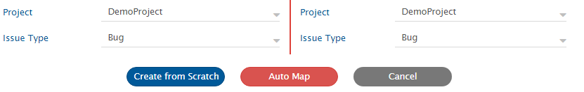

- Click **Create from Scratch** button to define the mapping from scratch. Search the fields from System 1 and System 2 that you want to map. Click them to select them.

## Define the Mode for Mapping Fields

Fields can be mapped for two different modes using the toggle button.  
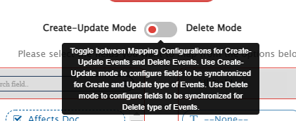

### Create-Update Mode

- This mode will be selected by default.
- The fields configured in this mode will be used for the synchronization of Create/Update type of events

#### Delete Mode

- The fields configured in this mode will be used for the synchronization of Delete type of events
- OpsHub Integration Manager cannot fetch any data from the end system for the entity which is deleted in the source system. Hence, [Default Target Field Mapping](#default-target-field-mapping) shall be done for each of the target fields to be mapped.
  - For more insights on the state of the source entity regarding Delete configuration, a read-only field named "OH Deletion Type" will be available:
    - This field will be of Lookup type.
    - Possible values for this field are as follows:
      - **NOT_ACCESSIBLE:**  
        - An entity will be tagged as "NOT_ACCESSIBLE" if it is deleted or OpsHub Integration Manager is unable to access it due to insufficient permissions.
      - **NOT_APPLICABLE:**  
        - An entity will be tagged as "NOT_APPLICABLE" if it has been moved to a project or entity type, whose configuration does not exist either in OpsHub Integration Manager or has certain criteria enabled. Moreover, that entity no longer meets the criteria.
- Three types of fields can be mapped to perform **Logical**, **Soft Delete**, and/or **Archive Operations** in this mode:
  1. The fields of the target entity to be updated to represent the **Logical Delete**
  2. The field to perform **Soft Delete** of the target entity
  3. The field to perform **Archive operation** on the target entity
- Soft Delete or Archive operations will be performed by default in the synchronization of the [Source Delete event](source-delete-synchronization.md) based on target system behavior.
  - From **version 7.181** onward, the **Archive Entity** feature is enabled by default in new installations.
  - However, when upgrading to **7.181 or later**, the functionality remains **disabled by default** to prevent unintended archival actions during the migration.
    - Follow these steps to activate the Archive Entity functionality post-upgrade:
      - Go to the **Mappings** page.
      - Remove the mapping from **None** to **OH_ARCHIVE**.
- To perform only the Logical Delete in target, the field corresponding to the Soft Delete or Archive operation should be mapped with default value 'No'. Example, for details on how to perform the logical delete operation in "Rally" endpoint, please refer to [Soft Delete Configuration](../connectors/rally.md#mapping-for-soft-delete-configuration).

- In [Entity Move Synchronization → Overview](entity-move-synchronization.md#overview), Deprecation will be performed in the target entity if the field corresponding to the Soft Delete or Archive operation are mapped with default value 'Yes'. If the field corresponding to Soft Delete or Archive operation is not mapped/mapped with default value "No", then the Logical delete will be performed based on the configured fields.

> **Note** : In both modes, you can also filter the fields as "All Fields", "Mandatory Fields", "Read Only Fields", "Custom Fields", and "System Fields".

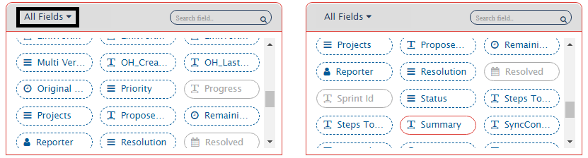

Here is how the mapping will look like:  


### Define the Flow of Data and Conditions to Synchronize It

- The mapped fields appear on the sliding pop-up on the right.
- In the pop-up, click the arrows under the **Flow** column to define the flow of data. Selecting both arrows signifies that the flow is bi-directional.  
  The default flow is bi-directional.
- **None** is generally used to put default values for fields on target side, which do not have relevant source field to be mapped. Click  to define the default value.

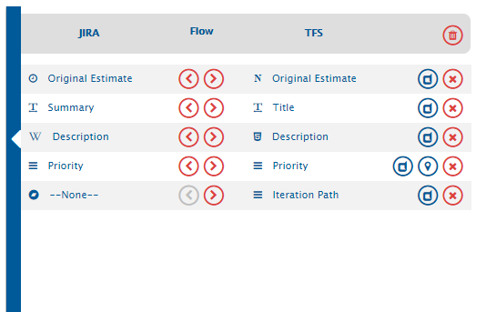

# Default Mapping

- There are two types of Default Mapping:
  1. [Default Value Mapping](#default-value-mapping)
  2. [Default Target Field Mapping](#default-target-field-mapping)

## Default Value Mapping

- Default Value Mapping is used to write default value to target field in case if there is no value coming from mapped source fields. Click  to define the default mapping. The Default Mapping pop-up opens.
- For user mapping, default value should be configured in form of user name or email as user name as expected by target end-point.
- For user mapping, default value will not be written to target even if matching user not found in target. Defaulting will be done only if nothing coming from mapped source field.
- For lookup value mapping, the default value is written to the target if the matching value is not found in the target.

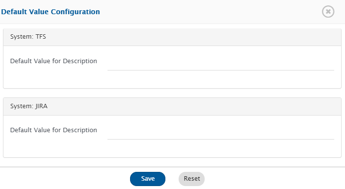

- Click **Save** button to save default value mapping.

## Default Target Field Mapping

- Default Target Field Mapping is used to write the default value to the target field in case there is no relevant source field to map
- For Default Target Field Mapping, "None" is used from the source endpoint.
  - After mapping "None" with the target field, the default value must be provided for that pair for field mapping using [Default Value Mapping](#default-value-mapping)
  - As the value remains constant during the synchronization, it is recommended to enable the "Overwrite" option when such default target field mapping is done with the [Sync When?](#sync-when) setting options, i.e., "Update"/"Both" or "Soft Delete" in [Create-Update Mode](#create-update-mode) or [Delete Mode](#delete-mode) respectively.

# Value Mapping

- Value Mapping is used to map the values for the Lookup Type fields. Click  to define the value mapping for all **Lookup Type** fields. The Value Mapping pop-up opens.
- A lookup field displays a list of values from which the user can choose.
- In the Value Mapping pop-up, select the relevant values for both the systems. Other actions that can be performed within Value Mapping tab are also listed in the image.

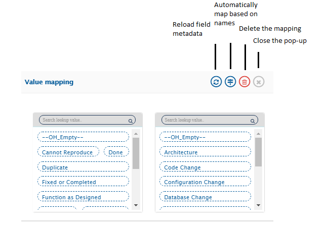

- Click **Save** button to save your selection.

## Value mapping using the Same As Integration option

- This option is available only for the "Projects" field.
- The project mapping is defined at the integration level in OpsHub Integration Manager. If there are no intended modifications in the project field's value mapping, the "Same as Integration" option within the value mapping can be used. This will avoid redundant project value mappings for the "Projects" field.

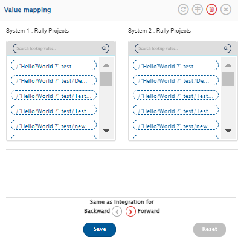

> **Note** : This option becomes available only if there is no default value configuration, one-to-one value mapping configuration, and advanced mapping configuration applied to the Projects field in the specified direction. Similarly, enabling this option in a specific direction will disable the default value configuration, one-to-one value mapping configuration, and advanced mapping configuration for that direction.

## Value Mapping using Excel sheet

- **There is a limitation in value mapping in lookup type of fields, i.e., a maximum of 100 values can be mapped.**
- If the user wants to map more than 100 values in lookup value mapping, then an Excel sheet can be used for this purpose.
- If there are a large number of values in a field to be mapped, then an Excel sheet is easier to use.
- Please refer to page [Excel Upload](excel-upload.md) for uploading excel sheet.

### Associate Excel File with Field Mapping

- The user can associate the excel file with the following field types:
  - Lookup, reference, and user fields.
- To associate excel file with the field mapping, user can select the excel icon as highlighted in the below screenshot:

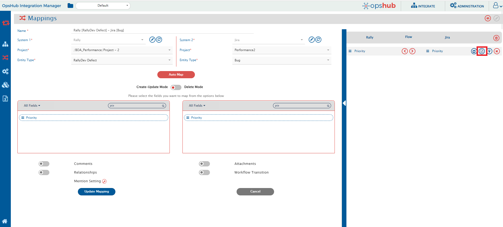

- On clicking the excel icon, the following form will appear:

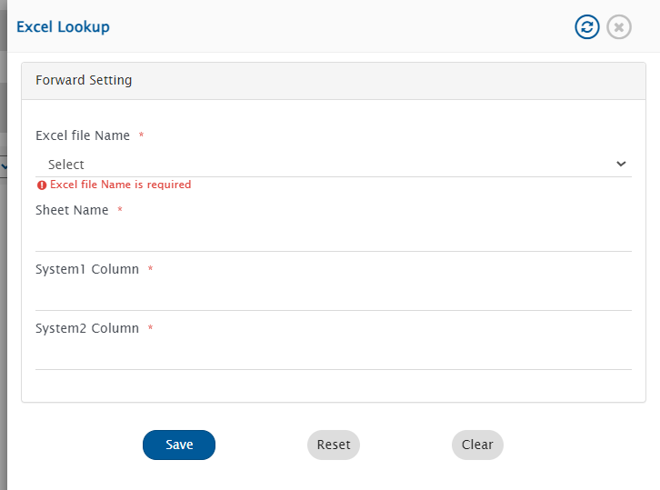

- An excel file can be selected from the drop-down menu:

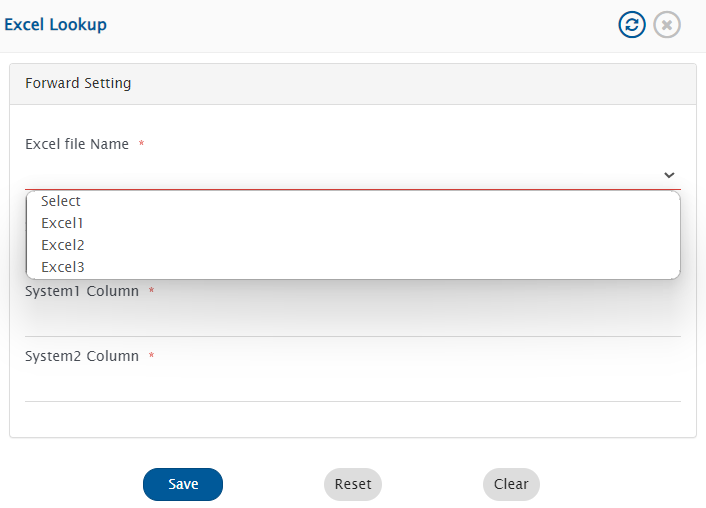

- In the sheet name, write the sheet name of the excel file containing the values.
- In system1 column, mention the column of the sheet which should be considered as source value.
- In system2 column, mention the column of the sheet which should be considered as target value.

### Configure Excel Mapping for Backward Direction

- If the fields are mapped bidirectionally, the checkbox for the same setting for backward direction will be there in the form:

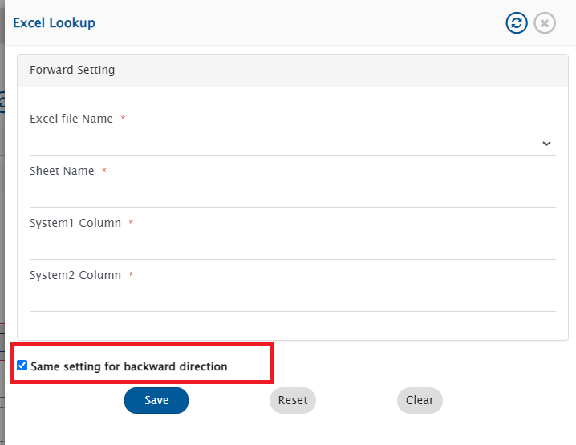

- If the checkbox option is selected, the same excel file and the same sheet will be used for the synchronization. The only difference is that the source column will be treated as the target column, and vice versa for backward direction sync.
- To configure different excels or different sheets in the backward direction, the user can uncheck the "same as backward direction" checkbox and configure different settings for the backward direction sync.
- It will open the the backward direction configuration form for the excel settings as shown in the screenshot below:

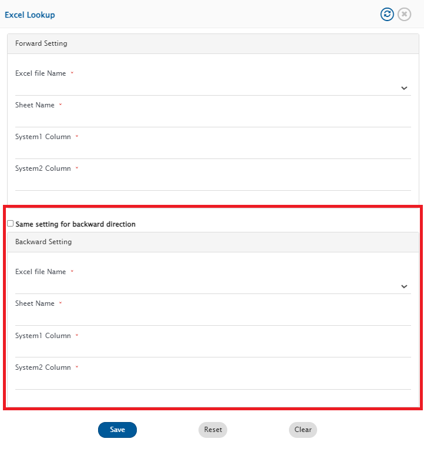

# View/Edit XSLT Configurations options

- Any field mapping created is saved in the XSLT language.
- View/Edit XSLT Configurations can be used to change the default mapping XSLT. Click  to change the default behaviour of a particular field mapping.
- User can customize default mapping XSLT using Advance mapping. For Advance mapping, OpsHub Integration Manager has some Utilities available. Refer to [Advance Mapping Utility](../manage/advance-mapping-utility.md) for Utilities.

## Defining Unicode for Element names

* The field names are normalized to be valid element names in XML. Some of the characters such as ~, @, #, ©, $, etc. are invalid XML characters and therefore, these characters are normalized when stored as XML.
* By default, when the 'View/Edit XSLT Configurations' is selected, then for a field name its element name is loaded in normalized format. So, if you want to perform customization on an element name that has invalid unicode character then first map the field and then from 'View/Edit XSLT Configurations' and then copy the field name. (You can remove this field mapping if it is not needed, as it was needed to get the field name.)
* If the field that you are using in advanced XSLT configuration is not available as a field in the available fields section, and if it contains invalid characters for element names, then you can add such invalid character in this format:  
  **`Ust__<<Unicode character Code>>__Uend`**  
  where `<<Unicode character Code>>` is character code in UTF-16.

**For example:**

* "Product©version" is the name of the field.
* **©** is an invalid character for element name.
* Now if this field is available as a part of list of fields, then you can get the element name by mapping the field and clicking . Copy this field name and it would not be an invalid character for element name as it will be in normalized format. (You can remove this field mapping if it is not needed, as it was only needed get the field name.)
* If this field containing character © is part of field name for which the advanced XSLT has to be configured and this field is not present in the field mapping, then the normalization of the © has to be done manually.
* For this, find the decimal Unicode for © which is 169. And now replace the place where © occurs with `Ust__169__Uend`.
* The final field name will be:  
  **`ProductUst__169__Uendversion`**

You can map attachments, comments and relationships between System 1 and System 2. You can also configure workflow transition between System 1 and System 2.

---

## Specifying Unicode for values in lookup fields

* Lookup field values containing special characters such as tab space (`\t`) are normalized for XML compatibility, as these characters are not directly supported in XML.
* By default, when 'View/Edit XSLT Configurations' option is selected, the fields values for a lookup field are loaded in normalized format.
* For advanced XSLT configuration of field values, if the value includes any of the aforementioned characters, you can manage them using the following format:  
  **`Ust_<<Unicode character Code>>_Uend`**  
  Here, `<<Unicode character Code>>` is the character code in UTF-16 decimal value.

**Examples of values normalization:**

* The source and target system contains value with a tab character. These values are mapped as follows:  
  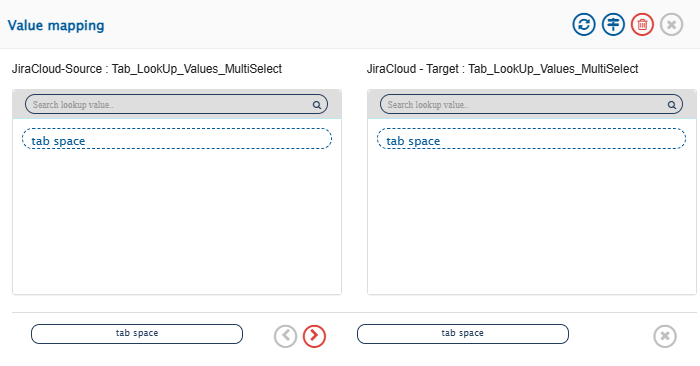

* Following is the advanced XSLT for the above mapped field values:

```xml
<xsl:when test="$xPathVariable='tab spaceUst_0009_Uend'">
  <xsl:value-of select="'tab spaceUst_0009_Uend'"/>
</xsl:when>
```

* Unicode character code of tab is **0009**


---

# Reference Field

## Synchronization behavior of reference field(s)

* The first synchronization will be performed based on the ID of the target entity synced by OpsHub Integration Manager.
* If no matching entity is found in the above step, then the synchronization will be performed based on the name of the entity.

## Synchronize default target value for reference field

* To synchronize "default target value" (irrespective of source field value) for the reference field, the advance mapping can be configured in OpsHub Integration Manager mapping.
* To perform this, `defaultTargetId` element needs to be mentioned in the advanced mapping of reference field.
* If the user has mentioned target internal id in the advance mapping and no entity match is found based on id and name based lookup, then this default value will be synchronized to the target end-system.

**XSLT snippet for single value reference field:**

```xml
<xsl:element xmlns:xsl="http://www.w3.org/1999/XSL/Transform" name="name">
  <xsl:value-of select="SourceXML/updatedFields/Property/SourceReferenceField/name"/>
</xsl:element>
<xsl:element xmlns:xsl="http://www.w3.org/1999/XSL/Transform" name="id">
  <xsl:value-of select="SourceXML/updatedFields/Property/SourceReferenceField/id"/>
</xsl:element>
<xsl:element xmlns:xsl="http://www.w3.org/1999/XSL/Transform" name="entityType">
  <xsl:value-of select="SourceXML/updatedFields/Property/SourceReferenceField/entityType"/>
</xsl:element>
<xsl:element xmlns:xsl="http://www.w3.org/1999/XSL/Transform" name="scope">
  <xsl:value-of select="SourceXML/updatedFields/Property/SourceReferenceField/scope"/>
</xsl:element>
<xsl:element xmlns:xsl="http://www.w3.org/1999/XSL/Transform" name="defaultlTargetId">
  <xsl:value-of select="123"/>
</xsl:element>
```

**XSLT snippet for multi valued reference field:**  
_(if decision to sync the entity is taken based on name)_

```xml
<xsl:for-each xmlns:xsl="http://www.w3.org/1999/XSL/Transform" select="SourceXML/updatedFields/Property/SourceReferenceField/com.opshub.eai.ReferenceValue">
  <fieldvalue op_type="Reference">
    <xsl:variable name="xPathVariable" select="./name"/>
    <xsl:choose>
      <xsl:when test="$xPathVariable='abc'">
        <xsl:element name="defaultTargetId">
          <xsl:value-of select="123"/>
        </xsl:element>
      </xsl:when>
      <xsl:when test="$xPathVariable='xyz'">
        <xsl:element name="defaultTargetId">
          <xsl:value-of select="456"/>
        </xsl:element>
      </xsl:when>
    </xsl:choose>
  </fieldvalue>
</xsl:for-each>
```

* Change the behavior of reference field synchronization:
  * If synchronization of the reference field needs to be done based on the default target ID only, then in that case all elements other than the default target ID should be removed.

---

## Synchronize reference field in case end system does not provide name of the referenced entity in Entity API and History API for base entity

* Following XSLT snippet can be used if name based synchronization is to be performed for reference field

```xml
<{fieldvalue} op_type="Reference">
  <xsl:variable xmlns:xsl="http://www.w3.org/1999/XSL/Transform" name="entityId" select="SourceXML/updatedFields/Property/fieldvalue/id"/>
  <xsl:variable xmlns:xsl="http://www.w3.org/1999/XSL/Transform" name="projectId" select="SourceXML/opshubProjectKey"/>
  <xsl:variable xmlns:xsl="http://www.w3.org/1999/XSL/Transform" name="entityTypeId" select={referencedentitytypeid}/>
  <xsl:variable xmlns:xsl="http://www.w3.org/1999/XSL/Transform" name="versionname" select="utils:getEntityFieldValue($workflowId,$sourceSystemId,$projectId, $entityTypeId, $entityId,{entityNameFieldName})"/>
  <xsl:element xmlns:xsl="http://www.w3.org/1999/XSL/Transform" name="name">
    <xsl:value-of select="$versionname"/>
  </xsl:element>
  <xsl:element xmlns:xsl="http://www.w3.org/1999/XSL/Transform" name="id">
    <xsl:value-of select="SourceXML/updatedFields/Property/{fieldvalue}/id"/>
  </xsl:element>
  <xsl:element xmlns:xsl="http://www.w3.org/1999/XSL/Transform" name="entityType">
    <xsl:value-of select="SourceXML/updatedFields/Property/{fieldvalue}/entityType"/>
  </xsl:element>
  <xsl:element xmlns:xsl="http://www.w3.org/1999/XSL/Transform" name="scope">
    <xsl:value-of select="SourceXML/updatedFields/Property/{fieldvalue}/scope"/>
  </xsl:element>
</{fieldvalue}>
```

**For example**, if in a entity if referenced entity type is **Sprint** and the field id of the reference field is **customfield_10103** and name field of the referenced entity is **Name**, the XSLT would be as follows:

```xml
<customfield_10103 op_type="Reference">
  <xsl:variable xmlns:xsl="http://www.w3.org/1999/XSL/Transform" name="entityId" select="SourceXML/updatedFields/Property/customfield__10103/id"/>
  <xsl:variable xmlns:xsl="http://www.w3.org/1999/XSL/Transform" name="projectId" select="SourceXML/opshubProjectKey"/>
  <xsl:variable xmlns:xsl="http://www.w3.org/1999/XSL/Transform" name="entityTypeId" select="'Sprint'"/>
  <xsl:variable xmlns:xsl="http://www.w3.org/1999/XSL/Transform" name="versionname" select="utils:getEntityFieldValue($workflowId,$sourceSystemId,$projectId, $entityTypeId, $entityId,'Name')"/>
  <xsl:element xmlns:xsl="http://www.w3.org/1999/XSL/Transform" name="name">
    <xsl:value-of select="$versionname"/>
  </xsl:element>
  <xsl:element xmlns:xsl="http://www.w3.org/1999/XSL/Transform" name="id">
    <xsl:value-of select="SourceXML/updatedFields/Property/customfield__10103/id"/>
  </xsl:element>
  <xsl:element xmlns:xsl="http://www.w3.org/1999/XSL/Transform" name="entityType">
    <xsl:value-of select="SourceXML/updatedFields/Property/customfield__10103/entityType"/>
  </xsl:element>
  <xsl:element xmlns:xsl="http://www.w3.org/1999/XSL/Transform" name="scope">
    <xsl:value-of select="SourceXML/updatedFields/Property/customfield__10103/scope"/>
  </xsl:element>
</customfield_10103>
```


---

# Comments

The following video shows how to configure comments synchronization during integration configuration:


* Slide the button adjacent to **Comments** to the right to map comments.
* The comments mapping will automatically enable comment author impersonation for supported systems. For more details, refer to Read the [Comment Author Impersonation](comment-author-impersonation.md) section.
* Comment time impersonation is not supported by OpsHub Integration Manager via comment mapping.

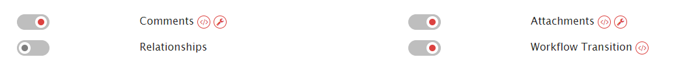

* Click the (</>) icon to define comments mapping.
* Map the correct fields and define the flow by selecting backward (<), forward (>), or bi-directional (<-->) arrows.
* As you can see in the screenshot below, you can map public reply and internal notes as well. You can also include author details and/or comment-time in the comment.

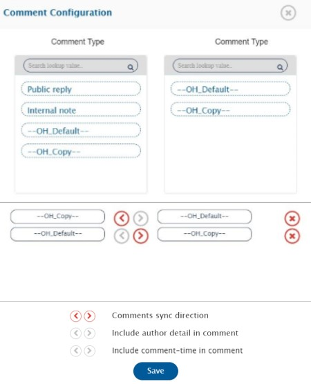

* Click the edit icon (right icon) to edit comments XSLT.


# Attachments

The following video shows how to configure attachments synchronization during integration configuration:


* Slide the button adjacent to **Attachments** to the right to map attachments.


* Click the (</>) icon to define mapping.
* Map the correct fields and define the flow by selecting backward (<), forward (>), or bi-directional (<-->) arrows.
* As you can see in the screenshot below, you can map status, projects, and priority for the attachments.


* Click the edit icon (right icon) to edit attachments XSLT.

# Relationships

Watch the following video to learn more about Relationships Mapping from one system to another:


Relationship synchronizes the relationship between the selected entities.

* Slide the button adjacent to **Relationships** to the right.
* Click the edit icon. The **Relationships** form opens on the right.
* Link Type mapping will be displayed by default.

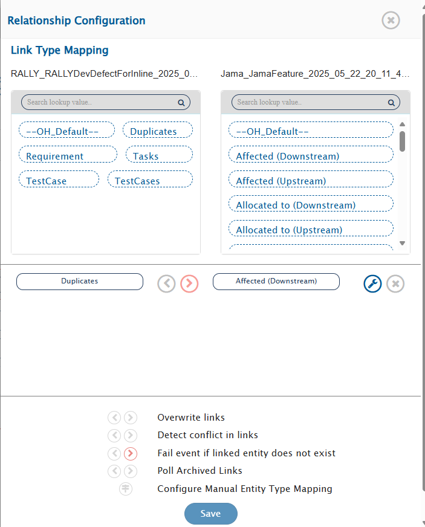

* Select the link types from the corresponding boxes in both systems by clicking them. For example, in the link type tab, we select Duplicates from System 1 and Affected from System 2. The arrows between the link types define the flow. If you want to enable a bi-directional flow, click both the arrows.

Click the edit icon against the link type for which you need to set default link. The 'Default Link Settings' option is applicable to any link type, not necessary to only mandatory link.

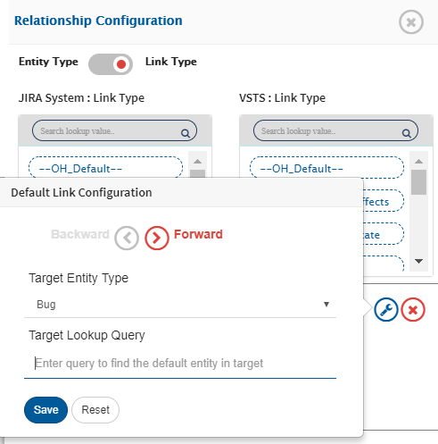

Read in detail about [Default Link Settings](default-link-settings.md) here.

* Enable the **Overwrite links** option when you want to replace the links in one system from the links coming from the other system. Select the arrow to define which system should be allowed to overwrite the links.  
* Enable the **Detect conflicts in links** option to diagnose any discrepancies between the links in the integrated system. If you want to enable a bi-directional conflict detection, click both the arrows.  
* Select the **Fail event if linked entity doesn't exist** option to fail the event when the linked entity doesn't exist in the target system. If you want to enable this feature bidirectionally, click both the arrows.  
* Select the **Poll archived links** option to retrieve archived links from end system. If you want to enable this feature bidirectionally, click both the arrows.  

## Entity Type Mapping

* OIM automatically identifies the target linked entity type in most cases. However, if you need to configure entity type mapping manually, follow the steps below.
* Click on **Manual Entity Type Mapping** to manually configure or adjust the mappings.
  * This opens a new window where you can map entity types from both systems, similar to how link types are mapped.
  * For example, you can map an entity like **Bug** in System 1 to **Defect** in System 2.

**When manual entity type mapping may be required:**

* In a **one-to-many mapping** scenario — for example, one integration maps **Bug** to **Defect**, and another maps **Bug** to **Case**.
* In such cases, OIM must know which target linked entity type to use (e.g., **Defect** or **Case**), and manual mapping is necessary to specify the intended target.

**Note:** The **Bypass Link Entity Type Mapping** add-on is required in your license to enable manual entity type mapping.

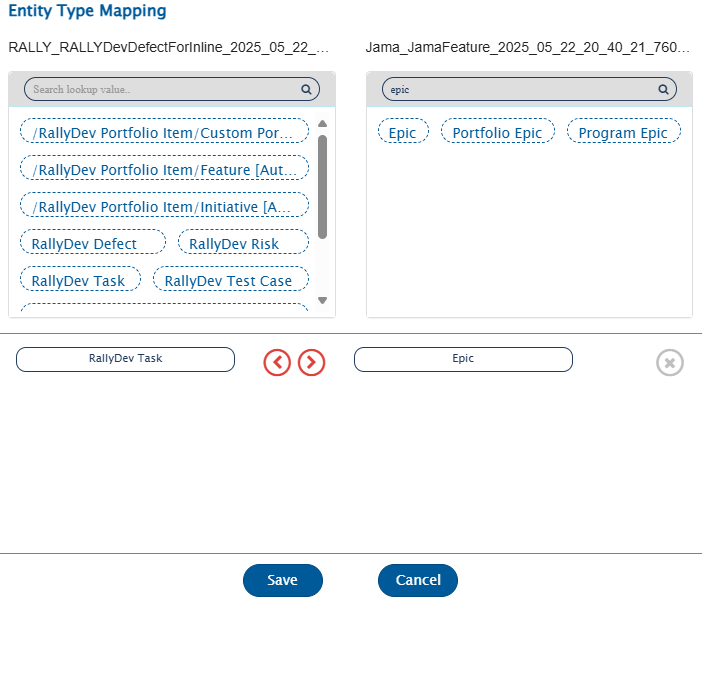

# Workflow Transition

**Workflow transition** is a feature supported by OpsHub Integration Manager wherein the user can configure OpsHub Integration Manager to automatically handle workflow transition of an entity as per requirement.

For example, consider a system in which Transition Workflow exists, a certain state is only accessible from a certain specific state or a new item can only exist in a new default state. Another example can be a requirement in which a state a field has to be assigned a value. If the value for that field is not assigned in that specific state, then it will result into error. In such circumstances, synchronizing entities from a system that does not enforce Transition Workflow to the target system is cumbersome.

To solve this problem, OpsHub Integration Manager allows the user to configure Workflow Transition Handling. Some systems provide workflow transition information through API. For these systems, the workflow transition information is picked from the API by default. Irrespective of the availability of the workflow transition through API, user can configure Workflow Transition by providing the information through XSL.

* Slide the button adjacent to **Workflow Transition** to the right.
* Click the (</>) icon to edit the workflow transition XSL. A default sample XSL is loaded using which a user can build his own XSL as per his requirement.

**Workflow Behaviour for Workflow Transition when the reference field is added as a dependent field:**

* If the dependent field added in the workflow transition is the reference field type, then by default, the lookup for the target entity will be done based on a name basis.
* If the user wants to perform target lookup based on the target entity id, they can achieve this by specifying the attribute `"lookupBy"` in the dependent field. For more details, refer to [Reference Field Working](mapping-configuration#reference-field).


* Given below is the template for Advance Transition XSL.

**Workflow transition** is a feature supported by OpsHub Integration Manager wherein the user can configure OpsHub Integration Manager to automatically handle workflow transition of an entity as per requirement.

For example, consider a system in which Transition Workflow exists, a certain state is only accessible from a certain specific state or a new item can only exist in a new default state. Another example can be a requirement in which a state a field has to be assigned a value. If the value for that field is not assigned in that specific state, then it will result into error. In such circumstances, synchronizing entities from a system that does not enforce Transition Workflow to the target system is cumbersome.

To solve this problem, OpsHub Integration Manager allows the user to configure Workflow Transition Handling. Some systems provide workflow transition information through API. For these systems, the workflow transition information is picked from the API by default. Irrespective of the availability of the workflow transition through API, user can configure Workflow Transition by providing the information through XSL.

* Slide the button adjacent to **Workflow Transition** to the right.
* Click the (</>) icon to edit the workflow transition XSL. A default sample XSL is loaded using which a user can build his own XSL as per his requirement.

**Workflow Behaviour for Workflow Transition when the reference field is added as a dependent field:**

* If the dependent field added in the workflow transition is the reference field type, then by default, the lookup for the target entity will be done based on a name basis.
* If the user wants to perform target lookup based on the target entity id, they can achieve this by specifying the attribute `"lookupBy"` in the dependent field. For more details, refer to [Reference Field Working](mapping-configuration#reference-field)


* Given below is the template for Advance Transition XSL.

```xml
<FieldTransitions>
  <FieldTransition>
    <transitionName>transitionName 1</transitionName>
    <fromField>field1</fromField>
    <toField>field1</toField>
    <sourceValue/>
    <targetValue>value1</targetValue>
    <defaultTransition>true</defaultTransition>
  </FieldTransition>
  <FieldTransition>
    <transitionName>transitionName 2</transitionName>
    <fromField>field1</fromField>
    <toField>field2</toField>
    <sourceValue>value1</sourceValue>
    <targetValue>value2</targetValue>
    <dependentFields>
      <dependentField>
        <fieldName>dependent field 1</fieldName>
        <possibleTargetValues>
          <possibleValue>value A1</possibleValue>
          <possibleValue>value B1</possibleValue>
          <possibleValue>value C1</possibleValue>
        </possibleTargetValues>
        <defaultValue>value A1</defaultValue>
      </dependentField>
      <dependentField lookupBy="defaultTargetId">
        <fieldName>dependent field 2</fieldName>
        <possibleTargetValues>
          <possibleValue>Id 1</possibleValue>
          <possibleValue>Id 2</possibleValue>
          <possibleValue>Id 3</possibleValue>
        </possibleTargetValues>
        <defaultValue>Id 1</defaultValue>
      </dependentField>
    </dependentFields>
  </FieldTransition>
</FieldTransitions>
```

* The tags shown in the image are explained below:
  * `<FieldTransition>` : Contains the information regarding a field transition
    * `<transitionName>` : Transition name for the individual transition
    * `<fromField>` : Field internal name from which transition is made
    * `<toField>` : Field internal name to which transition is made
    * `<sourceValue>` : Value from which the transition is made
    * `<targetValue>` : Value to which transition is made
    * `<defaultTransition type="string">` : When `true`: The field transition under which this is defined is set as the default transition. The attribute `type` is optional. In case of multi-valued fields, provide `type="string-array"`.
    * `<dependentField>` : These fields have to be changed when the `<toField>` is changed to a particular value.
      * `lookupBy="defaultTargetId"` : This attribute is used to perform lookup by using Id of the target entity.
      * `<fieldName>` : field internal name that is a dependent field.  
        _If Comment is mandatory for the transition, user can mention `OH_Dependent_Comments` as a dependent field in XML._
      * `<possibleTargetValues>` : These values are the values that are available after the field is transformed to `<targetValue>`.
        * `<possibleValue>` : Used for pre-validation of the possible values available in the target end system. Optional. If specified, OpsHub Integration Manager will validate and fail if incoming value is not in this list.
      * `<defaultValue>` : Default value that is to be selected from the list of possible values. If this is not defined then the first `<possibleValue>` is selected.
      * `<defaultValues>` : Default values that are to be selected when the field type is multi-valued.
        * `<string>` : When your field type is multi-valued, provide multiple values as: `<string>value</string>`

**Example of multi-valued type field:**

```xml
<dependentField type="string-array">
  <fieldName>Countries</fieldName>
  <defaultValues>
    <string>IN</string>
    <string>UK</string>
  </defaultValues>
</dependentField>
```

**Example of OH_Dependent_Comments field:**

```xml
<dependentField>
  <fieldName>OH_Dependent_Comments</fieldName>
  <defaultValue>Default comment for Transition</defaultValue>
</dependentField>
```

**Example of lookupBy="defaultTargetId":**

```xml
<dependentField type="string-array" lookupBy="defaultTargetId">
  <fieldName>Multi Select Version2</fieldName>
  <defaultValues>
    <string>10908</string>
    <string>10909</string>
  </defaultValues>
</dependentField>
```

> **Note** : All the values provided for Advance Transition XSL are related to the target system.  
> **Note** : `<fromField>` and `<toField>` refer to the same field, provided end system's transition flow is configured on a single transition field. Otherwise, they refer to different fields as per the end system's transition flow.

* If the Workflow Transition is configured, then during the integration, the transition of entities based on incoming values is done automatically by OpsHub Integration Manager. This makes it easier to synchronize such systems.
* Now, click **Create Mapping** button to create the mapping.

---

## Workflow Transition Example

Suppose the possible status transition(s) of Jira system is:

- Open  
- Open → Active  
- Active → Resolved  
- Resolved → Closed  

Below is workflow transition XML configuration sample for OpsHub Integration Manager for above possible end system transitions.

```xml
<FieldTransitions>
  <FieldTransition>
    <transitionName>transitionName 1</transitionName>
    <fromField>status</fromField>
    <toField>status</toField>
    <sourceValue/>
    <targetValue>Open</targetValue>
    <defaultTransition>true</defaultTransition>
  </FieldTransition>
  <FieldTransition>
    <transitionName>transitionName 2</transitionName>
    <fromField>status</fromField>
    <toField>status</toField>
    <sourceValue>Open</sourceValue>
    <targetValue>Active</targetValue>
  </FieldTransition>
  <FieldTransition>
    <transitionName>transitionName 3</transitionName>
    <fromField>status</fromField>
    <toField>status</toField>
    <sourceValue>Active</sourceValue>
    <targetValue>Resolved</targetValue>
  </FieldTransition>
  <FieldTransition>
    <transitionName>transitionName 4</transitionName>
    <fromField>status</fromField>
    <toField>status</toField>
    <sourceValue>Resolved</sourceValue>
    <targetValue>Closed</targetValue>
  </FieldTransition>
</FieldTransitions>
```


# Known Behavior and Limitations

* If comment is mandatory on state/status transitions and user has configured the `OH_Dependent_Comments` in workflow transition XML, the N number of comment from source will be processed with N number of transition in target. If there is no comment coming from the source, default comment [mentioned in the Workflow transition XML] will be synced to the target system.

**E.g.,**

* Source system: State changed new => close.
* Source comments:  
  * Comment 1: "Comment added for testing1"  
  * Comment 2: "Comment added for testing2"
* Target system: New => Close is not allowed. Transition needs to be performed as New => Active => Close. For New => Active and Active => Close transitions the comments are mandatory, hence, the `OH_Dependent_Comments` is configured in OpsHub Integration Manager.

**--- After the sync ---**

* Target system:
  * New => Active, and comment added: "Comment added for testing1"
  * Active => Close, and comment added: "Comment added for testing2"

**Note:** Currently, only Jira and Windchill RV&S as the target systems support using such dependent `OH_Dependent_Comments` along with the transitions.

# Mention Setting

## Overview

**Mention Synchronization** is a feature supported by **OpsHub Integration Manager** which allows users to synchronize the entity mentioned and user mentioned data from source end system to target end system.

End user can edit this **Mention Setting** in **OpsHub Integration Manager** to configure the mention sync option. This configuration is applicable to synchronization of entity mentioned. **OpsHub Integration Manager** supports three ways to synchronize the entity mentioned data to target end system.

## Mention Configuration

**Mention Sync Option**

* **Option1: Source entity id**  
  This option will synchronize the source id corresponding to source's mentioned entity in the target end system.

* **Option2: Source entity url**  
  If none of the options is configured, then this will be the default selected option. This option will synchronize the source entity URL corresponding to source's mentioned entity in the target end system.

* **Option3: Mentioned target entity (if found) else redirection via opshub**  
  This option will synchronize the entity mentioned in the target system if the target system supports the entity mention. Otherwise, this option will synchronize the target entity link. If the mentioned entity is not synchronized to the target system, then this option will synchronize the OpsHub redirection URL to redirect to the desired (source or target) entity whenever the user clicks on this URL. For this option, it is mandatory to provide the **OpsHub Base URI** against OpsHub system, otherwise sync error will be encountered.

> **Note** : In case the redirection via OpsHub option is set in the Mention Setting of the **OpsHub Integration Manager** mapping, then if the requests by a particular client (host) exceed the threshold request count within threshold time, then further requests from same client will result in HTTP error "429 Too many requests". This error indicates that further requests from this client will be blocked for a predefined interval. Refer to the response header(s) for more details or contact OpsHub support in case any configuration changes are required for this setting.

**Mention Prefix Text**

* This is a non-mandatory input. If any prefix text is configured, then the prefix will be added before the mention value getting synced to the target end system for entity mention. The given prefix text will not be considered when the mention value written in the target is an OpsHub redirection URL.

## How to Enable Entity Mention Sync for Existing Mapping

* Applicable when source system is any of the [**supported connector(s)**](#supported-connectors):
  * Edit **OpsHub Integration Manager** mapping and remap the field(s) where the source field type is Rich Text (HTML or Wiki) and remap comments.
  * Edit **OpsHub Integration Manager** mapping and remap comments.

> **Note** : To enable entity mention synchronization for supported systems, it is required to remap applicable field(s) and comments after upgrading **OpsHub Integration Manager** to version 7.146 or above. Otherwise, mentioned entity ID of source will sync to the target system. Additionally, further updates from corresponding target field will overwrite the source mentioned entity with source mentioned ID.

## Mention Sync Setting View

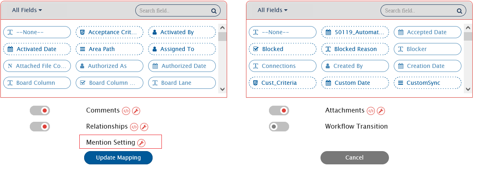
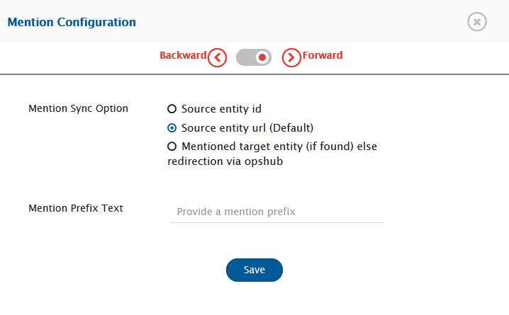


## Entity Mention Sync Example

Say, for example, if the rich text field **description** of the source end system is mapped to target **repo-steps** field, and the source end system supports entity mention.

> **Note** : **Defect101** is a mentioned entity in source end system with internal id 101 and display id Defect101.  
> **Note** : **DefectT101** is the target entity corresponding to source mentioned entity Defect101.

### When entity mention is supported for both mapped field of source and target end system

| Description value        | Is mentioned entity synchronized to target? | Target field type | Repo-Steps with Option1 | Repo-Steps with Option2 | Repo-Steps with Option3 |
|--------------------------|---------------------------------------------|--------------------|--------------------------|--------------------------|--------------------------|
| `#Defect101`             | Yes                                         | HTML               | Defect101                | [Defect101](https://source-end-host:port/SourceProject1/_workitems/edit/101) | [#DefectT101](https://target-endpoint:port/TargetProject1/_workitems/edit/T101) |
| `#Defect101`             | No                                          | HTML               | Defect101                | [Defect101](https://source-end-host:port/SourceProject1/_workitems/edit/101) | [OHDefect101](https://oim-host:8989/OpsHubWS/mentionsync?src_mention_sync_id={no}&tgt_host_entity_info_id={no}) |
| `#Defect101`             | Yes                                         | WIKI               | Defect101                | [Defect101](https://source-end-host:port/SourceProject1/_workitems/edit/101) | [#DefectT101](https://target-endpoint-host:port/TargetProject1/_workitems/edit/T101) |
| `#Defect101`             | No                                          | WIKI               | Defect101                | [Defect101](https://source-end-host:port/SourceProject1/_workitems/edit/101) | [OHDefect101](https://oim-host:8989/OpsHubWS/mentionsync?src_mention_sync_id={no}&tgt_host_entity_info_id={no}) |
| `#Defect101`             | Yes                                         | Text               | Defect101                | https://source-end-host:port/SourceProject1/_workitems/edit/101 | https://target-endpoint-host:port/TargetProject1/_workitems/edit/T101 |
| `#Defect101`             | No                                          | Text               | Defect101                | https://source-end-host:port/SourceProject1/_workitems/edit/101 | https://oim-host:8989/OpsHubWS/mentionsync?src_mention_sync_id={no}&tgt_host_entity_info_id={no} |

### When entity mention is supported for target end system but not for target mapped field

| Description value        | Is mentioned entity synchronized to target? | Target field type | Repo-Steps with Option1 | Repo-Steps with Option2 | Repo-Steps with Option3 |
|--------------------------|---------------------------------------------|--------------------|--------------------------|--------------------------|--------------------------|
| `#Defect101`             | Yes                                         | HTML               | Defect101                | [Defect101](https://source-end-host:port/SourceProject1/_workitems/edit/101) | [DefectT101](https://target-endpoint:port/TargetProject1/_workitems/edit/T101) |
| `#Defect101`             | No                                          | HTML               | Defect101                | [Defect101](https://source-end-host:port/SourceProject1/_workitems/edit/101) | [OHDefect101](https://oim-host:8989/OpsHubWS/mentionsync?src_mention_sync_id={no}&tgt_host_entity_info_id={no}) |
| `#Defect101`             | Yes                                         | WIKI               | Defect101                | [Defect101](https://source-end-host:port/SourceProject1/_workitems/edit/101) | [DefectT101](https://target-endpoint-host:port/TargetProject1/_workitems/edit/T101) |
| `#Defect101`             | No                                          | WIKI               | Defect101                | [Defect101](https://source-end-host:port/SourceProject1/_workitems/edit/101) | [OHDefect101](https://oim-host:8989/OpsHubWS/mentionsync?src_mention_sync_id={no}&tgt_host_entity_info_id={no}) |


## Entity Mention Sync Behaviour

* If source system supports entity mention, but the target system does not support it:
  * Mentioned entity from the source system will sync to the target system, as per the mention sync option configured in **OpsHub Integration Manager**.
  * It is recommended to configure either Option 1 or Option 2. Otherwise, the following sync failure will occur:  
    `"entity mention synchronization with opshub redirection url is not supported for the target end system, so to retry this failure edit the mapping to change the mention sync setting to other than opshub redirection url."`

* If source mapped field supports entity mention, but target mapped field does not:
  * Mentioned entity from source rich text field will synchronize to target system as per the mention sync option configured and target data type.

* If default mapping generated for entity mention for field/comment is removed:
  * Source entity ID of mentioned entity will synchronize to target field irrespective of the mention sync option configured.
  * Further, any updates from target field will overwrite the mentioned entity tag in source system with mentioned entity ID of source.

> **Note** : It is not recommended to alter or edit the default generated entity mentioned mapping for fields/comments other than removing whole mapping or setting empty tag.

## Entity Mention Sync Limitation

* Bidirectional sync of the Entity Mention is **not supported** in the below-mentioned cases:
  * If "sync Source Id" option is configured in the mention setting in **OpsHub Integration Manager**.
    * In this case, any updates from the target field will overwrite the source mentioned entity tag with source mentioned entity ID.
  * If source system rich-text field is mapped with text type field of the target system in **OpsHub Integration Manager**.
    * In this case, updates from target field will overwrite the source mentioned entity tag with value from target irrespective of mention sync option configured.
  * When integration is running in reconciliation mode then entity mention synchronization is supported only for the [**supported connector(s)**](#supported-connectors).

## Supported Connector(s)

Entity mention sync is supported only when the following systems are configured as the source in **OpsHub Integration Manager**:

1. [**Team Foundation Server ALM and Azure DevOps Services**](../connectors/team-foundation-server.md#EntityMentionSync)
2. [**Codebeamer**](../connectors/codebeamer.md#entityMentionSync)
3. [**CodebeamerX**](../connectors/codebeamerX.md#entityMentionSync)
4. [**Rally**](../connectors/rally.md#entityMentionSync)
5. [**Jira**](../connectors/jira.md#entityMentionSync)
6. [**GitHub**](../connectors/gitHub.md#entityMentionSync)

## User Mention Configuration When User Search On Email Not Supported

*If source system or target system doesn't support user search on Email API then the default XSLT needs to be changed.*

**Sample 1** – If the username in both source and target end systems are same.
```xml
<{fieldvalue}-dot-ohusermention>
  <xsl:for-each xmlns:xsl="http://www.w3.org/1999/XSL/Transform" select="SourceXML/updatedFields/Property/{fieldvalue}-dot-ohusermention/com.opshub.eai.metadata.UserMeta">
    <xsl:element name="{concat('UserMention_',position())}">
      <uuid>
        <xsl:value-of select="uuid"/>
      </uuid>
      <xsl:choose>
        <xsl:when test="userName">
          <xsl:variable name="userNameTarget" select="userName"/>
          <xsl:choose>
            <xsl:when test="$userNameTarget!=''">
              <userFound>
                <xsl:value-of select="'yes'"/>
              </userFound>
              <userName>
                <xsl:value-of select="$userNameTarget"/>
              </userName>
            </xsl:when>
          </xsl:choose>
        </xsl:when>
        <xsl:otherwise>
          <userFound>
            <xsl:value-of select="'no'"/>
          </userFound>
          <userName>
            <xsl:value-of select="userDisplayName"/>
          </userName>
        </xsl:otherwise>
      </xsl:choose>
    </xsl:element>
  </xsl:for-each>
</{fieldvalue}-dot-ohusermention>
```
**The `{fieldvalue}` should be replaced with the corresponding mapped field.**

**Sample 2** – This is an Excel mapping example where we need to have an Excel file which will have one-to-one user mapping. This will get the username of a user in target end system corresponding to the source system user's username from Excel sheet.
``` xml
<{fieldvalue}-dot-ohusermention>
  <xsl:for-each xmlns:xsl="http://www.w3.org/1999/XSL/Transform" select="SourceXML/updatedFields/Property/{fieldvalue}-dot-ohusermention/com.opshub.eai.metadata.UserMeta">
    <xsl:element name="{concat('UserMention_',position())}">
      <uuid>
        <xsl:value-of select="uuid"/>
      </uuid>
      <xsl:choose>
        <xsl:when test="userName">
          <xsl:variable name="userNameTarget" select="excel:lookup({Excel Id},'{Sheet Name}','{System1 Column}','{System2 Column}',userName)"/>
          <xsl:choose>
            <xsl:when test="$userNameTarget!=''">
              <userFound>
                <xsl:value-of select="'yes'"/>
              </userFound>
              <userName>
                <xsl:value-of select="$userNameTarget"/>
              </userName>
            </xsl:when>
          </xsl:choose>
        </xsl:when>
        <xsl:otherwise>
          <userFound>
            <xsl:value-of select="'no'"/>
          </userFound>
          <userName>
            <xsl:value-of select="userDisplayName"/>
          </userName>
        </xsl:otherwise>
      </xsl:choose>
    </xsl:element>
  </xsl:for-each>
</{fieldvalue}-dot-ohusermention>
```
In given excel mapping, in Sheet1 the column A will contain username of source system and column B will contain the username target system corresponding to source username for which user mention needs to be done.

The `{fieldvalue}`, `{Excel Id}`, `{Sheet Name}`, `{System1 Column}`, `{System2 Column}` should be replaced with the corresponding mapped field and excel upload details.  
Example for excel mapping: `excel:lookup(1,'Sheet1','A','B',userName)`

**Sample 3** – This is excel mapping example where we need to have an excel file which will have one-to-one user mapping. This will get the username of a user in target end system corresponding to the source system user email address from excel sheet.
```xml
<{fieldvalue}-dot-ohusermention>
  <xsl:for-each xmlns:xsl="http://www.w3.org/1999/XSL/Transform" select="SourceXML/updatedFields/Property/{fieldvalue}-dot-ohusermention/com.opshub.eai.metadata.UserMeta">
    <xsl:element name="{concat('UserMention_',position())}">
      <uuid>
        <xsl:value-of select="uuid"/>
      </uuid>
      <xsl:choose>
          <xsl:when test="userEmail">
          <xsl:variable name="emailTarget" select="excel:lookup({Excel Id},'{Sheet Name}','{System1 Column}','{System2 Column}',userEmail)"/>
          <xsl:choose>
            <xsl:when test="$emailTarget!=''">
              <userFound>
                <xsl:value-of select="'yes'"/>
              </userFound>
              <userName>
                <xsl:value-of select="$emailTarget"/>
              </userName>
            </xsl:when>
          </xsl:choose>
        </xsl:when>
        <xsl:otherwise>
          <userFound>
            <xsl:value-of select="'no'"/>
          </userFound>
          <userName>
            <xsl:value-of select="userDisplayName"/>
          </userName>
        </xsl:otherwise>
      </xsl:choose>
    </xsl:element>
  </xsl:for-each>
</{fieldvalue}-dot-ohusermention>
```
In given excel mapping, in Sheet1 the column A will contain userEmail address of source system and column B will contain the username target system.

The `{fieldvalue}`, `{Excel Id}`, `{Sheet Name}`, `{System1 Column}`, `{System2 Column}` should be replaced with the corresponding mapped field and excel upload details.  
Example for excel mapping: `excel:lookup(1,'Sheet1','A','B',userName)`

## User Field Configuration When User Search On Email Not Supported

If source system or target system doesn't support user search on Email API then the default XSLT needs to be changed. Below are some sample XSLT that can be configured according to given use case.

**Sample 1** – This mapping will work when username in both source and target end systems are same.
```xml
<{fieldvalue}>
  <xsl:choose xmlns:xsl="http://www.w3.org/1999/XSL/Transform">
    <xsl:when test="SourceXML/updatedFields/Property/{fieldvalue}/userName">
      <xsl:variable name="userNameTarget" select="SourceXML/updatedFields/Property/{fieldvalue}/userName"/>
      <xsl:choose>
        <xsl:when test="$userNameTarget!=''">
          <xsl:value-of select="$userNameTarget"/>
        </xsl:when>
      </xsl:choose>
    </xsl:when>
    <xsl:otherwise>
      <xsl:value-of select="SourceXML/updatedFields/Property/{fieldvalue}/userDisplayName"/>
    </xsl:otherwise>
  </xsl:choose>
</{fieldvalue}>
```
The **{fieldvalue}** should be replaced with the corresponding mapped field.

**Sample 2 - This is an Excel mapping example where we need to have an Excel file which will have one-to-one user mapping. This will get the username of a user in target end system corresponding to the source system user's username from Excel sheet.**
```xml
<{fieldvalue}>
  <xsl:choose xmlns:xsl="http://www.w3.org/1999/XSL/Transform">
    <xsl:when test="SourceXML/updatedFields/Property/{fieldvalue}/userName">
      <xsl:variable name="userNameTarget" select="excel:lookup({Excel Id},'{Sheet Name}','{System1 Column}','{System2 Column}',SourceXML/updatedFields/Property/{fieldvalue}/userName)"/>
      <xsl:choose>
        <xsl:when test="$userNameTarget!=''">
          <xsl:value-of select="$userNameTarget"/>
        </xsl:when>
      </xsl:choose>
    </xsl:when>
    <xsl:otherwise>
      <xsl:value-of select="SourceXML/updatedFields/Property/{fieldvalue}/userDisplayName"/>
    </xsl:otherwise>
  </xsl:choose>
</{fieldvalue}>
```
In given excel mapping, in Sheet1 the column A will contain username of source system and column B will contain the username target system.

The `{fieldvalue}`, `{Excel Id}`, `{Sheet Name}`, `{System1 Column}`, `{System2 Column}` should be replaced with the corresponding mapped field and excel upload details.  
Example for excel mapping: `excel:lookup(1,'Sheet1','A','B',userName)`

**Sample 3** – This is excel mapping example where we need to have an excel file which will have one-to-one user mapping. This will get the username of a user in target end system corresponding to the source system user email address from excel sheet.
```xml
<{fieldvalue}>
  <xsl:choose xmlns:xsl="http://www.w3.org/1999/XSL/Transform">
    <xsl:when test="SourceXML/updatedFields/Property/{fieldvalue}/userEmail">
      <xsl:variable name="emailTarget" select="excel:lookup({Excel Id},'{Sheet Name}','{System1 Column}','{System2 Column}',SourceXML/updatedFields/Property/{fieldvalue}/userEmail)"/>
      <xsl:choose>
        <xsl:when test="$emailTarget!=''">
          <xsl:value-of select="$emailTarget"/>
        </xsl:when>
      </xsl:choose>
    </xsl:when>
    <xsl:otherwise>
      <xsl:value-of select="SourceXML/updatedFields/Property/{fieldvalue}/userName"/>
    </xsl:otherwise>
  </xsl:choose>
</{fieldvalue}>
```
In given excel mapping, in Sheet1 the column A will contain userEmail address of source system and column B will contain the username target system.

The `{fieldvalue}`, `{Excel Id}`, `{Sheet Name}`, `{System1 Column}`, `{System2 Column}` should be replaced with the corresponding mapped field and excel upload details.  
Example for excel mapping: `excel:lookup(1,'Sheet1','A','B',userName)`

# Rank

## Overview

The Rank Synchronization is used to maintain the Rank of the entity in target system view [equivalent to its Rank in source system view]. The Rank will position the entity in the correct sequence among its siblings through synchronization, which can help users to visualize the data in a more meaningful manner. Below details will help better understand the meaning of Rank for various systems.

**Windchill RV&S view**  
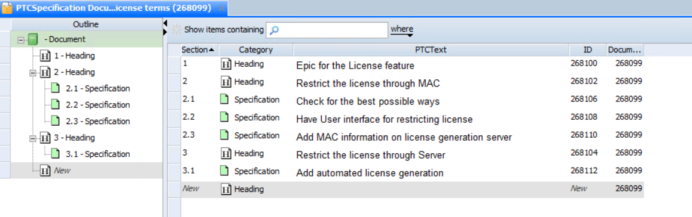

In the above image, each entity Rank can be determined based on the structure displayed on the left panel under 'Outline' or, with the 'Section' value of the entity display on the right panel. For example:

* The respective Ranks of entities, 268100, 268102, and 268104 are 1, 2 and 3. The respective Ranks of entities, 268106, 268108, and 268110 within the entity 268102 are 2.1, 2.2, and 2.3.
  * If user synchronizes all these entities without Rank synchronization, they will see the target entities in different sequence as compared to the source sequence [based on their processing order and the target system behaviour]. If the user synchronizes all of these entities with Rank synchronization, they will see a similar view where the target entity for 268100, 268102, 268104 and 268106, 268108, 268110 is in the equivalent sequence similar to the source sequence.

Hence, Rank Synchronization helps the user synchronize these entities and visualize Rank/Structure on the target system similar to the source Rank/Structure.

**Jira R4J Plugin view**  
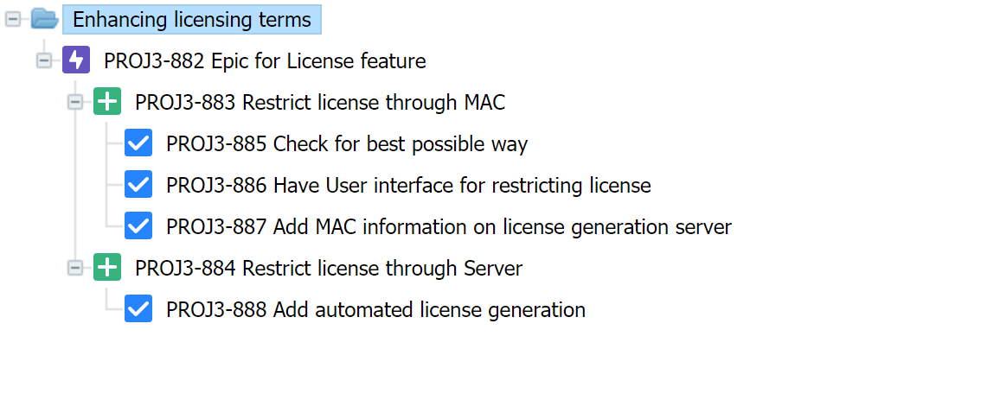

In the above image, the respective Ranks of entities, PROJ3-883, and PROJ3-884 within the entity PROJ3-882 are 1 and 2. Similarly, the respective Ranks of entities, PROJ3-885, PROJ3-886, and PROJ3-887 within the entity PROJ3-883 are 1, 2 and 3.

## Supported Connectors

Rank Synchronization is supported by following connectors:

1. [**Windchill RV&S**](../connectors/windchill_RV%26S.md#rank)
2. [**Jira R4J Plugin**](../connectors/jira.md#rank_.28r4j_plugin.29)
3. [**Verisium Manager**](../connectors/verisium-manager.md#rank)
4. [**Codebeamer**](../connectors/codebeamer.md#rank)
5. [**IBM Rational Doors**](../connectors/ibm-rational-doors.md#rank)

## Configuration

A field named **OH Enable Rank** is required to be mapped in order to enable the Rank Synchronization. It is recommended to map the **OH Enable Rank** field with the **OH Enable Rank** field only.

> **Name**: OH Enable Rank  
> **Data Type**: Boolean  
> **Value**: This field value contains the Boolean value. It is used to decide whether rank processing is required or not.

> **Note** : If the target system is having multi-level structure view, then please configure the relationship mapping to have a level structure view in addition to enable the Rank synchronization. Please refer to the below examples for better understanding:
> 
> - Windchill RV&S system allows Multi Level Structure with Contains-Contained By relationship. The entity within this structure can have a particular Rank. Hence, the user can enable the Relationship configuration to maintain the relationship between the entities. Also, the user can enable Rank Synchronization to maintain the entity rank within the structure.
> - R4J system allows Multi Level Structure with R4J Parent Link-R4J Child Link relationship. The entity within this structure can be in a particular Rank. Hence, the user can enable the [Relationship configuration](../connectors/jira.md#relationships) to maintain the relationship between the entities. Also, the user can enable Rank synchronization to maintain the entity rank within the structure.

Refer to the [Relationship configuration](#relationships) section to learn more about how to configure relationship.

## Known Behavior and Limitations

1. Rank Synchronization will be considered for the entities within same project.
2. Reconciliation is not supported for Rank Synchronization.
3. Conflict is not supported for **OH Enable Rank** field. OpsHub Integration Manager will always consider "Source win" policy for this field.
4. If **OH Enable Rank** field is added to an already running integration: Rank Synchronization will keep maintaining the Rank for the entities being processed after the mapping change.
5. If **OH Enable Rank** field is removed from a running integration: Rank Synchronization will not maintain the Rank for new entities being processed after the mapping change. For already processed entities, the Rank will be maintained if any of the adjacent entity's mapping configuration has the Rank synchronization enabled.
   - For example, two integrations are running with Rank Synchronization enabled for issue type "A" and "B". If user disables the Rank synchronization for only entity type "B", the processing of entities of type "A" will maintain the Rank for already synchronized (and all adjacent) entities of Type "B". If user disables the **OH Enable Rank** field for both entity types "A" and "B" mapping configurations, then OpsHub Integration Manager will not process Rank Synchronization for both entity types.
   - This behaviour will be revised in future OIM release.

> **Note** : Please refer to the respective connector document to check on connector limitations for Rank Synchronization.

# Synchronize source field updates as comments

## Overview

* This feature is used to add comments in the target system when the source field is updated/modified.
* It helps the user to generate traceability for source fields in the target system.
  * For example, suppose "State" field is mapped from source to target system. Now, if the source system has more number of states than the target system, then in value mapping of "State" field, we will not be able to map all the states of the source system.
    * To synchronize the unmapped states of the "State" field, this feature can be utilized by adding a comment in the target system based on the "State" field changes.

## Configuration

* A field named **OH Comment** is required to be mapped in the target system in order to enable this feature.
* The **OH Comment** field can be mapped multiple times with different source fields.
  * All the fields having difference in old and new values will be merged together and added as a single comment in the target system. Consider the following example:
    * Suppose "Priority" and "State" field in the source system are mapped with **OH Comment** field in the target system.
    * If "Priority" is changed from "Low" to "High" and "State" is changed from "Proposed" to "Active", then a comment will be added in the target system as below:

```
Priority changed from [Low] to [High]

State changed from [Proposed] to [Active]
```

* The username of the user, who updated the fields can also be included in the comment, which will be added in the target system.

**To change/customize the comment message, please refer the below steps:**

1. In the mapping, the **OH Comment** field needs to be mapped.
2. Navigate to the icon , which will appear adjacent to the **Comments**. Click on this icon and a window will open as shown below:
   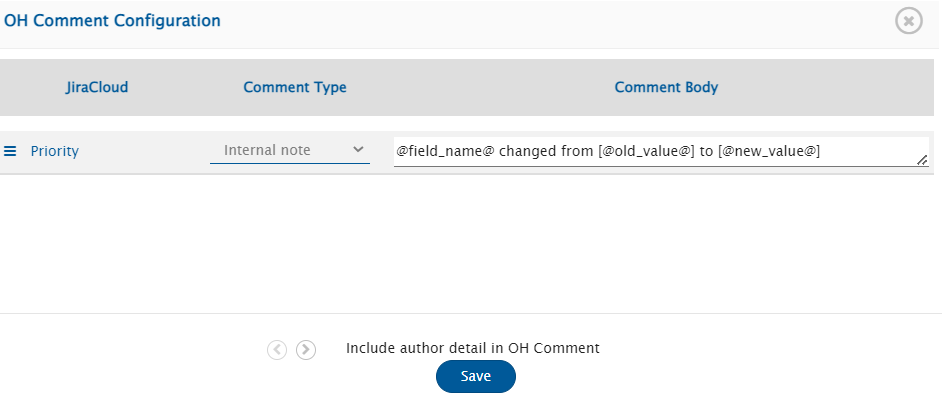
3. Here, the comment type and comment body format can be configured for each field mapped with **OH Comment** field.
4. To configure the comment body format, OpsHub Integration Manager provides special tokens as mentioned below to access various values of the source field:
   * `@field_name@`: This token is used to access the display name of the source field.
   * `@old_value@`: This token is used to access the old value of the source field.
   * `@new_value@`: This token is used to access the new value of the source field.
   * For example, comment body format can be:  
     **@field_name@ updated in source from "@old_value@" to "@new_value@"**

## Known Behavior and Limitations

* Reconciliation, Conflict Detection and Default Value Configuration are not supported for this feature.
* If the **Include author detail in OH Comment** is enabled:
  * Correct author details will not be added in the comment, if the integration is in **Current State** mode or the source system does not support **history**.
  * Only the "username" will be added to the comments.


# Restrict Target Update

## Overview

* In certain scenarios, the target entity cannot undergo further updates, when it is in a closed/done state or resides within an archived folder. Consequently, attempts by OpsHub Integration Manager to update such entities will result in processing failures.
* To address such cases, updates on the target entity can be restricted. "OH Update Target" field can be utilized for the same.

## Configuration

* **"OH Update Target"** field can be mapped in any mapping mode in the above-mentioned use cases.
  * This field is of Lookup type.
  * Possible values for this field are:
    * **Yes**: Indicates that the target entity will be updated.
    * **No**: Indicates that the target entity will not be updated.
	
# Advance Settings

Expand the pop-up by clicking the arrow icon.

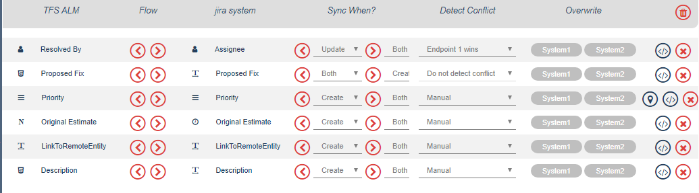

## Conflict Management

- In the **Detect Conflict** column, define the mechanism to resolve the conflict between System 1 and System 2. The options are: **Do not detect conflict**, **End system 1 wins**, **End system 2 wins**, and **Manual**. Select the relevant option from the **Detect Conflict** drop-down list.

From the **Detect Conflict** drop-down list:

- Select **Do not detect conflict** when you don't want OpsHub Integration Manager to detect and notify a conflict between the select entities in System 1 and System 2.
- Select **Endpoint 1 wins** when you want System 1 to be allowed to overwrite the information in System 2.
- Select **Endpoint 2 wins** when you want System 2 to be allowed to overwrite the information in System 1.
- Select **Manual** when you want the user to manually take an action to resolve the conflict.
- Select **Custom Strategy** when you want the user to define the action with a pre-defined condition, for example the system in which the entity was updated last is allowed to overwrite the information in the other system.

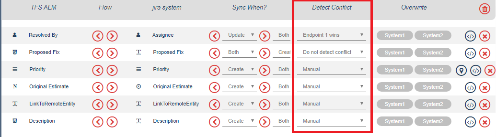

Read in detail about Custom Conflict Resolution Strategy [here](custom-conflict-resolution-strategy.md).

## Overwrite

- Click System 1 or System 2 in the **Overwrite** column depending on the system on which you want to overwrite the data.

## Sync When

From the **Sync When?** drop-down list against a field in [Create-Update Mode](#create-update-mode):

- Select **Both** when you want to sync the field when an entity gets created or updated in the target system. This is also the pre-configured setting.
- Select **Create** when you want to sync the field when an entity gets created in the target system.
- Select **Update** when you want to sync the field when an entity gets updated in the target system.

> **Note**:
> Do not set the **Conflict Resolution Strategy** as **Manual** when you have set **Sync When?** to Update.  
> Reason: As the field was not created at sync time, this will result into conflict error.

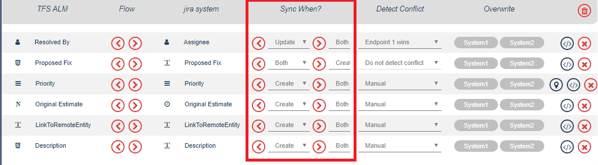

For the [Delete Mode](#delete-mode) mapping configuration, the default **Sync When?** mode is **Soft Delete**.

# Known Limitations

- While converting from Wiki to HTML:
  - Numbered list and Bullet list present in table cells in the wiki field will not be displayed properly in the HTML field.
  - Text between pipe character (`|`) and the next newline character in the wiki field will be converted to a table cell in the html field.
  - When a word contains two distinct formatting types, then such formatting will not synchronize to the target system as expected.
    - **Source Value:** <u>**conve**rsion</u>  
    - **Target Value:** **conve**+rsion+
  - Source Wiki type field is mapped with target HTML type field:
    - Superscript and Subscript formatting of source field will sync along with wiki formatting in target system.
      - If text with superscript is: `X<sup>2</sup>` then in target data sync as: `X^2^`
      - If text with subscript is: `X<sub>2</sub>` then in target data sync as: `X~2~`
    - If cell gets merged in table of source system's field then table content will sync along with wiki formatting in target system.
    - Emojis present in source system's field then, in the target system, the emojis will be sync as space.

# Update a Mapping

* Open the mapping from the integration page. Alternatively, you can also click the mapping name on the mapping configuration page. You will be navigated to the Mapping Configuration page. You can click the option highlighted in the image below to edit the mappping.

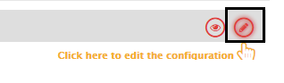

* Update the details and click the **Update Mapping** button to save the details. You will receive a prompt when the mapping details are updated.

# Actions on Existing Mapping

Apart from updating, you can also take multiple other actions on an existing mappings. Roll over the icon on the right most corner against the mapping name to see all actions that you can take.

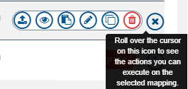

Here are the actions you can perform on an existing mapping:

You can:
* Export a mapping
* View XSL script for the selected mapping
* Clone the selected mapping
* Delete the selected mapping

Refer to the image below.

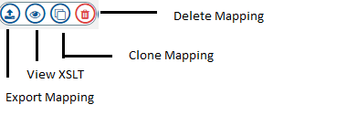

> **Note** :
> From version 7.0 onwards, exported mapping will be in XML format with display name of fields rather than internal names to make mapping portability robust.  
> 
> Additionally, XSL for fields, in which default transformation is automatically generated, won't be added to export mapping so that when user import mapping on newer version then automatically if default mapping is upgraded then that comes into effect. If user has done custom mapping then XSL for that will be shown in exported mapping.

You can also perform other actions on multiple selected mappings:

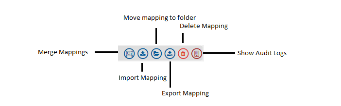
	
