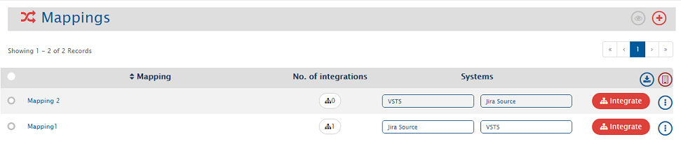
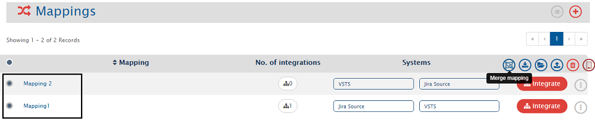
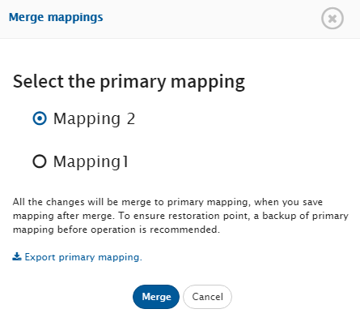
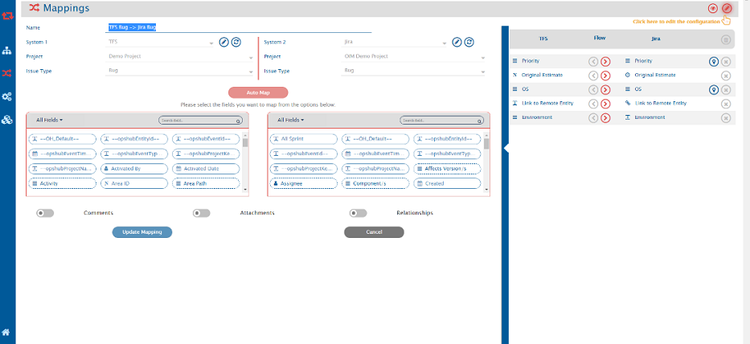
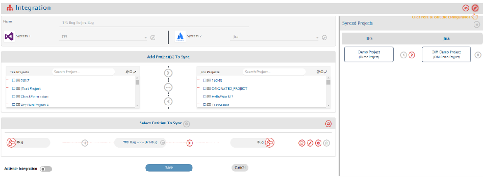
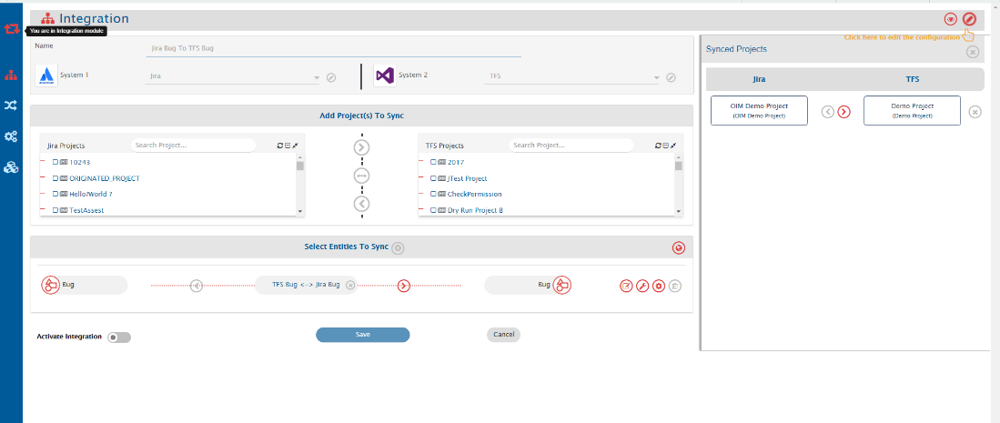
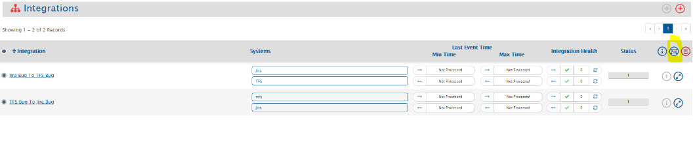
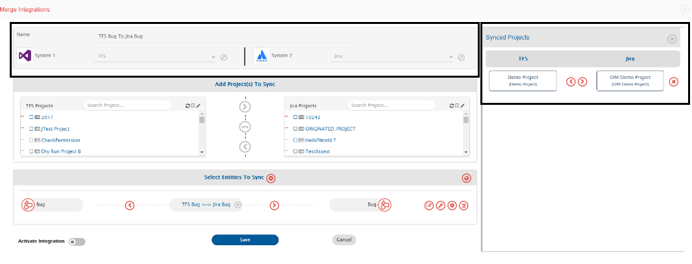
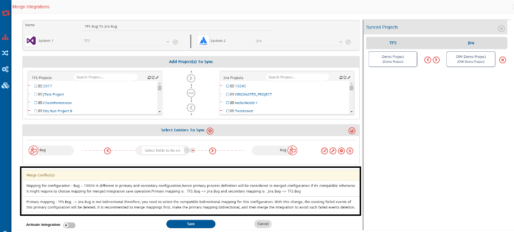
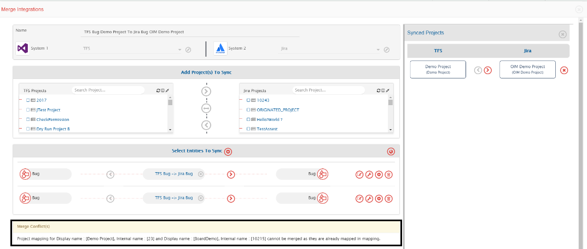

This page explains the merge feature available from version 7.0 onwards.
# When To Merge Integrations

As the name says, this feature allows users to merge existing configurations such as mappings and integration groups for usability purpose. It also helps reduce the maintenance cost. Given below are some cases in which merge feature can be useful.

* User was using the old User Interface (UI) for integration and has now shifted to the new UI. Before OpsHub Integration Manager Version 7.0, it was not possible to create bidirectional mapping and integrations in one go. If a user wanted to create a bidirectional integration between TFS and JIRA, the required configurations were as follows:

* **Configuration 1**
  * Mapping 1 [TFS User Story to JIRA Requirement]
  * Mapping 2 [JIRA Requirement to TFS User Story]
  * Integration 1 [TFS User Story to JIRA Requirement] with Mapping 1 associated with the integration
  * Integration 2 [JIRA Requirement to TFS User Story] with Mapping 2 associated with the integration

But from version 7.0 onwards, it's possible to have 1 mapping and 1 Integration for such cases. If a user wanted to create a bidirectional integration between TFS and JIRA, the required configurations now are as follows:

* **Configuration 2**
  * Mapping 1 [TFS Story to and from JIRA Requirement]
  * Integration 1 [TFS User Story to and from JIRA Requirement] with Mapping 1 associated with the integration

So, if a user migrates OpsHub Integration Manager instance to 7.0 version or onwards, the user can merge Mapping 1 and Mapping 2 into Mapping 1 as well as Integration 1 and Integration 2 into Integration 1. So, the user doesn't have to manage multiple integrations. Users can simply delete Mapping 2 and Integration 2 after they are successfully merged to another configuration and if they are not being used in any other integration.

The above case is also applicable when Configuration 1 is created in the new UI and user wants to have configuration like Configuration 2.
If the user has created different integrations created for different projects:

User had defined configurations as given below. It is because of project templates mismatch, user was required to create different mappings and different integrations.

* Mapping 1 [TFS User Story to JIRA Requirement for Project 1]
* Mapping 2 [TFS User Story to JIRA Requirement for Project 2]
* Integration 1 [TFS User Story to JIRA Requirement for Project 1] with Mapping 1 associated with the integration
* Integration 2 [TFS User Story to JIRA Requirement for Project 2] with Mapping 2 associated with the integration

But now both projects fall under similar templates and same mapping can be used in them. So, user can merge Integration 1 and Integration 2 and delete the other integration and mapping if they are not being used anywhere else.

# Merging Mappings or Integrations

The process for merging two mappings or integrations with sample example is given below.

## Merge Mappings

Here for example let us assume there are 2 different mappings [TFS User Story to JIRA Requirement and JIRA Requirement to TFS User Story as below]

* TFS User Story to JIRA Requirement
* JIRA Requirement to TFS User Story

  

Now, if these two mappings are to be merged, the following steps can be followed:

* Inactivate the integrations that are using any of the mappings that are to be merged.

* Make sure the mappings are configured between the same end points, otherwise merge will throw validation error and won't proceed further [Because if the mappings to be merged are configured for different end points, their context like projects/entity types, fields etc. are different]

* Make sure both the mappings are configured between same projects and entity types, otherwise merge will give validation error and won't proceed further [Because if both mappings are configured for different projects/entity types, their template/fields are different]

* Select merge option: On the Mappings list page, select 2 mappings. An option for merging those would be available as shown below.
  

  

* Click the "Merge Mapping" option. Select the Primary Mapping. Take the backup of the primary mapping and refer to the instructions on the screen before clicking the Merge button.\

  

* After clicking the Merge button, a mapping screen comes up as a result of merged mapping object that shows a preview of merged mapping which contains the existing primary mapping configurations and the secondary non-conflicting configurations merged.
  *Take a look at the fields mapping, value mapping, mapping for other configurations such as Comments, Attachments, Issue Relationship, etc. in the preview as well as Merge Conflict(s). If user wants this mapping as a result of your merged mapping, they should click the "Update Mapping" button.
  * In case there are conflicts in the primary and secondary mappings, then primary mapping's configuration will be considered in the preview of merged mapping details and warnings would be given for the conflict details in the Merge Conflict(s) section of preview.

  * In case any Merge Conflict(s) warning is/are available, please go through it before clicking the Update Mapping and perform the Update Mapping only if the behavior mentioned in Merge Conflict(s) is acceptable.

* Once the primary mapping is updated as per the merge result, merge operation is completed. The steps given below are then to be performed manually for the second mapping:\

  * For all the integrations that use secondary mapping, they should be edited to use primary mapping (Merged Mapping).
  * Take a backup of secondary mapping [Export it].
  * Delete the secondary mapping.

**Mapping merge with conflicting case example**

This section describes the sample conflict cases to give an overview on mapping merge operation with Merge Conflict(s).

* **Case 1**: Let's consider a case where there are two mappings from TFS 'Bug' to JIRA 'Bug', but in that some of the field mappings of secondary mapping have conflicts amongst them and they can't be merged.

Mapping 1: TFS Bug -> Jira Bug

  

Mapping 2: TFS Bug -> Jira Bug 2

  

Here, as per the Primary Mapping Environment [Mapping 1: TFS Bug -> Jira Bug], field value for JIRA Bug should be as per the Environment Field value of TFS Bug, but as per the Secondary Mapping Environment [Mapping 2: TFS Bug -> Jira Bug 2] field value for Jira Bug should be as per the Description Field value of TFS Bug. Now, this information contradicts with Primary Mapping. Hence, this Field mapping is available in the Merge Conflict(s) warning and in the Merged mapping preview, Environment -> Environment field mapping is being considered.

* **Case 2**: Let's consider a case where we have two mappings from TFS Bug to JIRA Bug but in those mappings some of the value mappings of secondary mapping are conflicting and can't be merged.

Primary Mapping:
Basic Details: TFS Bug -> Jira Bug
Field Mapping: Priority -> Severity
Value Mapping: High -> High
Critical -> High
Low -> Low

Secondary Mapping:
Basic Details: TFS Bug -> Jira Bug
Field Mapping: Priority -> Severity
Value Mapping: High -> High
Critical -> Blocker
Low -> Low

So, the Merged Preview will have Value Mapping as shown below:
Value Mapping: High -> High
Critical -> High
Low -> Low

In the Merge Conflict(s), there will be a warning around second value mapping "[Critical -> High] for field mapping priority -> Serverity can't be merged as it's conflicting with primary mapping."

Similar conflicts can also come for mapping configurations of Comments, Attachments, Issue Relationship, etc. as well.

## Merge Integrations

For example, let's assume there are 2 different integrations [TFS To JIRA and JIRA To TFS as shown below.]

The initial configurations were as below:

* TFS to JIRA Integration with mapping TFS Bug to JIRA Bug

* JIRA to TFS Integration with Mapping Jira Bug to TFS Bug
  With mapping merge operation, merge the TFS Bug to JIRA bug and JIRA Bug to TFS Bug into TFS Bug to JIRA Bug [ primary mapping] and name it TFS Bug <-> Jira Bug mapping and associate it with both the integrations:

**TFS Bug to Jira Bug**

  

**Jira Bug to TFS Bug**

  

Now merge these 2 integrations and follow the steps given below:

* Inactivate the integrations that are to be merged

* Ensure both the integrations are configured between same end points, otherwise merge will give validation error and won't proceed further [Because if both integrations are configured for different end points, their context like projects/entity types etc. would be different]

In our example, both the mappings are configured between TFS and JIRA.

* Select merge option: On the view integrations list page, once the 2 integrations are selected, an option for merging the integrations would be available as shown in the image below:

  

* Click the "Merge Integration" option. Select the Primary Integration. Take a backup of the primary integration \[Clone the primary integration and keep it in Inactive mode] Please refer to the instructions on the screen before clicking the Merge button.

* When the Merge button is clicked, a Merge Integration screen comes up as a result of merged mapping objects that show a preview of the merged integration. It that contains the existing primary integration configurations and the secondary non-conflicting configurations merged together.

Look at the image below. It shows an example where the Integration for Bug entity as well as the project mapping is bidirectional in merge preview.

  

* Take a look at each configuration in the preview as well as Merge Conflict(s). If this is wanted as a result of the merged integration, click the Save button [Edit the preview in case there are any changes required here]

* In case there are conflicts in the primary and secondary integration configurations, then primary integration's configuration will be considered in the preview of merged integration details and warnings would be given for the conflict details in the Merge Conflict(s) section of the preview.
* In case any Merge Conflict(s) warning is/are available, go through it before clicking the Save button and perform the Save operation only if the behavior mentioned in Merge Conflict(s) is acceptable.

* Once the primary integration is updated/saved as per the merge result, merge operation is completed. The secondary integration can now be deleted.

**Integration merge with conflicting cases examples:**
This section describes some of the conflicting cases/examples to give the overview on integration merge operation with Merge Conflict(s).

* **Case 1**: Let's consider a case where one has not performed Merge Mapping and are trying to merge Integrations with the following configurations:
  * TFS to JIRA Integration with mapping TFS Bug to Jira Bug

  * Jira to TFS Integration with Mapping Jira Bug to TFS Bug

In that case the merge preview will look as follows:

  

The Merge Integration preview has merge integration preview along with Merge Conflict(s). Merge Conflict(s) has warnings because both integrations have different mapping. In this case, the Primary mapping is being considered and this mapping is not bidirectional. Therefore, it's not compatible with the merged integration. So, the user needs to select a compatible mapping for saving the merged integration.

* **Case 2**: Merge 2 integrations of TFS Bug to Jira Bug but having conflicting project configuration as shown below:
  * Integration 1: TFS Bug Demo Project to Jira Bug OIM Demo Project
  * Integration 2: TFS Bug Demo Project to Jira Bug BoardDemo

The merge preview will look as shown below:

  

The Merge Integration preview has merge integration preview along with Merge Conflict(s). Merge Conflict(s) has warnings because as per the Primary Integration, TFS Demo Project Bugs are to be synchronized to Jira OIM Demo Project and as per the Secondary Integration TFS Demo Project Bugs are to be synchronized to Jira BoardDemo Project. In this case, the primary configuration is being considered.

# Best Practices

Before a user attempts merge integration, they should ensure the mapping associated with the integrations are compatible with the merged integration results. If required, they should merge their mappings first and then the integrations.

# Expected Behavior For Merge Conflicts

For Merge operation, primary configurations are given first preference and non-conflicting secondary configurations are merged to them. But for integration merge, following configurations of secondary integration will not being added/merged to the Primary/Merged integration even if they are not configured in the Primary Integrations.

**Post Failure Notification**
* If Primary Integration doesn't have Post Failure Notification configured but the Secondary Integration has it configured, the Merged Integration will also not have Post Failure Notification configured in it. Therefore, once the Merged Integration is saved, users must manually configure Post Failure Notification manually.
* If Post Failure Notification is configured in the Primary Integration, it will be retained after merge operation as well.

**Reconciliation**
* If Primary Integration doesn't have Renconciliation configured but the Secondary Integration has it configured, the Merged Integration will also not have Renconciliation configured in it. Therefore, once the Merged Integration is saved, users must manually configure Renconciliation manually.
* If Reconciliation is configured in the Primary Integration, it will be maintained after merge operation as well.

## What To Do After Merge is Completed

On clicking the merge button, for the merge response, the merged previewed details will be saved into the primary configuration and the secondary configuration will remain as it is. The secondary configuration can, then, be removed if not being used anywhere else.
