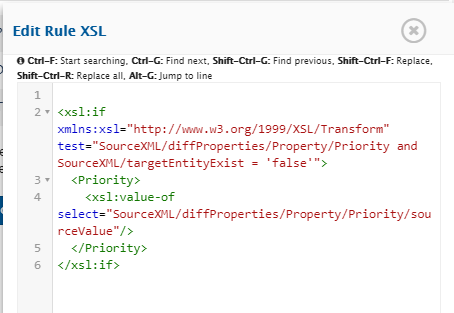

# Overview

Reconciliation feature helps reconcile data for fields added in integration. Primary use of this feature is to reconcile existing data in the end system after changing mapping, for example after adding new field, link type, enabling attachment, etc.  
Some of the use cases where this feature can be used are:
1. The user wants to add field(s) that was previously not integrated, but now the user would like it to be integrated. But the user also does not want to perform any mass update on all other entities existing in the source system so that the value of only the newly added field is integrated.  
2. The user may already be using OpsHub Integration Manager for sync and the data got into an inconsistent state, either due to bad failure management or inappropriate conflict resolution. And now, the user wants to reconcile both the systems to achieve a consistent state.  

An important point to remember is that Reconciliation is not Integration or Migration, and hence should not be confused with them.

# Steps to Configure Reconciliation

> **Note**: Few things to know before reconciling data:  
> - Inactive the integration to be reconciled. If the integration is not inactivated, then it will be automatically inactivated once data reconciling starts.  
> - When Reconciliation is configured on integration, all Failed Events currently associated with the integrations would be **deleted**.  
> - **Remote Entity Id** and **Remote Entity Link** fields are not supported.  
> - Workspace / Project / Entity type name with Unicode character is not supported.

- To configure Reconciliation, navigate to the integration to be reconciled. Click on reconcile icon as shown below:  
  

- The window will come up for the given integration:  
  

- User can select direction  based on: the system or the entity type that is to be reconciled. Reconcile can be configured in one direction at a time.  
  By default, all fields that are mapped in associated mapping for selected entity will be reconciled with source data being copied over to target.

- Now, click on **Save Reconciliation** button to save the reconcile. Basic reconcile with default options will be created.

> **Note** : If you are getting a warning stating that **Reconciliation start date will be changed**, then you have some criteria configured in your integration and you do not have a valid Migration license.  
> If you click on Yes, then Reconciliation will start from the date shown in the message (which is 60 days before the day of your first valid license).  
> If your reconcile is already created before this restriction, then you will see the same warning when you will activate your Reconciliation.

## Change Default Setting

- To change default setting click on  to configure Reconciliation. A new window which displays all the mapped fields will come up.  
  

- **Configure Mismatch** option:  
  - This defines the strategy on which the field value is to be reconciled in case a mismatch is found between its value in the source entity and the target entity.  
  - **Source** means that the value of source system would be written.  
  - **Target** means that the value of the target would be kept intact.  
  - **Custom** allows the user to configure a custom configuration for a situation where mismatch is found.  
  - **Target Empty** option will reconcile a field only if the mapped destination field is empty.

- **Reconcile For**: **Both** / **Create** / **Update**  
  This feature allows the user to select for which event the fields should reconcile.  
  - **Both** implies that for both Create and Update events, the field must be reconciled.  
  - **Create** implies that the field is reconciled only in cases when reconciliation must create an entity on the destination side.  
  - **Update** implies that the field is only reconciled for the Update event.

- If the user intends to have **Custom** rule as Mismatch Option, click on  button.  
  Below window will appear to insert custom XSL rule:  
  

> **Note** : If user wants to define rules for reconciling field based on a condition, then custom rules can be defined.  
> For example: a user wants to reconcile priority in target system based on a condition as shown above.

- Click **Save Reconcile Configuration** button to save reconcile rule changes.  
- Now, on clicking **Save Reconcile** button, reconciliation will start.

# Configure Workflow

- By default, **Default Reconcile Workflow** will be selected.  
- To select customized workflow, click on  on Reconciliation page and select workflow for reconcile.

# Monitor Reconciliation

- User can manage reconciliation failures like integration failures.  
- Once the reconciliation is completed, integration status will change to green.

# Switch Back to Integration Mode

- If the reconciliation is completed, the status will change to green on Reconcile page.  
- Go back to the same integration and set the polling time in integration to a time after reconciliation is completed to poll old updates which are already reconciled.  
- To re-run the Reconciliation, follow same steps. You can change the settings on Reconciliation page.
