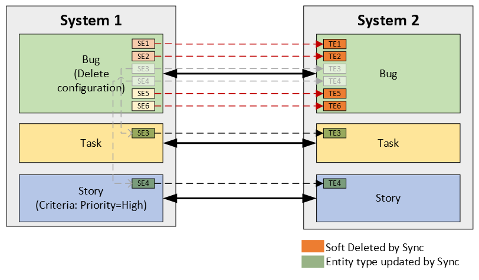

# Overview

- **OpsHub Integration Manager** supports the synchronization of sync-abandoned source entities by performing Logical delete, Soft delete, or Archive operation on the target entity.
  - An entity will be treated as sync-abandoned in the following cases:
    1. **OpsHub Integration Manager** is unable to access that entity due to insufficient permission or its deletion.
        - Such entities are categorized as "Not Accessible" in the integration sync report.
    2. Sometimes, the entity is no longer a part of synchronization in **OpsHub Integration Manager**, then also it will be treated as sync-abandoned entity, i.e.,
        - Modification of project and/or entity type of an entity in the end system leads to its exclusion from the synchronization, when the configuration related to updated entity type and/or project:
            1. Does not exist in **OpsHub Integration Manager**.
            2. Exists with specified criteria but the entity no longer meets the criteria.
        - Such entities are categorized as "Not Applicable" in the integration sync report.
  - In the "Logical Delete", some of the fields of the target entity is updated with some fixed values to represent that the corresponding source entity is deleted.
  - In the "Soft Delete", the target entity will be deleted in the target, which can go to the recycle bin of the corresponding systems.  
    - Currently, the "Soft Delete" is supported for the Rally, Team Foundation Server, VersionOne, Doors, Salesforce, and Codebeamer systems in **OpsHub Integration Manager**. For further details on the same, please refer to connector documentation of systems.
  - In the "Archive operation", target entity will be archived in the corresponding systems.  
    - Currently, "Archive" is supported in **Jira data center** system.

# Configuration Steps

1. Configure '[Enable Delete Sync](integration-configuration.md#enable-delete-sync)' in the advance configuration panel of the integration.
2. Upon '[Enable Delete Sync](integration-configuration.md#enable-delete-sync)' configuration, Soft Delete or Archive operation will be performed by default based on target system behavior.
    - To perform only logical delete, configure the '[Delete Mode](mapping-configuration.md#delete-mode)' mapping for the corresponding fields, setting the default value to 'No' in the '[Delete Mode](mapping-configuration.md#delete-mode)' mapping.
    - If the target end system supports both Soft Delete and Archive operations, Soft Delete will be performed by default. Otherwise, deletion will be performed as per the '[Delete Mode](mapping-configuration.md#delete-mode)' mapping.

# Known Behaviors

- This configuration needs to be performed for each entity pair configured in the integration group.
- If the source entity is restored somehow in the end system, in that case, the further updates on that entity will be synchronized under the configuration done for the regular synchronization of the "Create"/"Update" events.
- If the access of the integration user is revoked from some set of entities, then those entities will be considered as deleted for that integration user. Therefore, they will be considered for the Source Delete synchronization. Once access is being given to those entities, they would remain in sync and the behavior of the synchronization would be similar to the restoration of the entity in the source.
- If the '[Delete Mode](mapping-configuration.md#delete-mode)' mapping gets updated, then the earlier synchronized data cannot be reconciled as per the new "Delete Mode" configuration.
- If the Delete event is synchronized for the source entity, for which **OpsHub Integration Manager** has recreated the entity in the target as per 'Recreate' configuration of '[Action on Entity Deleted in Target](integration-configuration.md#action-on-entity-deleted-in-target)' advanced setting, then in the '[Integration Sync Report](../help-center/troubleshooting/integration-sync-report.md)', the already deleted entity will be in the 'Active' state.
- If **Synchronize Not Applicable Entities** is configured with **Yes** input:
  - **OpsHub Integration Manager** will meticulously scan all the configurations between relevant source and target systems. Consequently, there's a risk of erroneously identifying entities as not applicable under certain circumstances:
    - Criteria configuration will be updated in any dormant integration configuration related to the updated entity type or project.
        - In this case, **OpsHub Integration Manager** will consider the criteria set during the delete synchronization, which can lead to misidentification in the following cases:
            - Even if an entity meets the criteria (to be updated in the dormant configuration), it will still be flagged as "Not Applicable" because it didn't meet the criteria at the time of delete synchronization.
            - If the entity meets the criteria defined in the dormant configuration during the delete synchronization, it will be included in the synchronization process of dormant configuration, when reactivated, even if it no longer meets the updated criteria.
  - Hence, it is recommended to enable this setting only when all the configurations within **OpsHub Integration Manager** are strictly configured with the intended criteria, and there are no dormant or obsolete configurations (to be deleted in future).

# Use Case

- Suppose, the configuration between System 1 and System 2 is as follows:
  - The Delete configuration of Bug integration includes soft deletion or archive operation on the target entity in System 2.
  - **OpsHub Integration Manager** has synchronized 6 entities from System 1 to System 2, i.e., source entities SE1, SE2,...,SE6 to target entities TE1, TE2,...,TE6, respectively.

  

- Now, the user in the System 1 performs the following actions:

| **Entity** | **Action** |
|------------|------------|
| SE1        | Deleted    |
| SE2        | Permission is removed from it for the sync user |
| SE3        | Type is updated to Task |
| SE4        | Type is updated to Story and Priority Value is updated to High |
| SE5        | Type is updated to Story and Priority Value is updated to Low |
| SE6        | Type is updated to Feature |

- The Delete configuration of the Bug integration in the **OpsHub Integration Manager** will perform these actions:
  - TE1 and TE2 will be deleted in the target, and the sync report will be updated with the "Not Accessible" state for these entities.
  - Updates on the SE3 and SE4 will be synchronized to the target entities TE3 and TE4 respectively via Task and Story integration.
  - TE5 (as SE5 fails to meet the criteria of Story integration) and TE6 (as the configuration related to Feature is missing in **OpsHub Integration Manager**) will be soft deleted or archived in the target as per the configuration, and the sync report will be updated with the "Not Applicable" state for this entity.
    

  

