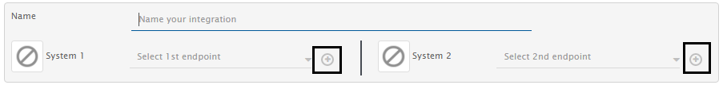
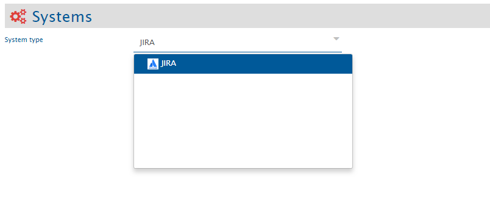
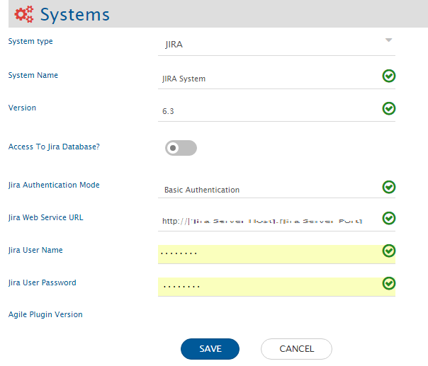
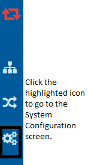
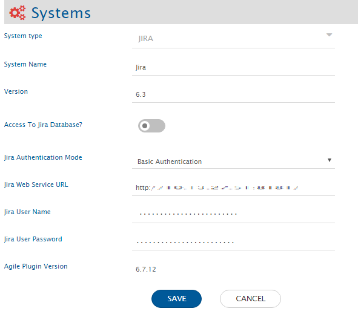

Systems here refer to the applications such as Team Foundation Server (TFS) and JIRA that you are using in your Application Lifecycle Management (ALM) ecosystem. 

In this section, you will learn how to configure a system onto <code class="expression">space.vars.SITENAME</code> and how to update the system details after configuration, if required. 

# Add a System

* While creating an integration on the Integration Configuration screen, click the the plus button [+] adjacent to System 1 and System 2 fields to access the System Configuration screen.  

<div align="center">
  
</div>

* The System Configuration page will open. 
* In the **Systems type** field, type the name of the system you want to create. The system name will appear in the drop-down options. For example, we type JIRA in the field and the JIRA system appears in the drop-down list.

<div align="center">
  
</div>

* Select the system you want to integrate. A form requesting system details opens.
* Fill the form with relevant details:
  * **System Name**: The name that you want to assign to the system you are configuring
  * **Version**: The version of the system that you are configuring
  * **Database Connection**: This field is for the systems that use database and for which OIM needs to have a connection with the database.
  * Other system-specific details: We have dedicated section for each system we support. Refer to the specific System Configuration section under that [Connectors](../connectors/connectors.md) page.

> **Note** : If the end system uses the MySQL database connection, then use the MySQL Connector Jar `mysql-connector-java-5.1.38-bin.jar`. You need to place this jar in `<OIM Installation Path>\OpsHubServer\lib`. In case MySQL jar already exists, then replace that MySQL jar with `mysql-connector-java-5.1.38-bin.jar`. MySQL jar can already be available in the case, OIM is installed with MySQL database.  

<div align="center">
  
</div>

* Click the **Save** button to save the details. 
* Repeat the same instructions to add another system. 

<div align="center">
  
</div>

You can also directly go to the System Configuration screen by clicking the System Configuration icon shown in the image below.

<div align="center">
  
</div>

# Edit System Details

* If the system you want to configure to <code class="expression">space.vars.SITENAME</code> is already configured, but you want to update some configuration details, you can click the pencil icon shown adjacent to the system name after you enable the edit mode in integration by clicking the icon show below. 

<div align="center">
  
</div>

* The form containing details will open. You will then get an option to edit the system details. 

<div align="center">
  
</div>

* Update the details and click the **Save** button to save the details. You will receive a prompt when the system details are updated.  

<div align="center">
  
</div>

## Understanding Json Metadata Input

* For some systems like Jira Align, Enterprise Architect, etc. we take json input for metadata.
* Below is the sample JSON input and explanation about what each field means and how to populate the data. Jira Align system is taken as a reference for this explanation:

```json
{
  "entities": [
    {
      "internalName": "capabilities",
      "displayName": "Capability",
      "readMechanism": "HISTORY",
      "hasReadSupport": true,
      "hasWriteSupport": true,
      "systemSpecific": {
        "projectEntityType": "PROGRAM",
        "projectFieldInternalName": "primaryProgramId"
      },
      "fields": {
        "system": [
          {
            "internalName": "title",
            "displayName": "Title",
            "dataType": "text",
            "mandatory": true,
            "systemSpecific": {
              "fieldNameInRevision": "Name"
            }
          },
          {
            "internalName": "state",
            "displayName": "State",
            "dataType": "lookup",
            "lookUpValues": {
              "1": "1 - Not Started",
              "2": "2 - In Progress",
              "3": "3 - Accepted"
            },
            "mandatory": true,
            "systemSpecific": {
              "fieldNameInRevision": "State"
            }
          },
          {
            "internalName": "programId",
            "displayName": "Primary Program",
            "dataType": "reference",
            "systemSpecific": {
              "lookuptype": "programs",
              "fieldNameInRevision": "Primary Program"
            },
            "mandatory": true
          },
          {
            "internalName": "parentId",
            "displayName": "Parent Initiative",
            "systemSpecific": {
              "entityType": "Initiative",
              "lookuptype": "epics",
              "fieldNameInRevision": "Parent Initiative"
            },
            "dataType": "reference",
            "mandatory": true
          },
          {
            "internalName": "description",
            "displayName": "Description",
            "dataType": "text",
            "mandatory": true,
            "systemSpecific": {
              "fieldNameInRevision": "Description"
            }
          },
          {
            "internalName": "tags",
            "displayName": "Tags",
            "dataType": "text",
            "multiselect": true,
            "mandatory": false,
            "systemSpecific": {
              "fieldNameInRevision": "Tags"
            }
          },
          {
            "internalName": "type",
            "displayName": "Type",
            "dataType": "lookup",
            "lookUpValues": {
              "1": "Business",
              "2": "Enabler",
              "3": "Non Functional",
              "4": "Architectural",
              "5": "Supporting"
            },
            "mandatory": true,
            "systemSpecific": {
              "fieldNameInRevision": "Type"
            }
          }
        ],
        "custom": []
      },
      "relationship": {
        "entities": [
          {
            "internalName": "epics",
            "displayName": "Initiative",
            "supportedAsSource": true,
            "supportedAsTarget": true
          },
          {
            "internalName": "Programs",
            "displayName": "Program",
            "supportedAsSource": true,
            "supportedAsTarget": true
          },
          {
            "internalName": "Features",
            "displayName": "Epic",
            "supportedAsSource": true,
            "supportedAsTarget": true
          },
          {
            "internalName": "Releases",
            "displayName": "Program Increment",
            "supportedAsSource": true,
            "supportedAsTarget": true
          }
        ],
        "linkTypes": [
          {
            "linkType": "Parent Initiative",
            "linkCardinality": "OneToOne",
            "reverseLinkType": null,
            "mandatory": true,
            "supportedAsSource": true,
            "supportedAsTarget": true
          }
        ]
      }
    },
    {
      "internalName": "themes",
      "displayName": "Theme",
      "readMechanism": "NON_TIMESTAMP",
      "hasReadSupport": true,
      "hasWriteSupport": true,
      "entityScope": "Global",
      "systemSpecific": {
        "OH_LastUpdatedField": "description",
        "projectEntityType": "ENTERPRISE"
      },
      "fields": {
        "system": [
          {
            "internalName": "title",
            "displayName": "Title",
            "dataType": "text",
            "mandatory": true
          },
          {
            "internalName": "isActive",
            "displayName": "Active",
            "dataType": "lookup",
            "lookUpValues": {
              "1": "Yes",
              "0": "No"
            },
            "mandatory": true
          },
          {
            "internalName": "state",
            "displayName": "State",
            "dataType": "lookup",
            "lookUpValues": {
              "1": "1 - Not Started",
              "2": "2 - In Progress",
              "3": "3 - Done"
            },
            "mandatory": true
          },
          {
            "internalName": "programIds",
            "displayName": "Programs",
            "multiselect": true,
            "dataType": "lookup",
            "systemSpecific": {
              "lookuptype": "programs",
              "entityType": "Program"
            },
            "mandatory": false
          },
          {
            "internalName": "releaseIds",
            "displayName": "Program Increments",
            "multiselect": true,
            "dataType": "lookup",
            "systemSpecific": {
              "lookuptype": "releases",
              "entityType": "Program Increment"
            },
            "mandatory": false
          }
        ],
        "custom": []
      },
      "relationship": {
        "entities": [
          {
            "internalName": "releases",
            "displayName": "Program Increment",
            "supportedAsSource": true,
            "supportedAsTarget": true
          },
          {
            "internalName": "programs",
            "displayName": "Program",
            "supportedAsSource": true,
            "supportedAsTarget": true
          }
        ],
        "linkTypes": [
          {
            "linkType": "Program Increments",
            "linkCardinality": "OneToOne",
            "reverseLinkType": null,
            "mandatory": false,
            "supportedAsSource": true,
            "supportedAsTarget": true
          },
          {
            "linkType": "Programs",
            "linkCardinality": "OneToOne",
            "reverseLinkType": null,
            "mandatory": false,
            "supportedAsSource": true,
            "supportedAsTarget": true
          }
        ]
      }
    }
  ],
  "projects": [
    {
      "internalName": "4",
      "displayName": "Legacy Apps",
      "entities": []
    },
    {
      "internalName": "8",
      "displayName": "Digital Services",
      "entities": [
        {
          "internalName": "defects",
          "displayName": "Defect Override",
          "hasReadSupport": true
        }
      ]
    }
  ]
}
```


