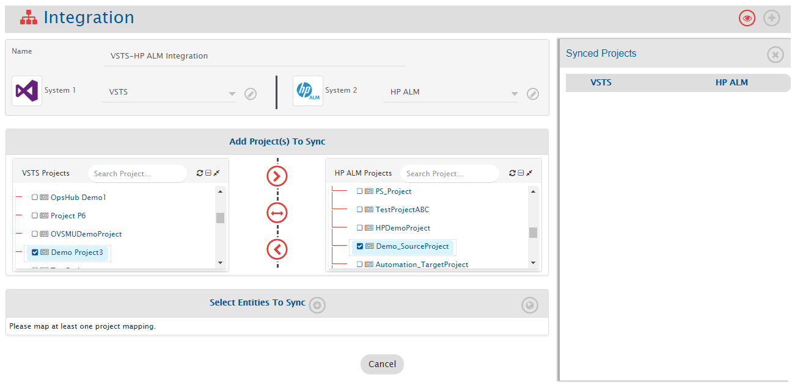
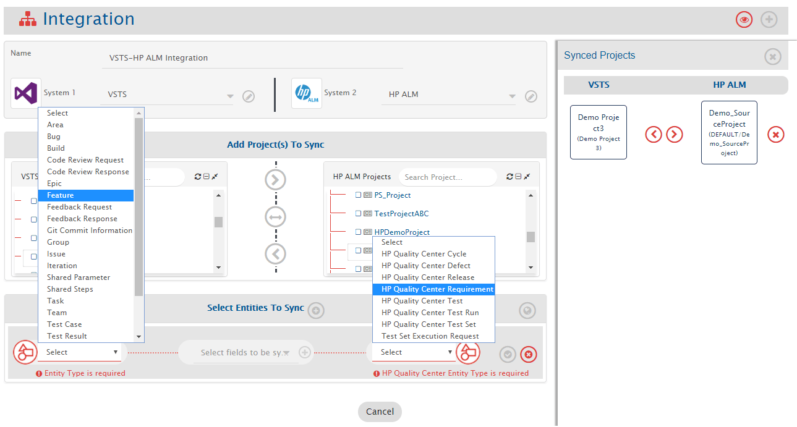
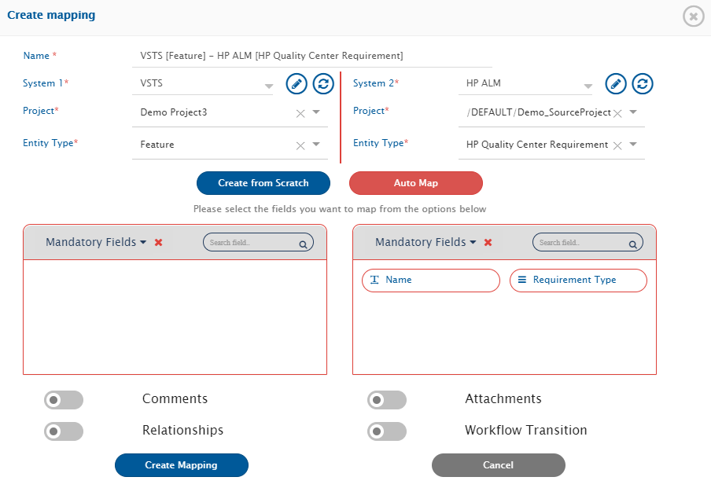
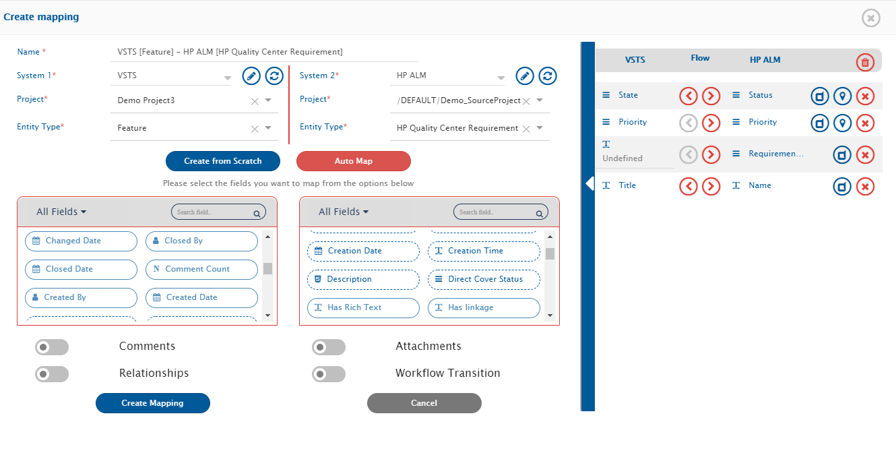
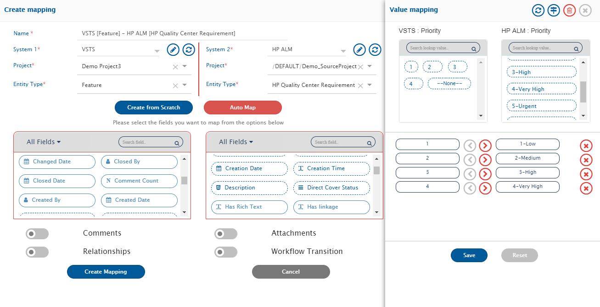
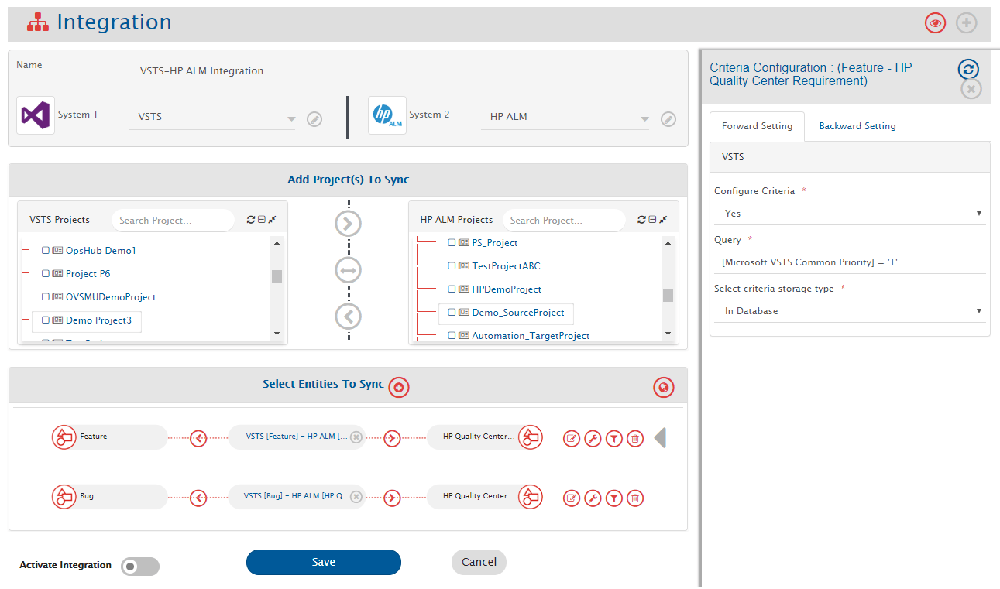
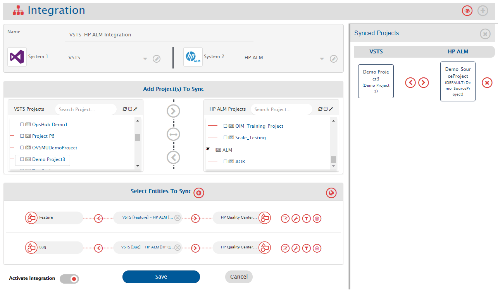
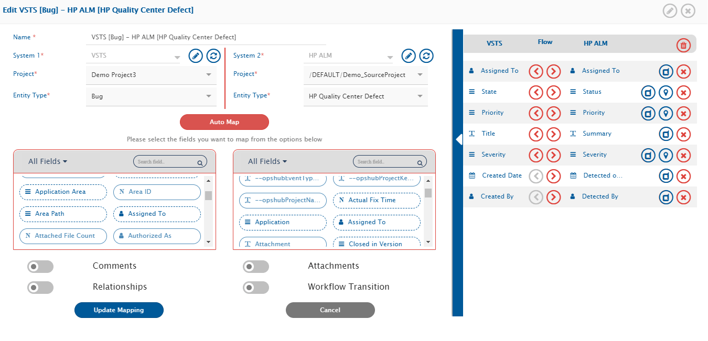

# Overview
Best of breed tools such as Azure DevOps Services (VSTS) and Micro Focus ALM bring richness to the enterprise ecosystem. The integration of Azure DevOps Services (VSTS) with Micro Focus ALM enhances collaboration between the development and quality assurance (QA) teams. This, in turn, helps deliver better quality products faster. There is no manual effort required from either of the teams to keep each other updated on the latest work status.  

**<code class="expression">space.vars.SITENAME</code>** integrates Azure DevOps Services (VSTS) and Micro Focus ALM bidirectionally. On this page, we will discuss the bi-directional integration of:  

  

  

# System Prerequisites
Configuring [system pre-requisites](../../integrate/integration-prerequisites.md) is mandatory for successful system configuration.  

Check out the pre-requisites for [Azure DevOps Services (VSTS)](../../connectors/azure-devops#prerequisites) and [Micro Focus ALM](../../connectors/microfocus-alm-qc.md#prerequisites) systems before you proceed with the integration.  

# Integration Configuration
* Log in into **<code class="expression">space.vars.SITENAME</code>**. The default credentials are:  
  **User Name:** admin, **Password:** password  

  

  

>**Note**: **Proxy parameters:** Before you proceed with the configuration, check whether the system is behind a proxy server. If yes, then set up [proxy parameters](../../manage/administrator/proxy-setting.md) in **<code class="expression">space.vars.SITENAME</code>**.  

* Click **Integrate** on the top right corner of the screen and then click the plus [+] icon.  

  

  

* The integration configuration page opens:  
  * Enter a unique name for the integration. For example, this integration is named **Azure DevOps Services (VSTS) – Micro Focus ALM Integration**.  
  * Click plus [+] icon adjacent to the System 1 and System 2 fields one by one to configure Azure DevOps Services (VSTS) and Micro Focus ALM.  

  

  

## Configure System(s)
* Once you have fulfilled all the prerequisites and are done with the above-mentioned check, configure Azure DevOps Services (VSTS) – Micro Focus ALM by following the steps given on [Azure DevOps Services (VSTS)](../../connectors/azure-devops#system-configuration) and [Micro Focus ALM](../../connectors/microfocus-alm-qc.md#system-configuration) pages respectively.  

  

  

* When you save the respective system configuration pages after configuring the systems, the systems will automatically be added to the integration. Proceed to adding projects and entities in the integration.  

  

  

## Select Projects and Entities
>**Note**: If you receive the following error: **PKIX certification path not found** and the projects and entities don’t load properly, then [import SSL certificate](../../getting-started/ssl-certificate-configuration.md) onto <code class="expression">space.vars.SITENAME</code>’s Java KeyStore before you proceed.  

* In the **Add Project(s) to Sync** section, select the projects you want to synchronize between Azure DevOps Services (VSTS) and Micro Focus ALM by clicking them.  
  Example: **Demo Project3** from Azure DevOps Services (VSTS) and **Demo_SourceProject** from Micro Focus ALM.  
* Once the projects are selected, define the source project and target project:  
  * **Forward (>)** → data flows from Azure DevOps Services (VSTS) to Micro Focus ALM  
  * **Backward (<)** → data flows from Micro Focus ALM to Azure DevOps Services (VSTS)  
  * **Bi-directional (<-->)** → data flows both ways  
* Once the direction is selected, the arrows will turn grey. We have selected the bi-directional flow.  

  

  

* **<code class="expression">space.vars.SITENAME</code>** fetches entities available in both systems and shows them in entities list for both systems. From the **Select Entities to Sync** section, select the relevant entities for both systems.  
  Example: **Feature** from Azure DevOps Services (VSTS) and **Micro Focus Quality Center Requirement** from Micro Focus ALM.  

* The next step is to define the fields that need to be integrated for every entity mapped. Once the entities are selected, click the plus icon [+] adjacent to **Select fields to be Synced** to create the mapping between these two entities. You will now be navigated to Mapping Configuration screen.  

  

  

## Mapping Fields
### Entity: Feature and Requirement
* Following details are automatically populated in the Mapping section: **Systems, Projects, Entities, and Mapping Name**. If you wish, change the name for the mapping in the **Name** field.  
* Now, either click **Create from Scratch** to define the mapping from scratch or click **Auto Map** to automatically map all fields with the same name.  
Even if you select the **Auto Map**, **<code class="expression">space.vars.SITENAME</code>** will allow you to remove or add more fields before saving mapping.  
We select **Create from Scratch**.  

  

  

#### Mapping Mandatory Fields
* From the **All fields** drop-down list, select the **Mandatory fields** option.  
* Choose Mandatory field(s) for Azure DevOps Services (VSTS) first and map them to the equivalent field in Micro Focus ALM, then repeat the same steps for Micro Focus ALM.  

>**Note**: The integration would fail if the Mandatory fields are not mapped.  

* There is no Mandatory field for Azure DevOps Services (VSTS) visible in this instance, but the Mandatory fields for the Micro Focus ALM are: **Name** and **Requirement Type**. Map them to **Title** and **None** (select from the drop-down list) fields in Azure DevOps Services (VSTS) respectively.  

  

  

#### Mapping Look-up Type Fields
* Once you have mapped the Mandatory fields, you can now add more fields for mapping.  
Look-up type fields are multivalued fields. During mapping, the values of Look-up fields must be mapped for the mapped entities.  
In this case, we choose **Priority** and **Status** as the Look-up type fields to be mapped:  
  * Priority → Priority  
  * Status → Status  

* The Status and Priority are Look-up type fields. They are marked with . Once you have mapped these fields in Azure DevOps Services (VSTS) and Micro Focus ALM, click the icon to map their values one by one.  

  

  

* Values for Look-up type fields may vary from one instance to another. Kindly map the values that you think are equivalent by clicking them. You have to map the values for all Look-up types fields before you proceed.  

Example mapping for Priority:  
* 1 → 1- Low  
* 2 → 2- Medium  
* 3 → 3- High  
* 4 → 4- Very High  

* Now, save the value mapping.  

  

  

* **Default Mapping** is used to write default value to target field in case if there is no value coming from mapped source fields.  
  * Click **Default Mapping** to define the default mapping.  
  * The **Default Mapping** pop-up opens.  

* For user mapping, default value should be configured in form of user name or email as user name as expected by target end-point.  
* For user mapping, default value will not be written to target even if matching user not found in target. This will be done only if nothing comes from mapped source field.  

  

  

#### Mapping Rich Text Fields
* A rich-text field provides editing tools to customize the text entered in the field.  
We can map rich text fields with similar values from both systems.  
Example: **Description** from Azure DevOps Services (VSTS) → **Description** from Micro Focus ALM.  

* Click **Create Mapping** to save the mapping.  
* Once you save the mapping successfully, you will be re-directed to the Integration page.  
* If you do not wish to add more entities, save the integration and activate it.  

  

  

### Entity: Bug and Defect
* From the **Select Entities to Sync**, select the relevant entities for both systems.  
In this case: **Bug** from Azure DevOps Services (VSTS) and **Defect** from Micro Focus ALM. Create a Mapping for these entities as well.  

* Click the adjacent mapping to **Select fields to be Synced** to create the mapping between these two entities. You will be navigated to Mapping Configuration screen.  

  

  

* You can refer to the [previous mapping](#mapping-mandatory-fields) and follow the same steps further.  
* Once the mapping is created, click the **Create Mapping** to create & save this mapping as well.  
* Once you save the mapping successfully, you will be re-directed to the Integration page.  

  

  

## Comments and Attachments Mapping
At this stage, you can also map entities such as comments and attachments. Refer to the videos on this page to learn in detail about [Comments](../../integrate/mapping-configuration.md#comments) and [Attachments](../../integrate/mapping-configuration.md#attachments) mapping.  

## Configure Filter(s) (Optional)
* Criteria Filter helps in integration of subset of entities based on some conditions.  
For example, a user can specify that only bugs with high priority are to be synchronized or tickets that are closed should be synchronized.  

* Criteria Configuration can be applied in both the directions:  
  * **Forward** → Azure DevOps Services (VSTS) is the source system  
  * **Backward** → Micro Focus ALM is the source system  

>**Note**: This is not a mandatory step. If no filter needs to be applied, skip this step.  

* Example: synchronize only **Low Priority Bug** from Micro Focus ALM to Azure DevOps Services (VSTS).  
  * Click the **configuration-criteria** icon against the mapping.  
  * In the pop-up, select **Yes** from **Configure Criteria** list.  
  * Enter the criteria query.  

>**Note**: Queries differ for different systems. For details, refer to [Azure DevOps Services (VSTS)](../../connectors/azure-devops#criteria-configuration) and [Micro Focus ALM](../../connectors/microfocus-alm-qc.md#criteria-configuration).  

* Select **In Database** from the **Select criteria storage type** drop-down list.  

  

  

## Save and Activate Integration
* To save the integration in active mode, slide the **Activate Integration** button to the right.  
* As the final step, click **Save** to save the integration.  

  

  

* The integration will be created. You will also get a confirmation pop-up at the bottom of the screen, and the integration will be listed in the integrations list.  

  

  

## Test the Integration
* Test the integration by synchronizing data between the specified Azure DevOps Services (VSTS) and Micro Focus ALM projects.  

>**Note**: Do not use the **integration user credentials** to create entities in the systems, as the integration will not work in that case.  

* Create/Update event in the source system and check whether the event synchronizes to the target system. Wait for one minute for the data to synchronize.  
* If you face any issue, please refer to [possible reasons and their fix](../../help-center/faqs/general.md).  

## Additional Configurations
### Mapping User Fields
* Choose the mapping in which you want to make the additional configuration.  
Example: Azure DevOps Services (VSTS) [Bug] – Micro Focus ALM [Defect] mapping. Edit this map to add the changes.  

* The user fields vary from one system to another.  
We map the user fields: **Assigned To** in Azure DevOps Services (VSTS) → **Assigned To** in Micro Focus ALM.  
You are free to choose other fields.  

>**Note**: User fields are mapped by **email id**. If emails are same in both systems, mapping is automatic. If not, update the [one-to-one XSL](../../integrate/mapping-configuration.md++#value-mapping-using-excel-sheet) for user fields mapping.  

  

  

* Once the additional configurations are completed successfully, update the mapping, activate the integration, and save it again.  
