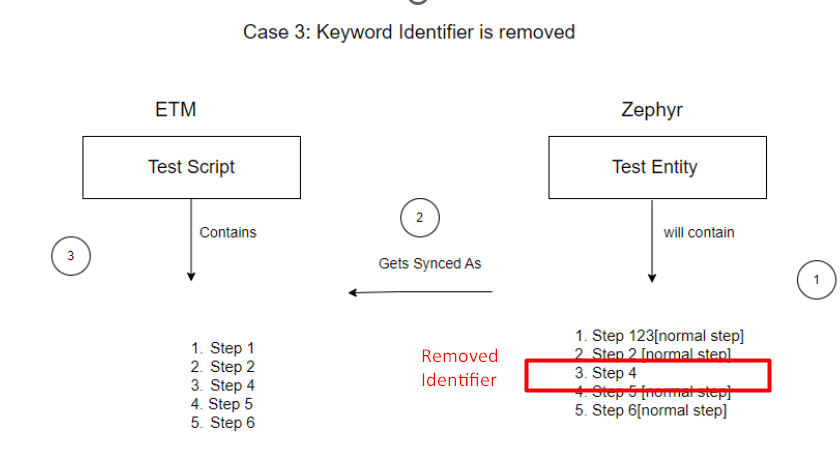
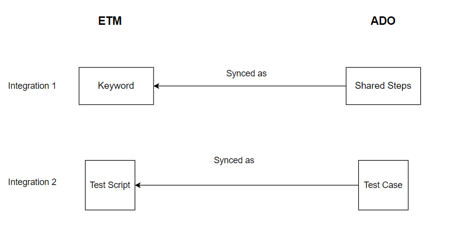

# ETM as a Source  

When **ETM is the source** and the **target system does not support Keywords**, the keywords entity is synced as regular test steps.  

OpsHub **preserves a reference** to the original keyword by appending a special identifier to the step description.  

Integration required:  

<p align="center">
  
</p>

This allows:  
- Syncing **Test steps to keywords** when syncing back to ETM.  
- Maintaining **step-level traceability** across systems.  

## Keyword Identifier  
- Format: `[OH_KY_DO_NOT_EDIT:keyword:<ID>]`  
- Example: `[OH_KY_DO_NOT_EDIT:keyword:38]`

- Placed at the **end of the step description**.  
- Used to track keyword-to-step mapping.  

## Guidelines  
- You can edit the step content, but:  
- **Do not delete or change** the identifier.  
- Add custom content **before** the identifier, if needed.  
- Modifying or removing the identifier may **break reverse sync** or lead to **loss of traceability**.  

# ETM as a Target with Non-Keyword Support  

When syncing from a non-keyword supported connector like **Zephyr back to ETM**, keyword preservation follows these rules:  

- In Zephyr-to-ETM synchronization, we **do not support creating new keywords** once they have already been created.  
- Therefore, if a user:  
- A keyword has two steps synced to Zephyr with indexes `1` and `2`, both containing the identifier `OH_KY_DO_NOT_EDIT:keyword_id`.  
  - During reverse sync (ETM → Zephyr), if the identifier is removed from step `2`, that step is still part of the keyword since step `1` retains it.  
  - The keyword in ETM remains unchanged.  
- If the identifier is removed from **both steps** in Zephyr:  
  - Those steps **lose traceability** and sync as **regular test steps** in ETM.  

## Important Behavior  
- If all steps related to a keyword are removed from Zephyr:  
- The corresponding keyword is also removed from ETM.  

## Side Effect in Reverse Sync  
- If only some keyword steps are removed in Zephyr:  
- The keyword still exists in ETM.  
- During the next sync from ETM to Zephyr:  
  - All keyword steps (including previously removed ones) will be re-synced.  
  - Ensures consistency with ETM but may **reintroduce deleted steps** in Zephyr.  

<p align="center">

</p>

## Preventing Keyword Step Resync  
- If users **do not want to sync keyword steps** from ETM to Zephyr:  
- They must use **advanced XSLT** logic.  
- This logic should **filter out steps** that lack a valid keyword identifier (`[OH_KY_DO_NOT_EDIT:keyword:<ID>]`) in their description.  
- This helps maintain control and avoid syncing undesired keyword steps back to Zephyr.  

# ETM to Target with Keyword Support [Supports Keyword Write]  

Since ADO supports **Shared Steps** (a separate entity type), if users want to sync ETM **Keywords as Shared Steps**, then:  

- The **Keyword** must be mapped as an **Entity** in the integration.  
- Otherwise, if only the normal Test Script is mapped, all the same behavior as **ETM to Zephyr** applies.  

## Integration Setup  

To properly sync ETM Keywords and Test Cases to ADO, users must set up **two separate integrations**:  

1. **Shared Steps → Keywords**  
 - Requires an **advanced XSL** to transform Shared Steps into ETM-compatible Keyword format.  
2. **Test Case → Test Script**  
 - Requires an **advanced workflow**: `Default Integration Workflow -keyword.xml`  

<p align="center">

</p>  

<p align="center">

</p>  


### XSL for Syncing Shared Steps from ADO to ETM Keywords  

Below is the advanced XSL used to transform ADO Shared Steps into ETM-compatible keyword steps:  

```xml
<steps xmlns:xsl="http://www.w3.org/1999/XSL/Transform">
<xsl:for-each select="SourceXML/updatedFields/Property/Steps/com.opshub.eai.tfs.common.TestStep">
  <xsl:element name="{concat('_',position())}">
    <xsl:element name="id">
      <xsl:value-of select="testStep/id"/>
    </xsl:element>
    <xsl:element name="description">
      <xsl:value-of select="testStep/action"/>
    </xsl:element>
    <xsl:element name="expectedResult">
      <xsl:value-of select="testStep/expectedResult"/>
    </xsl:element>
    <xsl:element name="order">
      <xsl:value-of select="position()"/>
    </xsl:element>
    <xsl:element name="SourceStepId">
      <xsl:value-of select="testStep/id"/>
    </xsl:element>
    <xsl:element name="refId">
      <xsl:value-of select="testStep/ref"/>
    </xsl:element>
    <OHAttachments>
      <xsl:for-each select="eaiAttachment/OHAttachment">
        <xsl:element name="{concat('attachment_',position())}">
          <filename><xsl:value-of select="fileName"/></filename>
          <addedByUser><xsl:value-of select="addedByUser"/></addedByUser>
          <contentBase64><xsl:value-of select="contentBase64"/></contentBase64>
          <attachmentURI><xsl:value-of select="attachmentURI"/></attachmentURI>
          <updateTimeStamp><xsl:value-of select="updateTimeStamp"/></updateTimeStamp>
          <label><xsl:value-of select="label"/></label>
          <fileComment><xsl:value-of select="fileComment"/></fileComment>
          <attachmentReferenceType><xsl:value-of select="attachmentReferenceType"/></attachmentReferenceType>
          <uniqueCode><xsl:value-of select="uniqueCode"/></uniqueCode>
        </xsl:element>
      </xsl:for-each>
    </OHAttachments>
  </xsl:element>
</xsl:for-each>
</steps>
```
<p align="center">  </p>

### Additional Notes

The recommended sync order is:

1. First, sync Shared Steps as Keywords.  
2. Then, sync the original Test Cases that reference those Shared Steps to the target.  

This ensures all keyword-related references are synced correctly and consistently across the system.

