# Overview

The integration of IBM DOORS and Jira ensures that the product management and application development teams are on the same page when it comes to customer expectations and deadlines.  
On this page, we will look at the bi-directional integration of Requirement from IBM DOORS and Story from Jira.

# How to Create an Integration Between IBM DOORS – Jira

Configuring [system pre-requisites](../../integrate/integration-prerequisites.md) is mandatory for successful system configuration.  Check out the pre-requisites for [IBM DOORS](../../connectors/ibm-rational-doors.md#prerequisites) and [Jira](../../connectors/jira.md#prerequisites) systems before you proceed with the integration.  

To create an integration between IBM DOORS and Jira, you need to:

- Log in into {{SITENAME}}. The default credentials are: **User Name**: admin, **Password**: password.  

  

 
>**Note**: Proxy parameters: Before you proceed with the configuration, check whether the system is behind a proxy server. If yes, then set up [proxy parameters](../../manage/administrator/proxy-setting.md) in {{SITENAME}}.

- Click **Integrate** on the top right corner of the screen and then click the plus [+] icon.  

  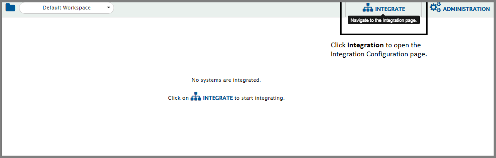

- The integration configuration page opens:  
- Enter a unique name for the integration. For example, this integration is named *IBM DOORS – Jira Integration*.  
- Click plus [+] icon adjacent to the System 1 and System 2 fields one by one to configure IBM DOORS and Jira.  

  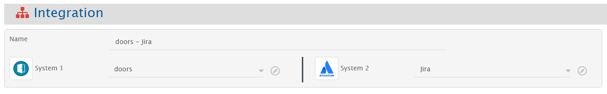

- After you save the respective configuration, the system automatically will be added to the integration form. You can now proceed with adding projects in the integration.  
Proceeding further, in the **Add Project(s) to Sync** section, select the projects you want to synchronize between IBM DOORS and Jira by clicking them.  

  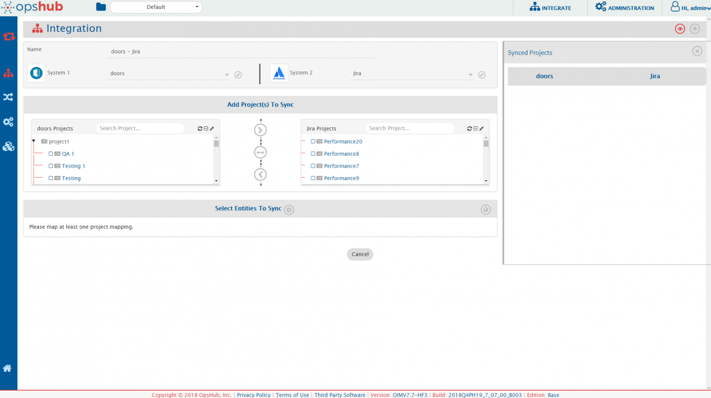

- For example, we select Demo Module 1 from IBM DOORS and DemoProject from Jira.  

  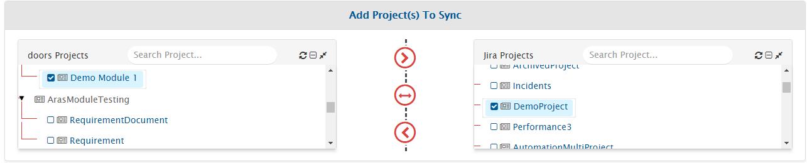

- If you select forward arrow (>) icon, the data would flow from IBM DOORS to Jira.  
- If you select backward arrow (<) icon, the data flow would from Jira to IBM DOORS.  
- If you want a bi-directional flow of data, select bi-directional arrow (<-->) icon.  

Once the direction is selected, the arrows would turn grey. We have selected the bi-directional flow.  

  

- The next step is to define entities that need to be integrated and fields that need to be integrated for every entity mapped.  
- {{SITENAME}} fetches entities available in both systems and shows them in entities list for both systems. From the **Select Entities to Sync** section, select the relevant entities for both systems. In this case, we select **Requirement** from IBM DOORS and **Story** from Jira.  

  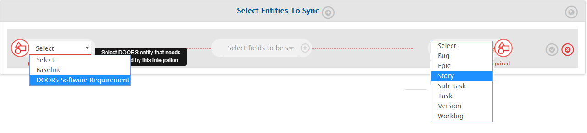

- Now, click the plus [+] icon adjacent to Select fields to be Synced to create the mapping between these two entities. You will now be navigated to the Mapping Configuration screen.  

  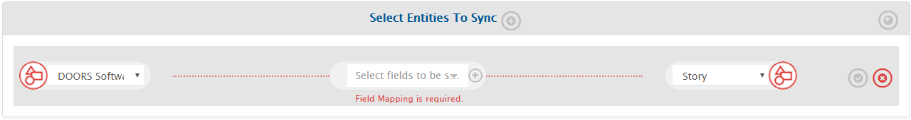

Once you come to the mapping page from the integration page, following details are automatically populated in the **Mapping section**:

- Systems  
- Projects  
- Entities  

  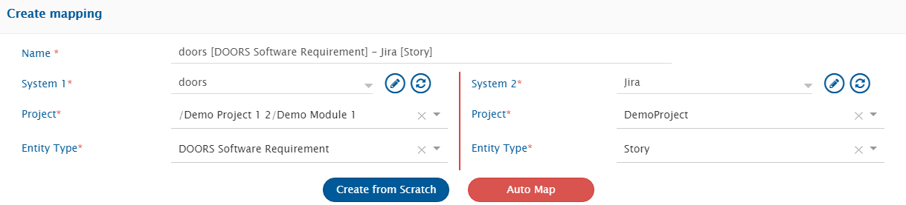

>**Note**:
For the first integration that you are configuring, we recommend you take only mandatory fields for mapping first and later edit the mapping to add more fields.  

- If you wish, change the name for the mapping in the **Name** field.  
- Now, click **Create from Scratch** to define the mapping from scratch.  
  OR  
- Click **Auto Map** to automatically map all fields with same name. OpsHub Integration Manager will allow you to remove or add more fields before saving mapping.  

OpsHub Integration Manager will load fields available in the selected entity and project fields. Refer to the image below:  

  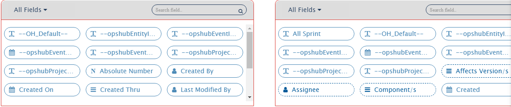

- Now, from the drop-down shown in the image below, select the **Mandatory fields** option for IBM DOORS, first.  

  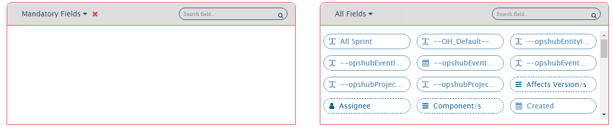

>**Note**:
The API of IBM DOORS doesn’t support mandatory fields to be fetched here, so you can directly look it up on its API.  
However, for the purpose of this integration, we will not have any mandatory fields mapped from IBM DOORS to Jira.  

Now go to Jira. Jira has a mandatory field: **Summary**.  

  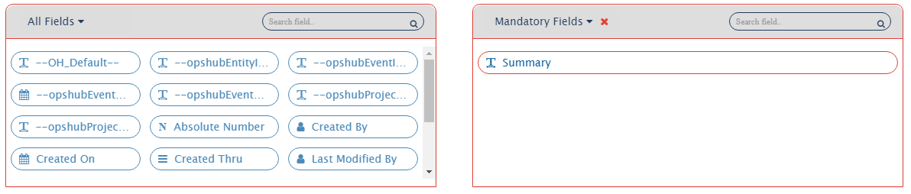

- Map the Summary field in Jira to the OH_Default field in IBM DOORS.  

>**Note**:
If Mandatory fields in one system don’t have a corresponding value in the other system, map the mandatory field in the system with the OH_Default field in the other system.  

- Now, proceed with mapping additional fields that you want to sync.  
- On the right panel, the mapped fields are displayed in the following manner:  

  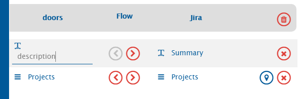

* If you want to synchronize a field only in one direction, then you can disable sync of a field by clicking [>] or [<].  
* The look-up type field, project, is marked with the value mapping icon  
  

>**Note**: Value Mapping is used to map the values for the Lookup Type fields.  
* Click  against the Projects fields to map their corresponding values.  
* From the Value Mapping pop-up that opens after clicking , select the corresponding values from both systems by clicking them. We select Demo Module 1 from IBM DOORS and DemoProject from Jira.  

  

* Click **Save** in the Value Mapping pop-up to save the mapping. It’s time to save the mapping now. Click the **Create Mapping** to create & save the mapping.  

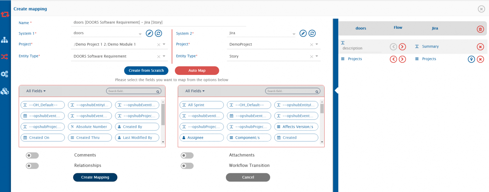  

* Once you save the mapping successfully, you will get the following pop-up at the bottom of the page.  

  

You will be further re-directed to the Integration page:  

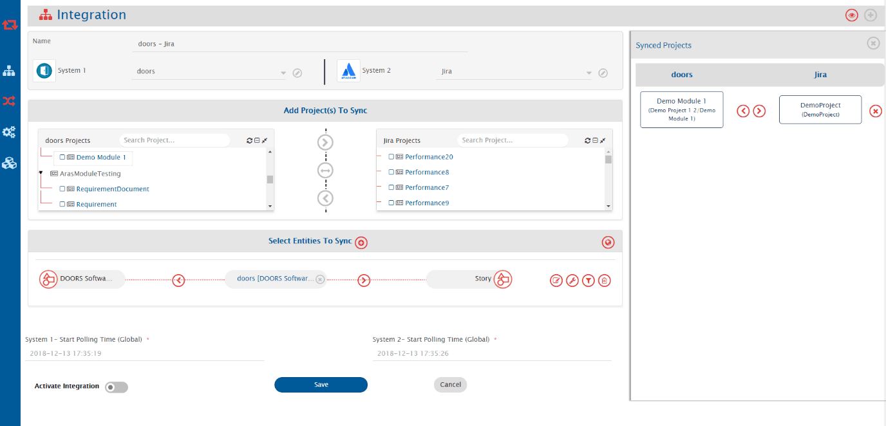  

# Set Polling Time & Activate Integration  
* Now on the integration page, in the **Start Polling Time** field, set the time to start synchronizing data in both the systems. The polling time for both systems needs to be set one by one.  

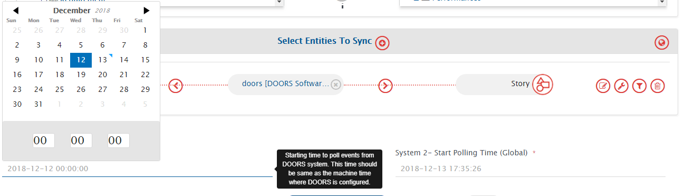  

To save the integration in active mode, slide the **Activate Integration** button to the right.  

  

* As the final step, click **Save** to save the integration.  
* The integration will be created. You will also get a pop-up at the bottom of the screen confirming the integration has been successfully configured and activated.  

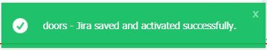  

>**Note**: At this stage, test the integration by trying to synchronize data between the specified IBM DOORS and Jira projects.  
>**Note**: You shouldn’t be using the integration user credentials to create entities in the systems or the integration will not work.  

# Additional Configurations  

Now, once you have set the basic integration in place, you can edit the integration to map entities such as Comments, Attachments, and Relationships.  

Refer to the videos on this page to learn in detail about [Comments](../../integrate/mapping-configuration.md#comments) and [Attachments](../../integrate/mapping-configuration.md#attachments) mapping.  

* Go to the Integration Page and click the Integration you want to edit. In this case, we click the IBM DOORS-Jira integration.  

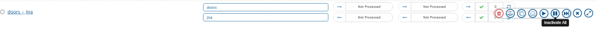  

* Once the integration configuration is open, click the edit icon as shown in the image below:  

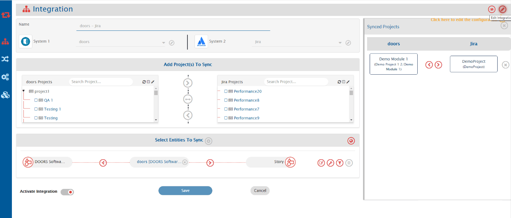  

>**Note**: You will have to de-activate an integration before you edit the integration.  

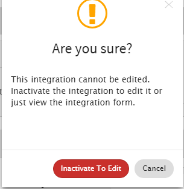  

* From the **Select Entities to Sync** section, click the mapping for which you want to enable comment and relationship synchronization.  

  

>**Note**: Mapping of attachments is not supported for this integration.  

* Once the mapping configuration page is open, click the edit icon to edit the mapping.  

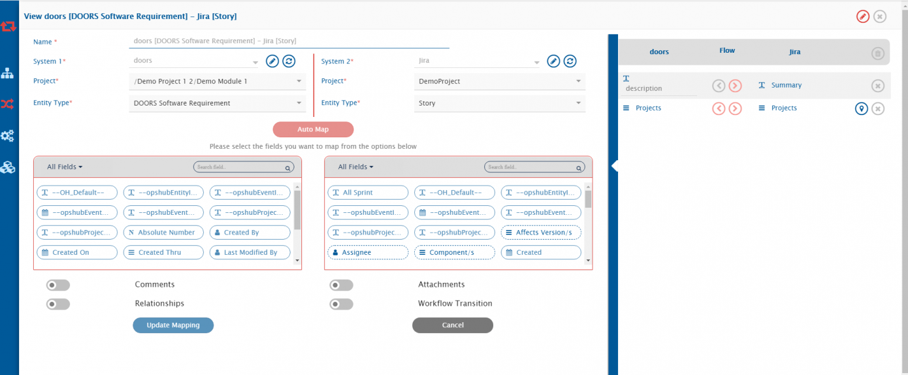  

# Map Comments and Relationships  

## Map Comments  
Refer to the video on this page to learn in detail about [Comments](../../integrate/mapping-configuration.md#comments) mapping.  

  

* For enabling comments, just toggle the comments toggle at bottom of fields mapping.  
* By default, comments will be synchronized in both directions. For changing the default behavior, click the icon next to comments.  
* If required, disable the direction in which comments need not be synchronized by clicking the [>][<] buttons.  

  

# Map Relationships  

  

* For syncing relationship and link between the entities in both systems, switch on the Relationship toggle.  
* Now, click Map Relationships.  
* Toggle the **Entity Type- Link Type** button to left to map entity types.  

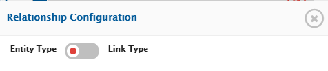  

* In the mapping, map the relationship between entities – SR in IBM DOORS to Story in Jira by selecting them from the respective boxes.  

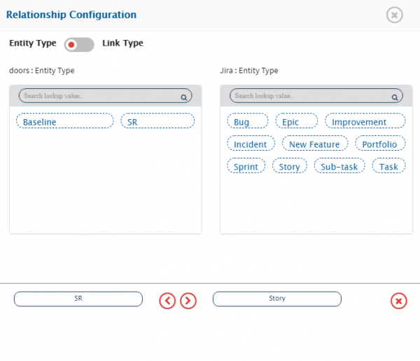  

* Click **Next** in the Relationship Configuration pop-up to map link type. We link `Oh_Childids` with `relates to`, which means SR from IBM DOORS, which is a child to the Requirement, relates to Story in Jira in the same manner.  

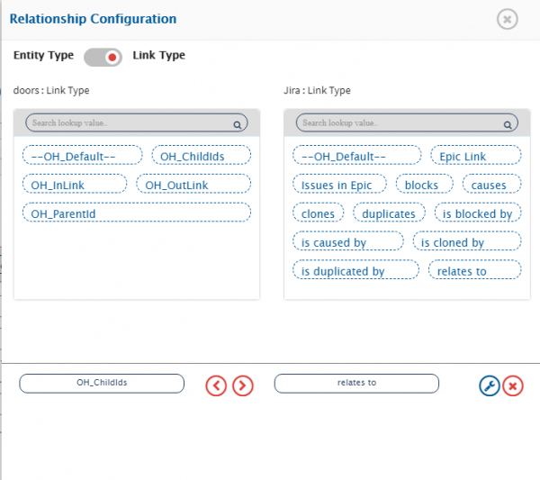  

* Now, click the **Update Mapping** to update the mapping.  

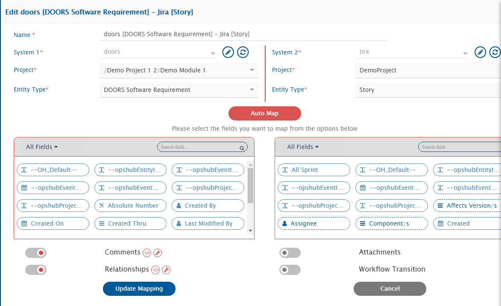  

* You will see the following pop-up at the bottom of the screen notifying the mapping is updated and you will be taken to the integration configuration page.  
* Activate the integration and save it.  

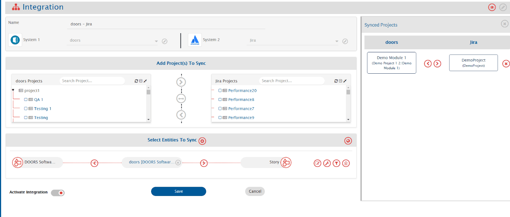  

