# Jama and TestRail Integration

Jama is a modern requirements and test management solution for complex systems development. Integrating Jama with TestRail, a comprehensive web-based test case management solution, ensures that the product management team using Jama has complete traceability for all the test entities in TestRail from Jama itself. 

## Use case: Jama and TestRail integration

**Problem statement:**  
As the test management system and requirement management system are not integrated, the product teams using the requirement management system don't have visibility into the testing progress. Lack of this information impacts their overall management of the application lifecycle.  

**Solution:**  
Integrating Jama and TestRail helps product team get real-time insights into the testing progress and efficiently manage the application lifecycle.  

**Use Case:**  
- The test team creates a Test Suite in TestRail for carrying out tests on multiple requirements. The Test Suite synchronizes to Jama as a Test Plan. The Test Plan gives visibility to the product team into the QA timelines.  
- The test team then creates Test Sections within the Test Suite to logically bifurcate different kinds of tests. The Test Sections synchronize to Jama as Test Groups.  
- The test team then writes Cases (and includes them within the respective Test Sections). The cases synchronize to Jama as Test Cases. The Product Manager, at this stage, can provide suggestions to the test team in case he/she sees a scope of improvement.  
- The test team then starts executing the Tests by creating a Test Run of the related Test Suite. The Test Run (which consists of multiple tests) synchronizes to Jama as Test Cycle. The Tests from TestRail synchronize to Jama as a Test Run.  
- When the test team completes the execution of the Test Run or finishes a particular Test, they update the Test Result(s) and that result value is updated in **Status** field (Steps) of Test Run in Jama.  

<p align="center">
  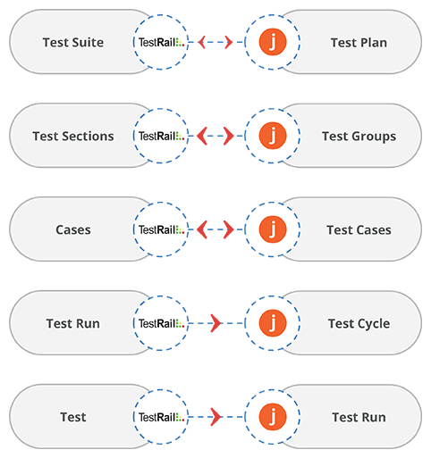
</p>

## How to create an integration between Jama and TestRail

### Pre-requisites for integration

To create an integration between Jama and TestRail, you need to:  
- First, install **<code class="expression">space.vars.SITENAME</code>**.  
- Then, configure Jama and TestRail onto **<code class="expression">space.vars.SITENAME</code>**.  

<p align="center">
  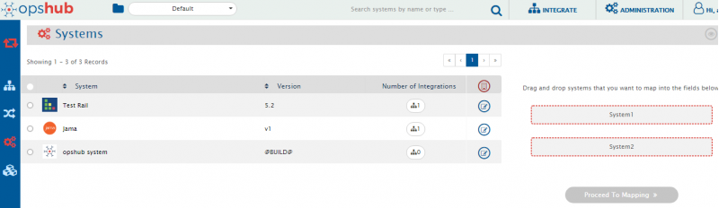
</p>

To learn how to configure Jama and TestRail, navigate to [Jama](../../connectors/jama.md) and [TestRail](../../connectors/testrail.md) pages.  

- If you want to synchronize test cases from Jama to TestRail bi-directionally, then due to TestRail's API limitation, criteria will have to be configured in Jama.  
- For this, you need to create a custom field of type **boolean**.  

### Known limitations

Before you proceed with Jama and TestRail integration, let's understand the limitations you will come across.

**Supported entities for this integration:**  
- Test Suite ↔ Test Plan  
- Section ↔ Test Group  
- Test Case ↔ Test Case  

**Notes:**  
- Section is a mandatory entity in TestRail system to create a Test Case. In Jama → TestRail integration, as per **<code class="expression">space.vars.SITENAME</code>**'s modeling structure, one pre-defined section is mapped for default mapping.  
- If a user requires syncing a Test Case in a different section corresponding to the Test Group, the following issues occur:  
  - While fetching the test case, Jama system will not provide association information of the Test Group; therefore, the test case in TestRail will have to be created with the default section provided in mapping.  
  - In TestRail, once a test case is associated with any section via API, the user **cannot change/modify** the 'section' association of the Test Case from the API.  
- If a user has mapped **Steps** field in Test entity of TestRail to **TestRun** entity of Jama, then status of each Step in TestRun will be the status of the entire Test Entity and not individual status of the step. Reason: Model mismatch between entities of TestRail and Jama.  

### Integration configuration

Integration configuration is the process of defining the flow, conditions, time, and parameters for integrating the entities between two systems.  

Follow the steps given below to integrate Jama and TestRail:

1. Click the **Integrate** button on the screen.  

<p align="center">
  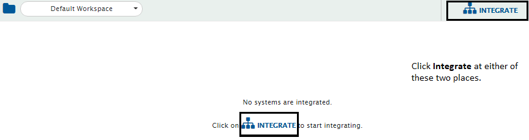
</p>

2. Click the plus icon [+] on the top right corner of the screen. You will be prompted to enter the **Integration Name** and name of systems you want to integrate.  

<p align="center">
  
</p>

3. Enter a unique name for the integration. Example: **TestRail–Jama Integration**.  
4. Click the plus sign [+] adjacent to **System 1** and **System 2** fields. From the drop-down lists, select **Jama** and **TestRail** respectively.  

<p align="center">
  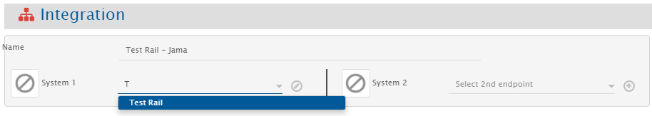
</p>

5. In the **Add Project(s) to Sync** section, select the projects you want to synchronize between Jama and TestRail. Example: **CTP Target** project in TestRail and **New testing** project in Jama.  

<p align="center">
  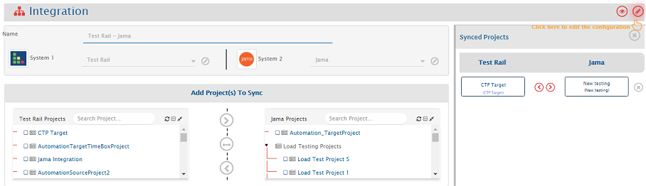
</p>

6. Click the bi-directional arrow (↔) between the projects to create bi-directional synchronization.  
7. In the **Select Entities to Sync** section, select the entities you want to synchronize between Jama and TestRail. Multiple entities can be synchronized in one integration.  

**Example entities mapping:**  

| Jama       | TestRail   | Direction      |  
|------------|------------|----------------|  
| Test Plan  | Test Suite | Bi-directional |  
| Test Group | Section    | Bi-directional |  
| Test Case  | Case       | Bi-directional |  
| Test Cycle | Test Run   | Uni-directional |  
| Test Run   | Test       | Uni-directional |  

8. From **Select Entities to Sync**, choose **Test Suite** in TestRail and **Test Plan** in Jama.  

<p align="center">
  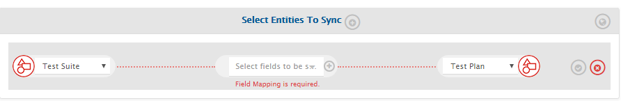
</p>

9. Click the plus button [+] adjacent to **Select fields to be synced** to create the mapping. You will now be navigated to **Mapping Configuration** screen.  

### Mapping Test Suite in TestRail to Test Plan in Jama

Once you come to the mapping page from the integration page, the following details are automatically populated:  
- Systems  
- Projects  
- Entities  

Give a unique name for the mapping in the **Name** field. Example:  
**1. TestRail [Test Suite] – Jama [Test Plan]**  

<p align="center">
  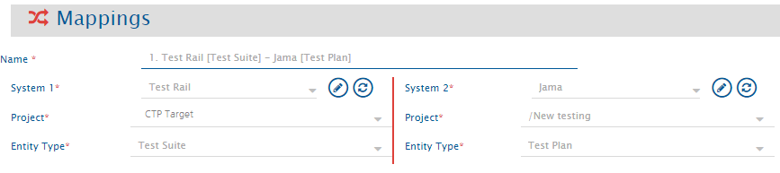
</p>

1. Click **Create from Scratch** button to define the mapping from scratch.  
2. Search and select **Description** field from TestRail and map it to **Contents** field in Jama.  
3. Search and select **Name** field from TestRail and map it to **Name** field in Jama.  

<p align="center">
  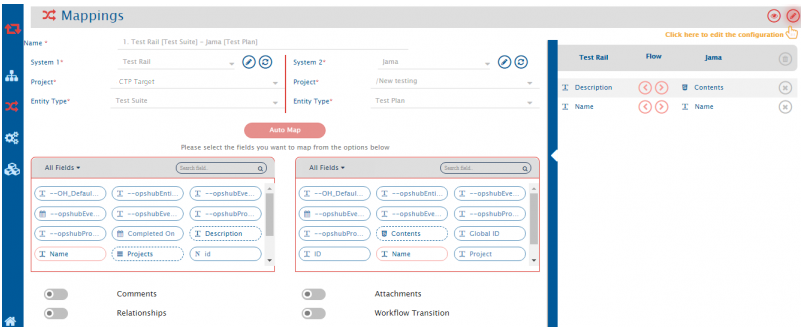
</p>

4. Click **Save Mapping** to save. You will be directed back to the integration page.  

>**Note**: The fields mapped here are examples; you can map more fields as per your requirement.

### Mapping Section in TestRail to Test Group in Jama

* From entity types drop-down lists, select **Section** in TestRail and **Test Group** in Jama.  
* Click the plus button `[+]` adjacent to **Select fields to be synced** to create the mapping between these two entities. You will now be navigated to the Mapping Configuration screen.  

Once you come to the mapping page from the integration page, the following details are automatically populated in the Mapping section:  
* Systems  
* Projects  
* Entities  

Give a unique name for the mapping in the **Name** field. For example, the name of the mapping between Test Plan in Jama and Test Suite in Test Rail is:  
**2. Test Rail [Section] - Jama [Test Group]**  

Now, click **Create from Scratch** button to define the mapping from scratch.  
* Search and select a user name value (Example: 'AutomationSyncUser') field from **All fields** box for TestRail and **Assigned To** from the **All fields** box for Jama.  
* Search and select the **Name** field from **All fields** box for TestRail and **Name** from the **All fields** box for Jama.  

<p align="center">
  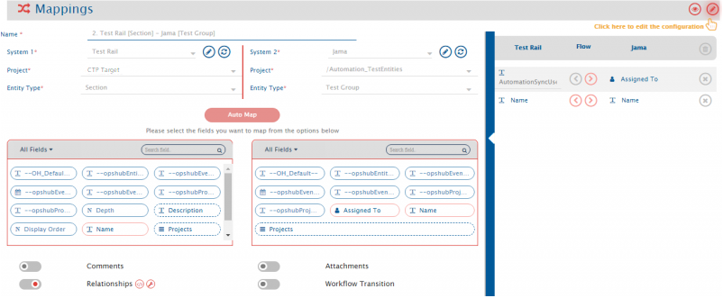
</p>

>**Note**:The fields mapped here are examples; you can map more fields as per your requirement.  

## <span style="color:#005999">Relationship Mapping</span>

The Relationships feature synchronizes the relationship between the selected entities.  

From the **Entity type** boxes for the systems:  
* Select **Test Suite** from TestRail and **Test Plan** to Jama and map them bi-directionally.  
* Select **Case** from TestRail and **Test Case** from Jama and map them bi-directionally.  

<p align="center">
  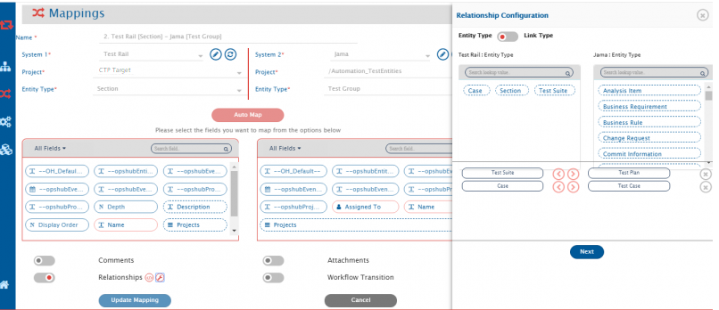
</p>

Now, map **Link types** between Jama and TestRail entities:  
* From the **Link type** boxes for the systems: select **Suite** from TestRail and **Test Plan** to Jama and map them bi-directionally.  
* Then select **Case** from TestRail and **Test Case** from Jama and map them bi-directionally.  

<p align="center">
  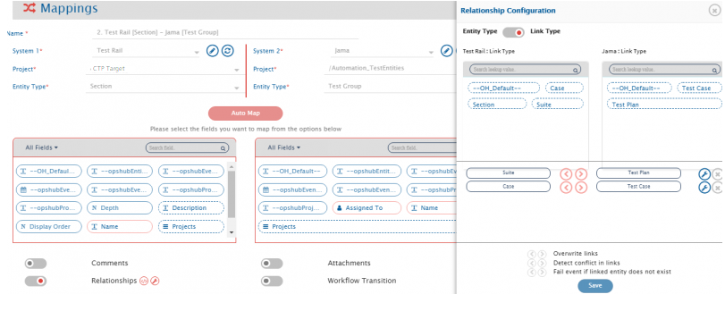
</p>

Click **Save Mapping** button to save the mapping. You will be directed back to the integration page.  

>**Note**:The fields mapped here are examples; you can map more fields as per your requirement.  

### Mapping Case in TestRail to Test Case in Jama

* From the entity type drop-down lists, select **Case** in TestRail and **Test Case** in Jama.  
* Click the plus button `[+]` adjacent to **Select fields to be synced** to create the mapping between these two entities. You will now be navigated to the Mapping Configuration screen.  

Once you come to the mapping page from the integration page, the following details are automatically populated in the Mapping section:  
* Systems  
* Projects  
* Entities  

Give a unique name for the mapping in the **Name** field. For example:  
**3. Test Rail [Case] - Jama [Test Case]**  

Click **Create from Scratch** button to define the mapping from scratch.  
* Search and select the **Section** field from **All fields** box for TestRail and **Default Test Group** from **All fields** box for Jama.  
* Search and select the **Title** field from **All fields** box for TestRail and **Name** from **All fields** box for Jama.  
* Search and select **Test Cases** (location under which you want to save the test cases) field from **All fields** box for TestRail and **Location** from **All fields** box for Jama.  
* Search and select **Steps** field from **All fields** box for TestRail and **Steps** from **All fields** box for Jama.  
* Search and select **Priority** field from **All fields** box for TestRail and **Priority** from **All fields** box for Jama.  

<p align="center">
  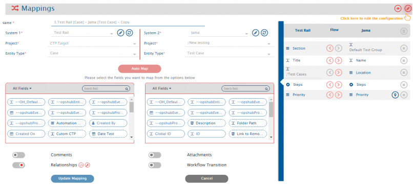
</p>

## <span style="color:#005999">Relationship Mapping</span>

From the **Entity type** boxes for the systems: select **Section** from TestRail and **Test Group** from Jama and map them bi-directionally.  

<p align="center">
  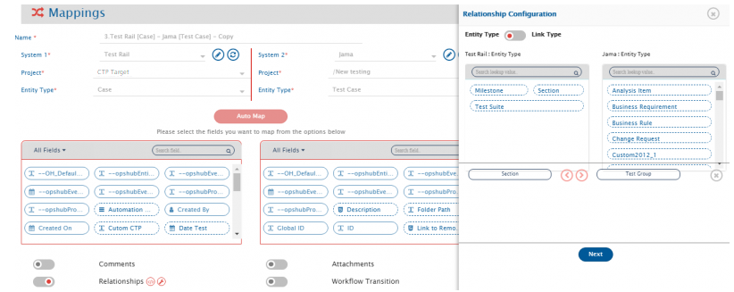
</p>

Now, map **Link types** between Jama and TestRail entities: select **Section** from TestRail and **Test Group** from Jama and map them bi-directionally.  

<p align="center">
  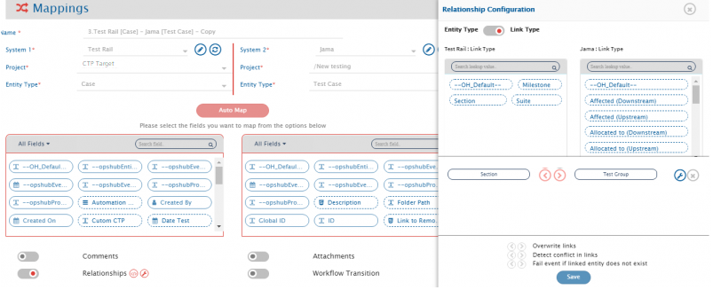
</p>

Click **Save Mapping** button to save the mapping. You will be directed back to the integration page.  

>**Note**: The fields mapped here are examples; you can map more fields as per your requirement.  

## <span style="color:#de413a">Criteria Configuration</span>

* In TestRail, there is no API to update Section in which test cases exist, and in Jama, test cases can't be linked to Test Group at the time of creation.  
* To bridge this model mismatch, configure criteria on Jama test cases so that the integration polls test cases only when criteria is met.  
* For example, a custom field of type 'boolean' is used for criteria. Only the test cases that have value 'true' in the 'boolean' field will be synchronized. Name of the boolean field: **syncedtotestrail (t/f)**.  

### Mapping Test Run in TestRail to Test Cycle in Jama

* From entity type drop-down lists, select **Test Run** in TestRail and **Test Cycle** in Jama.  
* Click the plus button `[+]` adjacent to **Select fields to be synced** to create the mapping between these two entities. You will now be navigated to the Mapping Configuration screen.  

Once you come to the mapping page from the integration page, the following details are automatically populated in the Mapping section:  
* Systems  
* Projects  
* Entities  

Give a unique name for the mapping in the **Name** field. For example:  
**4. Test Rail [Test Run] - Jama [Test Cycle]**  

Click **Create from Scratch** button to define the mapping from scratch.  
* Search and select **Created On** field from **All fields** box for TestRail and **End Date** field from **All fields** box for Jama.  
* Search and select **Created On** field from **All fields** box for TestRail and **Start Date** field from **All fields** box for Jama.  
* Search and select **Name** field from **All fields** box for TestRail and **Name** field from **All fields** box for Jama.  
* Search and select **Description** field from **All fields** box for TestRail and **Description** field from **All fields** box for Jama.  

<p align="center">
  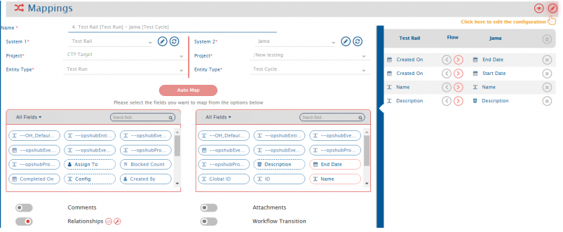
</p>

## <span style="color:#005999">Relationship Mapping</span>

From the **Entity type** boxes for the systems: select **Test Suite** from TestRail and **Test Plan** in Jama and map them in forward direction (TestRail to Jama).  

<p align="center">
  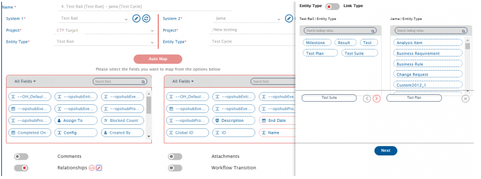
</p>

From the **Link type** boxes for the systems: select **Suite** from TestRail and **Test Plan** from Jama and map them in forward direction (TestRail to Jama).  

<p align="center">
  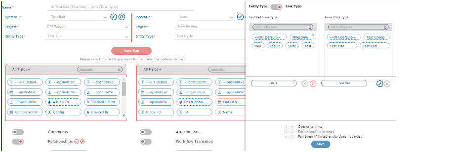
</p>

Click **Save Mapping** button to save the mapping. You will be directed back to the navigation page.  

>**Note**: The fields mapped here are examples, you can map more fields as per your requirement.

### Mapping Test in TestRail to Test Run in Jama

* From entity type drop-down lists, select **Test** in TestRail and **Test Run** in Jama.  
* Click the plus button `[+]` adjacent to **Select fields to be synced** to create the mapping between these two entities. You will now be navigated to the Mapping Configuration screen.  

Once you come to the mapping page from the integration page, the following details are automatically populated in the Mapping section:  
* Systems  
* Projects  
* Entities  

Give a unique name for the mapping in the **Name** field. For example:  
**5. Test Rail [Test] - Jama [Test Run]**  

Click **Create from Scratch** button to define the mapping from scratch.  
* Search and select **Title** field from **All fields** box for TestRail and **Name** field from **All fields** box for Jama.  
* Search and select **Steps** field from **All fields** box for TestRail and **Steps** field from **All fields** box for Jama.  

<p align="center">
  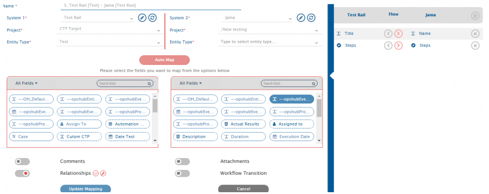
</p>

>**Note**: **For Steps field**: The Steps in TestRail can be mapped to Steps in Jama for a particular case/test run. But in Jama, there is an additional field within Steps named **status**, whereas in TestRail, **status** is a generic field. To sync the status from TestRail's test entity to Jama's test run entity, advanced XSL is created.  

* Click  against the field name toward the right end corner to amend the default XSL. Replace the default XSL with the XSL given below:

```json
<testRunSteps> <br>
  <xsl:for-each xmlns:xsl="http://www.w3.org/1999/XSL/Transform" select="SourceXML/updatedFields/Property/custom__steps__separated/com.opshub.eai.TestStep"><br>
    <xsl:element name="{concat('_',order)}"><br>
      <xsl:element name="order"><br>
        <xsl:value-of select="order"/><br>
      </xsl:element><br>
      <xsl:element name="step"><br>
        <xsl:value-of select="step"/><br>
      </xsl:element><br>
      <xsl:element name="expected"><br>
        <xsl:value-of select="expected"/><br>
      </xsl:element><br>
      <xsl:element name="description"><br>
        <xsl:value-of select="description"/><br>
      </xsl:element><br>
      <xsl:element name="calledTestCaseId"><br>
        <xsl:value-of select="calledTestCaseId"/><br>
      </xsl:element><br>
      <xsl:element name="additionalFields"><br>
		<xsl:element name="status"><br>
			<xsl:variable name="xPathVariable" select="/SourceXML/updatedFields/Property/status__id"/><br>
		<xsl:choose><br>
		<xsl:when test="$xPathVariable='passed'"><br>
			<xsl:value-of select="'PASSED'"/><br>
			</xsl:when><br>
			<xsl:when test="$xPathVariable='failed'"><br>
			<xsl:value-of select="'FAILED'"/><br>
			</xsl:when><br>
          <xsl:when test="$xPathVariable='blocked'"><br>
			<xsl:value-of select="'FAILED'"/><br>
			</xsl:when><br>
          <xsl:when test="$xPathVariable='retest'"><br>
			<xsl:value-of select="'FAILED'"/><br>
			</xsl:when><br>
          <xsl:when test="$xPathVariable='untested'"><br>
			<xsl:value-of select="'FAILED'"/><br>
			</xsl:when><br>
		</xsl:choose><br>
		</xsl:element><br>
	  </xsl:element><br>
      <OHAttachments><br>
        <xsl:for-each select="SourceXML/updatedFields/Property/OHAttachments/OHAttachment"><br>
          <xsl:element name="{concat('attachment_',position())}"><br>
            <filename><br>
              <xsl:value-of select="fileName"/><br>
            </filename><br>
            <addedByUser><br>
              <xsl:value-of select="addedByUser"/><br>
            </addedByUser><br>
            <contentLength><br>
              <xsl:value-of select="contentLength"/><br>
            </contentLength><br>
            <contentType><br>
              <xsl:value-of select="contentType"/><br>
            </contentType><br>
            <contentBase64><br>
              <xsl:value-of select="contentBase64"/><br>
            </contentBase64><br>
            <attachmentURI><br>
              <xsl:value-of select="attachmentURI"/><br>
            </attachmentURI><br>
            <updateTimeStamp><br>
              <xsl:value-of select="updateTimeStamp"/><br>
            </updateTimeStamp><br>
            <label><br>
              <xsl:value-of select="label"/><br>
            </label><br>
            <fileComment><br>
              <xsl:value-of select="fileComment"/><br>
            </fileComment><br>
            <attachmentType><br>
              <xsl:variable name="xPathVariable" select="attachmentType"/><br>
              <xsl:value-of select="attachmentType"/><br>
            </attachmentType><br>
          </xsl:element><br>
        </xsl:for-each><br>
      </OHAttachments><br>
    </xsl:element><br>
  </xsl:for-each><br>
</testRunSteps><br>
```
>**Note**: **TestRail and Jama Model Mismatch for Steps field:**  
In Jama, the information about the **"Steps"** of **TestRun Entity** cannot be updated after its creation, except for the **"status"** information of the Steps field. In TestRail, the information about the **"Steps"** in **Test Entity** can be updated after creation.  

So when the **Steps field** of Test in TestRail is synced with the **Steps field** of TestRun in Jama, it can cause failure as:  

> "Mismatch in the number of steps. Cannot execute Test Run."  

To avoid this failure, below are the two possible approaches:

- Map the TestRail **"Steps"** field of Test with the **"Steps"** field of TestRun of Jama and set the **"Sync when"** setting to **"Create"**, avoiding update events to sync.  
- Another solution is to use the sample advanced mapping below, which synchronizes the updated **"status"** information of the Steps field of TestRail to Jama on update in TestRail.  
- **Note:** In the sample mapping, replace `<<source_project_key>>` and `<<target_project_key>>` with the actual source project key and target project key, respectively, for which the integration is configured. The `<<target_entity_id>>` should be replaced with the XPath of the field of TestRail which contains the entity ID of Jama.

```json
<testRunSteps xmlns:map="http://java.util.Map" xmlns:str="http://java.lang.String" xmlns:xsl="http://www.w3.org/1999/XSL/Transform"><br>
	<xsl:variable name="xPathVariable" select="SourceXML/opshubProjectKey" /><br>
   	<xsl:variable name="targetProjectKey"><br>
		<xsl:choose><br>
			<xsl:when test="$xPathVariable='<<source_project_key>>'"><br>
				<xsl:value-of select="'<<target_project_key>>'"/><br>
			</xsl:when><br>
		</xsl:choose><br>
	</xsl:variable><br>
	<xsl:choose><br>
		<xsl:when test="SourceXML/opshubEventType='Update'"><br>
			<xsl:variable name="statusVar" select="SourceXML/updatedFields/Property/status__id"/><br>
			<xsl:variable name="stepsMap" select="utils:getEntityFieldValueAsObject($workflowId,$targetSystemId,$targetProjectKey,'TSTRN','<<target_entity_id>>','testRunSteps')"/><br>
			<xsl:if test="stepsMap != ''"><br>
				<xsl:for-each select="map:keySet($stepsMap)"><br>
					<xsl:variable name="stepData" select="map:get($stepsMap, concat('',position()))"/><br>
					<xsl:variable name="descr" select="map:get($stepData,'description')"/><br>
					<xsl:variable name="expectedR" select="map:get($stepData,'expected')"/><br>
					<xsl:variable name="stepN" select="map:get($stepData,'order')"/><br>
					<xsl:element name="{concat('_',$stepN)}"><br>
						<xsl:element name="order"><br>
							<xsl:value-of select="$stepN"/><br>
						</xsl:element><br>
						<xsl:element name="expected"><br>
							<xsl:value-of select="$expectedR"/><br>
						</xsl:element><br>
						<xsl:element name="description"><br>
							<xsl:value-of select="$descr"/><br>
						</xsl:element><br>
						<xsl:element name="additionalFields"><br>
							<xsl:element name="status"><br>
								<xsl:choose><br>
									<xsl:when test="$statusVar='passed'"><br>
										<xsl:value-of select="'PASSED'"/><br>
									</xsl:when><br>
									<xsl:when test="$statusVar='failed'"><br>
										<xsl:value-of select="'FAILED'"/><br>
									</xsl:when><br>
									<xsl:when test="$statusVar='blocked'"><br>
										<xsl:value-of select="'FAILED'"/><br>
									</xsl:when><br>
									<xsl:when test="$statusVar='retest'"><br>
										<xsl:value-of select="'FAILED'"/><br>
									</xsl:when><br>
									<xsl:when test="$statusVar='untested'"><br>
										<xsl:value-of select="'FAILED'"/><br>
									</xsl:when><br>
								</xsl:choose><br>
							</xsl:element><br>
						</xsl:element><br>
					</xsl:element><br>
				</xsl:for-each><br>
			</xsl:if><br>
		</xsl:when><br>
		<xsl:otherwise><br>
			<xsl:for-each select="SourceXML/updatedFields/Property/custom__steps__separated/com.opshub.eai.TestStep"><br>
				<xsl:element name="{concat('_',order)}"><br>
					<xsl:element name="order"><br>
						<xsl:value-of select="order"/><br>
					</xsl:element><br>
					<xsl:element name="step"><br>
						<xsl:value-of select="step"/><br>
					</xsl:element><br>
					<xsl:element name="expected"><br>
						<xsl:value-of select="expected"/><br>
					</xsl:element><br>
					<xsl:element name="description"><br>
						<xsl:value-of select="description"/><br>
					</xsl:element><br>
					<xsl:element name="calledTestCaseId"><br>
						<xsl:value-of select="calledTestCaseId"/><br>
					</xsl:element><br>
					<xsl:element name="additionalFields"><br>
						<xsl:element name="status"><br>
							<xsl:variable name="xstatusVar" select="/SourceXML/updatedFields/Property/status__id"/><br>
							<xsl:choose><br>
								<xsl:when test="$xstatusVar='passed'"><br>
									<xsl:value-of select="'PASSED'"/><br>
								</xsl:when><br>
								<xsl:when test="$xstatusVar='failed'"><br>
									<xsl:value-of select="'FAILED'"/><br>
								</xsl:when><br>
								<xsl:when test="$xstatusVar='blocked'"><br>
									<xsl:value-of select="'FAILED'"/><br>
								</xsl:when><br>
								<xsl:when test="$xstatusVar='retest'"><br>
									<xsl:value-of select="'FAILED'"/><br>
								</xsl:when><br>
								<xsl:when test="$xstatusVar='untested'"><br>
									<xsl:value-of select="'FAILED'"/><br>
								</xsl:when><br>
							</xsl:choose><br>
						</xsl:element><br>
					</xsl:element><br>
					<OHAttachments><br>
						<xsl:for-each select="SourceXML/updatedFields/Property/OHAttachments/OHAttachment"><br>
							<xsl:element name="{concat('attachment_',position())}"><br>
								<filename><br>
									<xsl:value-of select="fileName"/><br>
								</filename><br>
								<addedByUser><br>
									<xsl:value-of select="addedByUser"/><br>
								</addedByUser><br>
								<contentLength><br>
									<xsl:value-of select="contentLength"/><br>
								</contentLength><br>
								<contentType><br>
									<xsl:value-of select="contentType"/><br>
								</contentType><br>
								<contentBase64><br>
									<xsl:value-of select="contentBase64"/><br>
								</contentBase64><br>
								<attachmentURI><br>
									<xsl:value-of select="attachmentURI"/><br>
								</attachmentURI><br>
								<updateTimeStamp><br>
									<xsl:value-of select="updateTimeStamp"/><br>
								</updateTimeStamp><br>
								<label><br>
									<xsl:value-of select="label"/><br>
								</label><br>
								<fileComment><br>
									<xsl:value-of select="fileComment"/><br>
								</fileComment><br>
								<attachmentType><br>
									<xsl:variable name="xPathVariable" select="attachmentType"/><br>
									<xsl:value-of select="attachmentType"/><br>
								</attachmentType><br>
							</xsl:element><br>
						</xsl:for-each><br>
					</OHAttachments><br>
				</xsl:element><br>
			</xsl:for-each><br>
		</xsl:otherwise><br>
	</xsl:choose><br>
</testRunSteps><br>

```

# <span style="color:#005999">Relationship Mapping</span>

From the **Entity type** boxes for the systems: select **Case** from TestRail and **Test Case** in Jama and map them in forward direction (TestRail to Jama), select **Test Run** from TestRail and **Test Cycle** in Jama and map them in forward direction, and select **Test Suite** from TestRail and **Test Plan** in Jama and map them in forward direction.  

<p align="center">
  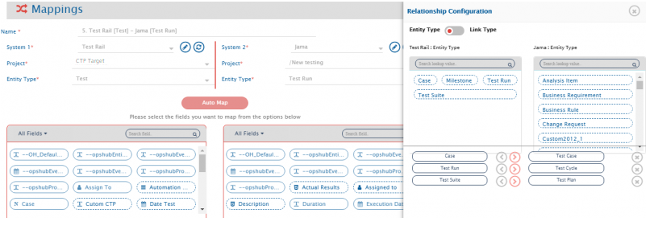
</p>

From the **Link type** boxes for the systems: select **Case** from TestRail and **Test Case** in Jama and map them in forward direction (TestRail to Jama), select **Test Run** from TestRail and **Test Cycle** in Jama and map them in forward direction, and select **Test Suite** from TestRail and **Test Plan** in Jama and map them in forward direction.  

<p align="center">
  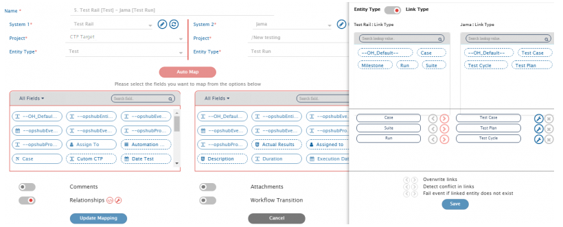
</p>

Now, click **Save Mapping** button to save the mapping. You will be directed to the integration page.  

>**Note**:The fields mapped here are examples, you can map more fields as per your requirement.  

This is how your integration page will look after all mapping is complete.  

<p align="center">
  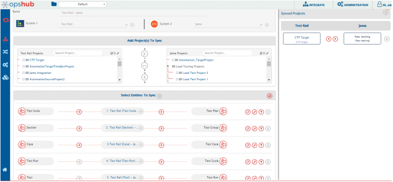
</p>

## Set Polling Time & Activate Integration

Once all the mappings are completed, in the **Start Polling Time** field, set the time to start synchronizing data in both the systems. For this integration in process, set **[Current time - 12 hours]**.  

<p align="center">
  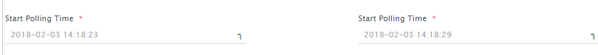
</p>

To save the integration in active mode, slide the **Activate Integration** button to the right. Select **Yes** in the **Are you sure?** pop-up.  

<p align="center">
  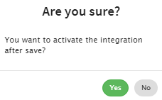
</p>

As the final step, click **Save** button to save the integration.  

The integration will be created.  

<p align="center">
  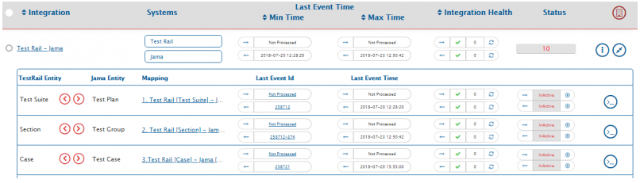
</p>

<p align="center">
  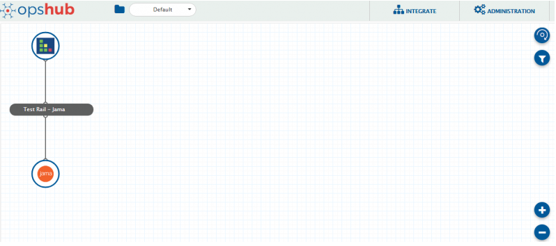
</p>


