# Overview
Best-of-breed systems such as Jira and Azure DevOps Server (TFS) bring rich functionalities to the ecosystem. The integration of Jira with Azure DevOps Services (VSTS) enhances collaboration between the project and development teams. As both the teams have visibility into each other’s task and complete context of customer expectations, the quality of product is better and the delivery cycle is shorter. There is no manual effort required to keep the teams updated on the latest work status.  
<code class="expression">space.vars.SITENAME</code> integrates Jira and Azure DevOps Services (VSTS) bi-directionally. On this page, we will discuss the bi-directional integration of:

  

# System Prerequisites
Configuring [system pre-requisites](../../integrate/integration-prerequisites.md) is mandatory for successful system configuration. Check out the pre-requisites for [Jira](../../connectors/jira.md#prerequisites) and [Azure DevOps Services (VSTS)](../../connectors/team-foundation-server.md#prerequisites) systems before you proceed with the integration.

# Integration Configuration
* Log in into <code class="expression">space.vars.SITENAME</code>. The default credentials are:  
  **User Name:** admin  
  **Password:** password
  

  

>**Note**: **Proxy parameters**: Before you proceed with the configuration, check whether the system is behind a proxy server. If yes, then set up [proxy parameters](../../manage/administrator/proxy-setting.md) in <code class="expression">space.vars.SITENAME</code>.

* Click **Integrate** on the top right corner of the screen and then click the plus [+] icon.  

  

* The integration configuration page opens:  
  - Enter a unique name for the integration. For example, this integration is named **Jira - Azure DevOps Services (VSTS) Integration**.  
  - Click the plus [+] icon adjacent to the System 1 and System 2 fields one by one to configure Jira and Azure DevOps Services (VSTS).  

  

## Configure System(s)

* Once you have fulfilled all the prerequisites and are done with the above-mentioned check, configure Jira and Azure DevOps Server (TFS) by following the steps given on [Jira](../../connectors/jira.md#system-configuration) and [Azure DevOps Services (VSTS)](../../connectors/team-foundation-server.md#system-configuration) pages respectively.  

  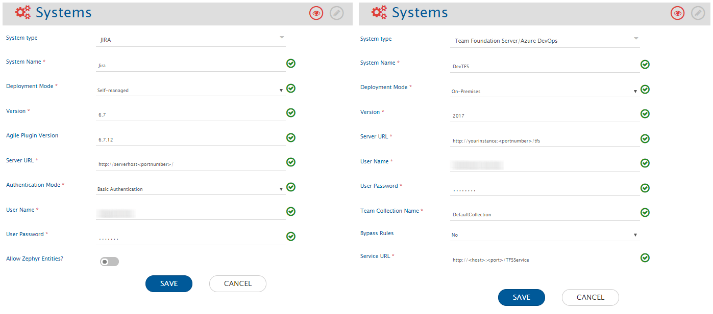

* When you save the respective system configuration pages after configuring the systems the systems will automatically be added to the integration. Proceed to adding projects and entities in the integration.  

  

## Select Projects and Entities
>**Note**: If you receive the following error: **PKIX certification path not found** and the projects and entities don’t load properly, then [import SSL certificate](../../getting-started/ssl-certificate-configuration.md) onto <code class="expression">space.vars.SITENAME</code>’s Java KeyStore before you proceed.

* In the **Add Project(s) to Sync** section, select the projects you want to synchronize between Jira and Azure DevOps Services (VSTS) by clicking them. For example, here we select <code class="expression">space.vars.SITENAME</code> Demo Project from Jira and TestProject from Azure DevOps Services (VSTS).  
* Once the projects are selected, define the source project and target project:  
  - If you select forward arrow (>) icon, the data would flow from Jira to Azure DevOps Services (VSTS).  
  - If you select backward arrow (<) icon, the data flow would from Azure DevOps Services (VSTS) to Jira.  
  - If you want a bi-directional flow of data, select bi-directional arrow (<-->) icon.  
* Once the direction is selected, the arrows would turn grey. We have selected the bi-directional flow.  

  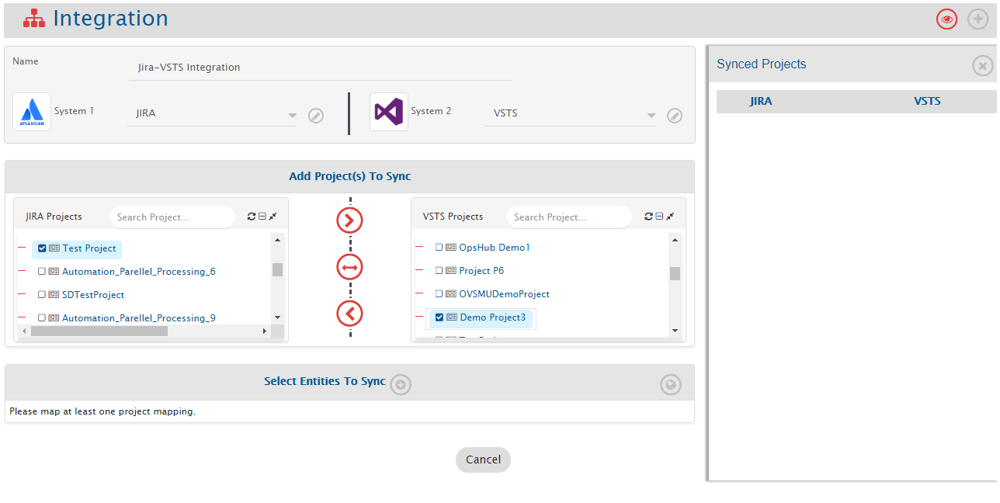

* <code class="expression">space.vars.SITENAME</code> fetches entities available in both systems and shows them in entities list for both systems. From the **Select Entities to Sync** section, select the relevant entities for both systems. In this case, we will select **Improvement** from Jira and **Feature** from Azure DevOps Services (VSTS).  
* The next step is to define the fields that need to be integrated for every entity mapped. So, once the entities are selected, click the plus [+] icon adjacent to **Select fields to be Synced** to create the mapping between these two entities. You will be navigated to Mapping Configuration screen.  

  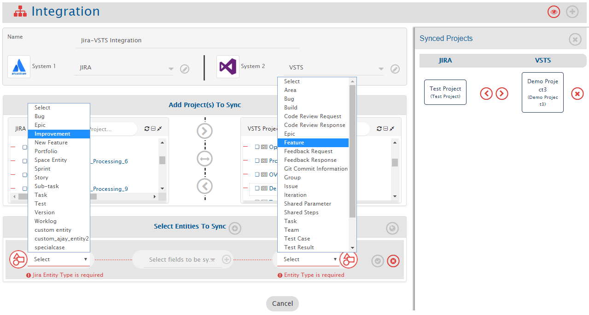

## Mapping Fields

### Entity: Improvement and Feature
* Following details are automatically populated in the Mapping section: **Systems, Projects, and Entities, and Mapping Name**. If you wish, change the name for the mapping in the Name field.  
* Now, either click **Create from Scratch** to define the mapping from scratch or click **Auto Map** to automatically map all fields with same name. Even if you select the **Auto Map**, <code class="expression">space.vars.SITENAME</code> will allow you to remove or add more fields before saving mapping. We select **Create from Scratch**.  

  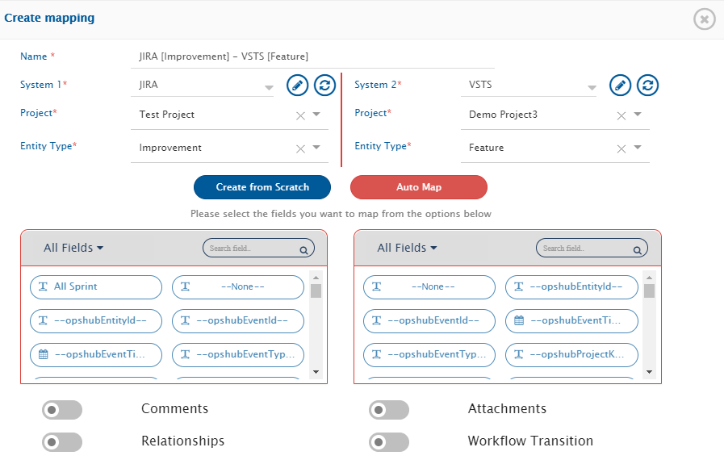

#### Mapping Mandatory Fields
* Now from the **All fields** drop-down list, select the **Mandatory fields** option.  
>**Note**: The integration would fail if the Mandatory fields are not mapped.  
* You will see, **Summary** as the Mandatory field in Jira for this instance, map it to **Title** field in Azure DevOps Services (VSTS).  
>**Note**: Mandatory fields might vary from one instance to another.  
>**Note**: Check the Mandatory fields for Jira from Jira UI as well and map them accordingly to suitable field(s) in Azure DevOps Services (VSTS).  

  

#### Mapping Look-up Type Fields
* Once you have mapped the Mandatory fields, you can now add more fields for mapping. We map the Look-up type fields first. Look-up type fields are multivalued fields. During mapping the fields for integration, the values of Look-up fields must be mapped for the mapped entities. In this case, we choose **Priority** and **Status** as the Look-up type fields to be mapped. We map:  
  - Priority → Priority  
  - Status → State  

* The Look-up type fields are marked with . Once you have mapped these fields in Jira and Azure DevOps Services (VSTS), click the icon to map their values one by one.  

  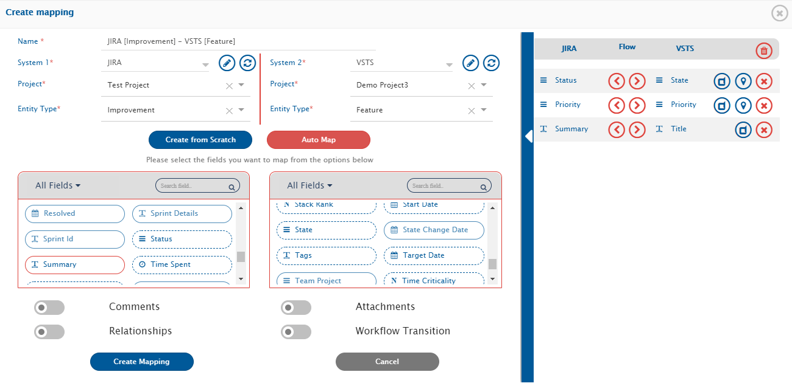

* Values for Look-up type fields may vary from one instance to another. Kindly map the values that you think are equivalent by clicking them. You have to map the values for all Look-up types fields before you proceed. For example, map the following values for Priority:  
  - Critical – 1  
  - High – 2  
  - Medium – 3  
  - Low – 4  

* You can map values for Status-State fields accordingly.  
* Now, save the value mapping.  
* Then click the **Create Mapping** button to save the mapping.  
* Once you save the mapping successfully, you will be further re-directed to the Integration page.  

  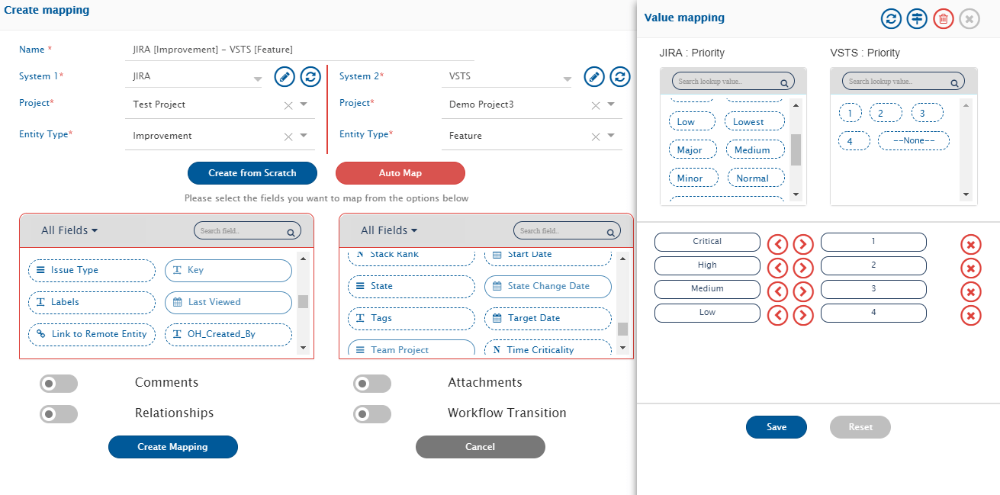

* Default Mapping is used to write default value to target field in case if there is no value coming from mapped source fields. Click **Default Mapping** to define the default mapping. The Default Mapping pop-up opens.  

* For user mapping, default value should be configured in form of user name or email as user name as expected by target end-point.  
* For user mapping, default value will not be written to target even if matching user not found in target. This will be done only if nothing coming from mapped source field.  

  

#### Mapping Rich Text Fields
* A rich-text field provides editing tools to customize the text entered in the field. We can map rich text fields with similar values from both the systems, for example, in this case, we map **Summary** from Jira to **Title** in Azure DevOps Services (VSTS).  
* Click **Create Mapping** to save the mapping.  
* Once you save the mapping successfully, you will be further re-directed to the Integration page.  
* If you do not wish to add more entities, save the integration and activate it.  

  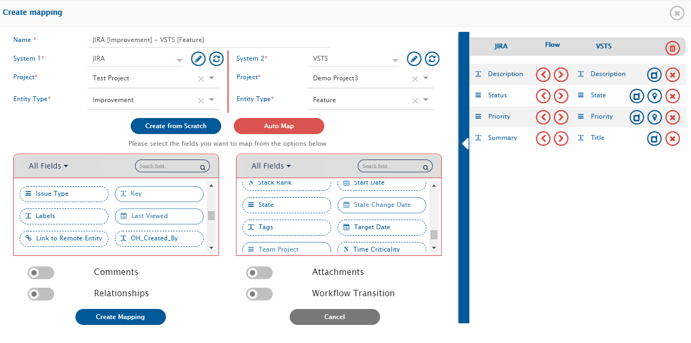

### Entity: Bug and Bug
* From the **Select Entities to Sync**, select the relevant entities for both systems. In this case, we will select **Bug** from Jira and **Bug** from Azure DevOps Services (VSTS). Create a Mapping for these entities as well.  
* Click the adjacent mapping to **Select fields to be Synced** to create the mapping between these two entities. You will be navigated to Mapping Configuration screen.  

  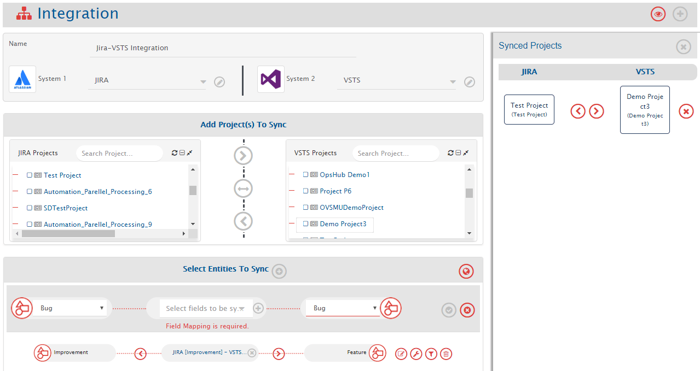

* You can refer to the [previous mapping](#mapping-mandatory-fields) and follow the same steps further.  
* It is time to save this mapping now. Once the mapping is created, click the **Create Mapping** to create & save this mapping as well.  
* The following screenshot shows a reference mapping for these entities. Once you save the mapping successfully, you will be further re-directed to the Integration page.  

  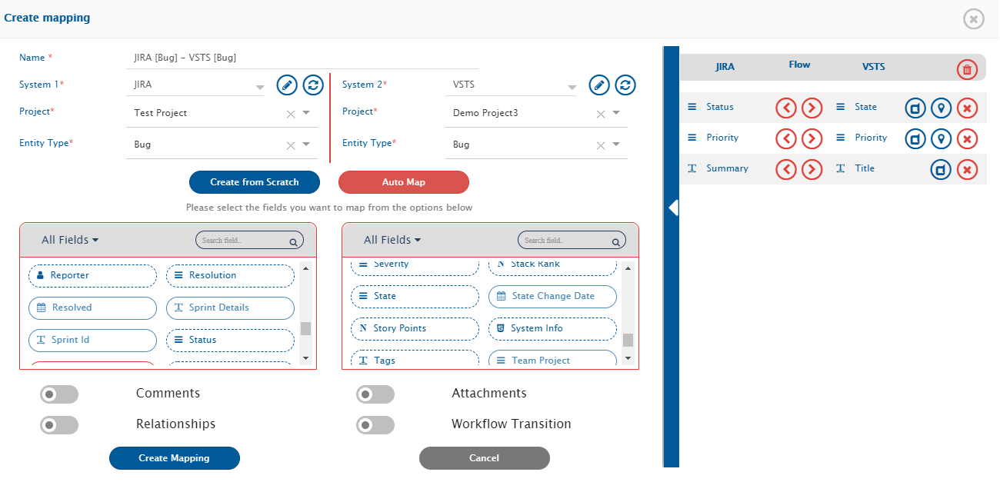

## Comments and Attachments Mapping
At this stage, you can also map entities such as comments and attachments. Refer to the videos on this page to learn in detail about [Comments](../../integrate/mapping-configuration.md#comments) and [Attachments](../../integrate/mapping-configuration.md#attachments) mapping.

## Configure Filter(s) (Optional)

- Criteria Filter helps in integration of subset of entities based on some conditions. For example, user can specify that only bugs with high priority are to be synchronized or tickets that are closed should be synchronized. Once the entity meets the criteria, it is always in synchronization, even after the criteria changes.  
- Criteria Configuration can be applied in both the directions, forward direction would mean Jira would be the source system and backward direction would mean Azure DevOps Services (VSTS) would be the source system.  

>**Note**: It is not a Mandatory step for integration and if no filter needs to be applied on the entities to be synchronized, this step can be skipped.

- If you want to specify conditions for synchronizing an entity between Jira and Azure DevOps Services (VSTS) to be integrated, use the Criteria Configuration feature. For example, we only want to synchronize fields with Priority 1 to Story from Jira to Azure DevOps Services (VSTS) then we set the configuration as shown here:  
  - Click the configuration-criteria icon against the mapping on which you are going to apply the criteria.  
  - The Criteria Configuration pop-up opens. In the pop-up, select **Yes** from **Configure Criteria** list.  
  - Enter the criteria query.  

>**Note**: The query is different for different systems. You can refer to more details about Criteria Configuration in [Jira](../../connectors/jira.md#criteria-configuration)
 and [Azure DevOps Services (VSTS)](../../connectors/team-foundation-server.md#criteria-configuration) from their respective configuration pages.

- Select **In Database** from the **Select criteria storage type** drop-down list.  

  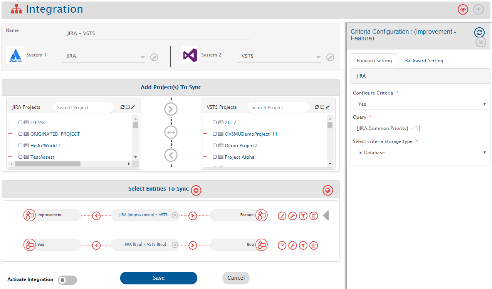

## Save and Activate Integration

- To save the integration in active mode, slide the **Activate Integration** button to the right.  
- As the final step, click **Save** to save the integration.  

  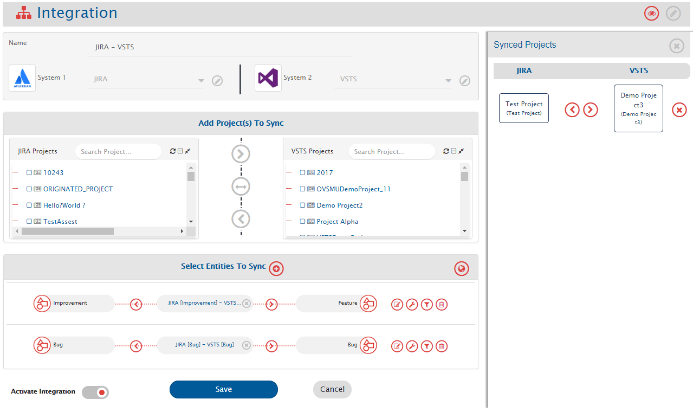

- The integration will be created. You will also get a pop-up at the bottom of the screen confirming the integration has been successfully configured and the integration will be listed in the integrations list.  

  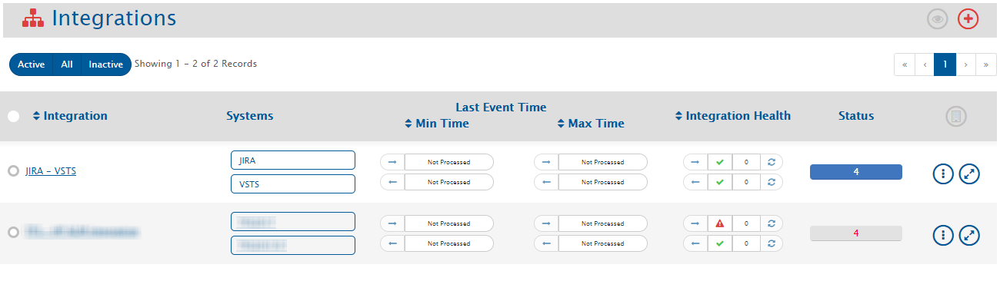

## Test the Integration

- At this stage, test the integration by trying to synchronize data between the specified Jira and Azure DevOps Services (VSTS) projects.  

>**Note**: You should not be using the integration user credentials to create entities in the systems as in this case the integration will not work.

- Create/Update event in the source system and check whether the event synchronizes to the target system. Wait for one minute for the data to synchronize. If you face any issue, please refer this page for [possible reasons and their fix](../../help-center/faqs/general.md).  

## Additional Configurations

#### Mapping User Fields  

Choose the mapping in which you want to make changes. We choose Jira [Bug] – TFS2017 [Bug] mapping. Edit this map to add the changes.  
We will now add user-types of fields such as Author, Updated By, etc. in the mapping. The user fields vary from one system to another.  
We will map the user fields: **Assignee** in Jira to **Assigned To** in Azure DevOps Server (TFS). You are free to choose other fields.  

>**Note**: User fields are mapped by email id. If e-mail ids of the users are same in both the systems, it will be mapped automatically, but if the email ids are not same, you will have to update the [one-to-one XSL](../../integrate/mapping-configuration.md#value-mapping-using-excel-sheet) mapping.

  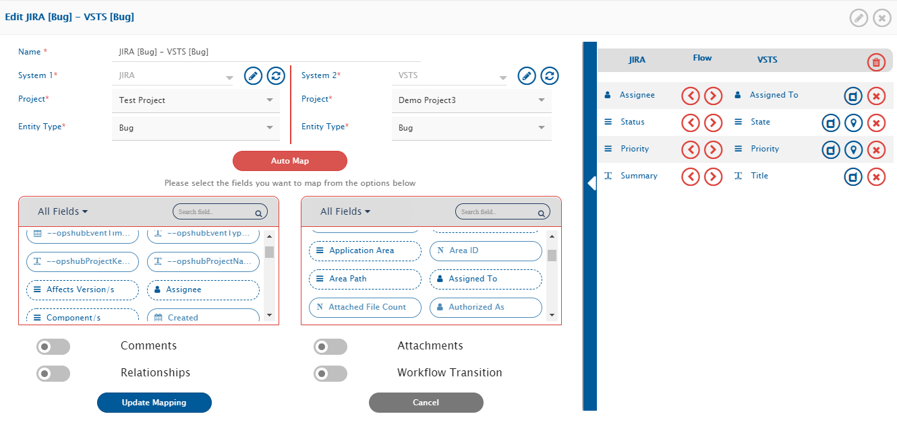

- Once the additional configurations are completed successfully, update the mapping, activate the integration, and save it again.
