Jira is a popular bug tracking, issue tracking, and project management functions whereas ServiceNow provides service management software as a service by way of a single data model enterprise cloud platform. The integration of Jira with ServiceNow helps the customer service and development teams communicate efficiently, in real time. This, in turn, helps resolve the customer issues faster.

## Use Case: Jira-ServiceNow integration

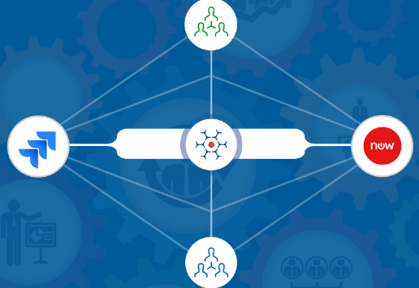

**Problem Statement**: The support team receives a ticket from a customer, which it identifies as a 'defect', and sends to the development team for resolution. The development team responds that the 'identified defect' is a 'known defect' and is in process of resolution before the next release.

**Solution**: When Jira and ServiceNow are bi-directionally integrated using <code class="expression">space.vars.SITENAME</code>, the status of this defect would have already synchronized to ServiceNow as 'In Progress' along with the expected resolution date. The response to customer could have been faster.

* Multiple customers report similar issues related to the product.
* The support team identifies these tickets and reports them as a ‘problem’ to the backend team.
* The development team identifies a ‘defect’ in the solution. They add a comment to the ‘defect’ stating that it will be resolved in the next release (and expected date).
* The support team receives the information as ‘comments’ in ServiceNow.
* When a new customer logs a ticket asking for resolution of the same defect, the support team immediately responds to the customer stating that the ‘defect’ is being resolved and the customers will have a solution by the next release.

## System Prerequisites

Configuring [system pre-requisites](../../integrate/integration-prerequisites.md) is mandatory for successful system configuration. Check out the pre-requisites for [Jira](../../connectors/jira.md#prerequisites) and [ServiceNow](../../connectors/servicenow.md#pre-requisites) systems before you proceed with the integration.

## Integration Configuration

* Log in into <code class="expression">space.vars.SITENAME</code>. The default credentials are: User Name: admin, Password: password.

> **Note**: Proxy parameters: Before you proceed with the configuration, check whether the system is behind a proxy server. If yes, then set up [proxy parameters](../../manage/administrator/proxy-setting.md) in <code class="expression">space.vars.SITENAME</code>.

* Click **Integrate** on the top right corner of the screen and then click the plus [+] icon.

* The integration configuration page opens:
  * Enter a unique name for the integration. For example, this integration is named **Jira – ServiceNow** Integration.
  * Click the plus sign [+] adjacent to the System 1 and System 2 fields. From the **Select 1st endpoint** and **Select 2nd endpoint** drop-down lists, select Jira and ServiceNow respectively.

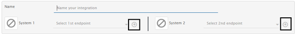

* In the **Add Project(s) to Sync** section, select the projects you want to synchronize between Jira and ServiceNow by clicking them. ServiceNow doesn’t have projects, so <code class="expression">space.vars.SITENAME</code> will show OH_NO_PROJECT. You can map OH_NO_PROJECT with multiple projects in Jira. Refer to the image below:

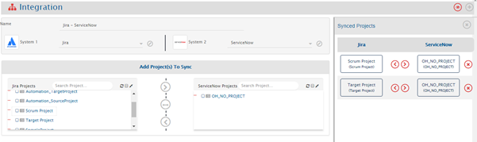

* Click the forward arrow (>) if you want to integrate any project only from Jira to ServiceNow, bi-directional arrow (<-->) if that project needs to be synced bi-directionally, or backward arrow (<) if for that projects synchronization is needed only from ServiceNow to Jira.

> **Note**: If you are mapping multiple projects from Jira and want to synchronize to a given Jira project on basis of a ServiceNow field, then in addition to the above configuration, an additional configuration will be required in field mapping. This will be covered in the [Mapping Configuration](../../integrate/mapping-configuration.md) section below.

* Once the projects are mapped, the next step is to define entities that needs to be integrated and fields that needs to be integrated for every entity mapped.
* <code class="expression">space.vars.SITENAME</code> fetches entities available in both systems and shows them in entities list for both systems. From the **Select Entities to Sync** section, select the relevant entities.

> **Note**: For ServiceNow, only entities having import set created on them will be shown in the list.

* Click the plus button [+] adjacent to **Select fields to be synced** to create the mapping between these two entities. You will, now, be navigated to Mapping Configuration screen.

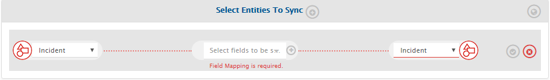

### Mapping configuration

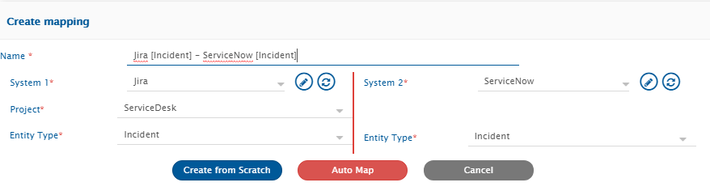

Once you come to the mapping page from the integration page, following details are automatically populated in the Mapping section.

1. Systems
2. Projects
3. Entities

* Give a unique name for the mapping in the **Name** field. For example, refer the image above.
* Now, click the **Create from Scratch** button to define the mapping from scratch.
  or,
* Click **Auto Map** to automatically map all fields with same name. <code class="expression">space.vars.SITENAME</code> will allow you to remove or add more fields before saving mapping.
* <code class="expression">space.vars.SITENAME</code> will load fields available in the selected entity and project fields. For reference, please look at the image below:

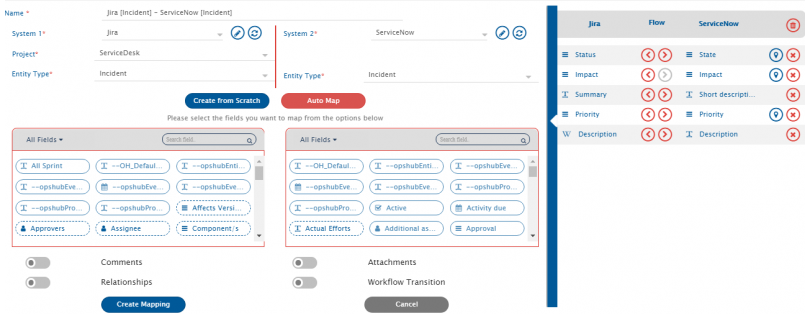

> **Note**: For creating any entity in Jira, mapping **Status** is mandatory, please make it is mapped and value mapping for it is done.

### Set Incident mapping

* If you want to create incidents in both systems through integration, then make sure all mandatory fields are mapped.
* For ServiceNow, a field will be writable only if it is part of import set.
* For mapping more fields, select the relevant field from Jira and then from ServiceNow. Just selecting the fields on both side will map it. Now, all the mapped fields will appear in right pane of fields mapped.
* After mapping the fields, if you want to synchronize a field only in one direction then you can disable sync of a field by clicking the forward arrow (>) or backward arrow (<).
* For look-up type fields such priority, status, etc. do value mapping by clicking on the bulb icon on the right.

Click [here](../../integrate/mapping-configuration.md#value-mapping) to learn about Value Mapping in detail.

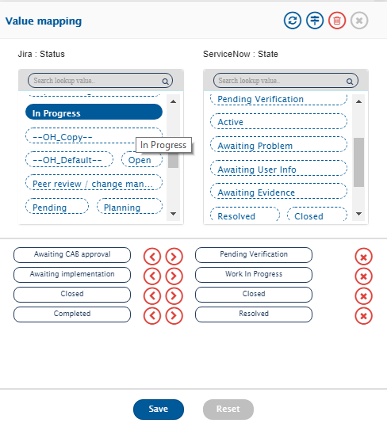

> **Note**: For any user field mapped, mapping will work without any change if users have same email id or username in both systems. It is recommended that users have same email id or username across the systems; however, if that is not the case, then advance mapping may be required. Kindly reach out to your sales/support representative.

#### Map Comments

Refer to the video on this page to learn in detail about [Comments mapping](../../integrate/mapping-configuration.md#comments).

* For enabling comments, just toggle the comments toggle at bottom of fields mapping.

* By default, comments will be synchronized in both directions and all comments will be synchronized as public/visible to customer comments. For changing the default behavior, click the Settings icon next to comments.
  * Change the direction in which comments needs to be synced.
  * To synchronize comments as public or private comments, use value mapping of comment type. You can synchronize all comments as private or public to additional comments and private to worknotes.
  * Once these changes are done, click the Save button to save comments configuration.

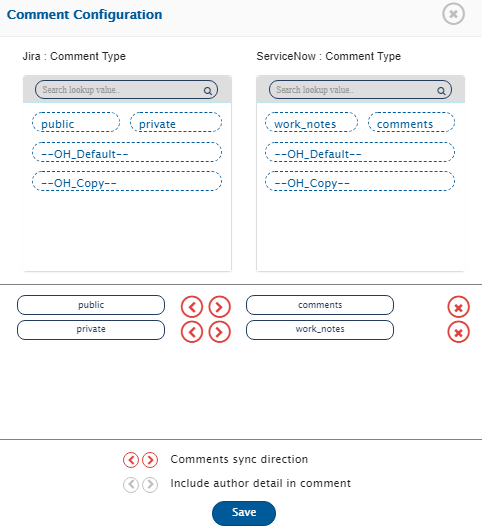

#### Map Attachments

Refer to the video on this page to learn in detail about [Attachments](../../integrate/mapping-configuration.md#attachments) mapping.

* For synchronizing attachments, switch the attachments toggle at the bottom of the mapping page:

* By default, attachments will be synchronized in both directions. For changing the default behavior, click the **Settings** icon next to Attachments toggle.
  * Attachments sync direction defines direction in which attachment needs to be synchronized.
  * Click on the direction arrows to enable/disable the sync for a given direction.
  * Once these changes are done, click the **Save** button to save attachments configuration.

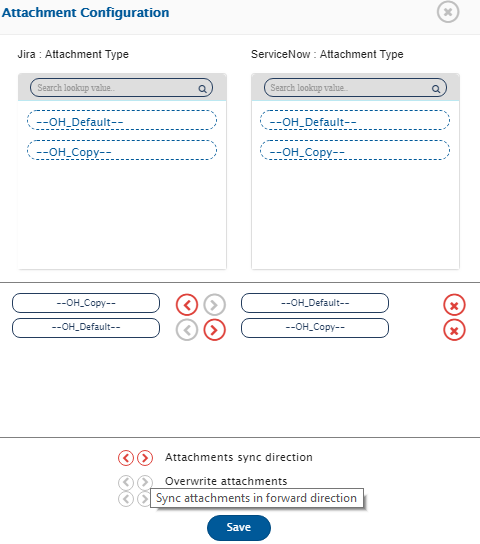

### Sync link between Incident and Problem

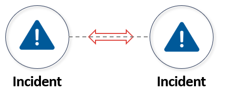

* For syncing link between incident and problem in both systems, switch on the **Relationship** toggle.

* Now, click on the settings icon.
  * Map the entities you want to link with Incident. In this case, we will map Jira Problem with ServiceNow Problem. This means that if Incident in Jira is linked to Problem then it should be linked to entity of type Problem in ServiceNow.
  * Click **Next** button to map link type.
  * Jira has multiple types of links and similarly in ServiceNow there are multiple fields to link to Incident.
  * On link type, map the link that you want to create between Incident and Problem in Jira and ServiceNow.
  * By default, if the linked problem doesn’t exist in the target system then sync won’t fail. In that case, link to problem will be done when next time any update comes on incident. If you want to fail the sync when linked problem doesn’t exist then enable sync in both directions.
  * Once these changes are done, click **Save** to save relationship configuration.

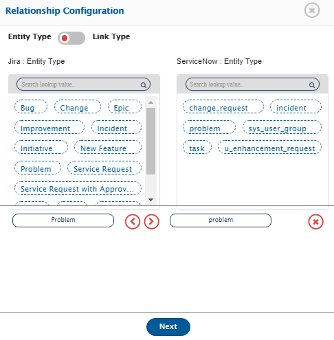

> **Note**: In the image below, we have mapped _is blocked by_ in Jira with Problem in ServiceNow (ServiceNow shows reference type field names in link type, so in your case it can be something other than _Problem_).

#### Setup Problem Mapping

* Select **Problem** on both sides. You will be prompted to create a mapping for the integration.
* Other than the steps for **Synchronizing link between Incident and Problem** (given above), repeat the steps listed in [Setup incident mapping](jira-snow-integration.md#setup-incident-mapping) for mapping Problem as well.

### Sync link between Incident and Incident

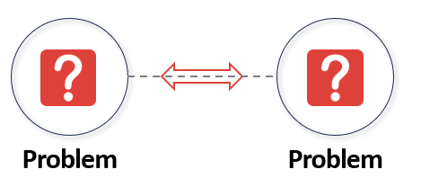

* For syncing link between incident and incident in both systems, switch on the **Relationship** toggle.

* Now, click the settings icon.
  * Map the entities you want to link with Problem. In this case, we will map Jira Incident with ServiceNow Incident. This means that if Incident in Jira is linked to Incident, then it should be linked to entity of type Incident in ServiceNow.
  * Click **Next** button to map link type.
  * Jira has multiple types of links and similarly in ServiceNow there are multiple fields to link to Incident.
  * On link type, map the link that you want to create between Incident and Problem in Jira and ServiceNow.
  * By default, if linked problem doesn’t exist in target system then sync won’t fail. In that case, link to problem will be done when next time any update comes on incident. If you want to fail the sync when the linked problem doesn’t exist, then enable sync in both directions.
  * Once these changes are done, click the **Save** button to save relationship configuration.

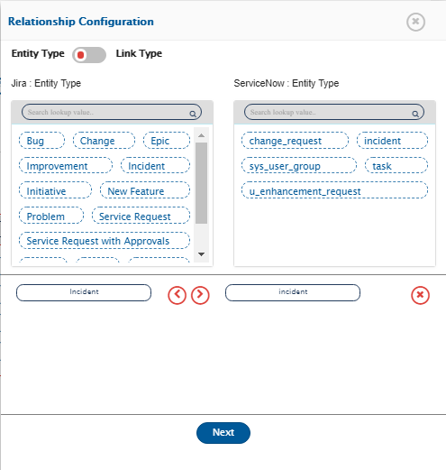

> **Note**: In the image given below, we have mapped _blocks_ in Jira with _Link Incident_ in ServiceNow (ServiceNow shows reference type field names in link type, in your case it can be something other than _Link Incident_).

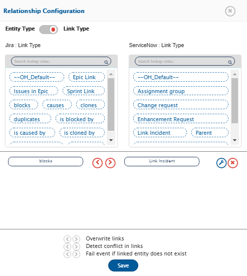

#### Save Problem Mapping

* Edit the auto-generated mapping name if you want to give some other name.
* Click **Create Mapping** button to create Incident mapping.
* It may take a few seconds to save the mapping.
* You will be taken back to the create integration page and with this, problem mapping will be completed.

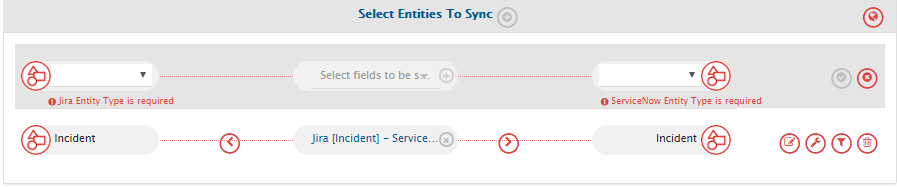

### Set Polling Time & Activate Integration

* Once all the mappings are completed, in the **Start Polling Time** field, set the time to start synchronizing data in both the systems. For this integration in process, set `[Current time - 12 hours]`.

* To save the integration in active mode, slide the **Activate Integration** button to the right. Select **Yes** in the _Are you sure?_ pop-up.

* As the final step, click **Save** to save the integration.
* The integration will be created.

> **Note**: Create an Incident in either ServiceNow or Jira. Incidents will be synchronized to the other system. Remember to use a user other than the integration user provided for ServiceNow and Jira in `<code class="expression">space.vars.SITENAME</code>`.

## Basic Troubleshooting

If you have created entities in one end system but do not see any entity created in another end system, then check for the following issues:

* On view integrations page, under **Integration health** section, check whether there is an error. The following descriptions will help identify error:
  * If there is **red exclamation mark**, it means there is an issue in reading data from the source system. This may be due to insufficient permission. Click on the red exclamation mark to see the error logged.
  * If there is a **green exclamation mark** but count next to it is more than zero:
    Click on count to see the error. This says data has been fetched from the source system, but some error came when writing it to the target system. Errors are generally the error message returned from an end system and can be something like _Status is invalid_ or _Some field value is not correct_. From the error message, identify the field and edit either the mapping to correct the value mapping or add the missing values in the target system.
* There are no errors and last event time is also NA.
  * Validate that the user with which entity was created is not the integration user.
  * Check that correct type of entity was created in the source system in the right project.
* There are no errors and last event time is showing ID of the entity that you created just now, but you can’t find the entity in the target system:
  * Validate if you are checking in the right project in the target system.
  * Check if you have the permission to view entities created by the integration user.
  * Click in the last event ID and go to sync report to see sync details. Sync details will show project in which the entity was synchronized.
