Jira Xray is a modern requirements and test management solution for complex systems development. Integrating Jira Xray with Codebeamer, a comprehensive web-based test case management solution, ensures that the product management team using Jira Xray has complete traceability for all the test entities in Codebeamer from Jira Xray itself.

# Use case: Jira Xray - Codebeamer integration

**Problem statement**: As the Jira Xray and Codebeamer are not integrated, the product team using the Codebeamer does not have visibility into the testing progress. Lack of this information impacts their overall management of the application lifecycle.  
**Solution**: Integrating Jira Xray and Codebeamer helps product team get real-time insights into the testing progress and efficiently manage the application lifecycle.  
**Use Case**:  
* The team creates Tests under sections in Jira Xray. The Tests is synchronized to Codebeamer as Test Cases.
* The team creates Test Run using multiple Tests. The Test Run Child(Result of Test Run) will be automatically created when running the Test Run.
* The team wants to synchronize the Test Run and Test Run Child(Result of Test Run) to respective entities, Test Run and Test Result in Jira Xray.

  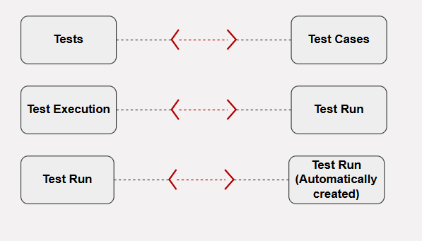

# How to create an integration between Jira Xray and Codebeamer

## Pre-requisites for integration
To create an integration between Jira Xray and Codebeamer, you need to:
* You need to install <code class="expression">space.vars.SITENAME</code>.
* Configure Jira Xray and Codebeamer onto <code class="expression">space.vars.SITENAME</code>.  

  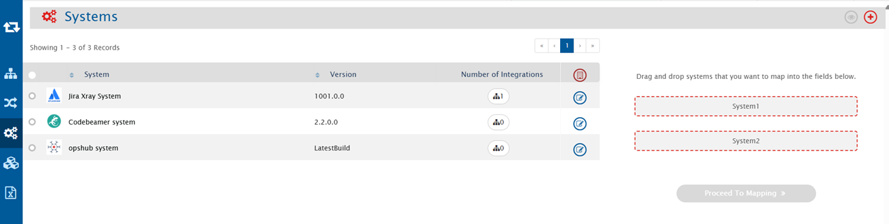

To learn how to configure Jira Xray and Codebeamer, navigate to [Jira Cloud Instance](../../connectors/jira.md#jira-cloud-instance) and [Codebeamer](../../connectors/codebeamer.md).

## Integration configuration

Integration configuration is the process of defining the flow, conditions, time, and parameters for integrating the entities between two systems.  
Here are the steps to integrate Jira Xray and Codebeamer.

* Click the **Integrate** button on the screen.  

  

* Click the plus icon [+] on the top right corner of the screen. You will be prompted to enter the **Integration Name** and name of systems you want to integrate.  
 

  

* Enter a unique name for the integration. For example, this integration is named **Jira Xray - Codebeamer Integration**.
* Click the plus sign [+] adjacent to the System 1 and System 2 fields. From the **Select 1st endpoint** and **Select 2nd endpoint** drop-down lists, select Jira Xray and Codebeamer respectively.  

  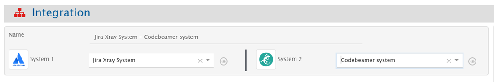

* In the **Add Project(s) to Sync** section, select the projects you want to synchronize between Jira Xray and Codebeamer by clicking them. For example, we have selected **XrayCloudTestProject** project in Jira Xray and **TestProject2** project in Codebeamer. 

  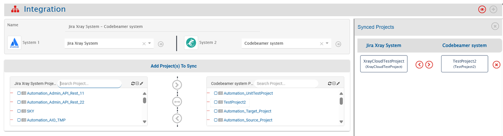

* Click the bi-directional arrow (<-->) between the projects to create a bi-directional synchronization between the selected projects.
* In the **Select Entities to Sync** section, select the entities you want to synchronize between Jira Xray and Codebeamer. You can synchronize multiple entities in one integration. For example, we are synchronizing the following entities between Jira Xray and Codebeamer:

| **Jira Xray**      | **Codebeamer** | **Direction**   |
|---------------------|----------------|-----------------|
| Tests               | Test Cases     | Bi-directional  |
| Test Execution      | Test Run       | Bi-directional  |
| Test Run            | Test Run       | Bi-directional  |

* From the **Select Entities to Sync** section, choose **Tests** in Jira Xray and **Test Cases** in Codebeamer from their respective drop-down lists. 

  

* Click the plus button [+] adjacent to **Select fields to be synced** to create the mapping between these two entities. You will be navigated to **Mapping Configuration** screen.

## Mapping Tests in Jira Xray to Test Cases in Codebeamer
Once you come to the mapping page from the integration page, following details are automatically populated in the Mapping section:
* Systems
* Projects
* Entities

Give a unique name for the mapping in the **Name** field. For example, the name of the mapping between Tests in Jira Xray and Test Cases in Codebeamer is  
**1. Jira Xray [Tests] - Codebeamer [Test Cases]**.  

  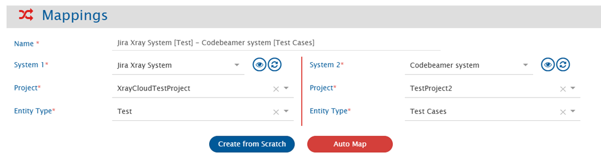

Now, click the **Create from Scratch** button to define the mapping from scratch.  
* Search and select the **Description** field from **All fields** box for Jira Xray and **Description** field from the **All fields** box for Codebeamer.
* Now, search and select the **Summary** field from **All fields** box for Jira Xray and **Name** field from the **All fields** box for Codebeamer.
* Now, search and select the **Steps** field from **All fields** box for Jira Xray and **Test Steps** field from the **All fields** box for Codebeamer.

  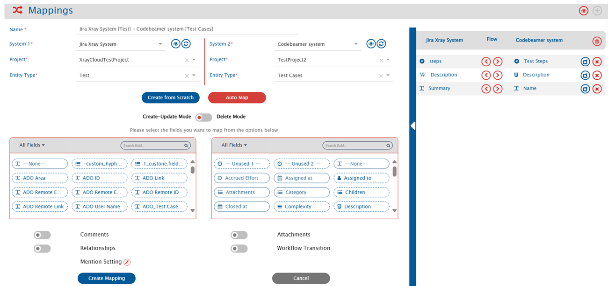

* Click **Save Mapping** to save the mapping. You will be re-directed to the integration page.

>**Note**:  You may map more fields as per your requirement.

## Mapping Test Execution in Jira Xray to Test Run in Codebeamer

* From entity types drop-down list, select **Test Execution** in Jira Xray and **Test Run** in Codebeamer.
* Click the plus button [+] adjacent to **Select fields to be synced** to create the mapping between these two entities. You will be navigated to Mapping Configuration screen.

Once you come to the mapping page from the integration page, following details will be automatically populated in the Mapping section:
* Systems
* Projects
* Entities

Give a unique name for the mapping in the **Name** field. For example, the name of the mapping between Test Run in Jira Xray and Test Run in Codebeamer is  
**2. Jira Xray [Test Execution] - Codebeamer [Test Run]**.
* Click **Create from Scratch** button to define the mapping from scratch.
* Search and select the **Description** field from **All fields** box for Jira Xray and **Description** field from the **All fields** box for Codebeamer.
* Search and select the **Summary** field from **All fields** box for TestRail and **Name** field from the **All fields** box for Codebeamer.
* Search and select the **Status** field from **All fields** box for Jira Xray and **Status** field from the **All fields** box for Codebeamer.
* Map the Test Run Type lookup field with its corresponding value. For more details, refer to this.

  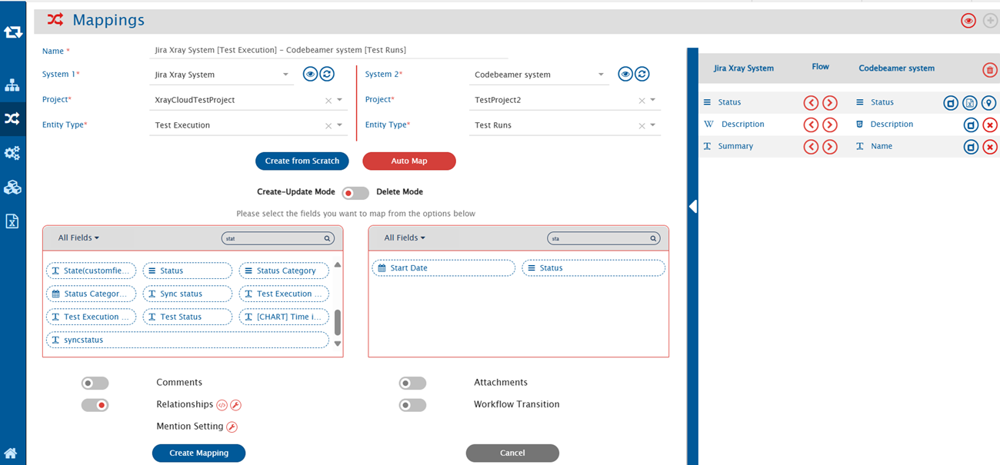

>**Note**:  You may map more fields as per your requirement.

### Relationship Mapping

Relationships feature synchronizes the relationship between the selected entities.  
* For the Codebeamer Test Run creation, **Test Cases** Linkage is mandatory. Configure the **Test Cases** links to create the Test Run in Codebeamer.  

  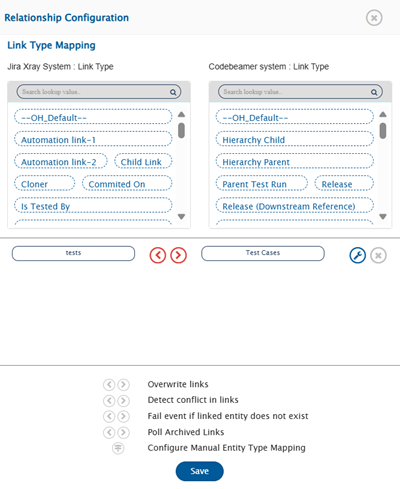

### Criteria Configuration

* In Codebeamer, there is only one entity as **Test Run** which automatically creates **Test Run Child(Result)** when we run the Test Run.
* If you need to synchronize Test Run only, the criteria needs to be configured as:  

  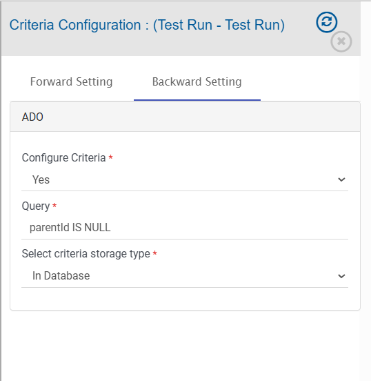

## Mapping Test Result in Jira Xray to Test Run in Codebeamer

* From entity types drop-down list, select **Test Result** in Jira Xray and **Test Run** in Codebeamer.
* Click the plus button [+] adjacent to **Select fields to be Synced** to create the mapping between these two entities. You will be navigated to Mapping Configuration screen.

Once you come to the mapping page from the integration page, following details are automatically populated in the Mapping section:
* Systems
* Projects
* Entities

Give a unique name for the mapping in the **Name** field. For example, the name of the mapping between Test Run in Jira Xray and Test Run in Codebeamer is  
**2. Jira Xray [Test Result] - Codebeamer [Test Run] (Result)**.
* Click **Create from Scratch** button to define the mapping from scratch.
* Search and select the **Description** field from **All fields** box for Jira Xray and **Description** field from the **All fields** box for Codebeamer.
* Search and select the **State** field from **All fields** box for Jira Xray and **Status** field from the **All fields** box for Codebeamer.
* Map the Test Run Type lookup field with its corresponding value. For more details, refer to this.

  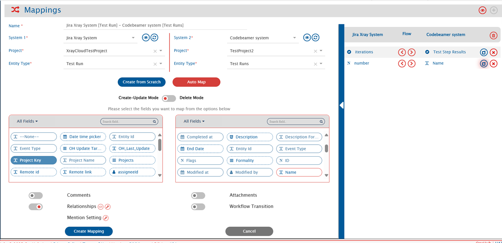

>**Note**:  You may map more fields as per your requirement.

### Relationship Mapping

Relationships feature synchronizes the relationship between the selected entities.  
* For the Codebeamer Test Run Result creation, **Test Case** and **Parent Test Run** links are required. Configure the **Parent Test Run** link along with the **Test Cases** links to sync the Test Run (Result) in Codebeamer.  

  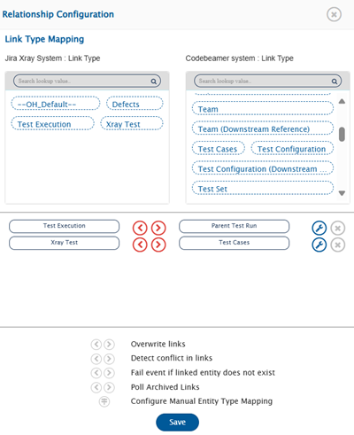

### Criteria Configuration

* In Codebeamer, there is only one entity **Test Run** which automatically creates **Test Run Child(Result)** when we run the Test Run.
* If you need to synchronize Test Run only, the criteria needs to be configured as:  

  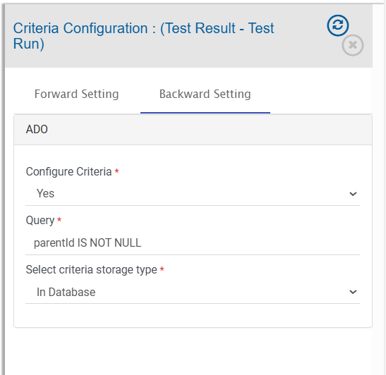

Refer to [Save and Activate Integration](../../integrate/configure-integrations.md#save-and-activate-integration) to **Save** and **Activate** the integration.
