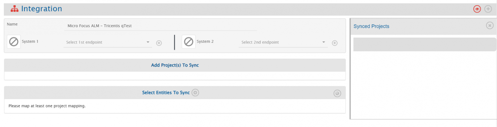
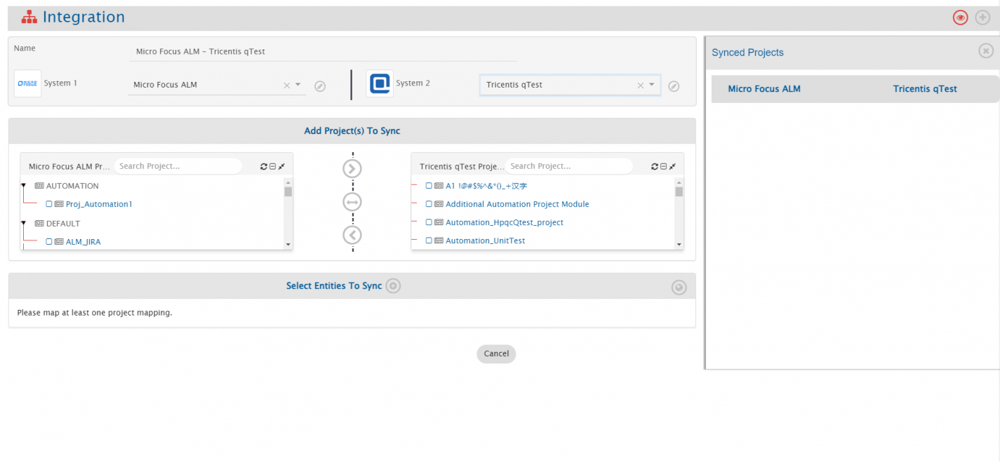
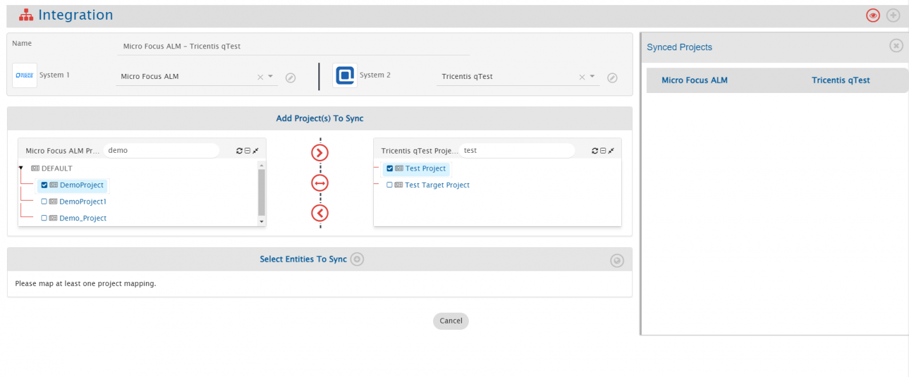
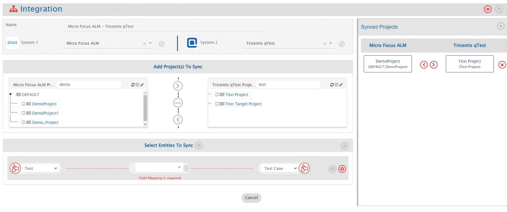

# Overview
Best-of-breed systems such as Micro Focus ALM/QC and Tricentis qTest bring rich functionalities to the ecosystem. The integration of Micro Focus ALM and Tricentis qTest makes it easier for the development, and quality assurance (QA) teams to collaborate with each other. This, in turn, helps in delivering a high quality product to customers at a faster pace. With this integration, there is no manual effort required to keep the teams updated on the latest work status.  

<code class="expression">space.vars.SITENAME</code> integrates Micro Focus ALM and Tricentis qTest bi-directionally. On this page, we will discuss the bi-directional integration of:  

<p align="center">
  
</p>

# System Prerequisites
Configuring [system pre-requisites](../../integrate/integration-prerequisites.md) is mandatory for successful system configuration.  Check out the prerequisites for [Micro Focus ALM](../../connectors/microfocus-alm-qc.md#prerequisites) and [Tricentis qTest](../../connectors/tricentis_qTest.md#prerequisites) systems before you proceed with the integration.  

# Integration Configuration
* Log in into <code class="expression">space.vars.SITENAME</code>. The default credentials are: User Name: `admin`, Password: `password`.  

<p align="center">
  
</p>

>**Note** **Proxy parameters**: Before you proceed with the configuration, check whether the system is behind a proxy server. If yes, then set up [proxy parameters](../../manage/administrator/proxy-setting.md) in <code class="expression">space.vars.SITENAME</code>.  

* Click **Integrate** on the top right corner of the screen and then click the plus [+] icon.  

<p align="center">
  
</p>

* The integration configuration page opens:  
* Enter a unique name for the integration. For example, this integration is named **Micro Focus ALM - Tricentis qTest Integration**.  
* Click the plus [+] icon adjacent to the System 1 and System 2 fields one by one to configure Tricentis qTest and Micro Focus ALM.  

<p align="center">
  
</p>

## Configure System(s)

* Once you have fulfilled all the prerequisites and are done with the above-mentioned check, configure Tricentis qTest and Micro Focus ALM by following the steps given on Tricentis qTest and Micro Focus ALM pages respectively.  

<p align="center">
  
</p>

* When you save the respective system configuration pages after configuring the systems, the systems will automatically be added to the integration. Proceed to adding projects and entities in the integration.  

<p align="center">
  
</p>

## Select Projects and Entities
>**Note** If you receive the following error: **PKIX certification path not found** and the projects and entities don’t load properly, then [import SSL certificate](../../getting-started/ssl-certificate-configuration.md) onto <code class="expression">space.vars.SITENAME</code>’s Java KeyStore before you proceed.  

* In the **Add Project(s) to Sync** section, select the projects you want to synchronize between Tricentis qTest and Micro Focus ALM by clicking them.  
For example, here we select <code class="expression">space.vars.SITENAME</code> Demo Project from Tricentis qTest and TestProject from Micro Focus ALM.  

* Once the projects are selected, define the source project and target project:  
  * If you select forward arrow (>) icon, the data would flow from Tricentis qTest to Micro Focus ALM.  
  * If you select backward arrow (<), the data would flow from Micro Focus ALM to Tricentis qTest.  
  * If you want a bi-directional flow of data, select bi-directional arrow (<-->) icon.  

* Once the direction is selected, the arrows will turn grey. We have selected the bi-directional flow.  

<p align="center">
  
</p>

* <code class="expression">space.vars.SITENAME</code> fetches entities available in both systems and shows them in the entities list for both systems.  
From the **Select Entities to Sync** section, select the relevant entities for both systems.  
In this case, we will select **Test** from Micro Focus ALM and **Test Case** from Tricentis qTest.  

* The next step is to define the fields that need to be integrated for every entity mapped.  
So, once the entities are selected, click the plus icon [+] adjacent to **Select fields to be Synced** to create the mapping between these two entities.  
You will be navigated to Mapping Configuration screen.  

<p align="center">
  
</p>

## Mapping Fields
### Entity: Test and Test Case
* Following details are automatically populated in the Mapping section: **Systems, Projects, Entities, and Mapping Name**.  
If you wish, change the name for the mapping in the **Name** field.  

* Now, either click **Create from Scratch** to define the mapping from scratch or click **Auto Map** to automatically map all fields with same name.  
Even if you select **Auto Map**, <code class="expression">space.vars.SITENAME</code> will allow you to remove or add more fields before saving mapping.  
We select **Create from Scratch**.  

<p align="center">
  
</p>


#### Mapping for Design Steps to Test Steps ####
* To synchronize Design Steps from Micro Focus ALM [where the project is versioned] with Test Steps in Tricentis qTest, the following advanced mapping can be applied:
 
```json

 <Test-space-Step source-entity-version="{SourceXML/updatedFields/Property/Version-space-Number}">
  <xsl:for-each select="SourceXML/updatedFields/Property/Design-space-Steps/list">
   <xsl:element name="{concat('_',Property/Step-hash-)}">
    <xsl:element name="order">
     <xsl:value-of select="Property/Step-hash-"/>
    </xsl:element>
    <xsl:element name="description">
     <xsl:value-of select="utils:replace(utils:replace(utils:convertHTMLToPlainText(Property/Description),'#OH_START_PARAM#','[~'),'#OH_END_PARAM#',']')"/>
    </xsl:element>
    <xsl:element name="expected">
     <xsl:value-of select="utils:replace(utils:replace(utils:convertHTMLToPlainText(Property/Expected-space-Result),'#OH_START_PARAM#','[~'),'#OH_END_PARAM#',']')"/>
    </xsl:element>
    <xsl:if test="Property/OHAttachments">
     <OHAttachments>
      <xsl:for-each select="Property/OHAttachments/OHAttachment">
       <xsl:element name="{concat('attachment_',position())}">
        <filename>
         <xsl:value-of select="fileName"/>
        </filename>
        <addedByUser>
         <xsl:value-of select="addedByUser"/>
        </addedByUser>
        <contentBase64>
         <xsl:value-of select="contentBase64"/>
        </contentBase64>
        <attachmentURI>
         <xsl:value-of select="attachmentURI"/>
        </attachmentURI>
        <updateTimeStamp>
         <xsl:value-of select="updateTimeStamp"/>
        </updateTimeStamp>
        <label>
         <xsl:value-of select="label"/>
        </label>
        <fileComment>
         <xsl:value-of select="fileComment"/>
        </fileComment>
       </xsl:element>
      </xsl:for-each>
     </OHAttachments>
    </xsl:if>
   </xsl:element>
  </xsl:for-each>
 </Test-space-Step>
```

>**Note**:
* In the above advanced mapping, we have passed the '''source-entity-version''' in Design Steps as attribute to sync the Design Steps and parameters with the history.
* In case, the Micro Focus ALM's projects is not versioned, then there is no need to pass the above attribute '''source-entity-version''' in the advanced mapping.

### Entity:Test Run and Test Log ###

#### Mapping for Run Steps to Step Results ####
* To synchronize Run Steps from Micro Focus ALM [where the project is versioned] to Step Results in Tricentis qTest, the following advanced mapping can be applied:

```json

 <Step-space-Results xmlns:xsl="http://www.w3.org/1999/XSL/Transform" xmlns:eaiUtils="http://com.opshub.eai.EaiUtility" source-entity-version="{SourceXML/updatedFields/Property/Test-space-Version-space-Number}">
  <xsl:for-each select="SourceXML/updatedFields/Property/Run-space-Steps/list">
   <xsl:element name="{concat('_',position())}">
    <xsl:element name="order">
     <xsl:value-of select="Property/Step-space-Order"/>
    </xsl:element>
    <xsl:element name="step_status">
     <xsl:variable name="xPathVariable" select="Property/Status"/>
     <xsl:choose>
      <xsl:when test="$xPathVariable='Passed'">
       <xsl:value-of select="'Passed'"/>
      </xsl:when>
      <xsl:when test="$xPathVariable='N/A'">
       <xsl:value-of select="'Unexecuted'"/>
      </xsl:when>
      <xsl:when test="$xPathVariable='Failed'">
       <xsl:value-of select="'Failed'"/>
      </xsl:when>
      <xsl:when test="$xPathVariable='No Run'">
       <xsl:value-of select="'Unexecuted'"/>
      </xsl:when>
      <xsl:when test="$xPathVariable='Not Completed'">
       <xsl:value-of select="'Incomplete'"/>
      </xsl:when>
      <xsl:when test="$xPathVariable='Blocked'">
       <xsl:value-of select="'Blocked'"/>
      </xsl:when>
      <xsl:otherwise>
       <xsl:value-of select="'Unexecuted'"/>
      </xsl:otherwise>
     </xsl:choose>
    </xsl:element>
    <xsl:element name="actual_result">
     <xsl:value-of select="utils:convertHTMLToPlainText(Property/Actual)"/>
    </xsl:element>
    <xsl:element name="expected_parameter_values">
     <xsl:value-of select="eaiUtils:convertListToStringByDelimiter(utils:getMatchingRegexPatternFromString(utils:convertHTMLToPlainText(Property/Expected),'\&lt;{1,3}(.*?)\&gt;{1,3}'),',')"/>
    </xsl:element>
    <xsl:element name="description_parameter_values">
     <xsl:value-of select="eaiUtils:convertListToStringByDelimiter(utils:getMatchingRegexPatternFromString(utils:convertHTMLToPlainText(Property/Description),'\&lt;{1,3}(.*?)\&gt;{1,3}'),',')"/>
    </xsl:element>
   </xsl:element>
  </xsl:for-each>
 </Step-space-Results>
``` 

>**Note**:
* In the above advanced mapping, we have passed the **source-entity-version** in Run Steps as attribute to sync the Run Steps and parameters with history.
* In case, the Micro Focus ALM's projects is not versioned, then there is no need to pass the above attribute **source-entity-version** in the advanced mapping.

* Once the additional configurations are completed successfully, update the mapping, activate the integration, and save it again.

 


