# Overview

Best of breed tools such as ServiceNow and Azure DevOps Services (VSTS) bring richness to the enterprise ecosystem. The integration of ServiceNow with Azure DevOps Services (VSTS) enhances collaboration between the customer service and development teams. This, in turn, helps resolve the customer issues faster and gives visibility to both teams into customer priorities. There is no manual effort required from either of the teams to keep each other updated on the latest work status or customer expectations.  
{{SITENAME}} integrates ServiceNow and Azure DevOps Services (VSTS) bi-directionally. On this page, we will discuss the bi-directional integration of:

  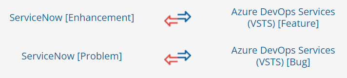

# System Prerequisites

Configuring [system pre-requisites](../../integrate/integration-prerequisites.md) is mandatory for successful system configuration. Check out the pre-requisites for [ServiceNow](../../connectors/servicenow.md#prerequisites) and [Azure DevOps Services (VSTS)](../../connectors/team-foundation-server.md#prerequisites) systems before you proceed with the integration.

# Integration Configuration

* Log in into {{SITENAME}}. The default credentials are: User Name: admin, Password: password.

  

>**Note**: Proxy parameters: Before you proceed with the configuration, check whether the system is behind a proxy server. If yes, then set up [proxy parameters](../../manage/administrator/proxy-setting.md) in {{SITENAME}}.

* Click **Integrate** on the top right corner of the screen and then click the plus [+] icon.

  

* The integration configuration page opens:  
* Enter a unique name for the integration. For example, this integration is named **ServiceNow – Azure DevOps Services (VSTS) Integration**.  
* Click the plus [+] icon adjacent to the System 1 and System 2 fields one by one to configure ServiceNow and Azure DevOps Services (VSTS).

  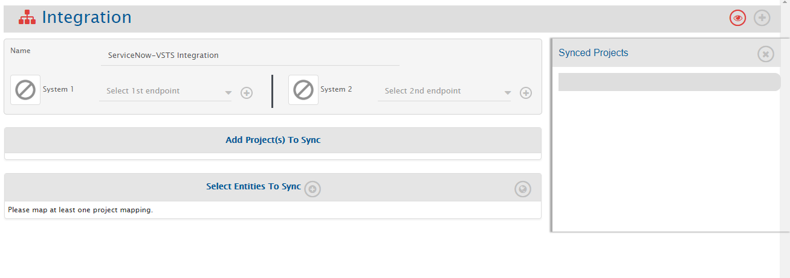

## Configure System(s)

* Once you have fulfilled all the prerequisites and are done with the above-mentioned check, configure ServiceNow and Azure DevOps Services (VSTS) by following the steps given on [ServiceNow system configuration](../../ServiceNow#System_Configuration) and [Azure DevOps Services (VSTS) system configuration](../../Team_Foundation_Server#System_Configuration) pages respectively.

  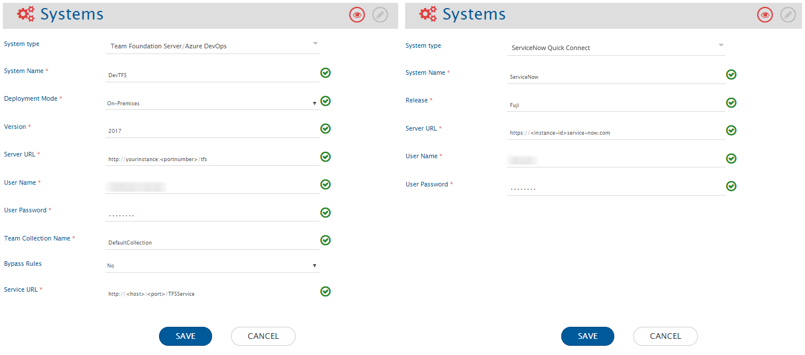

* When you save the respective system configuration pages after configuring the systems, the systems will automatically be added to the integration. Proceed to adding projects and entities in the integration.

  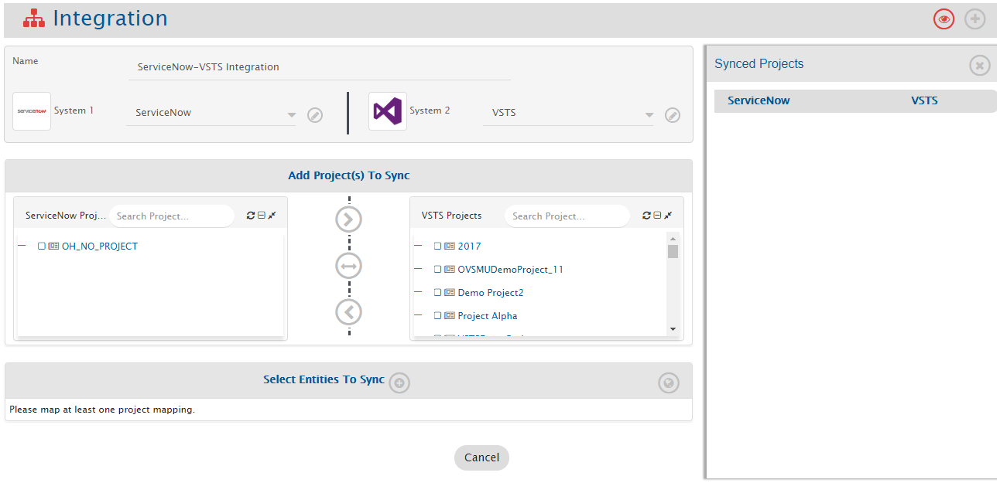

## Select Projects and Entities

>**Note**: If you receive the following error: **PKIX certification path not found** and the projects and entities don’t load properly, then [import SSL certificate](../../getting-started/ssl-certificate-configuration.md) onto OpsHub Integration Manager’s Java KeyStore before you proceed.

* In the **Add Project(s) to Sync** section, select the projects you want to synchronize between Azure DevOps Server (TFS) and Micro Focus ALM by clicking them. For example, here we select **Demo Project** from Azure DevOps Server (TFS) and **Demo Project** from Micro Focus ALM.
* Once the projects are selected, define the source project and target project:
  * Forward arrow (>) → data flows from ServiceNow to Azure DevOps Services (VSTS)  
  * Backward arrow (<) → data flows from Azure DevOps Services (VSTS) to ServiceNow  
  * Bi-directional arrow (<-->) → bi-directional data flow  
* Once the direction is selected, the arrows will turn grey. We have selected bi-directional flow.

  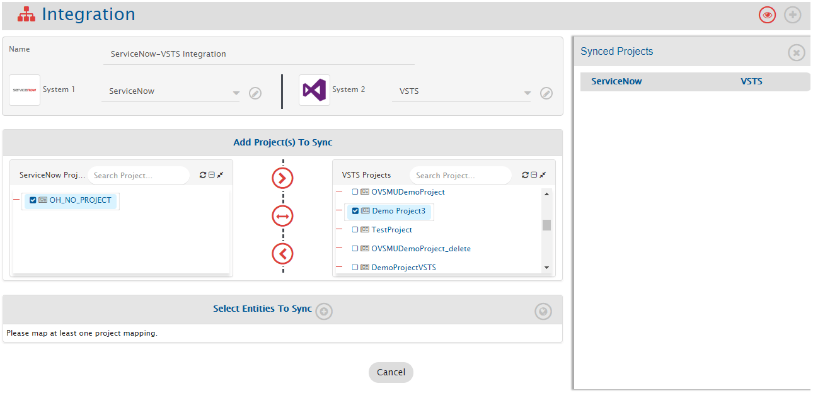

* {{SITENAME}} fetches entities available in both systems and shows them in the entities list. From the **Select Entities to Sync** section, select the relevant entities for both systems. Here we select **Feature** from Azure DevOps Server (TFS) and **Requirement** from Micro Focus ALM.
* Define the fields that need to be integrated for every entity mapped. Click the plus [+] icon adjacent to **Select fields to be Synced** to create the mapping between these entities. You will be navigated to Mapping Configuration screen.

  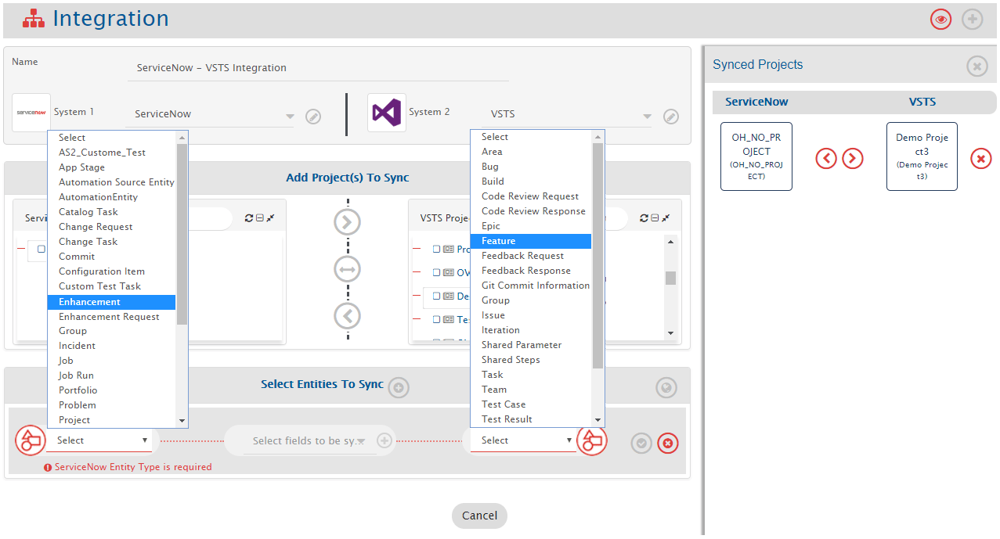

## Mapping Fields

### Entity: Enhancement and Feature

* Details automatically populated: **Systems, Projects, Entities, and Mapping Name**. Change the name in the Name field if desired.
* Click **Create from Scratch** to define mapping manually or **Auto Map** to map all fields with the same name. Even if you select **Auto Map**, {{SITENAME}} allows adding/removing fields before saving. We select **Create from Scratch**.

  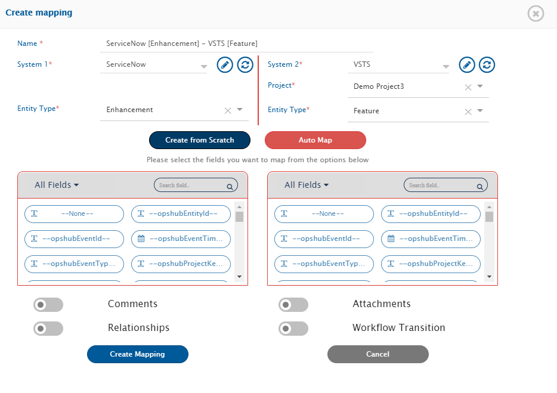

#### Mapping Mandatory Fields

* From the **All fields** drop-down list, select **Mandatory fields**.  
* APIs of ServiceNow and Azure DevOps Services (VSTS) do not allow mandatory fields to be called, so search mandatory fields from the systems’ UI and map them.

>**Note**: For ServiceNow, a field is writable only if it is part of import set.

  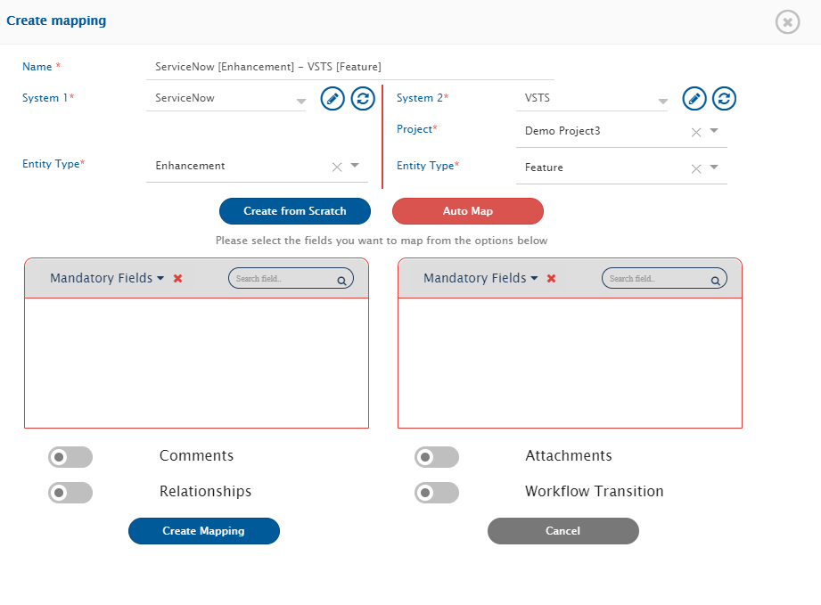

#### Mapping Look-up Type Fields

* After mapping mandatory fields, map Look-up type fields (multi-valued). For example:  
  * **Priority → Priority**  
  * **Status → Status**  
* Look-up fields are marked with . Click the icon to map values.

  

* Map the values for all Look-up type fields. Example for Priority:  
  * 1 – Critical – 1  
  * 2 – High – 2  
  * 3 – Moderate – 3  
  * 4 – Low – 4  

  

* Default Mapping: set default value if no value comes from source. For user mapping, default should be user name/email expected by target.

  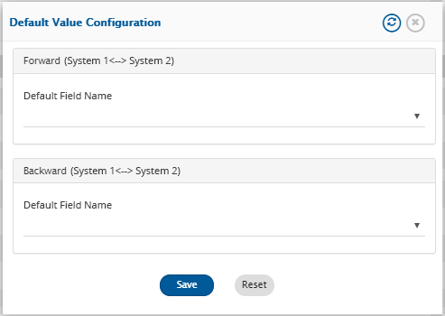

#### Mapping Rich Text Fields

* Rich-text fields provide editing tools. Example: map **Description** in ServiceNow to **Title** in Azure DevOps.
* Click **Create Mapping** to save.
* After saving, you are redirected to the Integration page.
* If no more entities, save the integration and activate it.

  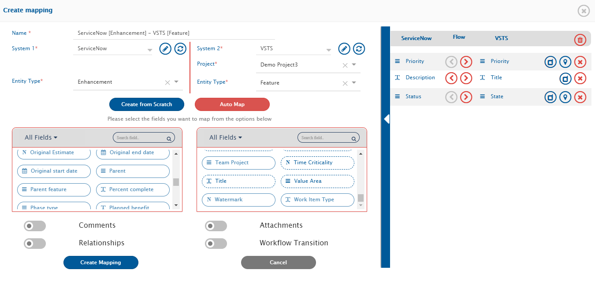

### Entity: Problem and Bug

* Select **Problem** from ServiceNow and **Bug** from Azure DevOps. Create mapping.  
* Click adjacent field icon to **Select fields to be Synced**. You will navigate to Mapping Configuration screen.

  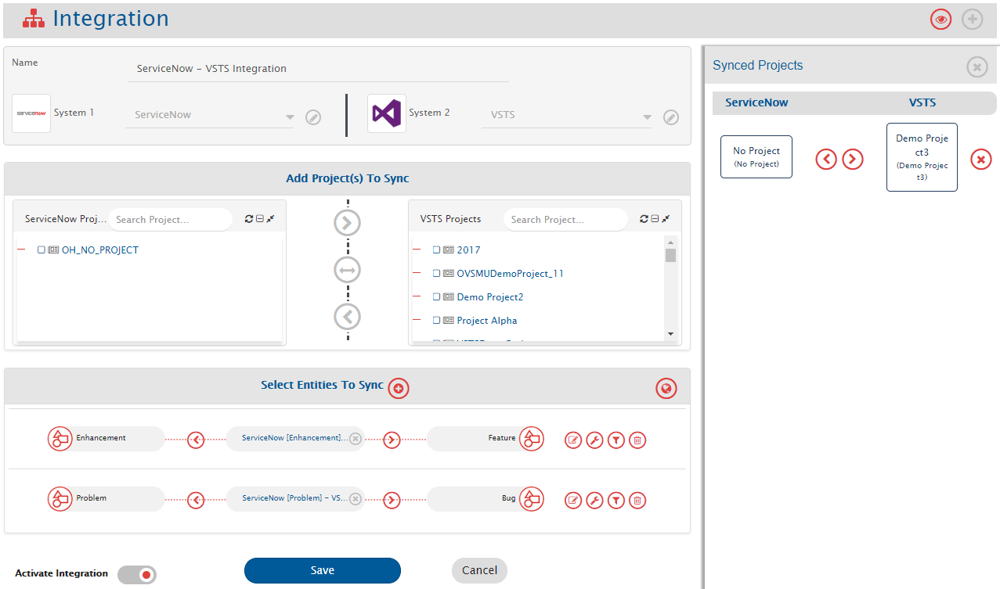

* Save mapping by clicking **Create Mapping**.

  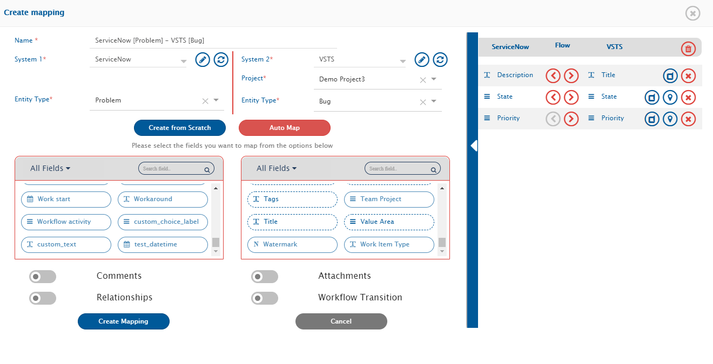

## Comments and Attachments Mapping

* Map entities like comments and attachments. Refer to [Comments](../../integrate/mapping-configuration.md#comments) and [Attachments](../../Mapping_Configuration#Attachments) for details.

## Configure Filter(s) (Optional)

* Criteria Filter helps integrate a subset of entities. Example: only high priority bugs or closed tickets.  
* Filter can be applied forward (ServiceNow → Azure DevOps) or backward (Azure DevOps → ServiceNow).

>**Note**: Not mandatory; skip if no filter is needed.

* To specify conditions, use Criteria Configuration. Example: synchronize only Low Priority Bugs.  
* Click configuration-criteria icon, select **Yes** in **Configure Criteria**, enter criteria query.  

>**Note**: Queries vary by system. See [ServiceNow Criteria Configuration](../../connectors/servicenow.md#criteria-configuration) and [Azure DevOps Criteria Configuration](../../connectors/team-foundation-server.md#criteria-configuration).  

* Select **In Database** from **Select criteria storage type** drop-down.

  

## Save and Activate Integration

* Slide **Activate Integration** button to the right.  
* Click **Save** to save integration.

  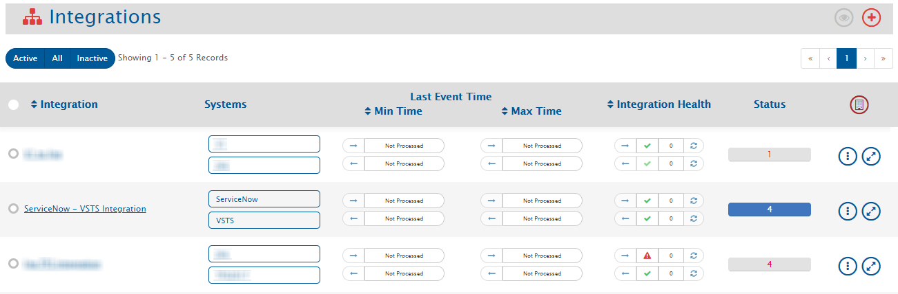

* Integration is created. A pop-up confirms successful configuration. Integration will appear in the integrations list.

## Test the Integration

* Test synchronization between ServiceNow and Azure DevOps Services (VSTS) projects.

>**Note**: Do not use integration user credentials to create entities.  

* Create/Update events in source system and check synchronization. Wait one minute. For issues, refer to [General](../../General).

## Additional Configurations

### Mapping User Fields

* Choose mapping for additional configuration. Example: ServiceNow [Problem] – Azure DevOps [Bug].  
* Map user fields like **Assigned to** in both systems. Other fields can be selected.

>**Note**: User fields are mapped by email. If emails differ, update [one-to-one XSL](../../integrate/mapping-configuration.md++#value-mapping-using-excel-sheet) for user mapping.

  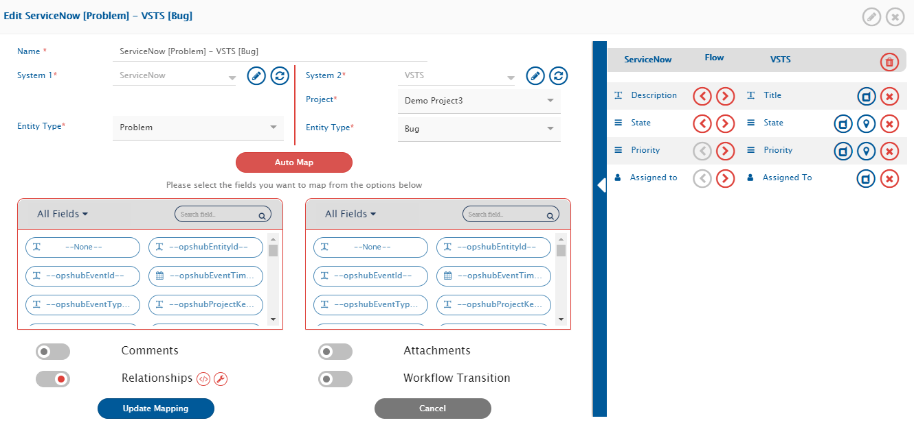

* After additional configuration, update mapping, activate integration, and save again.
