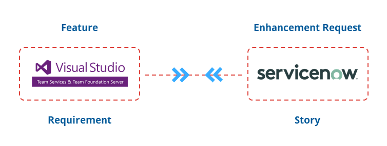
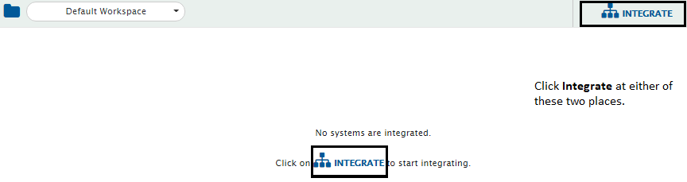

The integration of VSTS with ServiceNow enhances collaboration between the customer service and development teams. This, in turn, helps resolve the customer issues faster and gives visibility to both teams into customer priorities.

# Use Case: VSTS Integration With ServiceNow

**Problem statement**: The support team receives an enhancement request from the customer. The product team also logs a story in ServiceNow at the same time. Both the teams email their requests to the development team.  

**Solution**: When VSTS and ServiceNow are bi-directionally integrated using {{SITENAME}}, the support team upon receiving the feature request from the customer will log an ‘enhancement request’ in ServiceNow. Similarly, product team will log a ‘story’. The enhancement request will synchronize to VSTS as a ‘feature’ and the story will synchronize to VSTS as a ‘user story’.  

* The support team upon receiving a request from the customer logs an ‘enhancement request’ in ServiceNow. Similarly, the product team logs a ‘story’. 
* The enhancement request synchronizes to VSTS as a feature and the story synchronizes as a user story. 
* The development team using VSTS then schedules the feature and the user story and plan their development. They also define the ‘user story’ to be a child of the ‘feature’ in VSTS. 
* The schedule details and relationship synchronizes to ServiceNow. 
* When the development team starts work on the ‘feature’, it changes the status of the feature to ‘In Progress’. The status of the ‘enhancement request’ in ServiceNow changes in accordance. Similar updates happen when the status of ‘user story’ changes. 
* The development team successfully completes the development of the feature that also includes the user story, runs a test case against it, and adds work notes for the support team and closes both the entities in VSTS.
* The support team and product team using ServiceNow are notified that their requests are completed– the detail of which are given in the work notes. 

# How To Create An Integration Between VSTS-ServiceNow

To create an integration between VSTS and ServiceNow, you need to:

* First, install {{SITENAME}}. 
* Then, configure [VSTS] and [ServiceNow] onto {{SITENAME}}.

## Integration Configuration

Integration configuration is the process of defining the flow, conditions, time, and parameters for integrating the entities between two systems. Follow the steps given below to integrate VSTS and ServiceNow.  

* Click the **Integrate** button on the screen.

* Click  on the top right corner of the screen. You will be prompted to enter the Integration Name and name of systems you want to integrate.
* Enter a unique name for the integration. For example, this integration is named VSTS-ServiceNow Integration.

* Click  adjacent to the System 1 and System 2 fields. From the Select 1st endpoint and Select 2nd endpoint drop-down lists, select VSTS and ServiceNow respectively.

* In the **Add Project(s) to Sync** section, select the projects you want to synchronize between VSTS and ServiceNow by clicking them. ServiceNow doesn’t have projects, so {{SITENAME}} will show OH_NO_PROJECT. You can map OH_NO_PROJECT with multiple projects in VSTS.

* Click the forward arrow  if you want to integrate any project only from VSTS to ServiceNow, bi-directional arrow  if that project needs to be synced bi-directionally, or backward arrow  if for that projects’ synchronization is needed only from ServiceNow to VSTS. 
* Once the projects are mapped, the next step is to define entities that needs to be integrated and fields that needs to be integrated for every entity mapped.
* {{SITENAME}} fetches entities available in both systems and shows them in entities list for both systems. From the **Select Entities to Sync** section, select the relevant entities for both systems.

>**Note**: For ServiceNow, only entities having import set created on them under OpsHub’s ServiceNow application will be shown in the list.

* Click  adjacent to **Select fields to be Synced** to create the mapping between these two entities. You will, now, be navigated to Mapping Configuration screen.

## Mapping Configuration

Once you come to the mapping page from the integration page, following details are automatically populated in the Mapping section:  

1. Systems  
2. Projects  
3. Entities  

* If you wish, change the name for the mapping in the **Name** field. 
* Now, click the **Create from Scratch** button to define the mapping from scratch.  
Or,  
* Click **Auto Map** to automatically map all fields with same name. {{SITENAME}} will allow you to remove or add more fields before saving mapping. 
* {{SITENAME}} will load fields available in the selected entity and project fields.

## Set Enhancement Request and Feature Mapping

* Make sure all mandatory fields are mapped.  
* For ServiceNow, a field will be writable only if it is part of import set.  
* For mapping more fields, select the relevant field from VSTS and then from ServiceNow. Just selecting the fields on both sides will map it. Now, all the mapped fields will appear in right pane of fields mapped.

* After mapping the fields, if you want to synchronize a field only in one direction then you can disable sync of a field by clicking  or .

* For look-up type fields such priority, status, etc. do value mapping by clicking .

>**Note**: Value Mapping is used to map the values for the Lookup Type fields.  

* From the Value Mapping pop-up, select the relevant values for lookup fields in both the systems. Look at the screen shot to see how priority values are mapped between VSTS and ServiceNow.

### Map Comments

* For enabling comments, just toggle the comments toggle at bottom of fields mapping.  
  ** By default, comments will be synchronized in both directions. For changing the default behavior, click  next to comments.  
  ** If required, disable the direction in which comments need not be synchronized by clicking the  buttons.  
  ** All comments, by default, will be synchronized as public/visible to customer comments. To synchronize comments as public or private comments, use value mapping of comment type.

>**Note**: Public comments are visible to all, including clients, whereas private comments are meant for internal communication between teams. You can synchronize all comments as private or public to additional comments. You can then synchronize private comments to work notes.  

>**Note**: Name of public, private comments will depend upon the system you are using. In ServiceNow, public comments are called comments and private comments are called work notes.  

** If both systems have the concept of public-private comments, public comments in one system can be mapped with public comments in other system whereas private comments can be mapped with private comments. However, if one system does not have the concept of public-private comments, for example VSTS, then map OH_Default with work_notes in ServiceNow. With this configuration, ServiceNow comments and work notes will synchronize to VSTS, but VSTS comments will synchronize to ServiceNow only as work_notes.  

* Once these changes are done, click the **Save** button to save comments configuration.

### Map Attachments

* For synchronizing attachments, switch the attachments toggle at the bottom of the mapping page.  
* By default, attachments will be synchronized in both directions. For changing the default behavior, click  next to Attachments toggle.  
* If required, disable the direction in which attachments need not be synchronized by clicking the  buttons.  
* Once these changes are done, click the **Save** button to save attachments configuration.

### Map Relationships

* For syncing relationship and link between the entities in both systems, switch on the Relationship toggle.  
* Now, click .  
* Toggle the **Entity Type- Link Type** button to left to map entity types.  

* Map the entities – Enhancement Request in ServiceNow to Feature in VSTS by selecting them from the respective boxes.

* Click **Next** button to map link type.  
* On link type, map the link that you want to create between VSTS Feature and ServiceNow Enhancement Request. We select **Related** from VSTS to ServiceNow Enhancement Request. This means both entities are related.  

* Once these changes are done, click the **Save** button to save relationship configuration.

>**Note**: As {{SITENAME}} supports multi-entity mapping in the same integration, you can map story and user story between the two systems in the same manner.

#### Save Mapping

* Click **Create Mapping** button to save the mapping. 
* It may take few seconds to save the mapping.
* You will be taken back to create the integration page and with this step, the mapping will be completed.

## Set Polling Time & Activate Integration

* Once all the mappings are completed, in the **Start Polling Time** field, set the time to start synchronizing data in both the systems. For this integration in process, set [Current time - 12 hours].

* To save the integration in active mode, slide the **Activate Integration** button to the right.  

* As the final step, click **Save** button to save the integration. The integration will be created.
