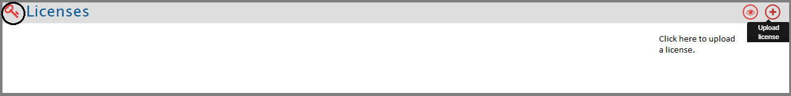
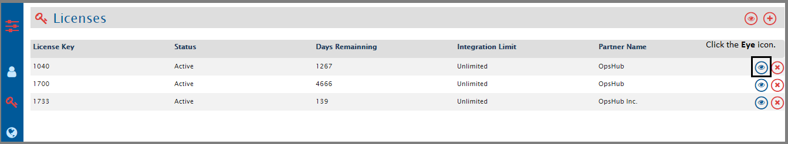
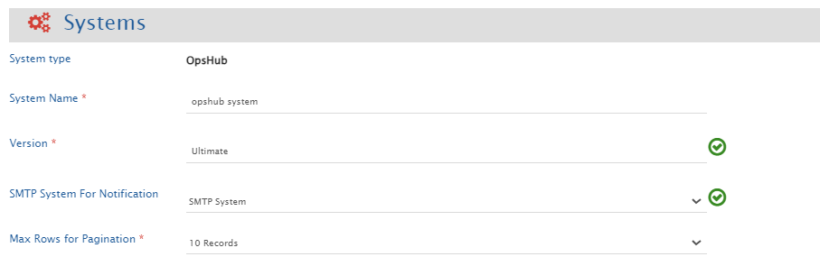
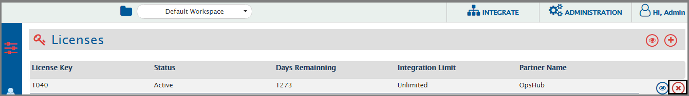

# Overview

This section covers how to install new licenses, renew licenses and uninstall licenses.

The License Management option will be shown under the Administration drop-down.  

  

The License Management section contains your license details and information such as what kind of license you have, how many days are left for your license to expire, etc.

For detail about how to get a license issued, please refer the section [How to Procure and Renew Licenses](#how-to-procure-and-renew-licenses) in appendix.

# Install License

* Navigate to the Administration section and select **License Management** from the drop-down options.  

  

* Click the **Upload License** link. It will open install license window.  

  

* You can drag & drop the license on **Drop license file here** box or upload the license file using the **Choose File** button.  
* License updates will get populated in the form on the right.  
* Click **Install License** button to install the license. If you want to reset this change, click the **Reset** button.  

After installing, refresh the browser.  

**Note** : You can check the status of license and even delete the license from this window.

# View License

* Navigate to the Administration section and select **License Management** from the drop-down options.  
* You will see the **Licenses** screen.  
* Click the eye icon against the License name for which you want to view the details.
  

  

A pop-up with **License Details** will open.  

  

**Note** See the Version [Example: QAOIMV6.16-U4B002] and Build [Example: QA2018Q1PH19_6_16_004_B002] details in the footer.

# License Expiry Notification

* **<code class="expression">space.vars.SITENAME</code> UI Notifications**
  * On <code class="expression">space.vars.SITENAME</code>, upon login, upcoming license expiry warning notifications will be shown for each license starting 60 days till its expiry date.
  **Note** : No additional configuration is required to enable the same.

* **Mail Notifications**
  * To get mail notifications regarding each upcoming license expiry, the SMTP mail server notifications can be configured
  * Refer to [Creating SMTP System](../../help-center/troubleshooting/configure-post-failure-notification.md#smtp-configuration) for creating an SMTP system.
  * SMTP Mail Client system must be created in <code class="expression">space.vars.SITENAME</code> and configured in **OpsHub System** under **SMTP System For Notification**.
    
 

  

  * Mails will be sent out to the **to** and **cc** configured in SMTP system.
  * It will notify the configured SMTP system regarding upcoming expiry at intermittent intervals starting from 60 days before its expiry date. It will send out mail notifications on 60, 45, 30, 15, and from 10 days until 1 day before the expiry of any license.
  * If for any reason (such as the SMTP mail server is not connected or SMTP system configuration is not valid or <code class="expression">space.vars.SITENAME</code> is down) license expiry notification doesn't come, it will be logged in <code class="expression">space.vars.SITENAME</code> logs.

# Uninstall License

* Navigate to the Administration section and select **License Management** from the drop-down options.  
* You will see the **Licenses** screen.  
* Click the cross icon against the License name which you want to delete.  

  

After uninstalling, refresh the browser.  

**Note** You will not be able to see the details for a trial license and you will not be able to uninstall it.

## How to Procure and Renew Licenses

For procuring a license, you have to contact our [Sales](mailto:sales@opshub.com) / [Support](mailto:ps@opshub.com) representatives.
* Name  
* Email  
* Phone  
* Organization name  
* Country  
* MAC Address  

If you want to renew your license, send your current license number and your requirement to our sales/support representatives.

<code class="expression">space.vars.SITENAME</code> works best with the following browsers: Google Chrome, Mozilla Firefox, and Safari.

