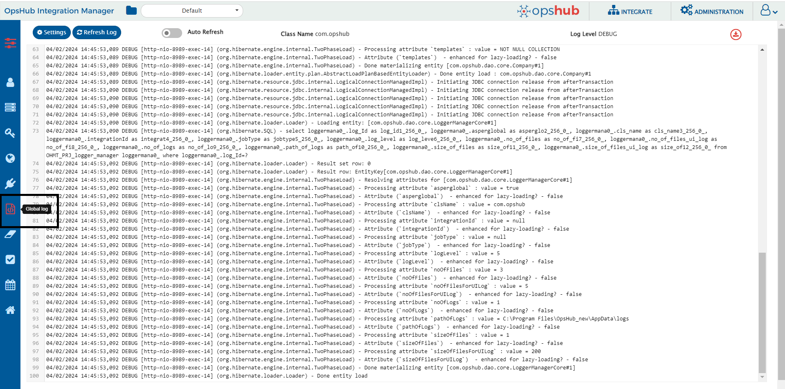
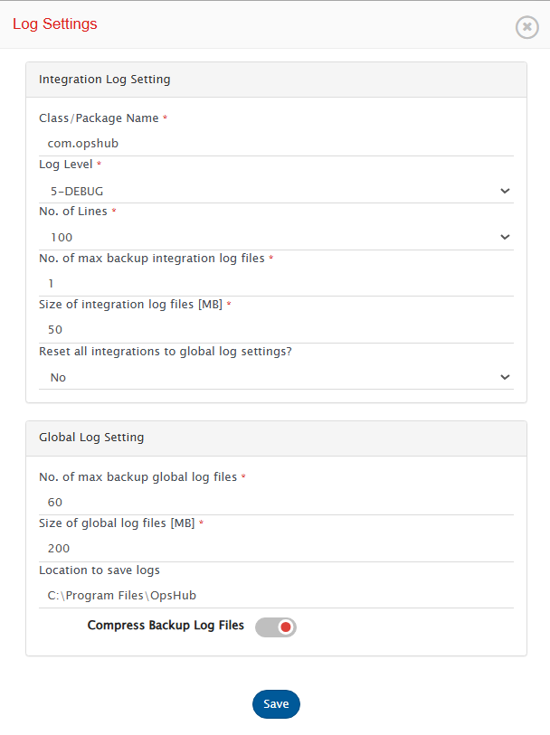

# Different Types of Logs

There are different logs maintained and stored under **`<code class="expression">space.vars.SITENAME</code> Installation Folder>\AppData\logs`** during the installation process and one log is maintained to track the ongoing processing in \<code class="expression">space.vars.SITENAME</code>.

| **Log File Name**      | **Description**                                                                                                                                                                                                                                                                                                                                                         |
| ---------------------- | ----------------------------------------------------------------------------------------------------------------------------------------------------------------------------------------------------------------------------------------------------------------------------------------------------------------------------------------------------------------------- |
| DatabaseCreation.log   | Log generated during Database Creation phase of Installation                                                                                                                                                                                                                                                                                                            |
| Install.log            | Log related to installation steps                                                                                                                                                                                                                                                                                                                                       |
| OpsHubServer.log       | Log generated while <code class="expression">space.vars.SITENAME</code> Installation (like launching URL).                                                                                                                                                                                                                                                                                                   |
| Service.log            | Log generated while registering <code class="expression">space.vars.SITENAME</code> Application as Service.                                                                                                                                                                                                                                                                                                  |
| ConnectionModeConf.log | Log related to the Connection Mode Configuration.                                                                                                                                                                                                                                                                                                                       |
| OpsHub.log             | 
<code class="expression">space.vars.SITENAME</code> Application log file for all the

migrations

integrations

  |
| OpsHubTFSService.log   | Common log file for TFS API interaction                                                                                                                                                                                                                                                                                                                                 |
| Integrations           | 
Folder contains the files for the logs of each

migrations

integrations

 |


# Log Settings

System log helps to view logs for tracking backend activity in <code class="expression">space.vars.SITENAME</code>. Usually logs are useful when any failure or unusual behavior is detected in integration. System log can store logs in 5 different levels. Logs will capture information based on logging level set in System log.

To navigate to System log

* Click on Administration on top right corner.
* On Left panel click on Global log as shown below

  

## Settings

Click on Setting button on System log window to configure log settings as mentioned below

  

## Integration Log Setting

**Class/Package Name:** The name of the package or class for which logs need to be monitored. To monitor the logs within the 'com.opshub', package 'com.opshub' should be entered here.

**Log Level:** Represents the logging level which determines the amount of information recorded in the log files. By default, only Error logged in <code class="expression">space.vars.SITENAME</code> are logged in logs. The coverage of information increases in ascending order from logging level 1 to 6.

1-FATAL, 2-ERROR, 3-WARN, 4-INFO, 5-DEBUG, 6-TRACE

1-FATAL will log minimum amount of data, not sufficient for tracking integrations, while 6-TRACE will log maximum data, most useful for tracking integration but it also creates log sizes and creates multiple log files due to amount of information logged.

**No. of Lines:** Number of lines of logs to be displayed on the log viewer screen of the UI.

**No. of max backup log files:** Maximum number of backup files to store excluding the current log file used by the integration.

**Size of log file [MB]:** Maximum size (in MB) that an integration log file can have before a new backup log file is created.

**Reset all integrations to global log settings?:** This option reverts all individual/custom log settings for each integration to the global/default log configuration defined at the system level. Any integration-specific overrides will be removed.

## Global Log Setting

**No. of max backup global log files:** Select the maximum number of backup files to store, excluding the current log file used by the UI logs.

**Location to save logs:** Location where log files should be saved, this should be configured if default directory where <code class="expression">space.vars.SITENAME</code> is installed do not have sufficient space to store log files. By default, logs are stored in default directory where <code class="expression">space.vars.SITENAME</code> is installed.

* If you change the default location to another location, all the older logs will be copied to the updated location, except for Tomcat Server logs. The new logs will be logged at the updated location.

**Size of global log files [MB]:** Select the maximum size (in MB) that a UI log file can have before a backup log file is created.

**Compress Backup Log Files:** Enable the toggle button to store all the backup log files in **compressed(.zip)** format.

> **Note**: Following points should be considered:

* When the toggle button for 'Compress Backup Log Files' is enabled or disabled, ensure that no other application is using the backup files.
* When the toggle button for 'Compress Backup Log Files' is enabled or disabled, ensure to configure the values for 'No. of max backup global log files' and 'No. of max backup log files' appropriately.

## Refresh Log

  

**Refresh log** button on the top of window can be used to refresh logs once to display latest logged data.

  

**Auto Refresh Log** is a toggle button, it can be set on to automatically refresh logs in every few seconds (2-3 seconds).

## Export Logs

  

Click on Export logs button to export logs as zip file.

## Word Wrap

  

Click on Word Wrap to enable/disable the word wrapping behavior in the log viewer.

* Word wrap is enabled by default.
* When word wrap is enabled, long log entries are wrapped, making them easier to read without horizontal scrolling.
* When word wrap is disabled, log entries remain on a single line, preserving the visual alignment of timestamps and structure. However, horizontal scrolling may be needed.

