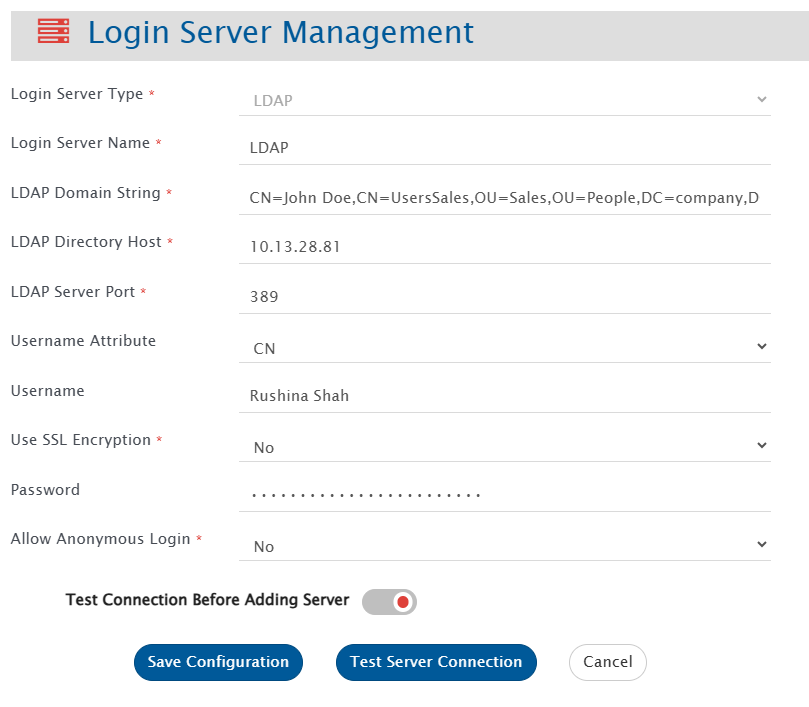
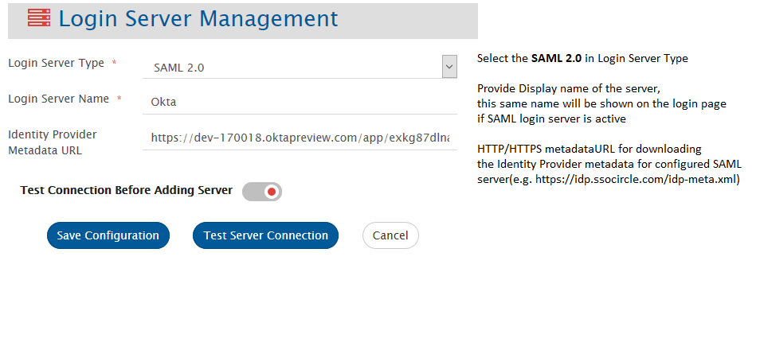
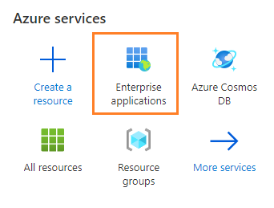
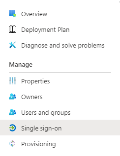
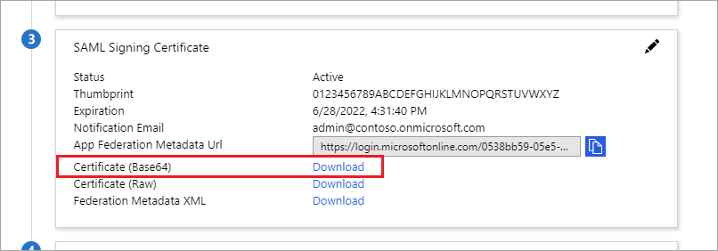
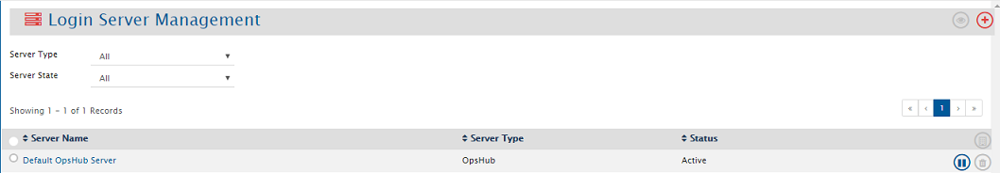
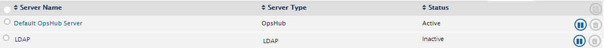

OpsHub Integration Manager supports LDAP and SAML Authentication, so that user can login with their own LDAP or SAML credentials.

# LDAP

## LDAP Server Limitations

OpsHub Integration Manager does not support configuration and authentication of LDAP servers that are running behind the proxy.

## New LDAP Server Configuration

To proceed, select Login Server Type as LDAP. This will display the form shown above. Provide the following inputs to all the fields:

Select Login Server Type as LDAP and the form shown above would be displayed. Provide inputs to all the fields, as given below:

- **Login Server Name**: Enter a unique name for the LDAP Server configuration.
- **LDAP Domain String**: Enter the exact directory path (Distinguished Name) where LDAP users reside.

If your company structure is as follows:  
<p align="center">
  
</p>

Now, here if you want to give access to John Doe, follow the below configuration:  
<p align="center">
  
</p>

Below are the three examples for constructing path:

1. As per the above example, the domain string will be:  
   `CN=John Doe,CN=UsersSales,OU=Sales,OU=People,DC=company,DC=com`  
   This path means Look for "John Doe" in "UsersSales" group within the "Sales" Organizational Unit, under "People" Organizational Unit in the company domain structure company.com.

2. A few more examples for better understanding. Let's say the path is:  
   `CN=UsersEng,DC=company,DC=com`  
   This path will give access to all users under "UsersEng" group within company domain company.com.

3. Now, if there is another OU "Engineering" parallel to "Sales" organization unit, then the path formed will be:  
   `CN=Smith Doe,CN=UsersEng,OU=Engineering,OU=People,DC=company,DC=com`

The paths mentioned above must match the LDAP directory structure precisely to locate the users. An incorrect path may allow a successful test connection but can cause login failures.  
If you want to give permission to these two OU's "Sales" and "Engineering" only in company.com, then we must configure two LDAP configurations.

- **LDAP Directory Host**: Specify the LDAP server's machine name or IP address.
- **LDAP Server Port**: Enter the port number on which the LDAP server is running. The default is 389 for LDAP, and 636 for LDAPS.
- **Username Attribute**: Choose the LDAP attribute for validating usernames. Options include CN, UID, Name, sAMAccountName, or userPrincipalName. You can use any of the above options. For example, if set to sAMAccountName, the login process will use this attribute to validate the provided username.
- **Username**: Provide a username for connecting to the LDAP server. This is mandatory if the Username Attribute is set to UID, Name, or sAMAccountName. It’s not required for CN or userPrincipalName.
- **Use SSL Encryption**: Select YES if the connection to the LDAP Server is secured, otherwise select NO.
- **Password**: Provide a password for the above given username.

**Note** : For LDAPS, the certificates will be auto imported by OpsHub Integration Manager and if not, then user can manually import it as specified in [Import SSL Certificates](../../getting-started/ssl-certificate-configuration.md).

- **Allow Anonymous Login**: Select "Yes" if you want to allow Anonymous login. If the anonymous login feature is enabled on your remote LDAP server and this option is activated in the login server configuration, users can log in without a password.
- Select **Test Connection Before Adding Server** when users want to test the connection before adding it to the records. Otherwise, it would only be added to the database but not validated.

After providing all the inputs, user can test or save the configuration.

- **Save Configuration**: It will save the entire configuration of LDAP Server to database. If **Test Connection Before Adding Server** is put on, then, OpsHub Integration Manager would first test the connection and if the connection to the server is successful, it would save the configuration to the database. The server would be added in the Inactive state.

- **Test Configuration**: This will validate the connection to the LDAP server using the provided configuration details. If no connection username and password are specified, the test will verify only the connectivity to the LDAP server host, without performing a bind or login request.

Once the server is configured, user needs to activate it to authenticate with that server.

**Note** : To use OpsHub Integration Manager using LDAP user, we need to create LDAP user in OpsHub Integration Manager. Refer to Create User section on [User Management](user-management.md) page to create LDAP user.

---

# SAML 2.0

Identity Providers following SAML 2.0 standards and having HTTP/HTTPS metadata URL for downloading their metadata are supported.

## Service Provider Metadata

Below information should be used for configuring OpsHub Integration Manager as a Service Provider for Identity Provider(s):

- **Assertion Consumer Service (ACS) URL** or **Single sign on URL** → `<protocol>://<hostname>:<port>/OpsHubWS/login/saml2/sso/opshubsaml`  
  - protocol: `http` or `https` depending on the type of OpsHub Integration Manager installation  
  - hostname: hostname of machine where OpsHub Integration Manager is installed  
  - port: port on which OpsHub Integration Manager is installed

- **Audience URI** or **Service Provider Entity ID** → `opshubsaml`

**Note** : The complete OpsHub Integration Manager SAML Service Provider metadata can be downloaded from:  
`<protocol>://<hostname>:<port>/OpsHubWS/saml/metadata`

## New SAML Login Server Configuration

For enabling SAML authentication, user needs to configure SAML server. For configuring new SAML server, go to  
**Administration > Login Server Management > Add Login Server**.  
Select Login Server Type as SAML 2.0 and the form shown below would be displayed:

<p align="center">
  
</p>

- Provide inputs to all the fields, as shown in the above image. Only after providing all the inputs, user can save the configuration.
- The server would be added in Inactive state.
- SSL certificate needs to be imported when SAML Identity Server is on HTTPS. To import the SSL certificate, please follow the steps given on [Import SSL Certificates](../getting-started/ssl-certificate-configuration.md).  
  **Note:** In case of Azure SAML, refer to [Azure Active Directory Configuration](#azure-active-directory-configuration)

- Once the server is configured, user needs to create equivalent SAML Users in OpsHub Integration Manager and then Activate the SAML login server, in order to authenticate with that server.
**Note** :Refer to Create User section on [User Management](user-management.md) page to create SAML user.

---

### Azure Active Directory Configuration

- **For downloading HTTPS Certificate:**
  1. Go to **Enterprise applications**  
     <p align="center">
       
     </p>
  2. Select your application from **All applications**  
     <p align="center">
       
     </p>
  3. Select **Single sign-on** from left panel  
     <p align="center">
       
     </p>
  4. Go to section **SAML Signing Certificate** and download 'Certificate (Base64)'  
     <p align="center">
       
     </p>

- **For extracting the key credential from metadata XML file:**
  1. Open metadata URL in new browser window. It will open an XML file.
  2. Find `<X509Certificate>` inside `<Signature>` tag.
  3. Copy the key between `<X509Certificate>` and `</X509Certificate>`
  4. Paste it into a new file in the below format and save with `.crt` extension:
     ```
     -----BEGIN PKCS7-----
     <Paste key here>
     -----END PKCS7-----
     ```
  5. Now import the key certificate file into `opshubSAMLKeyStore.jks`.  
     Refer to [Import SSL Certificate](../getting-started/ssl-certificate-configuration.md) for steps. Use:
     - **Path:** `<<OpsHub_Installation_Directory>>\OpsHub_Resources\config\opshubSAMLKeyStore.jks`
     - **Password:** `int3gr@tion`

---

## Known Behaviors

- If OpsHub Integration Manager is behind the proxy server, and you want to configure SAML authentication, then after configuring proxy using [Proxy Setting](proxy-setting.md), you need to re-start the OpsHub Integration Manager server.

---

# Default OpsHub Integration Manager Server

In the list of login servers, users can find a record for **Default Server** of type **OpsHub Integration Manager**.  
Using this, users can login with the default credentials or the users configured in OpsHub Integration Manager itself fall in this category.

<p align="center">
  
</p>

This server cannot be deleted.

**Note** : If the Default Server is inactivated and OpsHub Integration Manager is unable to connect with any of the active LDAP servers, please contact sales/support representative.

---

# View Login Servers

To manage Login servers, go to **Administration > Login Server Management > View Login Servers.**  
It would lead to the page which allows managing multiple servers.

This page displays all the configured login servers with a search tool in the first part.

<p align="center">
  
</p>

One can search configured login servers using the search options available.

- **Server Name**: Search could be done by name of server.
- **Status**: Login servers could be filtered by the state **Active** or **Inactive**.
- **Server Type**: Login Servers could be filtered on the basis of Server type, i.e. LDAP, SAML 2.0 or OpsHub Integration Manager.

**Login Server view has the following information:**

- **Server Name** of the servers configured.
- **Server Type** of the servers configured.
- Current **Status** of the servers.
- **Actions**: Following actions could be performed on a server:
  - **Edit**: User can edit the server configuration as per their requirement.
  - **Activate/Inactivate**: User can change the status of the server as per their requirement.
  - **Delete**: User can delete the server configuration.

**Note** All servers cannot be inactivated at the same time. At any point of time, at least one server should be in Active state.
