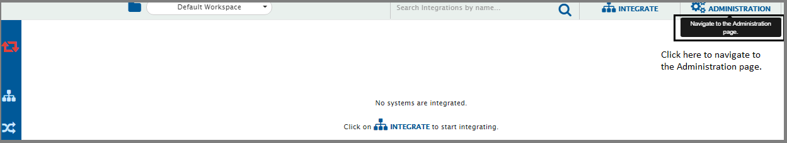
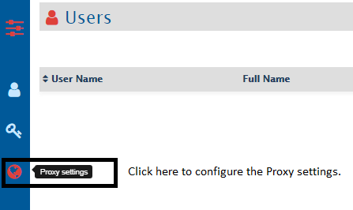
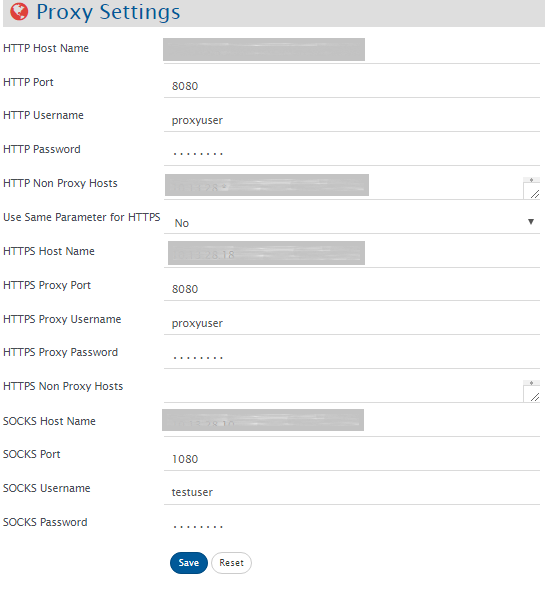

You need to configure proxy settings to be able to access the external resources from the machine which is behind a proxy server or when OpsHub Integration Manager is behind a proxy server.

# How to Configure Proxy Settings

Watch the following video to learn how to configure proxy settings:

> **Note:** This video has no audio.



1. Navigate to the top right corner of the screen and click **Administration** as shown in the screenshot below:

  

2. Now, click the third icon on the left menu as shown in the screenshot below: 

  

The proxy settings form opens as shown in the screenshot below:

  

3. Fill the relevant details in the form: 

**HTTP settings**
* For HTTP you can fill the following details:
  * Provide the **HTTP Host Name** if proxy is configured on HTTP
  * Provide **HTTP Port** on which HTTP proxy is configured (by default it will use port 80)
  * Provide **HTTP Username** to connect to proxy if username is configured for above proxy
  * Provide **HTTP Password** if password is configured for above proxy
  * For **HTTP Non Proxy Hosts**, provide host(s) that should be connected directly without using HTTP proxy and separate the names with "|"  
    * Some examples are: `10.13.27.1|10.13.27.200|jira.aws.com|localhost`

**HTTPS settings**
* Select **Use Same Parameter** for HTTPS as **Yes**, if both HTTP and HTTPS are configured on same proxy server – otherwise, select **No** and provide the credentials to connect to HTTPS proxy
  * Provide the **HTTPS Host Name** if proxy is configured on HTTPS
  * Provide **HTTPS Port** on which HTTPS proxy is configured (by default it will use port 443)
  * Provide **HTTPS Username** to connect to proxy if username is configured for above proxy
  * Provide **HTTPS Password** if password is configured for above proxy
  * For **HTTP Non Proxy Hosts**, provide host(s) that should be connected directly without using HTTPS proxy and separate the names with "|"

**SOCKS settings**
* For SOCKS, you can fill the following details:
  * In **SOCKS Host Name**, provide host name of the SOCKS Proxy
  * In **SOCKS Port**, provide the port where proxy is installed; if, by default, it is kept empty, set port 1080 with the given host name
  * Provide **SOCKS Username** to connect to the proxy
  * Provide **SOCKS Password** for the given user name

4. Save the configuration and check the connection by trying to create mapping.

