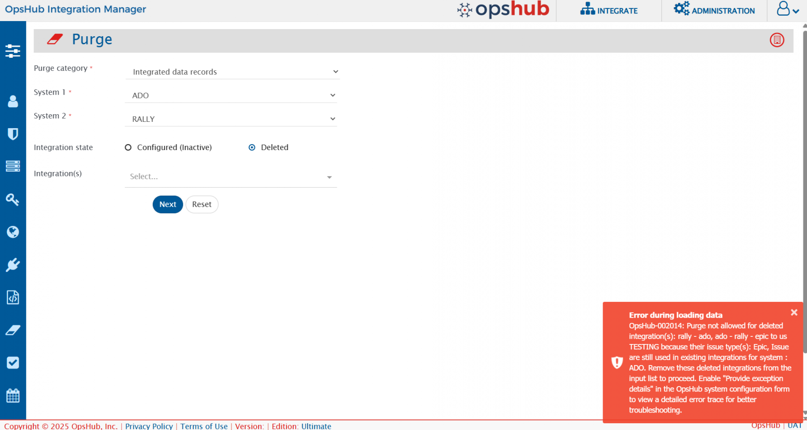

# Overview

* The **Purge** feature in OpsHub Integration Manager helps users clean up old or unnecessary data associated with integration configuration changes or previously synchronized records.
* Following are the types of **Purge** provided:
  * **Audit Logs**: It enables users to purge different types of change logs, such as **Excel upload audits**, **Job schedule audits**, **Roles audits**, etc. Refer to the [Purge Audit Logs](purge-records.md#purge-audit-logs) section for more details.
  * **Integrated Data Records**: It enables users to purge integrated data records from the OpsHub Integration Manager database. Refer to the [Purge Integrated Data Records](purge-records.md#purge-integrated-data-records) section for more details.

## Steps to access the Purge Feature

* Navigate to the top-right corner of the screen and click **Administration**.
  
 

  

* Now, click the **Purge** icon on the left sidebar, as shown in the image.
  

  

# Purge Audit Logs

## Overview

**Purge Audit Logs** provides the functionality to purge change logs for the following component(s):

1. Event failures
2. Excel upload
3. Integration change
4. Job schedules
5. Login information
6. Login server
7. Mapping
8. Permissions associated with roles
9. Roles
10. System
11. System type extension
12. Users
13. Workflow

## Prerequisites

Only users with an **Ultimate** license can access the **Purge Audit Logs**.

## Steps to purge audit logs

1. From the **Purge category**, select the **Audit Logs** as shown in the image below.
   
 

  

2. Now, from the **Audit component(s) drop-down list**, select the **Audit component(s)** as per your requirements, as shown in the image below.
3. Then select the date from the **Purge audits created before date** field.
   

  

4. Click the **Purge** button to filter the information according to the specified inputs.

Audit Logs of all the selected components before the specified date in the **Purge audits created before** field will be purged.

# Purge Integrated Data Records

## Overview

* The **Purge Integrated Data Records** feature allows users to clean up integrated data directly from the OpsHub Integration Manager user interface, eliminating the need for standalone SQL utilities.
  * This improves usability and accessibility and simplifies the cleanup process.
* This feature is especially useful in **re-sync** or **re-migration** scenarios, where previously synchronized data needs to be purged before initiating a new sync.
* Users can filter and control purge operations based on the following:
  1. **System Pair:** Select the source and target systems involved
  2. **Integration Groups:** Choose from configured integration groups between the selected systems
  3. **Entity Type Pairs:** Choose from configured entity type mappings within the integration group

## Prerequisites

### User privileges

Following are the privileges required for the dedicated {{SITENAME}} user to purge synchronized entities:

**Required role**

| **Role Name**       | **Required in** |
| ------------------- | --------------- |
| Super Administrator | Administration  |
| Sync Monitor        | Integration     |

**Minimum required permissions in case of customized roles**

| **Permissions Name**                          | **Permissions Scope** |
| --------------------------------------------- | --------------------- |
| Administration Permissions: Server Management | Delete                |
| Integration Permissions: Integration          | Action                |

Refer to the [Permissions and Corresponding Actions](role-configuration.md#permissions-and-corresponding-actions) section to understand which operations can be performed based on the configured role.

### License requirement

* Users with either a 'Professional' or 'Ultimate' license have access to the **Purge Integrated Data Records** feature.

### Purge usage guidelines

* For **configured integrations**:
  * Integrations must be **inactivated** before purging their synchronized records.
  * **Reason:** Purging data from an active integration can accidentally remove information that is still in use or currently being synchronized. This may result in processing failures or even impact other active integrations.
* For **deleted integrations**:
  * Purge operations are also supported for **deleted integrations**, allowing removal of previously synchronized records and related data from the database.
  * **Important:** Ensure that the **issue type(s)** configured in the deleted integration are **not used in any existing integration** with the same system and scope.
  * If they are still in use, the purge will fail with an error, as illustrated in the image below.
    
 

  

## Steps to purge integrated data records

1. From the **Purge category**, select **Integrated data records** as shown in the image below.
   
2. Now, select **System 1** and **System 2** from the dropdown to filter the integrated records for purging as shown in the image below.
   * These are mandatory selections.
     
3. After selecting both **System 1** and **System 2**, the interface displays **Integration state** and **Integration(s)** as shown in the image below.
   * The **Integration(s)** dropdown lists configured (but inactive) integrations between the selected systems by default.
   * You can switch to **deleted integrations list** by choosing **Integration state** as **Deleted**.
   * These selections are optional, meaning purge can be performed based solely on the system selection also.
     
4. From the **Integration(s)**, select the integrations as per your requirements as shown in the image below.
   * This is a multi-select field, allowing multiple integrations to be selected for purge at the same time.
     
5.  After selecting **Integration(s)**, the interface displays **Entity type pair(s)** as shown in the image below.

    * Users can select for which **entity type pair(s)** they want to purge the synced records.
    * This is a multi-select field, allowing multiple pairs to be selected for purge at the same time.
      

    > **Note**: **Entity type pair(s)** is not available for **Deleted Integrations**. All entity types configured for the deleted integration will be purged.
6. After selecting required **Entity type pair(s)**, click on **Next** to view the details of records to be purged.
   
7. The **Purge confirmation** page loads as shown in the image below:
   
   * The **Purge confirmation** page is a critical safety checkpoint in the database cleanup process that displays a comprehensive preview of all integrated records that will be marked for deletion from the OpsHub database. This page serves as the final verification step before executing the purge operation.
   * **Key Aspects**:
     1. **Warning Alert:** The selected records will be marked as deleted in the OpsHub database. These records will be recreated during resynchronization. A backup of the database is strongly recommended before proceeding.
     2. **Records Preview Table:** Users can review detailed information about the records being purged, including integration name, systems involved, projects, entity types, and IDs.
     3. **Export Option:** An option to export the record list as a CSV file is available for offline review or audit purposes. The file will be downloaded to the **Downloads** folder in the user end-system.
     4. **Data Preservation:** All deleted records are saved as CSV files in the {{SITENAME}} directory, `@INSTALLATION_PATH@\AppData\PurgedRecords` and kept permanently unless manually removed.

Click on **Purge** to purge the selected records from the **OpsHub** database.

## Important Purge Behaviors and Considerations

### End System Data Not Cleaned Before Purging

* Before purging records from {{SITENAME}}, make sure the synced data is also deleted or archived in the target (end) system.
* If the end system still holds the data, {{SITENAME}} will lose reference to it after purge.
* Upon reactivating the integration, {{SITENAME}} will treat the existing entities in the end system as new, resulting in:
  * Duplicate records
  * Orphaned entities
  * Data inconsistencies and potential sync conflicts

### Replication of Source Data to Multiple Target Systems

* When you purge data from a source system that is used in multiple integrations, it impacts **all integrations connected to that same source**.
* This is because the purge removes shared information these other integrations will also need to resynchronize data using correct target lookup settings.
* This scenario requires additional configuration of target lookup to ensure consistent and conflict-free data across all target systems.
* For example:
  * Source entity: **Bug**
    1. Integration A: **Jira → Rally**, "Bug" → "Defect".
    2. Integration B: **Jira → ServiceNow**, "Bug" → "Problem".
  * If you purge data for **Integration A** only, you must:
    * Either **purge Integration B** as well,
    * Or **update the target lookup** in Integration B to make sure data is re-synced correctly and without conflicts.

### Data Recovery and Audit Trail

* All purged records are automatically saved as CSV files in the {{SITENAME}} installation directory:
  `@INSTALLATION_PATH@\AppData\PurgedRecords`
* Each purge operation generates a unique timestamped file, maintaining a complete audit trail of all cleanup operations.
* These logs are kept permanently unless explicitly deleted.

### Selective Purging Based on Filters

* If no specific integration or entity type filters are applied, {{SITENAME}} purges data for **all configured integrations and entity types** between the selected source and target systems.
* **Warning:** Use with caution, broad scope purging to avoid removing unintended data.

### REST API implementation

* Purge Integrated Data Records is **not supported with REST APIs**.
* This is to prevent accidental data loss, as API-based purging would skip important warnings and confirmation steps visible in the UI.
