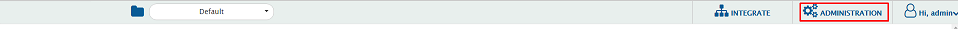
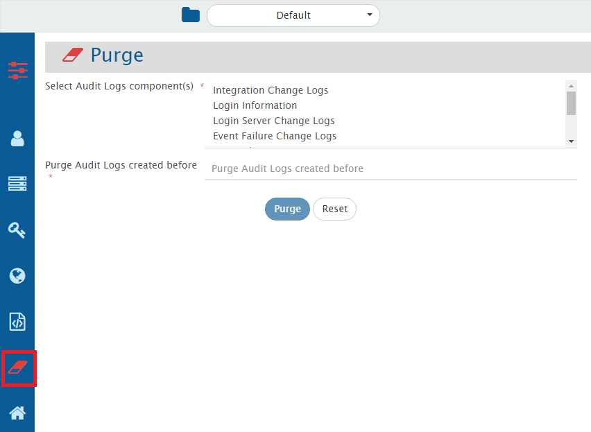

# Purge Audit Logs

* Navigate to the top right corner of the screen and click **Administration**.  

  

* Now, click the **Purge** icon on the left sidebar as shown in the image.  

  

* From the **Audit Logs component(s) drop-down list**, select the **Audit Logs component(s)** as shown in the image below.  
* Then select the date from the **Purge Audit Logs created before date** field.  

  

* Click the **Purge** button to filter the information according to the specified inputs.

Audit Logs of all the selected components before the specified date in the **Purge Audit Logs created before** field will be purged.
