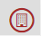

# Overview

This section will guide the users on how to register and edit the connectors.

# Register Connectors

- Connectors can be registered from administration page by clicking the "plug" icon  present in left side bar as shown in the image below:

- To register a connector, click the "+"[add image] icon on the top right corner of the "Registered Connectors" page.
- The following page comes which requires two inputs as shown in the image below:

- Fill the form with relevant details:
  - **'''System Type Name '''**: The name that you want to assign to the connector you are registering. This name will be shown in the system type list on "Configure Systems" page.
  - **'''SDK API Base URLs'''**: Base URL of the Connector SDK where it is hosted. E.g., http://<hostname>:<port>/sdk-api/api/1.0 . You can add more than one SDK URLs for a given connector. It can be added with the "+" icon present on the right side of the text box.The first URL entered will be used for fetching the metadata of the connector. All the SDK API calls will be made by appending resource path in this URL.

- All the URLs entered will be checked if they are implemented with the same connector's name and version or not.

- After entering valid details, click the Save button to register the connector with the given name.
> **Note** : System Type Name must be unique as OpsHub Integration Manager won't allow you to use the same name for registering the connector.

# View Connectors

- The registered connectors are available in the form of list on the "Registered Connectors" page as shown in the image below:

- There is an audit icon  present on the top right corner of the list. Clicking this icon will show all the audits related to the registered connectors.

# Edit Connectors

- Registered connectors can be edited by clicking the specific connector followed by clicking the pencil icon on the top right corner of the page.

- You can edit the system name, add or remove URLs. There is also a check box in case you want to refresh the metadata of the connector.

> **Note** :  Edit register connector option will not allow you to remove the URL if it is already used in any system or in the integration of the systems. An error message will be displayed in case the URL that is already in use is deleted.

## Refresh Connector Metadata

Refresh Connector Metadata checkbox (as shown in the image above) can be selected under the following condition:

- Whenever there is any change (addition or deletion) of metadata in the connector.

While editing the connector, if the refresh connector metadata is checked, a warning pops up as shown in the image below:

  

> **Note**:  If you want to refresh metadata for a connector, it is advisable to verify the systems and integrations that will be affected.

This warning box contains the instructions on how the systems and integrations created on the connector will be affected, if you choose to refresh the metadata of the connector. As shown in the image, this warning also shows the particular field that is removed and the screens affected by it.

