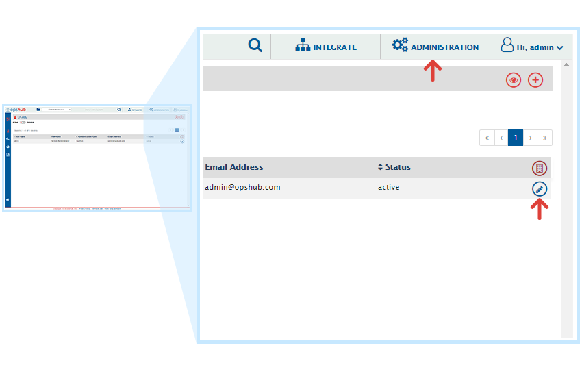
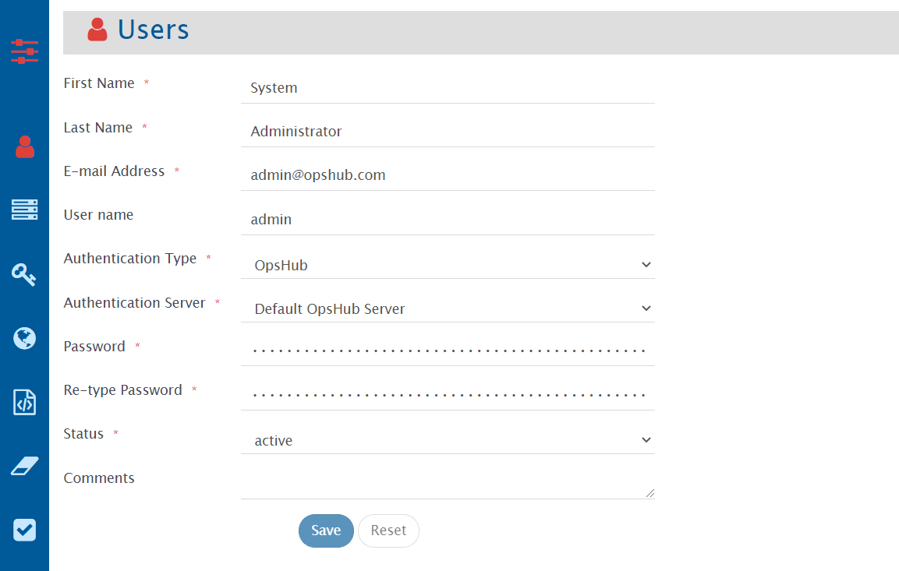

# Logging in to <code class="expression">space.vars.SITENAME</code> (OIM) for the first time

Use **admin** as User Name and **password** as Password for log-in after installation.

  

## Changing Password

As shown below, click on the **ADMINISTRATION**. It will display the User Details with above window. Then click on Edit Icon. It will display the following window. 

  

Then type your desired password in Password field and retype it in the Re-type Password field for confirmation. Then click on the Save button to save the password.

  

