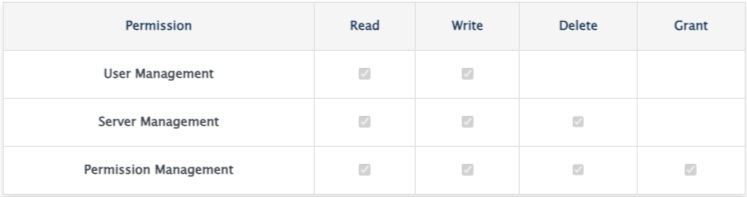
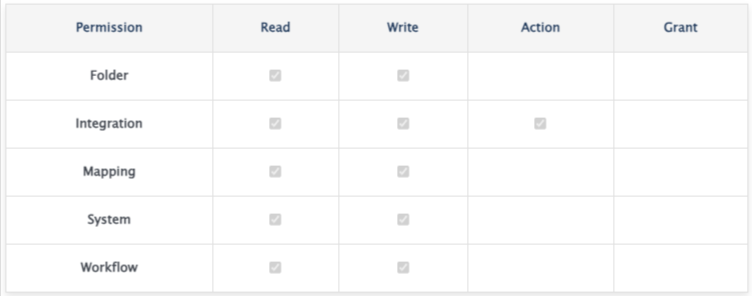
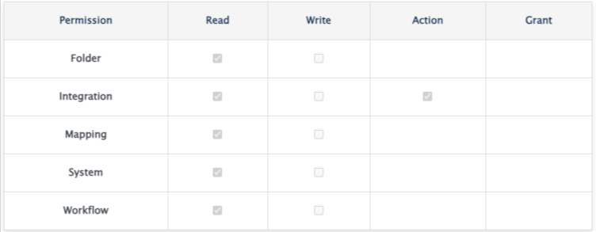
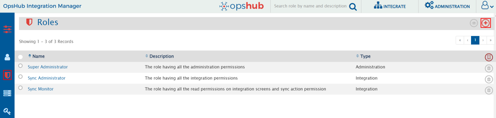
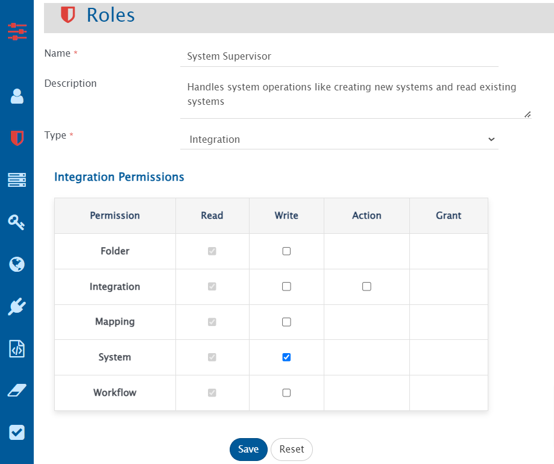
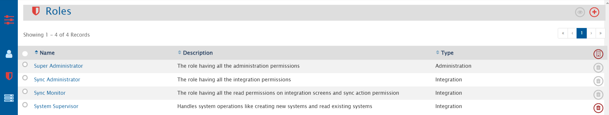

# Overview
<code class="expression">space.vars.SITENAME</code> supports User Access Control, enabling users manage permissions in <code class="expression">space.vars.SITENAME</code> by associating users with specific roles. Each role encapsulates a set of permissions suited to particular responsibilities.

# Permission
Permission refers to specific rights like Read, Write, Delete, Grant on different resources like System, Mapping, Integration, User Management associated with a given role.

# Role
- A Role is a set of permissions that define what actions a user is permitted to perform on a resource.
- Integration Role:
  - An Integration role allows user to configure permissions for operations that can be performed on **Integration** tab in <code class="expression">space.vars.SITENAME</code> like System, Mapping, Integration, etc.
  - Refer to [Associating Integration Role to a User](user-role-association.md#associating-integration-role-to-a-user) section to understand how integration roles can be associated with user.
- Administration Role: 
  - An Administration role allows user to configure permissions for operations that can be performed on **Administration** in <code class="expression">space.vars.SITENAME</code> tab like Proxy Settings, License Management, etc.
  - Refer to [Associating Administration Role to a User](user-role-association.md#associating-administration-role-to-a-user) section to understand how administration roles can be associated with user.

# Default Roles
<code class="expression">space.vars.SITENAME</code> provides with the following default roles:

| **Role Name** | **Description** |
|---------------|------------------|
| Super Administrator | All administration permissions are available  |
| Sync Administrator | All integration permissions are available  |
| Sync Monitor | All read and sync action permissions are available  |

# Create Custom Roles
- Navigate to **Role Management** screen under **Administration** tab and click on Create Role button on the top right corner as shown below:  
  

    
  

- Add Role Name, Description, Type and select permissions that a user want to associate with the role. For instance, if a role is to be configured for performing all system operations, select **Integration** under Role type and tick mark **write** permission checkbox as shown below:  
  

    
  

- Save the role and it will be accessible from **Role Management** screen as shown below:  
  

    
  

# Standard Role Behaviors
- In Integration type role, **read** permission is granted by default on all resources like System, Mapping, Folder, etc.
- In Integration type role, with **Write** permission, **Action** permission is granted by default for **Integration**.
- Default roles cannot be edited or deleted.
- In Administration type Role, with **write** permission on **User Management**, all write operations can be performed in all user accounts.
- Role type cannot be changed after the role is created.

# Permissions and Corresponding Actions
- Permissions and operations that can be performed are listed below:

| **Permission Name** | **Permission Scope** | **Actions Supported** |
|---------------------|----------------------|------------------------|
| **Integration Permissions** |||
| Folder | Read | Read Folders |
| Folder | Write | Create, update, delete folders |
| Folder | Grant | Allows user to manage integration permissions of other users on the folders on which the user has access |
| Integration | Read | Read integrations, reconciliations, failures Export sync report Read failure notifications' configuration |
| Integration | Write | Create, update, delete, merge, move integrations Create, update reconciliations |
| Integration | Action | Failures: Retry, delete, edit event xml, configure failure notifications Integrations: Activate, inactive, execute Delete Synchronization: Execute Switch to integration mode (from reconciliation) |
| Mapping | Read | Read, import, export mappings Read, export excel uploads |
| Mapping | Write | Create, update, delete, clone, merge, move mappings Create, update, delete excel uploads |
| System | Read | Read systems |
| System | Write | Create, update, move systems |
| Workflow | Read | Read, export workflows |
| Workflow | Write | Create, update, move, delete workflows |
| *Note:* Move operation requires **write** permission in both source and destination folders. |||
| **Administration Permissions** |||
| User Management | Read | Read users Read login servers |
| User Management | Write | Create, update users Create, update login servers |
| Server Management | Read | Read licenses Read proxy settings Read registered connectors Read system logs Read purge Read rules management Read schedule |
| Server Management | Write | Install license Update proxy settings Create, update registered connectors Create, update rules management Create, update schedules |
| Server Management | Delete | Uninstall License Apply purge Delete rules management Delete schedules |
| Permission Management | Read | Read roles |
| Permission Management | Write | Create, update roles |
| Permission Management | Delete | Delete roles |
| Permission Management | Grant | Grant permissions to other users |
