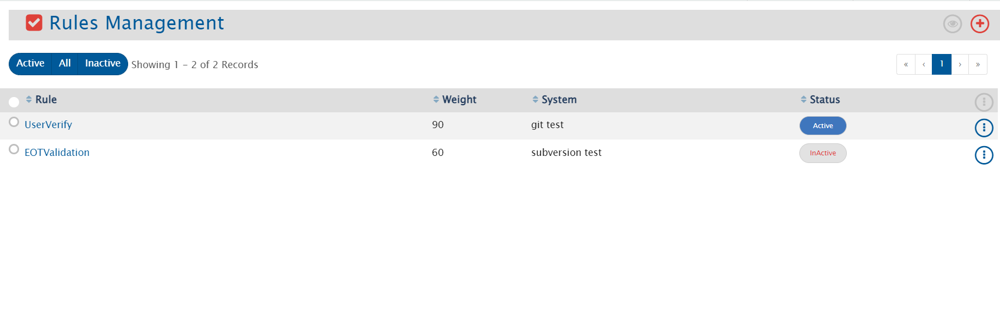
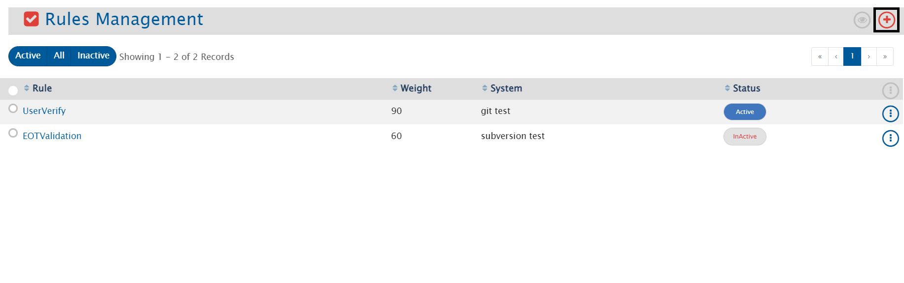
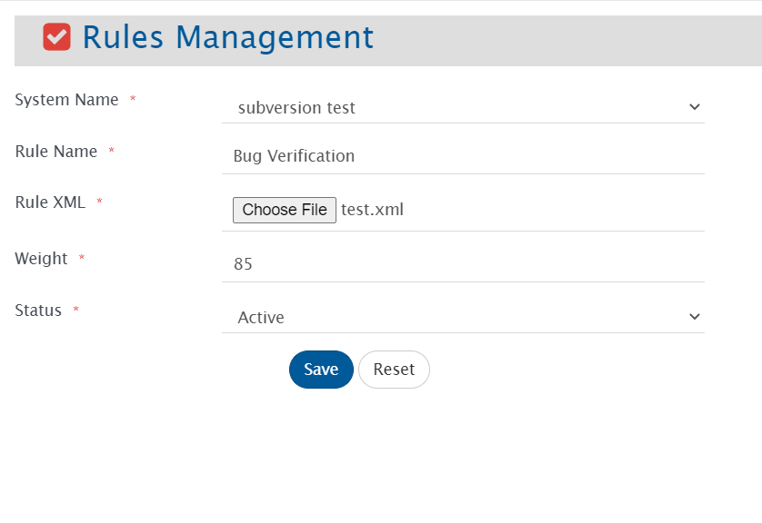
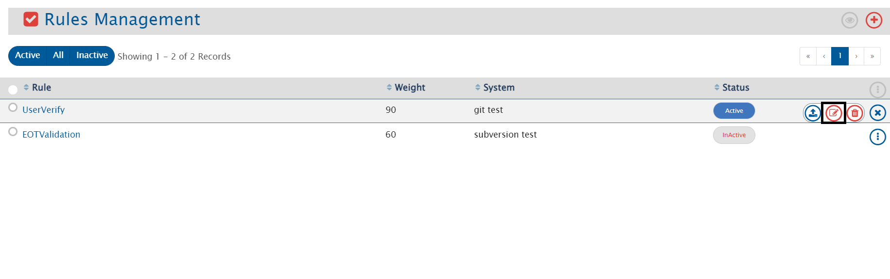
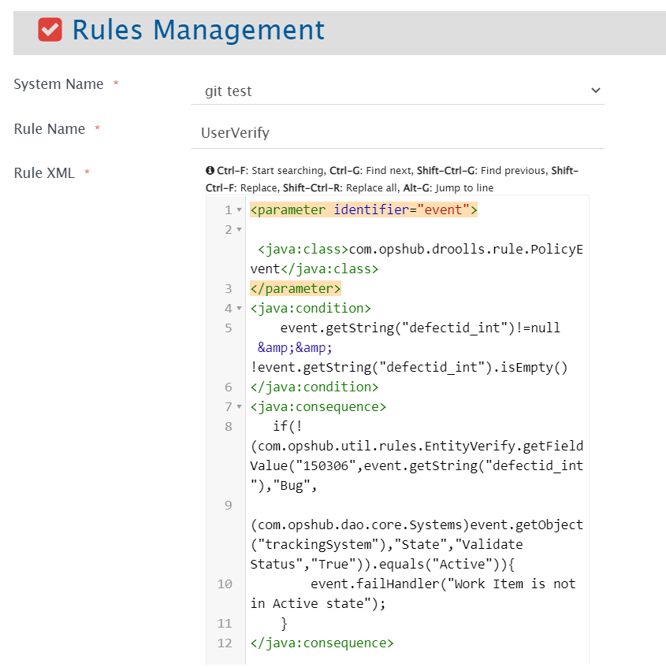
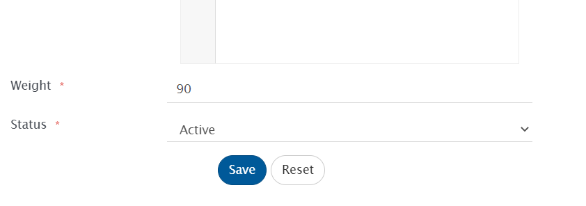
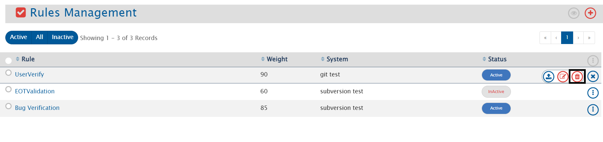
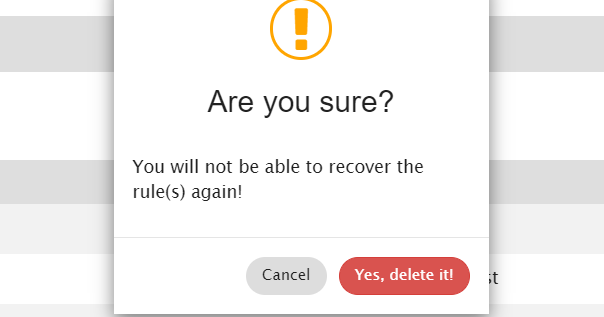

# View Rules

To view Rules, go to Administration > Rules Management. This would lead to a page that lists multiple rules that are already configured for different systems integrated using OpsHub Integration Manager.

  

## Filters

* **Filter by rule name**: Search configured rules using the search available in the header navigation bar  
* **Filter by rule state**: Click on the Active, All, or Inactive button to filter by the status

## Actions

* **View rule's xml**: Click the rule's name to view the rule's xml  
* **Export rules**: Roll over the vertical ellipses icon  against the rule that you want to export and then select *Export rule*  
* **Activate/Inactivate rules**: Select the *Status* button against the rule for which you want to toggle the status. The status will change from *Active* to *Inactive* or from *Inactive* to *Active*  
* **Actions over multiple rules**: Select multiple rules and then roll over the cursor to point to the vertical ellipses icon  on the table header to see the operations that you could perform on multiple selected rules.

---

# Upload Rule

To upload a new rule, follow the steps given below:
* Click on **"Administration"**
* Click on  given on the left panel. You can see the list of rules that are already uploaded
* To upload a new rule, click on  given on the top right corner of the screen

  

* The Upload form will open. Fill the following details in the form: 
  * **System Name**: It gives option to select the system from all the SCM systems mentioned in the dropdown  
  * **Rule Name**: It represents the name of the rule which will be uploaded  
  * **Rule XML**: Upload the XML file using the *Choose File* option  
  * **Weight**: It defines the priority of rule. Higher the weight, higher will be the priority given to the rule  
  * **Status**: It represents whether the rule is active or inactive

  

* Click on **"Save"**  
* Click on **"Reset"** to fill the form again  

---

# Edit Rule

* To edit a rule, follow the steps given below:
  * Click on **"Administration"**
  * Click on  given on the left panel. You can see the list of rules that are already uploaded
  * To edit a rule, roll over the vertical ellipses icon  against the rule that you want to edit
  * Click on 
    

  

* The Edit form will open. Edit the details in the form. Refer to the image below:

  

* Click on **"Save"**  
* Click on **"Reset"** to set the previously saved value  

---

# Delete Rule

* To delete the rule which is active, first you need to inactivate the rule

* To delete a rule, roll over the vertical ellipses icon  against the rule that you want to delete  
* Click on 

  

* You will not be able to recover the rule once you delete it

  

* Click on **"Yes, delete it"** to delete the rule  
* Click on **"Cancel"** to cancel the process

